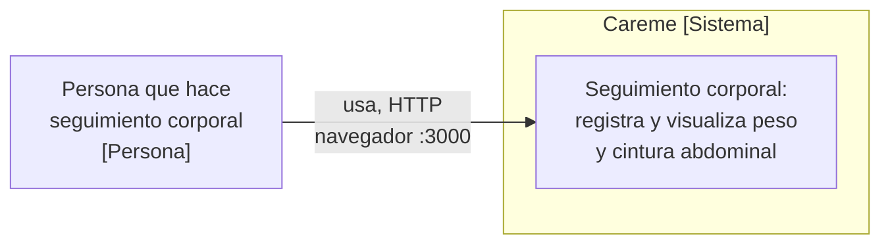
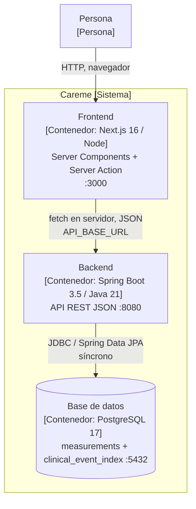
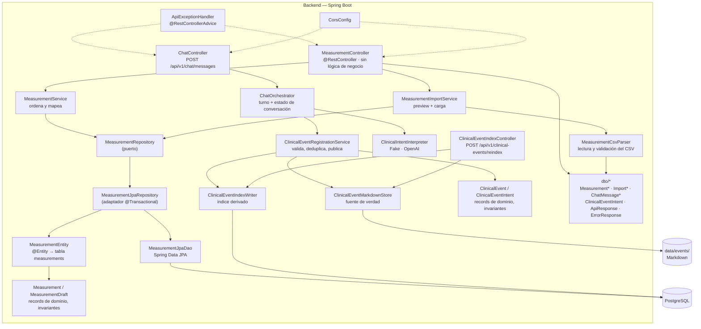

# architecture.md — Careme

> Documento de arquitectura con dos propósitos: onboarding humano en <15 minutos
> y contexto operativo para agentes IA bajo SDD/OpenSpec.
> Cada afirmación cita el archivo que la respalda.

---

## 1. Resumen ejecutivo

Careme es una aplicación de asistente clínico personal y seguimiento corporal: su
punto de entrada es un chat en el que una persona cuenta hechos médicos en
lenguaje natural —diagnósticos, medicaciones, mediciones y notas— y el sistema
los registra o responde preguntas sobre la historia clínica con hechos
recuperados, conservando la precisión temporal; además registra un peso y una
circunferencia abdominal por día y los muestra como tendencia y detalle por
fecha. Se compone de dos servicios independientes —un frontend Next.js y un
backend Spring Boot— más una base de datos PostgreSQL. El backend es la fuente
de verdad del contrato HTTP; el frontend no posee los datos. (Contrato de
consulta: `openspec/changes/uc-007/specs/clinical-history-query/spec.md`.)

**Propuesta de valor:** historia clínica personal fiel —los hechos se conservan
con las palabras y la precisión temporal de la persona— y seguimiento corporal
mínimo, sin cuentas de usuario, con una sola medición por día y con la precisión
del dato en manos del dominio (invariantes en el constructor del record) en lugar
de la interfaz.

**Lenguaje ubicuo:**

| Término | Significado | Evidencia |
| --- | --- | --- |
| **Medición** (Measurement) | Un peso y una circunferencia abdominal de un día concreto | `backend/src/main/java/com/careme/backend/entity/Measurement.java` |
| **Día** | La fecha identifica la medición dentro de la tabla; es única y no puede ser futura | `backend/src/main/resources/db/migration/V1__create_measurements_table.sql` |
| **Cintura abdominal** (waist / abdominal circumference) | Perímetro abdominal en centímetros | `backend/src/main/java/com/careme/backend/dto/MeasurementRequest.java` |
| **Peso** (weight) | Peso en kilogramos, un decimal, máximo 500 | `backend/src/main/java/com/careme/backend/dto/MeasurementRequest.java` |
| **Registrar** | Guardar la medición de un día: crea si el día no existía, reemplaza si existía | `backend/src/main/java/com/careme/backend/service/MeasurementService.java` |
| **Medición preliminar** (MeasurementDraft) | Medición sin identidad en base de datos, usada en cargas masivas | `backend/src/main/java/com/careme/backend/entity/MeasurementDraft.java` |
| **Carga / importación** | Leer mediciones desde un archivo CSV y persistirlas | `backend/src/main/java/com/careme/backend/service/MeasurementImportService.java` |
| **Previsualización** | Informe de lo que haría una carga, sin guardar nada | `backend/src/main/java/com/careme/backend/dto/ImportPreviewResponse.java` |
| **Envoltura de respuesta** (ApiResponse) | Sobre único para toda respuesta, éxito o error | `backend/src/main/java/com/careme/backend/dto/ApiResponse.java` |
| **Hecho clínico** (ClinicalEvent) | Un hecho médico contado por la persona, con tipo, contenido y precisión temporal | `backend/src/main/java/com/careme/backend/entity/ClinicalEvent.java` |
| **Intención clínica** (ClinicalEventIntent) | Resultado estructurado del chat: `events`, `query`, `clarification` o `conversation` | `backend/src/main/java/com/careme/backend/dto/ClinicalEventIntent.java` |
| **Precisión temporal** (date_precision) | `exact`, `approximate` o `unknown`; nunca mayor que la aportada | `backend/src/main/java/com/careme/backend/entity/ClinicalEvent.java` |
| **Fuente de verdad Markdown** | Documentos `evt_NNN.md` en `data/events/` donde viven los hechos | `backend/src/main/java/com/careme/backend/service/ClinicalEventMarkdownStore.java` |
| **Índice derivado** | Tabla PostgreSQL `clinical_event_index`, reconstruible desde el Markdown | `backend/src/main/resources/db/migration/V2__create_clinical_event_index.sql` |
| **Turno del chat** (ChatMessageResponse) | Respuesta del asistente: estado, mensaje y eventos de apoyo cuando aplica | `backend/src/main/java/com/careme/backend/dto/ChatMessageResponse.java` |

---

## 2. Contexto y alcance

Diagrama C4 nivel 1 (Context):



**Sistemas externos:** un proveedor LLM compatible con OpenAI (DeepSeek por
defecto) cuando el chat se habilita con `CAREME_LLM_MODE=openai`; con el
default `CAREME_LLM_MODE=fake` no hay llamada de red. No hay brokers, caché ni
proveedores de identidad (`backend/README.md`, sección *Use of APIs or external
services*; `backend/.../service/OpenAiClinicalIntentInterpreter.java`). Las demás
dependencias de runtime son PostgreSQL y el filesystem local.

**Fuera del alcance del repositorio:**

- Autenticación y autorización — no existen (`frontend/README.md`: *There is no
  authentication yet*).
- Multi-usuario — el modelo no distingue mediciones de distintas personas
  (`docs/use-cases/UC-001.md`, *Fuera de alcance*).
- Objetivos, notificaciones y recomendaciones (`docs/use-cases/UC-002.md`).
- Integración continua — ⚠️ NO DETECTADO: `.github/` contiene `prompts/`,
  `hooks/`, `skills/`, `context-mode/` y `copilot-instructions.md`, pero no hay
  `.github/workflows/`. Verificar si el CI vive en otro proveedor.
- Convención OpenSpec — ✅ RESUELTO: existe `openspec/` con `config.yaml`,
  `openspec/specs/` (capacidades vigentes) y `openspec/changes/archive/` (cambios
  archivados). Coexiste con la documentación funcional en `docs/use-cases/`
  (UC-001…UC-004) y `docs/roadmap/`.

---

## 3. Stack tecnológico

| Capa | Tecnología | Versión | Justificación (deducible) | Fuente de verdad |
| --- | --- | --- | --- | --- |
| Frontend runtime | Next.js (App Router) | 16.3.4 | Server Components por defecto: los gráficos se derivan en servidor | `frontend/package.json` |
| Frontend UI | React | 19.2.8 | Compatibilidad Next 16 | `frontend/package.json` |
| Frontend lenguaje | TypeScript (strict) | ^5 | Contrato tipado con la API | `frontend/package.json`, `frontend/tsconfig.json` |
| Frontend estilos | Tailwind CSS | ^4 | Utilidades + tokens shadcn/ui | `frontend/package.json` |
| Frontend componentes | shadcn/ui + radix-ui | ^4.21.0 / ^1.6.7 | Primitivas accesibles ya resueltas | `frontend/components.json` |
| Frontend gráficos | Recharts | 3.8.0 | Vía el componente `chart` de shadcn/ui | `frontend/package.json` |
| Frontend validación | Zod | ^4.6.2 | Valida la respuesta de la API y el formulario | `frontend/src/features/measurements/lib/schema.ts` |
| Frontend tests | Vitest + Testing Library | ^5.0.0 | Entorno jsdom, alias `@` | `frontend/vitest.config.mts` |
| Frontend gestor | pnpm | 10.34.5 | Declarado en `packageManager` | `frontend/package.json` |
| Backend lenguaje | Java (LTS) | 21 | Pinned por enforcer | `backend/pom.xml` |
| Backend framework | Spring Boot (Web MVC, Validation, Data JPA) | 3.5.3 | Stack prescrito por el estándar del repo | `backend/pom.xml`, `docs/standards/java-springboot-standards.md` |
| Backend persistencia | Hibernate ORM | 6 (gestionado por el parent) | `ddl-auto: validate`, el esquema lo posee Flyway | `backend/src/main/resources/application.yml` |
| Backend migraciones | Flyway | Gestionado por el parent | Esquema creado en el primer arranque | `backend/src/main/resources/db/migration/` |
| Backend CSV | Apache Commons CSV | 1.14.1 | Lectura de archivos de importación | `backend/pom.xml` |
| Backend build | Maven Wrapper + enforcer | 3.9.9 / JDK 21 | Build reproducible sin Maven instalado | `backend/pom.xml`, `backend/.mvn/wrapper/` |
| Backend tests | JUnit 5, Mockito, AssertJ, MockMvc, Spring Boot Test, Testcontainers | — | Unit + capa web + integración real | `backend/pom.xml` |
| Backend cobertura | JaCoCo (gate 90 % ramas / 90 % líneas) | 0.8.12 | Bound a `verify`, no a `test` | `backend/pom.xml` |
| Backend LLM | Spring `RestClient` (JDK HttpClient) a una API compatible con OpenAI | `deepseek-flash` | Chat opt-in (`CAREME_LLM_MODE=openai`), prompt en `prompts/clinical-intent-v1.txt` | `backend/.../service/OpenAiClinicalIntentInterpreter.java`, `backend/src/main/resources/application.yml` |
| Datos | PostgreSQL | 17 (`postgres:17-alpine`) | Estándar del repo y de los tests de integración | `docker-compose.yml`, `backend/README.md` |
| Empaquetado | Docker multi-stage | `maven:3.9-eclipse-temurin-21` → `eclipse-temurin:21-jre-alpine` | Imagen no-root | `backend/Dockerfile` |
| Orquestación local | Docker/Podman Compose | — | Levanta los tres contenedores | `docker-compose.yml` |

---

## 4. Vista de contenedores (C4 nivel 2)



| Contenedor | Responsabilidad | Comunicación |
| --- | --- | --- |
| **Frontend** | Renderizar tendencia y detalle diario; validar payloads antes de enviarlos; refrescar la vista tras registrar | Servidor Node: `fetch` server-side a la API (`frontend/src/services/measurementService.ts`). Entrega HTML/JS al navegador |
| **Backend** | Poseer el contrato HTTP, validar, aplicar invariantes, persistir y ordenar | Expone HTTP/JSON en `/api/v1/**` (`backend/.../controller/MeasurementController.java`); habla JDBC con PostgreSQL |
| **PostgreSQL** | Almacenar una fila de medición por día (`UNIQUE(date)`, `CHECK > 0`) y el índice derivado `clinical_event_index` | Volumen `careme-pgdata`; healthcheck `pg_isready` (`docker-compose.yml`) |

**Protocolos:** todo síncrono, sin colas ni eventos. El frontend consume la API
desde el servidor (no desde el navegador), por lo que CORS no es estrictamente
necesario hoy — está configurado de forma explícita para un cliente futuro
(`backend/src/main/java/com/careme/backend/config/CorsConfig.java`).

**Arranque local** (`docker-compose.yml`): `postgres` (healthcheck) →
`backend` (`depends_on: service_healthy`, `SPRING_PROFILES_ACTIVE=dev`, variables
`CAREME_LLM_*` y `CAREME_EVENTS_DIRECTORY=/app/data/events`) →
`frontend` (`API_BASE_URL=http://backend:8080`, dentro de la red de Compose). El
backend monta el volumen `careme-events` en `/app/data` para que la fuente de
verdad Markdown sobreviva a la recreación del contenedor.

---

## 5. Vista de componentes (C4 nivel 3)

### 5.1 Backend (contenedor más complejo)



| Módulo | Rol arquitectónico | Evidencia |
| --- | --- | --- |
| `controller/` | Adaptador de entrada: traduce HTTP ↔ DTO. No decide nada | `backend/.../controller/MeasurementController.java`, `ChatController.java`, `ClinicalEventIndexController.java` |
| `service/` | Casos de uso: ordenar, decidir crear vs. reemplazar, previsualizar y cargar | `backend/.../service/MeasurementService.java`, `MeasurementImportService.java`, `MeasurementCsvParser.java` |
| `service/` (clínico) | Chat y registro: interpretar, normalizar fechas, validar, deduplicar y publicar de forma atómica Markdown + índice derivado | `backend/.../service/ChatOrchestrator.java`, `ClinicalEvent*.java`, `OpenAiClinicalIntentInterpreter.java` |
| `repository/` | Puerto (`MeasurementRepository`) + adaptadores JPA. Aísla el motor de persistencia | `backend/.../repository/` |
| `entity/` | Separación dominio/mapeo: `MeasurementEntity` (mapeo), `Measurement` y `MeasurementDraft` (dominio sin anotaciones), `ClinicalEvent` (dominio del asistente) | `backend/.../entity/` |
| `dto/` | Contrato HTTP, independiente del esquema | `backend/.../dto/` |
| `config/` | CORS explícito y acotado por origen | `backend/.../config/CorsConfig.java` |
| `exception/` | Manejador global: 400/500 uniformes | `backend/.../exception/ApiExceptionHandler.java` |

### 5.2 Frontend


| Módulo | Rol arquitectónico | Evidencia |
| --- | --- | --- |
| `app/` | Puntos de entrada: chat en `/`, dashboard en `/measurements`; layout, frontera de error y estilos | `frontend/src/app/page.tsx`, `measurements/page.tsx`, `error.tsx`, `layout.tsx` |
| `features/chat/` | Módulo del asistente: workspace, Server Action, esquema y tipos | `frontend/src/features/chat/` |
| `features/measurements/` | Módulo de seguimiento corporal autocontenido (feature-sliced) | `frontend/src/features/measurements/` |
| `features/.../lib/metrics.ts` | Registro de métricas + helpers puros (series, dominio de ejes, etiquetas) | `frontend/src/features/measurements/lib/metrics.ts` |
| `features/.../lib/schema.ts` | Esquemas Zod de la API y del formulario | `frontend/src/features/measurements/lib/schema.ts` |
| `features/.../lib/strings.ts` | Único lugar con textos de usuario (español) | `frontend/src/features/measurements/lib/strings.ts` |
| `features/.../actions.ts` | Server Action de registro + `revalidatePath("/")` | `frontend/src/features/measurements/actions.ts` |
| `services/` | Frontera de datos: `fetch` + envoltura + Zod (mediciones y chat) | `frontend/src/services/measurementService.ts`, `chatService.ts`, `apiConfig.ts` |
| `components/ui/` | Primitivas shadcn/ui reutilizables | `frontend/src/components/ui/` |
| `test/` | Setup de Vitest | `frontend/src/test/setup.ts` |

---

## 6. Mapa del repositorio

```text
careme/
├── backend/                        # Servicio REST (fuente de verdad del contrato)
│   ├── src/main/java/com/careme/backend/
│   │   ├── controller/             # Adaptador de entrada HTTP
│   │   ├── service/                # Casos de uso, parseo CSV, chat y registro clínico
│   │   ├── repository/             # Puerto de datos + adaptadores JPA
│   │   ├── entity/                 # Dominio (records) + mapeo JPA
│   │   ├── dto/                    # Contrato HTTP
│   │   ├── config/                 # CORS
│   │   ├── exception/              # Manejador global de errores
│   │   └── CaremeBackendApplication.java
│   ├── src/main/resources/         # application.yml + perfiles + migraciones + prompts
│   ├── src/test/java/              # Espeja la estructura de paquetes
│   ├── Dockerfile                  # Imagen multi-stage no-root
│   └── pom.xml
├── frontend/                       # SPA/SSR Next.js
│   ├── src/app/                    # Chat (/), dashboard (/measurements), layout, error, estilos
│   ├── src/components/ui/          # Primitivas shadcn/ui
│   ├── src/features/chat/          # Módulo del asistente
│   ├── src/features/measurements/  # Módulo de seguimiento corporal
│   ├── src/services/               # Frontera de datos (fetch + Zod)
│   ├── src/test/                   # Setup de tests
│   └── e2e/playwright/             # Reservado; sin tests todavía
├── docs/                           # Documentación del proyecto
│   ├── standards/                  # Estándares de Java/Spring y de Next
│   ├── use-cases/                  # UC-001…UC-004
│   ├── roadmap/                    # Roadmap y alcance del MVP del asistente clínico
│   ├── data-model.md               # Modelo de datos
│   └── architecture.md             # Este documento
├── openspec/                       # Specs vigentes y cambios archivados (OpenSpec)
├── .github/                        # prompts/, skills/, hooks/ y context-mode/ (sin workflows)
├── graphify-out/                   # Grafo de conocimiento del repo para agentes IA
└── docker-compose.yml              # postgres + backend + frontend
```

Rol arquitectónico de las carpetas de primer nivel:

- `backend/` y `frontend/`: despliegues independientes; solo se comunican por
  HTTP. Ninguno importa código del otro.
- `docs/`: fuente de requisitos y estándares. Un cambio de regla de negocio debe
  reflejarse aquí.
- `.github/`: configuración del asistente de IA (prompts, hooks), no del
  producto.
- `graphify-out/`: artefacto de ingeniería de contexto (grafo de código). Se
  regenera; no es fuente de verdad.

---

## 7. Patrones arquitectónicos

**Patrón principal: por capas (Layered) con puerto/adaptador en persistencia
(Hexagonal parcial).**

- El backend sigue `controller → service → repository`, explícito en
  `backend/README.md` y verificable en los paquetes de
  `backend/src/main/java/com/careme/backend/`.
- El dominio (`Measurement`) es un `record` sin anotaciones de persistencia y con
  invariantes en su constructor compacto
  (`backend/.../entity/Measurement.java`). `MeasurementEntity` mapea la tabla y
  solo ella; `MeasurementResponse` es el contrato HTTP. Tres tipos, tres
  responsabilidades.
- `MeasurementRepository` es un **puerto** (`backend/.../repository/MeasurementRepository.java`)
  implementado por `MeasurementJpaRepository`; el servicio depende de la interfaz,
  no de JPA. Es la evidencia del componente hexagonal.

**Reglas de dependencia:**

| Desde | Puede importar | No puede importar |
| --- | --- | --- |
| `controller` | `dto`, `service`, `exception` | `repository`, `entity` (JPA) |
| `service` | `dto`, `entity` (dominio), `repository` (interfaz) | `controller`, `MeasurementJpaDao` |
| `repository` (adaptador) | `entity`, JPA | `controller`, `service` |
| `entity` (dominio) | Solo JDK | Cualquier capa de aplicación |

- **Frontend:** arquitectura por capas de render + feature-sliced. Server
  Components por defecto; `MetricTrendChart` es la única isla cliente por
  Recharts y `MeasurementForm`/`MeasurementImport` por interacción
  (`frontend/README.md`, *Architecture notes*). La frontera de datos está
  concentrada en `services/measurementService.ts`.
- **Reactividad:** Server Actions + `revalidatePath("/")` en lugar de una capa de
  estado en cliente (`frontend/src/features/measurements/actions.ts`).

**Anti-patrones y deuda técnica detectada:**

| Hallazgo | Evidencia | Impacto |
| --- | --- | --- |
| Sin autenticación ni autorización en toda la API | `backend/README.md`; `frontend/README.md` | Alto si los datos salen del entorno local |
| Sin integración continua | `.github/` sin `workflows/` | Medio: los gates de cobertura solo corren localmente |
| `e2e/playwright/` reservado y vacío; Storybook, Playwright, TanStack Query, Zustand, i18n en runtime y modo oscuro pendientes | `frontend/README.md`, *Deferred from the frontend standard* | Bajo: adopción aditiva prevista |
| Eventos clínicos sin edición ni borrado; la consulta de historia se resuelve desde el índice derivado y UC-008 sigue pendiente | `openspec/changes/uc-007/specs/clinical-history-query/spec.md`, `backend/.../service/ClinicalEventIndexRebuilder.java` | Informativo: alcance del MVP |
| Deduplicación de hechos limitada a la conversación en curso, con estado en memoria | `backend/.../service/ClinicalEventConversationRegistry.java`, `ConversationStateStore.java` | Bajo: una repetición en otra conversación crea un evento nuevo |

---

## 8. Decisiones arquitectónicas (ADR-light)

No existen ADRs formales en el repositorio — ⚠️ NO DETECTADO: no hay carpeta
`docs/adr/` ni archivos `adr-*.md`. Las decisiones siguientes se infieren del
código y de los README.

| ID | Decisión | Estado | Contexto | Consecuencias |
| --- | --- | --- | --- | --- |
| ADR-001 | Flyway posee el esquema; Hibernate solo valida (`ddl-auto: validate`) | Vigente | Evitar DDL implícito | Un desajuste entre mapeo y migración falla al arrancar, no en silencio |
| ADR-002 | Separar dominio (`Measurement`), mapeo (`MeasurementEntity`) y contrato (`MeasurementResponse`) | Vigente | El contrato JSON no debe moverse al cambiar el esquema | Más clases por entidad; aislamiento real entre capas |
| ADR-003 | `MeasurementRepository` como interfaz (puerto) ante JPA | Vigente | Cambiar el motor de persistencia sin tocar el contrato | Indirección extra; testeabilidad alta |
| ADR-004 | Una medición por día: `date` única; registrar reemplaza | Vigente | Evitar duplicados y ambigüedad de "la del día" | Registrar dos veces al día sobrescribe; requiere migración para cambiarlo |
| ADR-005 | Envoltura única `ApiResponse` para todo resultado | Vigente | Respuestas predecibles para el cliente | El cliente debe desenvolver siempre |
| ADR-006 | Frontend consume la API desde el servidor; `API_BASE_URL` sin prefijo `NEXT_PUBLIC_` | Vigente | El navegador nunca necesita la URL del backend | CORS no es necesario hoy; hay que documentarlo al añadir llamadas de navegador |
| ADR-007 | Server Components por defecto; islas cliente mínimas | Vigente | Evitar enviar lógica y `Date` al navegador | Las etiquetas de fecha no se desplazan por zona horaria |
| ADR-008 | Validación de importación todo-o-nada, reutilizando `MeasurementRequest` | Vigente | Un archivo no puede aceptar lo que el formulario rechaza | Archivos grandes con un error no cargan nada; una sola fuente de reglas |
| ADR-009 | Tests de integración contra PostgreSQL real (Testcontainers), no H2 | Vigente | Probar el esquema de producción | Requiere runtime de contenedores en local |
| ADR-010 | Gate de cobertura (90 % ramas/líneas) atado a `verify`, no a `test` | Vigente | No bloquear ciclos rápidos de test | `mvn test` puede pasar con cobertura insuficiente |
| ADR-011 | Java 21 fijado por `maven-enforcer-plugin` y wrapper de Maven commiteado | Vigente | Build reproducible | Builds con otro JDK fallan explícitamente |
| ADR-012 | Textos de usuario en español aislados en `strings.ts`; código en inglés | Vigente | i18n futura sin refactor | Disciplina manual; sin verificación automática |
| ADR-013 | `Patient` implícito y eventos clínicos en Markdown como fuente de verdad + índice PostgreSQL derivado | Vigente | MVP del asistente de historia clínica | El Markdown manda; PostgreSQL indexa y se reconstruye; la consulta es de solo lectura y no hay edición ni borrado |
| ADR-014 | Interpretación y composición del lenguaje natural tras adaptadores separados (`ClinicalIntentInterpreter` / `ClinicalAnswerComposer`) con modo `fake`/`openai` | Vigente | Separar el proveedor LLM del dominio y validar respuestas fundadas | El default `fake` es determinista; `openai` exige `CAREME_LLM_API_KEY`, clasifica consultas y compone respuestas solo con hechos recuperados |

---

## 9. Seguridad y cumplimiento

**Autenticación y autorización:** ninguna. No hay login, tokens, sesiones ni
roles en ninguno de los dos servicios (`backend/README.md`; `frontend/README.md`).
Toda la API es anónima y abierta a quien alcance el puerto 8080.

**Gestión de secretos:** por variables de entorno, con valores por defecto solo
en desarrollo.

| Variable | Uso | Default |
| --- | --- | --- |
| `CAREME_DB_URL` | URL JDBC | `jdbc:postgresql://localhost:5432/careme` |
| `CAREME_DB_USER` / `CAREME_DB_PASSWORD` | Credenciales de base de datos | `careme` / `careme` |
| `CAREME_CORS_ALLOWED_ORIGINS` | Orígenes permitidos en `pre`/`prd` | Sin default: la app no arranca sin ella |
| `CAREME_EVENTS_DIRECTORY` | Directorio de la fuente de verdad Markdown | `data/events` |
| `CAREME_LLM_MODE` | `fake` (sin red) u `openai` | `fake` |
| `CAREME_LLM_API_KEY` | Credencial del proveedor LLM (solo backend) | Sin default; obligatoria con `openai` |
| `CAREME_LLM_BASE_URL` / `CAREME_LLM_MODEL` | Endpoint y modelo compatibles con OpenAI | `https://api.deepseek.com` / `deepseek-flash` |
| `CAREME_LLM_CONNECT_TIMEOUT` / `CAREME_LLM_READ_TIMEOUT` | Timeouts del cliente LLM | `PT5S` / `PT30S` |
| `API_BASE_URL` (frontend) | URL del backend para el fetch en servidor | `http://localhost:8080` |

Evidencia: `backend/src/main/resources/application.yml`,
`backend/src/main/resources/application-{dev,pre,prd}.yml`, `.env.example`,
`frontend/.env.example`.
Las credenciales de `docker-compose.yml` (`careme`/`careme`) son de desarrollo
local y no deben reutilizarse fuera de él.

**Superficies expuestas y validaciones:**

| Superficie | Validación | Evidencia |
| --- | --- | --- |
| `POST /api/v1/measurements` | Bean Validation: fecha no futura, métricas positivas, límites 500/400, un decimal | `backend/.../dto/MeasurementRequest.java` |
| Invariantes de dominio | Constructor compacto del `record` rechaza valores nulos o no positivos | `backend/.../entity/Measurement.java` |
| Base de datos | `UNIQUE(date)` + `CHECK (weight_kg > 0)` + `CHECK (waist_cm > 0)` | `db/migration/V1__create_measurements_table.sql` |
| Carga de archivo | Multipart limitado a 10 MB (11 MB de request), máximo 10000 filas, cabeceras exactas, validación fila a fila antes de persistir | `application.yml`, `MeasurementCsvParser.java` |
| Errores | Manejador global: 400 `VALIDATION_ERROR` / `INVALID_REQUEST`, 500 `INTERNAL_ERROR`; sin detalles internos al cliente | `backend/.../exception/ApiExceptionHandler.java` |
| `POST /api/v1/chat/messages` | Bean Validation: mensaje no vacío y ≤ 4000 caracteres, `messageId` obligatorio; validación determinista de la intención antes de registrar | `backend/.../dto/ChatMessageRequest.java`, `ClinicalEventIntentValidator.java` |
| `POST /api/v1/clinical-events/reindex` | Sin cuerpo; reconstruye el índice derivado desde `data/events/` | `backend/.../controller/ClinicalEventIndexController.java` |

**CORS:** mapeo `/api/**` restringido a orígenes configurados y métodos `GET` y
`POST` (`CorsConfig.java`). No es una defensa de seguridad por sí mismo: no
sustituye a la autenticación.

**Cumplimiento:** no hay requisitos implementados. El producto trata datos de
salud personales, por lo que la evolución prevista incluye privacidad, cifrado,
auditoría y control de acceso
(`docs/roadmap/roadmap_asistente_historia_clinica.md`, §2.5) — ⚠️ NO DETECTADO en
código: ninguna de esas capacidades existe hoy. Antes de exponer el sistema fuera
de un entorno local hay que confirmar el marco regulatorio aplicable (p. ej.
GDPR si hay usuarios en la UE) y decidir autenticación, cifrado en tránsito y en
reposo, y política de retención.

---

Generado: 2026-09-13
Commit analizado: fcff0b252e21e01234f944bc1be8578e19b79c3e
Autor del análisis: GitHub Copilot
Próxima revisión sugerida: 2026-12-13
