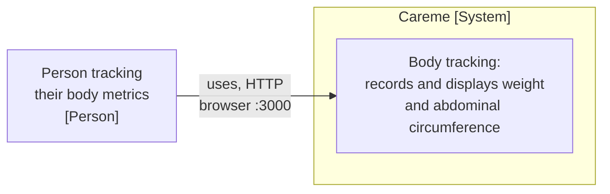
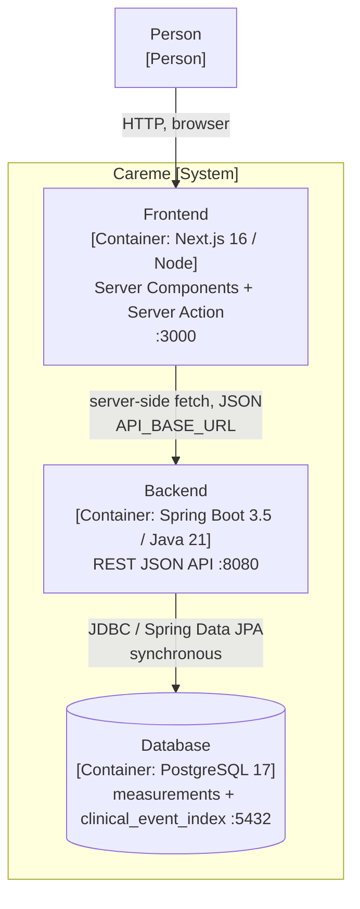
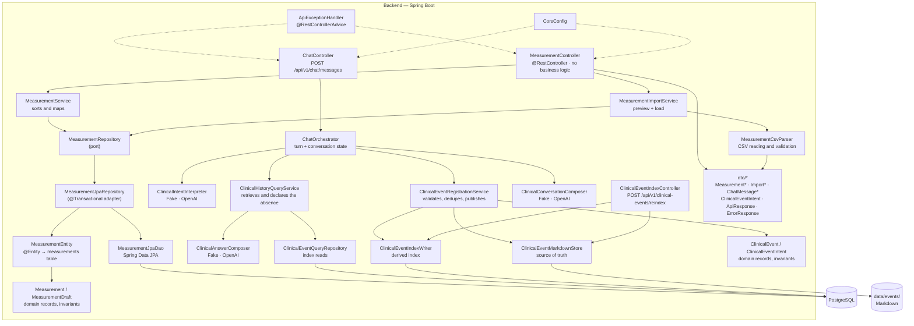
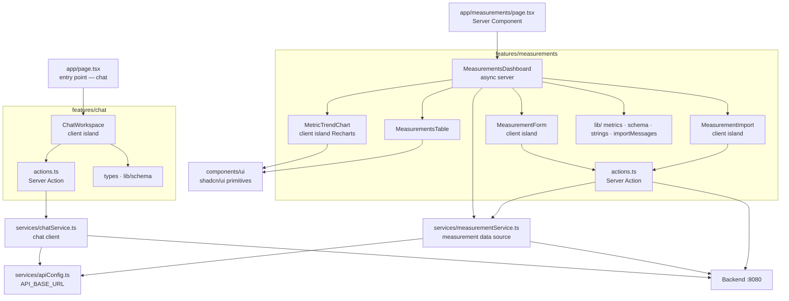

# architecture.md — Careme

> Architecture document with two purposes: human onboarding in under 15 minutes
> and operating context for AI agents under SDD/OpenSpec.
> Every claim cites the file that supports it.

---

## 1. Executive summary

Careme is a personal clinical assistant and body-tracking application: its entry
point is a chat where a person states medical facts in natural language —
diagnoses, medications, measurements and notes — and the system records them or
answers questions about the clinical history from retrieved facts, preserving
temporal precision; it also records one weight and one abdominal circumference per
day and shows them as a trend and as a per-date detail. It is made of two
independent services — a Next.js frontend and a Spring Boot backend — plus a
PostgreSQL database. The backend is the source of truth for the HTTP contract; the
frontend does not own the data. (Query contract:
`openspec/specs/clinical-history-query/spec.md`.)

**Value proposition:** a faithful personal clinical history — facts keep the
person's own wording and temporal precision — and minimal body tracking, with no
user accounts, one measurement per day and data precision owned by the domain
(invariants in the record constructor) instead of the interface.

**Ubiquitous language:**

| Term | Meaning | Evidence |
| --- | --- | --- |
| **Measurement** | One weight and one abdominal circumference for a specific day | `backend/src/main/java/com/careme/backend/entity/Measurement.java` |
| **Day** | The date identifies the measurement within the table; it is unique and cannot be in the future | `backend/src/main/resources/db/migration/V1__create_measurements_table.sql` |
| **Abdominal circumference** (waist) | Abdominal perimeter in centimetres | `backend/src/main/java/com/careme/backend/dto/MeasurementRequest.java` |
| **Weight** | Weight in kilograms, one decimal, at most 500 | `backend/src/main/java/com/careme/backend/dto/MeasurementRequest.java` |
| **Register** | Store the measurement of a day: create it when the day did not exist, replace it when it did | `backend/src/main/java/com/careme/backend/service/MeasurementService.java` |
| **MeasurementDraft** | A measurement without database identity, used by bulk loads | `backend/src/main/java/com/careme/backend/entity/MeasurementDraft.java` |
| **Load / import** | Read measurements from a CSV file and persist them | `backend/src/main/java/com/careme/backend/service/MeasurementImportService.java` |
| **Preview** | A report of what a load would do, storing nothing | `backend/src/main/java/com/careme/backend/dto/ImportPreviewResponse.java` |
| **Response envelope** (ApiResponse) | The single wrapper for every response, success or error | `backend/src/main/java/com/careme/backend/dto/ApiResponse.java` |
| **ClinicalEvent** | A medical fact stated by the person, with type, content and temporal precision | `backend/src/main/java/com/careme/backend/entity/ClinicalEvent.java` |
| **ClinicalEventIntent** | The structured result of the chat: `events`, `query`, `clarification` or `conversation` | `backend/src/main/java/com/careme/backend/dto/ClinicalEventIntent.java` |
| **Temporal precision** (date_precision) | `exact`, `approximate` or `unknown`; never more precise than what was given | `backend/src/main/java/com/careme/backend/entity/ClinicalEvent.java` |
| **Markdown source of truth** | The `evt_NNN.md` documents in `data/events/` where the facts live | `backend/src/main/java/com/careme/backend/service/ClinicalEventMarkdownStore.java` |
| **Derived index** | The PostgreSQL table `clinical_event_index`, rebuildable from the Markdown | `backend/src/main/resources/db/migration/V2__create_clinical_event_index.sql` |
| **Chat turn** (ChatMessageResponse) | The assistant response: status, message, supporting events when they apply and, when there are no records, the reason for the absence and the actions offered | `backend/src/main/java/com/careme/backend/dto/ChatMessageResponse.java` |

---

## 2. Context and scope

C4 level 1 diagram (Context):



**External systems:** an OpenAI-compatible LLM provider (DeepSeek by default)
when the chat is enabled with `CAREME_LLM_MODE=openai`; with the default
`CAREME_LLM_MODE=fake` there is no network call. There are no brokers, caches or
identity providers (`backend/README.md`, section *Use of APIs or external
services*; `backend/.../service/OpenAiClinicalIntentInterpreter.java`). The
remaining runtime dependencies are PostgreSQL and the local filesystem.

**Out of scope for the repository:**

- Authentication and authorization — they do not exist (`frontend/README.md`:
  *There is no authentication yet*).
- Multi-user — the model does not distinguish measurements of different people
  (`docs/use-cases/UC-001.md`, *Fuera de alcance*).
- Goals, notifications and recommendations (`docs/use-cases/UC-002.md`).
- Continuous integration — ⚠️ NOT DETECTED: `.github/` holds `prompts/`,
  `hooks/`, `skills/`, `context-mode/` and `copilot-instructions.md`, but there is
  no `.github/workflows/`. Verify whether CI lives in another provider.
- OpenSpec convention — ✅ RESOLVED: `openspec/` exists with `config.yaml`,
  `openspec/specs/` (current capabilities) and `openspec/changes/archive/`
  (archived changes). It coexists with the functional documentation in
  `docs/use-cases/` (UC-001…UC-004, UC-007, UC-008 and UC-010) and
  `docs/roadmap/`.

---

## 3. Technology stack

| Layer | Technology | Version | Rationale (deducible) | Source of truth |
| --- | --- | --- | --- | --- |
| Frontend runtime | Next.js (App Router) | 16.3.4 | Server Components by default: charts are derived on the server | `frontend/package.json` |
| Frontend UI | React | 19.2.8 | Next 16 compatibility | `frontend/package.json` |
| Frontend language | TypeScript (strict) | ^5 | Typed contract with the API | `frontend/package.json`, `frontend/tsconfig.json` |
| Frontend styling | Tailwind CSS | ^4 | Utilities + shadcn/ui tokens | `frontend/package.json` |
| Frontend components | shadcn/ui + radix-ui | ^4.21.0 / ^1.6.7 | Accessible primitives already solved | `frontend/components.json` |
| Frontend charts | Recharts | 3.8.0 | Through the shadcn/ui `chart` component | `frontend/package.json` |
| Frontend validation | Zod | ^4.6.2 | Validates the API response and the form | `frontend/src/features/measurements/lib/schema.ts` |
| Frontend tests | Vitest + Testing Library | ^5.0.0 | jsdom environment, `@` alias | `frontend/vitest.config.mts` |
| Frontend package manager | pnpm | 10.34.5 | Declared in `packageManager` | `frontend/package.json` |
| Backend language | Java (LTS) | 21 | Pinned by the enforcer | `backend/pom.xml` |
| Backend framework | Spring Boot (Web MVC, Validation, Data JPA) | 3.5.3 | Stack prescribed by the repository standard | `backend/pom.xml`, `docs/standards/java-springboot-standards.md` |
| Backend persistence | Hibernate ORM | 6 (managed by the parent) | `ddl-auto: validate`, the schema is owned by Flyway | `backend/src/main/resources/application.yml` |
| Backend migrations | Flyway | Managed by the parent | Schema created on first start | `backend/src/main/resources/db/migration/` |
| Backend CSV | Apache Commons CSV | 1.14.1 | Reading import files | `backend/pom.xml` |
| Backend build | Maven Wrapper + enforcer | 3.9.9 / JDK 21 | Reproducible build without an installed Maven | `backend/pom.xml`, `backend/.mvn/wrapper/` |
| Backend tests | JUnit 5, Mockito, AssertJ, MockMvc, Spring Boot Test, Testcontainers | — | Unit + web layer + real integration | `backend/pom.xml` |
| Backend coverage | JaCoCo (gate 90 % branches / 90 % lines) | 0.8.12 | Bound to `verify`, not to `test` | `backend/pom.xml` |
| Backend LLM | Spring `RestClient` (JDK HttpClient) to an OpenAI-compatible API | `deepseek-flash` | Chat opt-in (`CAREME_LLM_MODE=openai`), versioned prompts: classification in `prompts/clinical-intent-v3.txt`, composition in `prompts/clinical-answer-v3.txt` and `prompts/conversation-reply-v1.txt` | `backend/.../service/OpenAiClinical*.java`, `backend/src/main/resources/application.yml` |
| Data | PostgreSQL | 17 (`postgres:17-alpine`) | Repository standard and integration tests | `docker-compose.yml`, `backend/README.md` |
| Packaging | Docker multi-stage | `maven:3.9-eclipse-temurin-21` → `eclipse-temurin:21-jre-alpine` | Non-root image | `backend/Dockerfile` |
| Local orchestration | Docker/Podman Compose | — | Starts the three containers | `docker-compose.yml` |

---

## 4. Container view (C4 level 2)



| Container | Responsibility | Communication |
| --- | --- | --- |
| **Frontend** | Render the trend and the daily detail; validate payloads before sending them; refresh the view after registering | Node server: server-side `fetch` to the API (`frontend/src/services/measurementService.ts`). Serves HTML/JS to the browser |
| **Backend** | Own the HTTP contract, validate, apply invariants, persist and sort | Exposes HTTP/JSON under `/api/v1/**` (`backend/.../controller/MeasurementController.java`); speaks JDBC to PostgreSQL |
| **PostgreSQL** | Store one measurement row per day (`UNIQUE(date)`, `CHECK > 0`) and the derived index `clinical_event_index` | Volume `careme-pgdata`; `pg_isready` healthcheck (`docker-compose.yml`) |

**Protocols:** everything is synchronous, with no queues or events. The frontend
consumes the API from the server (not from the browser), so CORS is not strictly
necessary today — it is configured explicitly for a future client
(`backend/src/main/java/com/careme/backend/config/CorsConfig.java`).

**Local startup** (`docker-compose.yml`): `postgres` (healthcheck) →
`backend` (`depends_on: service_healthy`, `SPRING_PROFILES_ACTIVE=dev`, `CAREME_LLM_*`
variables and `CAREME_EVENTS_DIRECTORY=/app/data/events`) →
`frontend` (`API_BASE_URL=http://backend:8080`, inside the Compose network). The
backend mounts the `careme-events` volume at `/app/data` so the Markdown source of
truth outlives container recreation.

---

## 5. Component view (C4 level 3)

### 5.1 Backend (the most complex container)



| Module | Architectural role | Evidence |
| --- | --- | --- |
| `controller/` | Inbound adapter: translates HTTP ↔ DTO. It decides nothing | `backend/.../controller/MeasurementController.java`, `ChatController.java`, `ClinicalEventIndexController.java` |
| `service/` | Use cases: sort, decide create vs. replace, preview and load | `backend/.../service/MeasurementService.java`, `MeasurementImportService.java`, `MeasurementCsvParser.java` |
| `service/` (clinical) | Chat and registration: interpret, normalise dates, validate, dedupe, publish Markdown + derived index atomically, and answer through the matching channel (clinical history query or general conversation) without writing the history | `backend/.../service/ChatOrchestrator.java`, `ClinicalEvent*.java`, `ClinicalHistoryQueryService.java`, `OpenAiClinical*.java` |
| `repository/` | Port (`MeasurementRepository`) + JPA adapters. Isolates the persistence engine | `backend/.../repository/` |
| `entity/` | Domain/mapping separation: `MeasurementEntity` (mapping), `Measurement` and `MeasurementDraft` (annotation-free domain), `ClinicalEvent` (assistant domain) | `backend/.../entity/` |
| `dto/` | HTTP contract, independent of the schema | `backend/.../dto/` |
| `config/` | Explicit CORS, bounded by origin | `backend/.../config/CorsConfig.java` |
| `exception/` | Global handler: uniform 400/500 | `backend/.../exception/ApiExceptionHandler.java` |

### 5.2 Frontend



| Module | Architectural role | Evidence |
| --- | --- | --- |
| `app/` | Entry points: chat at `/`, dashboard at `/measurements`; layout, error boundary and styles | `frontend/src/app/page.tsx`, `measurements/page.tsx`, `error.tsx`, `layout.tsx` |
| `features/chat/` | Assistant module: workspace, Server Action, schema and types | `frontend/src/features/chat/` |
| `features/measurements/` | Self-contained body-tracking module (feature-sliced) | `frontend/src/features/measurements/` |
| `features/.../lib/metrics.ts` | Metric registry + pure helpers (series, axis domain, labels) | `frontend/src/features/measurements/lib/metrics.ts` |
| `features/.../lib/schema.ts` | Zod schemas for the API and the form | `frontend/src/features/measurements/lib/schema.ts` |
| `features/.../lib/strings.ts` | The only place with user-facing text (Spanish) | `frontend/src/features/measurements/lib/strings.ts` |
| `features/.../actions.ts` | Registration Server Action + `revalidatePath("/")` | `frontend/src/features/measurements/actions.ts` |
| `services/` | Data boundary: `fetch` + envelope + Zod (measurements and chat) | `frontend/src/services/measurementService.ts`, `chatService.ts`, `apiConfig.ts` |
| `components/ui/` | Reusable shadcn/ui primitives | `frontend/src/components/ui/` |
| `test/` | Vitest setup | `frontend/src/test/setup.ts` |

---

## 6. Repository map

```text
careme/
├── backend/                        # REST service (source of truth for the contract)
│   ├── src/main/java/com/careme/backend/
│   │   ├── controller/             # HTTP inbound adapter
│   │   ├── service/                # Use cases, CSV parsing, chat and clinical registration
│   │   ├── repository/             # Data port + JPA adapters
│   │   ├── entity/                 # Domain (records) + JPA mapping
│   │   ├── dto/                    # HTTP contract
│   │   ├── config/                 # CORS
│   │   ├── exception/              # Global error handler
│   │   └── CaremeBackendApplication.java
│   ├── src/main/resources/         # application.yml + profiles + migrations + prompts
│   ├── src/test/java/              # Mirrors the package structure
│   ├── Dockerfile                  # Non-root multi-stage image
│   └── pom.xml
├── frontend/                       # Next.js SPA/SSR
│   ├── src/app/                    # Chat (/), dashboard (/measurements), layout, error, styles
│   ├── src/components/ui/          # shadcn/ui primitives
│   ├── src/features/chat/          # Assistant module
│   ├── src/features/measurements/  # Body-tracking module
│   ├── src/services/               # Data boundary (fetch + Zod)
│   ├── src/test/                   # Test setup
│   └── e2e/playwright/             # Reserved; no tests yet
├── docs/                           # Project documentation
│   ├── standards/                  # Java/Spring and Next standards
│   ├── use-cases/                  # UC-001…UC-004, UC-007, UC-008 and UC-010
│   ├── roadmap/                    # Roadmap and MVP scope of the clinical assistant
│   ├── data-model.md               # Data model
│   └── architecture.md             # This document
├── openspec/                       # Current specs and archived changes (OpenSpec)
├── .github/                        # prompts/, skills/, hooks/ and context-mode/ (no workflows)
├── graphify-out/                   # Repository knowledge graph for AI agents
└── docker-compose.yml              # postgres + backend + frontend
```

Architectural role of the top-level folders:

- `backend/` and `frontend/`: independent deployments; they only talk over HTTP.
  Neither imports the other's code.
- `docs/`: source of requirements and standards. A business rule change must be
  reflected here.
- `.github/`: configuration of the AI assistant (prompts, hooks), not of the
  product.
- `graphify-out/`: context-engineering artefact (code graph). It is regenerated;
  it is not a source of truth.

---

## 7. Architectural patterns

**Main pattern: layered with a port/adapter in persistence (partially
hexagonal).**

- The backend follows `controller → service → repository`, stated in
  `backend/README.md` and verifiable in the packages of
  `backend/src/main/java/com/careme/backend/`.
- The domain (`Measurement`) is a `record` with no persistence annotations and with
  invariants in its compact constructor
  (`backend/.../entity/Measurement.java`). `MeasurementEntity` maps the table and
  nothing else; `MeasurementResponse` is the HTTP contract. Three types, three
  responsibilities.
- `MeasurementRepository` is a **port** (`backend/.../repository/MeasurementRepository.java`)
  implemented by `MeasurementJpaRepository`; the service depends on the interface,
  not on JPA. That is the evidence of the hexagonal component.

**Dependency rules:**

| From | May import | May not import |
| --- | --- | --- |
| `controller` | `dto`, `service`, `exception` | `repository`, `entity` (JPA) |
| `service` | `dto`, `entity` (domain), `repository` (interface) | `controller`, `MeasurementJpaDao` |
| `repository` (adapter) | `entity`, JPA | `controller`, `service` |
| `entity` (domain) | JDK only | Any application layer |

- **Frontend:** render-layer architecture + feature-sliced. Server Components by
  default; `MetricTrendChart` is the only client island for Recharts and
  `MeasurementForm`/`MeasurementImport` for interaction (`frontend/README.md`,
  *Architecture notes*). The data boundary is concentrated in
  `services/measurementService.ts`.
- **Reactivity:** Server Actions + `revalidatePath("/")` instead of a client-side
  state layer (`frontend/src/features/measurements/actions.ts`).

**Detected anti-patterns and technical debt:**

| Finding | Evidence | Impact |
| --- | --- | --- |
| No authentication or authorization anywhere in the API | `backend/README.md`; `frontend/README.md` | High if the data leaves a local environment |
| No continuous integration | `.github/` without `workflows/` | Medium: coverage gates only run locally |
| `e2e/playwright/` reserved and empty; Storybook, Playwright, TanStack Query, Zustand, runtime i18n and dark mode pending | `frontend/README.md`, *Deferred from the frontend standard* | Low: additive adoption planned |
| Clinical events cannot be edited or deleted; the history query is answered from the derived index and the absence of records is declared with its reason and its actions | `openspec/specs/clinical-history-query/spec.md`, `backend/.../service/ClinicalEventIndexRebuilder.java` | Informative: MVP scope |
| Fact deduplication is limited to the active conversation, with in-memory state | `backend/.../service/ClinicalEventConversationRegistry.java`, `ConversationStateStore.java` | Low: a repetition in another conversation creates a new event |

---

## 8. Architectural decisions (ADR-light)

There are no formal ADRs in the repository — ⚠️ NOT DETECTED: there is no
`docs/adr/` folder and no `adr-*.md` files. The decisions below are inferred from
the code and the READMEs.

| ID | Decision | Status | Context | Consequences |
| --- | --- | --- | --- | --- |
| ADR-001 | Flyway owns the schema; Hibernate only validates (`ddl-auto: validate`) | Current | Avoid implicit DDL | A mismatch between mapping and migration fails at startup instead of silently |
| ADR-002 | Separate domain (`Measurement`), mapping (`MeasurementEntity`) and contract (`MeasurementResponse`) | Current | The JSON contract must not move when the schema changes | More classes per entity; real isolation between layers |
| ADR-003 | `MeasurementRepository` as an interface (port) in front of JPA | Current | Change the persistence engine without touching the contract | Extra indirection; high testability |
| ADR-004 | One measurement per day: unique `date`; registering replaces | Current | Avoid duplicates and the ambiguity of "the one for the day" | Registering twice a day overwrites; changing it requires a migration |
| ADR-005 | A single `ApiResponse` envelope for every result | Current | Predictable responses for the client | The client must always unwrap |
| ADR-006 | The frontend consumes the API from the server; `API_BASE_URL` without the `NEXT_PUBLIC_` prefix | Current | The browser never needs the backend URL | CORS is not needed today; document it when browser calls are added |
| ADR-007 | Server Components by default; minimal client islands | Current | Avoid sending logic and `Date` to the browser | Date labels do not shift because of the time zone |
| ADR-008 | All-or-nothing import validation, reusing `MeasurementRequest` | Current | A file cannot accept what the form rejects | A large file with one error loads nothing; a single source of rules |
| ADR-009 | Integration tests against real PostgreSQL (Testcontainers), not H2 | Current | Test the production schema | Requires a container runtime locally |
| ADR-010 | Coverage gate (90 % branches/lines) bound to `verify`, not to `test` | Current | Do not block fast test cycles | `mvn test` can pass with insufficient coverage |
| ADR-011 | Java 21 pinned by `maven-enforcer-plugin` and a committed Maven wrapper | Current | Reproducible build | Builds with another JDK fail explicitly |
| ADR-012 | User-facing text in Spanish isolated in `strings.ts`; code in English | Current | Future i18n without a refactor | Manual discipline; no automated check |
| ADR-013 | Implicit `Patient` and clinical events in Markdown as the source of truth + derived PostgreSQL index | Current | MVP of the clinical history assistant | Markdown rules; PostgreSQL indexes and is rebuilt; the query is read-only and there is no edit or delete |
| ADR-014 | Natural-language interpretation and composition behind separate adapters (`ClinicalIntentInterpreter` / `ClinicalAnswerComposer` / `ClinicalConversationComposer`) with `fake`/`openai` mode | Current | Separate the LLM provider from the domain and validate grounded answers | The `fake` default is deterministic; `openai` requires `CAREME_LLM_API_KEY`, classifies queries, composes answers only from retrieved facts and composes the conversational reply without reading the history |

---

## 9. Security and compliance

**Authentication and authorization:** none. There is no login, tokens, sessions or
roles in either service (`backend/README.md`; `frontend/README.md`). The whole API
is anonymous and open to whoever reaches port 8080.

**Secret management:** through environment variables, with defaults in development
only.

| Variable | Use | Default |
| --- | --- | --- |
| `CAREME_DB_URL` | JDBC URL | `jdbc:postgresql://localhost:5432/careme` |
| `CAREME_DB_USER` / `CAREME_DB_PASSWORD` | Database credentials | `careme` / `careme` |
| `CAREME_CORS_ALLOWED_ORIGINS` | Origins allowed in `pre`/`prd` | No default: the app does not start without it |
| `CAREME_EVENTS_DIRECTORY` | Directory of the Markdown source of truth | `data/events` |
| `CAREME_LLM_MODE` | `fake` (no network) or `openai` | `fake` |
| `CAREME_LLM_API_KEY` | LLM provider credential (backend only) | No default; required with `openai` |
| `CAREME_LLM_BASE_URL` / `CAREME_LLM_MODEL` | OpenAI-compatible endpoint and model | `https://api.deepseek.com` / `deepseek-flash` |
| `CAREME_LLM_CONNECT_TIMEOUT` / `CAREME_LLM_READ_TIMEOUT` | LLM client timeouts | `PT5S` / `PT30S` |
| `API_BASE_URL` (frontend) | Backend URL for the server-side fetch | `http://localhost:8080` |

Evidence: `backend/src/main/resources/application.yml`,
`backend/src/main/resources/application-{dev,pre,prd}.yml`, `.env.example`,
`frontend/.env.example`.
The `docker-compose.yml` credentials (`careme`/`careme`) are for local development
and must not be reused outside it.

**Exposed surfaces and validations:**

| Surface | Validation | Evidence |
| --- | --- | --- |
| `POST /api/v1/measurements` | Bean Validation: date not in the future, positive metrics, limits 500/400, one decimal | `backend/.../dto/MeasurementRequest.java` |
| Domain invariants | The record's compact constructor rejects null or non-positive values | `backend/.../entity/Measurement.java` |
| Database | `UNIQUE(date)` + `CHECK (weight_kg > 0)` + `CHECK (waist_cm > 0)` | `db/migration/V1__create_measurements_table.sql` |
| File upload | Multipart capped at 10 MB (11 MB request), at most 10000 rows, exact headers, row-by-row validation before persisting | `application.yml`, `MeasurementCsvParser.java` |
| Errors | Global handler: 400 `VALIDATION_ERROR` / `INVALID_REQUEST`, 500 `INTERNAL_ERROR`; no internal detail reaches the client | `backend/.../exception/ApiExceptionHandler.java` |
| `POST /api/v1/chat/messages` | Bean Validation: message not empty and ≤ 4000 characters, required `messageId`; deterministic validation of the intent before registering | `backend/.../dto/ChatMessageRequest.java`, `ClinicalEventIntentValidator.java` |
| `POST /api/v1/clinical-events/reindex` | No body; rebuilds the derived index from `data/events/` | `backend/.../controller/ClinicalEventIndexController.java` |

**CORS:** the `/api/**` mapping is restricted to configured origins and to the
`GET` and `POST` methods (`CorsConfig.java`). It is not a security defence by
itself: it does not replace authentication.

**Compliance:** no requirements are implemented. The product handles personal
health data, so the planned evolution includes privacy, encryption, auditing and
access control
(`docs/roadmap/roadmap_asistente_historia_clinica.md`, §2.5) — ⚠️ NOT DETECTED in
code: none of those capabilities exists today. Before exposing the system outside
a local environment, the applicable regulatory framework must be confirmed (e.g.
GDPR if there are users in the EU) and authentication, encryption in transit and
at rest, and a retention policy must be decided.

---

Generated: 2026-09-13
Analysed commit: fcff0b252e21e01234f944bc1be8578e19b79c3e
Analysis author: GitHub Copilot
Suggested next review: 2026-12-13
