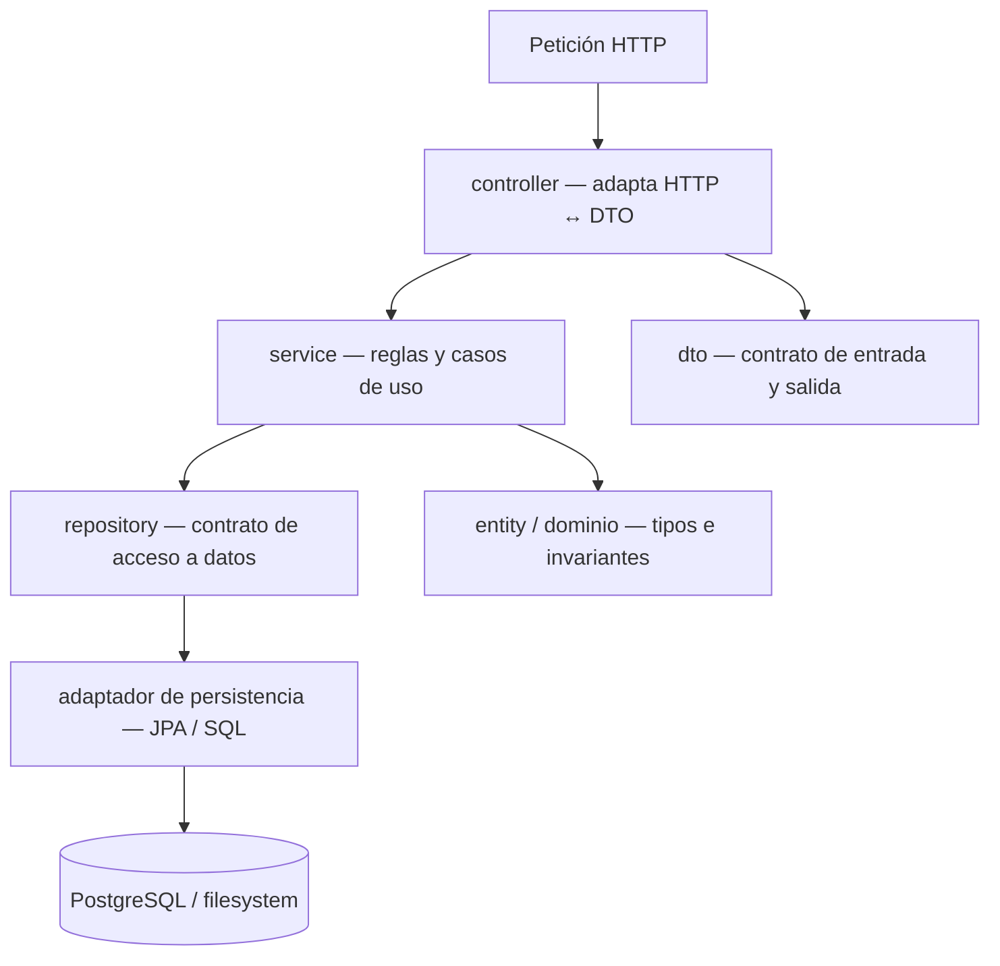
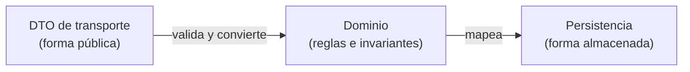
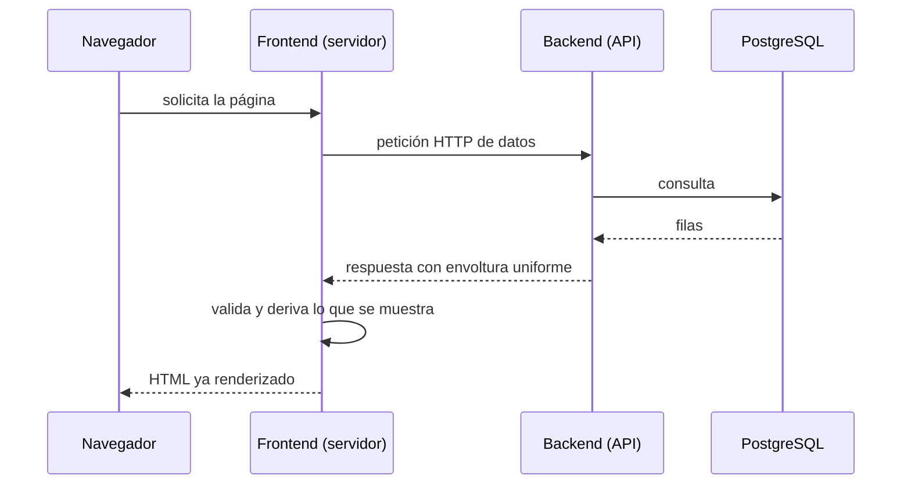
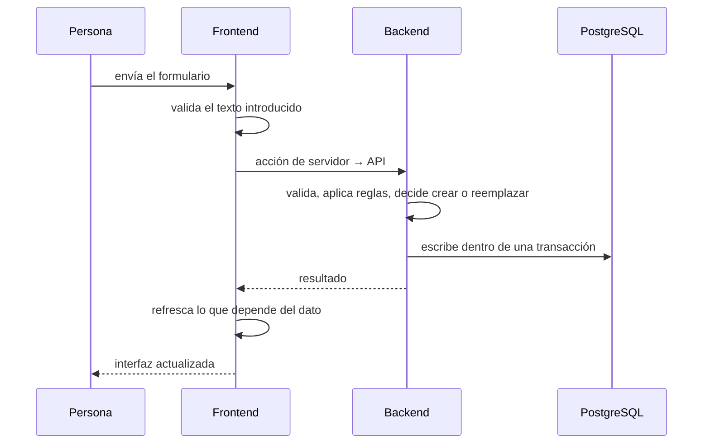

# 01 — Estructura y arquitectura del repositorio

Este documento explica cómo está organizado el repositorio y por qué esa organización sostiene el comportamiento del sistema. El objetivo no es catalogar archivos, sino entender qué responsabilidad tiene cada zona, qué límites las separan y cómo atraviesa el sistema una operación completa.

---

## 1. ¿Qué es?

El repositorio describe un sistema compuesto por **dos servicios desplegables** y una **base de datos**:

- un **frontend** que renderiza la interfaz,
- un **backend** que expone la API y contiene las reglas,
- una **base de datos relacional** que persiste el estado.

El frontend no posee los datos: los solicita al backend. El backend es la fuente de verdad del contrato HTTP y del estado persistido. Alrededor de esos tres elementos hay zonas de **soporte** (documentación, especificaciones, configuración de ejecución y automatización del editor) que no forman parte del runtime, pero condicionan cómo se construye y evoluciona el sistema.

Esto define una propiedad importante: los servicios se pueden **desplegar y ejecutar por separado**, cada uno con su propio proceso, y se comunican únicamente por HTTP. No comparten memoria ni disco local; la base de datos es el único punto de encuentro de los datos estructurados.

### Mapa general

```text
careme/
├── frontend/          # Aplicación Next.js (interfaz + comunicación con la API)
├── backend/           # Servicio Spring Boot (API, reglas y persistencia)
├── docs/              # Documentación: arquitectura, modelo de datos, estándares, casos de uso
├── openspec/          # Especificaciones vigentes y cambios archivados (proceso de diseño)
├── .github/           # Prompts, skills e instrucciones para el desarrollo asistido
├── docker-compose.yml # Definición del stack completo: postgres + backend + frontend
└── README.md          # Punto de entrada del proyecto
```

Cada servicio tiene su propio README y su propio sistema de construcción. El `docker-compose.yml` de la raíz es lo único que conoce a los tres a la vez.

---

## 2. ¿Por qué se utiliza aquí?

La organización responde a **separar responsabilidades** para que cada decisión viva en un solo lugar.

**Por qué dos servicios y no uno.** Si el frontend hablara directamente con la base de datos, las reglas del dominio quedarían duplicadas en la interfaz y el esquema se volvería parte del contrato público. Con un backend en medio, el frontend depende de una **API**, no de un esquema: el almacenamiento puede cambiar sin tocar la interfaz, y las validaciones críticas se aplican en un único punto de confianza. Ese punto se convierte en la **frontera de seguridad**: lo que envía el navegador nunca es de fiar, aunque la interfaz ya haya validado.

**Por qué capas en el backend.** Una petición HTTP atraviesa etapas con intereses distintos: interpretar el protocolo, decidir reglas, leer y escribir datos. Mezclarlas hace que un cambio de esquema obligue a tocar la capa web, o que una decisión de negocio se esconda dentro de una consulta. Las capas convierten cada etapa en un lugar identificable.

**Por qué módulos por funcionalidad en el frontend.** La interfaz crece por **capacidades** (conversar, seguir mediciones), no por tipo de archivo. Agrupar todo lo de una capacidad —componentes, esquemas, acciones— mantiene junta la lógica que cambia por la misma razón y deja la frontera de datos en un solo sitio.

**Por qué documentación y especificaciones dentro del repositorio.** `docs/` guarda el conocimiento estable (arquitectura, modelo, estándares) y `openspec/` guarda el proceso: qué se quiere cambiar, por qué y con qué criterios. Separar el "cómo es" del "cómo cambia" evita que la documentación de diseño se contamine con propuestas aún no decididas.

---

## 3. Zonas del repositorio y responsabilidades

| Zona | Responsabilidad | Depends on |
| --- | --- | --- |
| `frontend/` | Renderizar la interfaz y comunicarse con la API desde el servidor | Backend (HTTP) |
| `backend/` | Exponer la API, aplicar reglas, validar y persistir | PostgreSQL, filesystem |
| PostgreSQL | Almacenar el estado estructurado y los índices | — |
| `docs/` | Explicar arquitectura, modelo de datos, estándares y casos de uso | — |
| `openspec/` | Registro de especificaciones vigentes y cambios propuestos/archivados | — |
| `.github/` | Instrucciones, prompts y skills del desarrollo asistido | — |
| `docker-compose.yml` | Orquestar los tres contenedores y su red | Imágenes de los servicios |

Regla práctica: si algo **solo tiene sentido en ejecución**, vive en `frontend/` o `backend/`; si **describe el sistema**, vive en `docs/`; si **describe un cambio pendiente o histórico**, vive en `openspec/`.

---

## 4. Arquitectura por capas del backend

El backend sigue una estructura en capas con una **dirección de dependencia única**: las capas externas conocen a las internas, nunca al contrario.



| Paquete | Rol | Qué no debe hacer |
| --- | --- | --- |
| `controller/` | Traducir HTTP a llamadas de servicio y envolver la respuesta | Contener lógica de negocio o consultas |
| `dto/` | Definir el contrato de entrada y salida | Filtrar el esquema de la base de datos |
| `service/` | Orquestar casos de uso y decisiones | Conocer detalles de HTTP o de SQL crudo |
| `repository/` | Declarar el acceso a datos y adaptarlo | Decidir reglas de negocio |
| `entity/` | Modelar el dominio y sus invariantes | Exponerse directamente como respuesta HTTP |
| `config/` | Ajustes transversales, como el origen permitido | Lógica funcional |
| `exception/` | Traducir errores a respuestas uniformes | Filtrar información interna |

Cada capa tiene una razón distinta para cambiar. Un cambio en el esquema de la base de datos afecta al adaptador; un cambio en las reglas afecta al servicio; un cambio en el contrato afecta al DTO. Mantener esas razones separadas es lo que evita que un ajuste pequeño se propague por todo el sistema.

### El repositorio como puerto

El acceso a datos se declara como un **contrato** (un puerto) y se implementa en un **adaptador**. El servicio depende del contrato, no del motor de persistencia. Así, el motor puede cambiar —o sustituirse por una implementación en memoria en las pruebas— sin tocar las reglas. Es el mismo principio que permite que la lógica de negocio sea comprobable sin una base de datos real.

---

## 5. Módulos por funcionalidad del frontend

El frontend se organiza por **capacidad**, con los puntos de entrada y las primitivas compartidas en zonas propias.

| Zona | Responsabilidad |
| --- | --- |
| `src/app/` | Rutas y estructura de páginas: la entrada del chat y la vista de mediciones, más el layout, los estilos globales y la pantalla de error de ruta |
| `src/features/chat/` | Todo lo del chat: componente principal, acción de servidor, esquema de validación y tipos |
| `src/features/measurements/` | Todo lo del seguimiento corporal: panel, formulario, importación, tabla, gráfico y lógica pura |
| `src/components/ui/` | Primitivas visuales reutilizables, independientes de la funcionalidad |
| `src/services/` | Frontera de datos: los únicos módulos que conocen la dirección y el formato de la API |
| `src/lib/` | Utilidades transversales |
| `src/test/` | Configuración común de las pruebas |

Dentro de una funcionalidad, la separación es consistente: `components/` contiene lo que se renderiza, `lib/` contiene lógica pura y textos, y la raíz del módulo contiene la acción de servidor y los tipos compartidos. La lógica pura —cálculos, formateo, validación— se mantiene fuera de los componentes para poder probarla sin montar la interfaz.

**Por qué la frontera de datos es un módulo aparte.** Si cada componente llamara a la API por su cuenta, la dirección del backend, el formato de la respuesta y su validación quedarían dispersos. Centralizarlos en `services/` hace que un cambio de contrato se resuelva en un solo lugar y que el resto del código trabaje con datos ya validados y tipados.

---

## 6. Límites entre dominio, transporte y persistencia

Uno de los límites más importantes es el que separa **tres representaciones** de la misma información:

- el **tipo de dominio**, que expresa las reglas y no admite estados inválidos;
- el **modelo de persistencia**, que describe cómo se guarda;
- el **DTO de transporte**, que describe qué viaja por la API.



Mantenerlos separados tiene una consecuencia deliberada: **un cambio en la base de datos no altera el JSON público**, y un cambio en el contrato no obliga a reestructurar el almacenamiento. El precio es algo de mapeo explícito; el beneficio es que cada forma evoluciona por separado.

Las **invariantes** —aquello que nunca puede ser falso, como que una fecha no sea futura o que un valor sea positivo— se sitúan en el dominio, de modo que un objeto inválido no llega a existir. Las restricciones que además protegen la base de datos se replican en el esquema, como una segunda línea de defensa que actúa incluso si algo se insertara por fuera de la aplicación.

---

## 7. Recorrido de una operación

### Lectura



El navegador no conoce la dirección del backend: la petición sale del **servidor** del frontend. Esto simplifica la seguridad (la API no necesita exponerse al navegador) y permite preparar los datos antes de enviar la página.

### Escritura



La validación ocurre **dos veces** por diseño: en la interfaz, para dar respuesta inmediata; en el backend, porque es la frontera de confianza. La segunda no se puede omitir.

### Operación con efectos secundarios externos

El flujo de chat añade dos particularidades que se documentan en detalle en los documentos 3 y 5: una llamada a un proveedor externo de lenguaje, y una **fuente de verdad en archivos** con un **índice derivado** en la base de datos, reconstruible a partir de esos archivos. Esto introduce un límite más: el estado no vive solo en PostgreSQL, y el índice puede regenerarse sin pérdida porque los archivos son la referencia.

---

## 8. Ideas clave

- El sistema se compone de **servicios independientes** unidos por HTTP y por una base de datos; el frontend no posee los datos.
- El backend organiza su razón de cambio en **capas** con dependencias en una sola dirección (entrada → reglas → datos).
- El acceso a datos se declara como **contrato** y se implementa en un **adaptador**, para aislar el motor de persistencia.
- El frontend se agrupa por **capacidad**, con una **frontera de datos** única hacia la API.
- Dominio, transporte y persistencia son **tres formas distintas** de la misma información, y se mantienen separadas a propósito.
- Las **invariantes** viven en el dominio y se reflejan en el esquema como segunda defensa.
- La validación del navegador **nunca sustituye** a la del backend.
- La documentación describe el sistema; las especificaciones describen **cómo cambia**.
