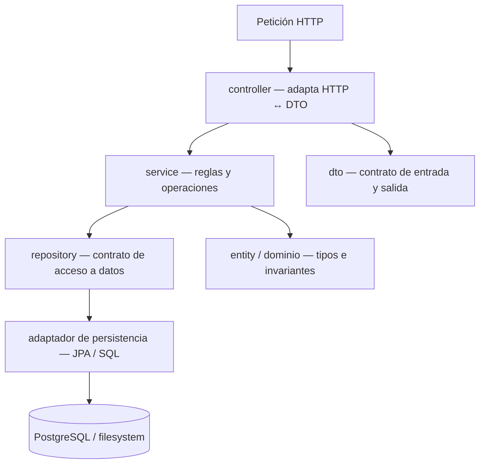
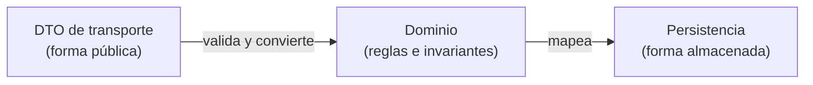
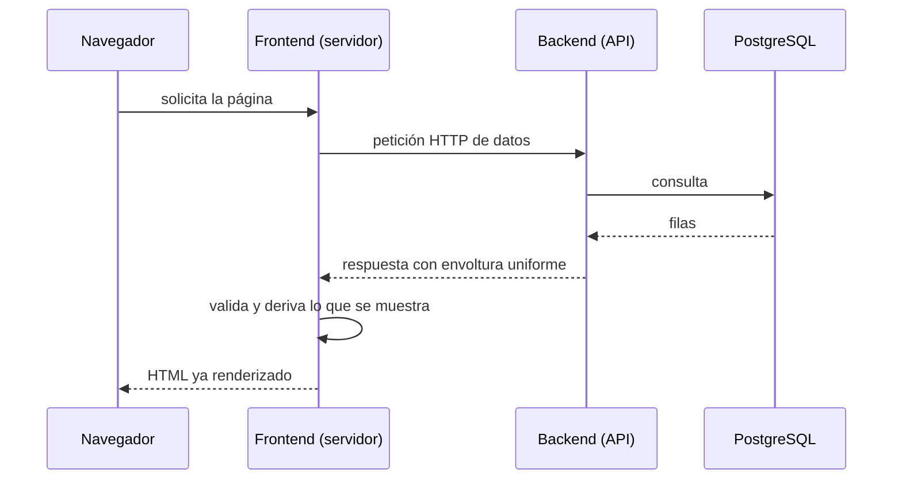
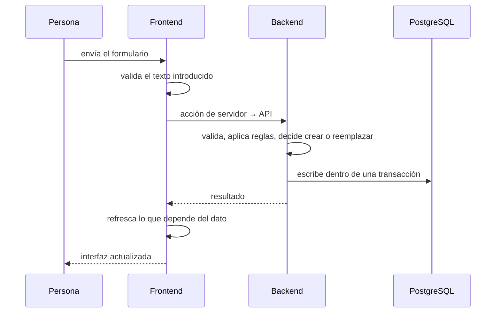

# 01 — Estructura y arquitectura del repositorio

Este documento presenta la estructura del repositorio como una arquitectura de
software. No se limita a enumerar carpetas: define los conceptos que organizan
el sistema, explica las responsabilidades de cada límite y muestra cómo una
operación atraviesa frontend, backend, persistencia y documentación.

## Índice

1. [Sistema y arquitectura](#1-sistema-y-arquitectura)
2. [Separación de responsabilidades](#2-separación-de-responsabilidades)
3. [Zonas del repositorio](#3-zonas-del-repositorio)
4. [Arquitectura por capas del backend](#4-arquitectura-por-capas-del-backend)
5. [Módulos por funcionalidad del frontend](#5-módulos-por-funcionalidad-del-frontend)
6. [Dominio, transporte y persistencia](#6-dominio-transporte-y-persistencia)
7. [Recorrido de una operación](#7-recorrido-de-una-operación)

---

## 1. Sistema y arquitectura

Una **arquitectura de software** es la organización de los elementos de un
sistema y de las reglas que limitan sus dependencias y comunicaciones. Describe
decisiones relativamente estables: qué componentes existen, qué responsabilidad
tiene cada uno, qué interfaces utilizan y qué datos pueden compartir.

Un **componente** es una unidad con una responsabilidad identificable y una
interfaz de comunicación. Un **límite arquitectónico** separa componentes para
impedir que una decisión interna se convierta accidentalmente en una dependencia
externa. En Careme, el frontend, el backend y PostgreSQL son componentes de
ejecución; `docs/` y `openspec/` son componentes de conocimiento y evolución.

El repositorio describe un sistema compuesto por **dos servicios desplegables** y una **base de datos**:

- un **frontend** que renderiza la interfaz,
- un **backend** que expone la API y contiene las reglas,
- una **base de datos relacional** que persiste el estado.

El frontend no posee los datos: los solicita al backend. El backend define el
contrato HTTP y coordina el estado persistido. Alrededor de esos tres elementos
hay zonas de soporte: documentación, especificaciones, configuración de
ejecución y automatización del editor. Estas zonas no atienden peticiones, pero
determinan cómo se construye, verifica y modifica el sistema.

Esto define una propiedad importante: los servicios se pueden **desplegar y
ejecutar por separado**, cada uno con su propio proceso, y se comunican por HTTP.
No comparten memoria ni disco local; PostgreSQL y los mecanismos de persistencia
del backend son los puntos de encuentro de los datos.

### Mapa general

```text
careme/
├── frontend/          # Aplicación Next.js (interfaz + comunicación con la API)
├── backend/           # Servicio Spring Boot (API, reglas y persistencia)
├── docs/              # Documentación: arquitectura, modelo de datos, estándares y funcionalidad
├── openspec/          # Especificaciones vigentes y cambios archivados (proceso de diseño)
├── .github/           # Prompts, skills e instrucciones para el desarrollo asistido
├── docker-compose.yml # Definición del stack completo: postgres + backend + frontend
└── README.md          # Punto de entrada del proyecto
```

Cada servicio tiene su propio README y su propio sistema de construcción. El `docker-compose.yml` de la raíz es lo único que conoce a los tres a la vez.

---

## 2. Separación de responsabilidades

La **separación de responsabilidades** consiste en asignar cada decisión a la
unidad que posee la información y las reglas necesarias para tomarla. Una unidad
debe cambiar por una razón coherente; si cambia por razones no relacionadas, su
responsabilidad probablemente es demasiado amplia.

La organización del repositorio aplica este principio en tres niveles:

- **Servicio:** frontend para presentación e interacción; backend para contrato,
    reglas y persistencia coordinada.
- **Capa:** controlador para HTTP, servicio para decisiones y repositorio para
    acceso a datos.
- **Funcionalidad:** módulos del frontend agrupados por capacidad, no por tipo
    genérico de archivo.

Una **API** (Application Programming Interface) es un contrato que define cómo
un consumidor solicita operaciones y cómo recibe sus resultados. El frontend
depende de la API, no del esquema de PostgreSQL. Esto permite cambiar el
almacenamiento sin convertirlo en parte del contrato público.

La **frontera de confianza** es el límite a partir del cual una entrada se
considera no confiable. En este sistema está en el backend: la validación del
frontend mejora la experiencia, pero la validación del backend es obligatoria
porque cualquier cliente puede llamar directamente a la API.

Una **capa** es un conjunto de componentes que comparte un nivel de
abstracción y una dirección de dependencia. Una petición HTTP atraviesa etapas
con intereses distintos: interpretar el protocolo, decidir reglas, leer y
escribir datos. Las capas convierten cada etapa en un lugar identificable.

Un **módulo por funcionalidad** agrupa componentes, esquemas, acciones y tipos
que cambian por la misma capacidad del producto: chat, inspección de eventos
clínicos o seguimiento corporal. Esta organización reduce dependencias
accidentales entre funcionalidades.

`docs/` conserva conocimiento de referencia sobre el sistema actual. `openspec/`
conserva especificaciones y cambios que describen cómo evoluciona. La separación
distingue el estado del sistema de las decisiones que lo modifican.

---

## 3. Zonas del repositorio

Una **zona del repositorio** es una parte con una responsabilidad documental,
de ejecución o de soporte. La siguiente tabla expresa la dirección de las
dependencias, no solo el contenido de cada carpeta.

| Zona | Responsabilidad | Depende de |
| --- | --- | --- |
| `frontend/` | Renderizar la interfaz y comunicarse con la API desde el servidor | Backend (HTTP) |
| `backend/` | Exponer la API, aplicar reglas, validar y persistir | PostgreSQL, filesystem |
| PostgreSQL | Almacenar el estado estructurado y los índices | — |
| `docs/` | Explicar arquitectura, modelo de datos, estándares y funcionalidad | — |
| `openspec/` | Registro de especificaciones vigentes y cambios propuestos/archivados | — |
| `.github/` | Instrucciones, prompts y skills del desarrollo asistido | — |
| `docker-compose.yml` | Orquestar los tres contenedores y su red | Imágenes de los servicios |

La regla de ubicación es semántica: si algo implementa comportamiento en
ejecución, vive en `frontend/` o `backend/`; si describe el sistema actual, vive
en `docs/`; si describe una evolución especificada, vive en `openspec/`.

---

## 4. Arquitectura por capas del backend

La **arquitectura por capas** restringe qué nivel puede conocer a otro. La
dirección de dependencia va desde la entrada hacia las reglas y desde las
reglas hacia los adaptadores de datos. Una dependencia es una relación en la
que un componente necesita conocer la interfaz o el comportamiento de otro.

El backend sigue una estructura en capas con una **dirección de dependencia única**: las capas externas conocen a las internas, nunca al contrario.



| Paquete | Rol | Qué no debe hacer |
| --- | --- | --- |
| `controller/` | Traducir HTTP a llamadas de servicio y envolver la respuesta | Contener lógica de negocio o consultas |
| `dto/` | Definir el contrato de entrada y salida | Filtrar el esquema de la base de datos |
| `service/` | Orquestar operaciones y decisiones | Conocer detalles de HTTP o de SQL crudo |
| `repository/` | Declarar el acceso a datos y adaptarlo | Decidir reglas de negocio |
| `entity/` | Modelar el dominio y sus invariantes | Exponerse directamente como respuesta HTTP |
| `config/` | Ajustes transversales, como el origen permitido | Lógica funcional |
| `exception/` | Traducir errores a respuestas uniformes | Filtrar información interna |

Cada capa tiene una razón distinta para cambiar. Un cambio en el esquema de la base de datos afecta al adaptador; un cambio en las reglas afecta al servicio; un cambio en el contrato afecta al DTO. Mantener esas razones separadas es lo que evita que un ajuste pequeño se propague por todo el sistema.

El siguiente ejemplo muestra la dirección correcta de una llamada. El servicio
depende de una abstracción, mientras que el adaptador implementa esa abstracción:

```java
public interface EventReader {
    List<ClinicalEvent> findAll(EventFilter filter);
}

public final class EventInspectionService {
    private final EventReader reader;

    public List<ClinicalEvent> list(EventFilter filter) {
        return reader.findAll(filter);
    }
}
```

El servicio conoce `EventReader`, no PostgreSQL ni los detalles del controlador.
Esta relación es una aplicación de **inversión de dependencias**: las reglas
dependen de una abstracción estable y los detalles técnicos se conectan detrás
de ella.

### El repositorio como puerto

El acceso a datos se declara como un **contrato** (un puerto) y se implementa en un **adaptador**. El servicio depende del contrato, no del motor de persistencia. Así, el motor puede cambiar —o sustituirse por una implementación en memoria en las pruebas— sin tocar las reglas. Es el mismo principio que permite que la lógica de negocio sea comprobable sin una base de datos real.

---

## 5. Módulos por funcionalidad del frontend

Una **funcionalidad** es una capacidad observable de la aplicación que agrupa
interfaz, validación y coordinación de datos. El frontend usa este criterio para
mantener juntas las partes que evolucionan por la misma razón.

El frontend se organiza por **capacidad**, con los puntos de entrada y las primitivas compartidas en zonas propias.

| Zona | Responsabilidad |
| --- | --- |
| `src/app/` | Rutas y estructura de páginas: chat, inspección de eventos clínicos y mediciones, además del layout, estilos globales y errores de ruta |
| `src/features/chat/` | Todo lo del chat: componente principal, acción de servidor, esquema de validación y tipos |
| `src/features/clinical-events/` | Lista, filtros, orden, detalle y estados de la inspección de eventos clínicos |
| `src/features/measurements/` | Todo lo del seguimiento corporal: panel, formulario, importación, tabla, gráfico y lógica pura |
| `src/components/ui/` | Primitivas visuales reutilizables, independientes de la funcionalidad |
| `src/services/` | Frontera de datos: los únicos módulos que conocen la dirección y el formato de la API |
| `src/lib/` | Utilidades transversales |
| `src/test/` | Configuración común de las pruebas |

Dentro de una funcionalidad, `components/` contiene lo que se renderiza, `lib/`
contiene lógica pura y textos, y la raíz del módulo contiene acciones y tipos
compartidos. La **lógica pura** es una función cuyo resultado depende solo de sus
argumentos y que no produce efectos observables fuera de su retorno. Mantenerla
fuera de los componentes permite probarla sin montar la interfaz.

**Por qué la frontera de datos es un módulo aparte.** Si cada componente llamara a la API por su cuenta, la dirección del backend, el formato de la respuesta y su validación quedarían dispersos. Centralizarlos en `services/` hace que un cambio de contrato se resuelva en un solo lugar y que el resto del código trabaje con datos ya validados y tipados.

---

## 6. Dominio, transporte y persistencia

Un **modelo de dominio** representa conceptos y reglas del problema. Un **DTO**
(Data Transfer Object) representa datos que cruzan una frontera, por ejemplo una
petición HTTP. Un **modelo de persistencia** representa la forma que usa un
almacenamiento. Son representaciones distintas aunque describan el mismo hecho.

Uno de los límites más importantes es el que separa **tres representaciones** de la misma información:

- el **tipo de dominio**, que expresa las reglas y no admite estados inválidos;
- el **modelo de persistencia**, que describe cómo se guarda;
- el **DTO de transporte**, que describe qué viaja por la API.



Mantenerlos separados tiene una consecuencia deliberada: **un cambio en la base
de datos no altera el JSON público**, y un cambio en el contrato no obliga a
reestructurar el almacenamiento. El mapeo explícito es el coste de mantener
esas fronteras.

Las **invariantes** —aquello que nunca puede ser falso, como que una fecha no sea futura o que un valor sea positivo— se sitúan en el dominio, de modo que un objeto inválido no llega a existir. Las restricciones que además protegen la base de datos se replican en el esquema, como una segunda línea de defensa que actúa incluso si algo se insertara por fuera de la aplicación.

---

## 7. Recorrido de una operación

Un **flujo de extremo a extremo** describe cómo una intención del usuario se
transforma en una respuesta observable atravesando varias fronteras. El flujo
de lectura siguiente muestra que el navegador no consulta PostgreSQL: solicita
una página al servidor frontend, y ese servidor consume la API.

### Lectura



El navegador no conoce la dirección del backend: la petición sale del **servidor** del frontend. Esto simplifica la seguridad (la API no necesita exponerse al navegador) y permite preparar los datos antes de enviar la página.

### Escritura



La validación ocurre **dos veces** por diseño: en la interfaz, para dar respuesta
inmediata; en el backend, porque es la frontera de confianza. La segunda es la
que protege el contrato y las invariantes del sistema.

### Operación con efectos secundarios externos

El flujo de chat añade dos particularidades que se documentan en detalle en los documentos 3 y 5: una llamada a un proveedor externo de lenguaje, y una **fuente de verdad en archivos** con un **índice derivado** en la base de datos, reconstruible a partir de esos archivos. Esto introduce un límite más: el estado no vive solo en PostgreSQL, y el índice puede regenerarse sin pérdida porque los archivos son la referencia.

---

