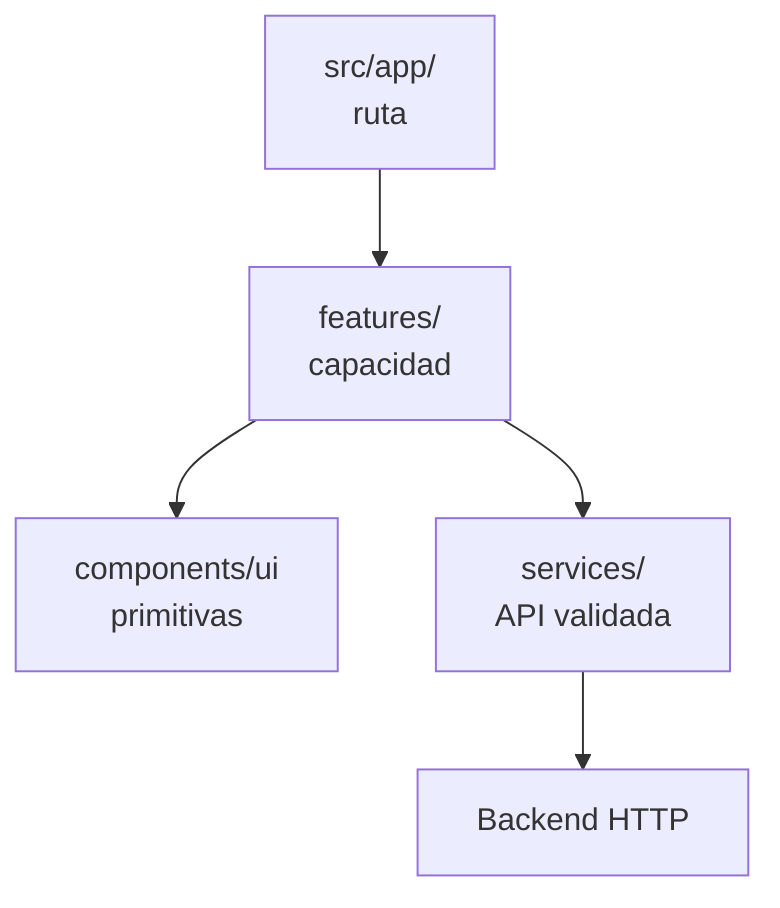
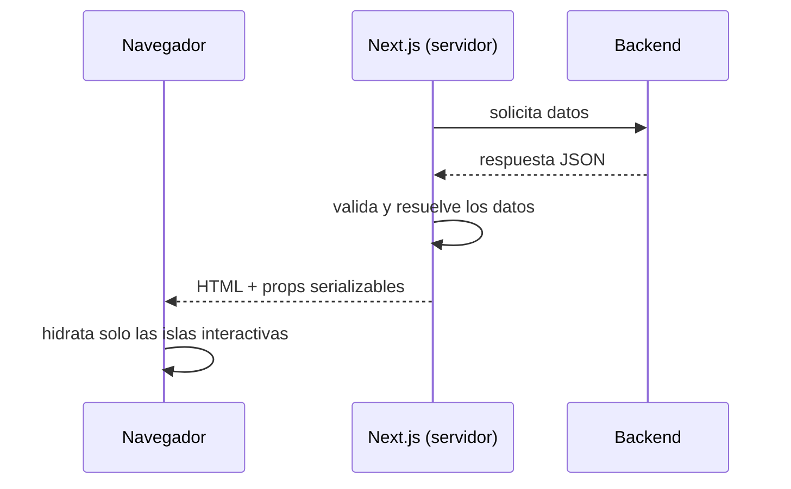
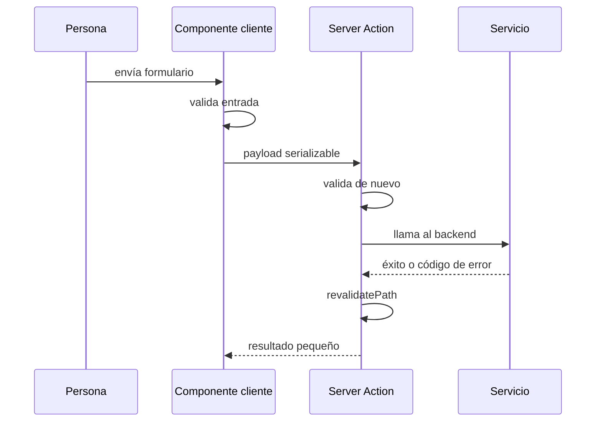

# 02 — Frontend: renderizado y comunicación

Este documento explica cómo está construido el frontend de Careme, dónde se
ejecuta cada parte, cómo viajan los datos entre servidor y navegador y qué
reglas permiten ampliar la interfaz sin romper sus límites ni su estilo visual.

## Índice

1. [Qué es el frontend](#1-qué-es-el-frontend)
2. [El stack y sus responsabilidades](#2-el-stack-y-sus-responsabilidades)
3. [Estructura del proyecto](#3-estructura-del-proyecto)
4. [Features y composición de la interfaz](#4-features-y-composición-de-la-interfaz)
5. [Modelos de renderizado](#5-modelos-de-renderizado)
6. [El modelo usado en Careme](#6-el-modelo-usado-en-careme)
7. [Comunicación con el backend](#7-comunicación-con-el-backend)
8. [Estilos y componentes reutilizables](#8-estilos-y-componentes-reutilizables)
9. [Estados, errores y actualización](#9-estados-errores-y-actualización)

## 1. Qué es el frontend

El **frontend** es la parte de una aplicación que presenta información y recibe
interacciones de la persona. En una aplicación web moderna no es únicamente
HTML y CSS: también incluye código que se ejecuta en un servidor, código que se
ejecuta en el navegador, comunicación con servicios externos y reglas para
convertir datos en una interfaz observable.

Careme usa **React** sobre **Next.js**, con TypeScript, para construir una
interfaz compuesta por tres capacidades principales: chat en `/`, inspección de
eventos clínicos en `/clinical-events` y seguimiento corporal en
`/measurements`.

Una interfaz tiene dos responsabilidades distintas:

- **Presentación:** convertir datos válidos en una estructura visual accesible.
- **Interacción:** recibir eventos del navegador, validar entradas y solicitar
  cambios al sistema.

Separar ambas responsabilidades permite que una página pueda prepararse en el
servidor y que solo las partes que necesitan interacción reciban JavaScript de
cliente.

## 2. El stack y sus responsabilidades

Un **stack tecnológico** es el conjunto de lenguajes, bibliotecas, frameworks y
herramientas que colaboran para construir y ejecutar una aplicación. En Careme,
cada pieza aporta una capacidad concreta:

| Tecnología | Responsabilidad en el frontend |
| --- | --- |
| React 19 | Modelo de componentes, composición y actualización de la interfaz |
| Next.js 16 | Enrutamiento, renderizado servidor/cliente, Server Actions y build |
| TypeScript 5 | Tipado estático del código y de los contratos internos |
| Tailwind CSS 4 | Utilidades de estilo y tokens visuales |
| shadcn/ui + Radix | Componentes accesibles y composables |
| Recharts | Gráficos de las métricas corporales |
| Zod | Validación de datos en tiempo de ejecución |
| Vitest + Testing Library | Pruebas de lógica y componentes |
| pnpm | Instalación reproducible y ejecución de scripts |

### 2.1 Qué aporta React

**React** es una biblioteca para construir interfaces mediante componentes. Un
**componente** es una función que recibe propiedades (`props`) y produce una
representación de la interfaz. La composición permite construir una pantalla
grande a partir de piezas pequeñas con responsabilidades explícitas.

```tsx
type GreetingProps = { name: string };

function Greeting({ name }: GreetingProps) {
  return <p>Hola, {name}</p>;
}
```

React mantiene una representación interna del árbol de elementos y actualiza el
DOM cuando cambian los datos relevantes. El **estado** es información que puede
cambiar durante la vida de un componente; un **evento** es una notificación de
una acción del navegador, como un clic o el envío de un formulario.

React aporta principalmente:

- composición de componentes;
- propiedades y estado para representar datos cambiantes;
- renderizado declarativo, donde el código describe qué debe verse para cada
  estado;
- un modelo de eventos y ciclo de vida para las islas que se ejecutan en el
  navegador.

React no define por sí solo rutas, acceso al backend ni construcción para
producción. Esas responsabilidades las cubre Next.js.

### 2.2 Qué aporta Next.js

**Next.js** es un framework de React que define convenciones para construir una
aplicación web completa. En este proyecto aporta:

- **App Router:** el árbol de carpetas bajo `src/app/` define rutas y archivos
  especiales como `layout.tsx`, `loading.tsx` y `error.tsx`;
- **Server Components:** componentes que se ejecutan en el servidor por
  defecto;
- **Client Components:** componentes marcados con `"use client"` para estado,
  eventos y APIs del navegador;
- **Server Actions:** funciones de servidor invocables desde la interfaz para
  operaciones de escritura;
- **renderizado y streaming:** preparación de HTML y datos antes de entregarlos
  al navegador;
- **build de producción:** compilación, optimización y salida autónoma para el
  contenedor.

La ruta de una página se determina por su ubicación. Por ejemplo:

```text
src/app/clinical-events/page.tsx  ->  /clinical-events
src/app/measurements/page.tsx     ->  /measurements
```

### 2.3 Qué aporta TypeScript

**TypeScript** es JavaScript con un sistema de tipos estático. Un tipo describe
qué valores puede manejar una operación y qué propiedades tiene una estructura.
El compilador comprueba esas relaciones antes de ejecutar el programa.

```ts
type Measurement = {
  date: string;
  weightKg: number;
  waistCm: number;
};

function formatWeight(measurement: Measurement): string {
  return `${measurement.weightKg.toFixed(1)} kg`;
}
```

El tipado estático detecta usos incompatibles durante `typecheck`, pero no
valida datos que llegan por HTTP en tiempo de ejecución. Por eso Careme combina
TypeScript con Zod: TypeScript protege el código que ya se conoce y Zod protege
la frontera donde llegan datos externos.

## 3. Estructura del proyecto

La estructura del frontend separa rutas, funcionalidades, componentes visuales,
servicios y pruebas. Cada zona tiene una razón distinta para cambiar:

```text
frontend/src/
├── app/              # rutas, layouts y estados de ruta
├── components/ui/    # primitivas visuales reutilizables
├── features/         # capacidades completas del producto
├── services/         # frontera con la API
├── lib/              # utilidades transversales
└── test/             # configuración común de pruebas
```

### 3.1 `src/app/`: rutas y composición

El **App Router** interpreta el sistema de archivos como un árbol de rutas.
`page.tsx` define el contenido de una ruta; `layout.tsx` define una envoltura
compartida; `loading.tsx` representa una espera; `error.tsx` captura errores de
renderizado de ese segmento.

```text
src/app/
├── layout.tsx
├── page.tsx
├── clinical-events/
│   ├── page.tsx
│   ├── loading.tsx
│   └── error.tsx
└── measurements/
    ├── page.tsx
    ├── loading.tsx
    └── error.tsx
```

La carpeta `app/` compone las páginas; no debe convertirse en el lugar donde se
acumula toda la lógica de negocio o de acceso a datos.

### 3.2 `src/components/ui/`: primitivas visuales

Una **primitiva de interfaz** es un componente pequeño que resuelve una
necesidad visual o de interacción general, como un botón, una tarjeta, un campo
o una tabla. No conoce la lógica específica de mediciones o chat. Las
funcionalidades las combinan para formar pantallas.

### 3.3 `src/services/`: frontera de datos

Un **servicio frontend** es un módulo que encapsula una operación de comunicación
con el backend. En Careme, `measurementService`, `chatService` y
`clinicalEventService` conocen las rutas HTTP, la envoltura de respuesta y la
validación Zod. Los componentes reciben datos ya convertidos a estructuras
útiles y no construyen URLs ni interpretan respuestas crudas.

### 3.4 Otras zonas

- `src/lib/` contiene utilidades transversales, como la combinación de clases.
- `src/test/` configura el entorno común de Vitest y Testing Library.
- `e2e/playwright/` contiene los recorridos de extremo a extremo y `e2e/corpus/`
  la medición sobre un corpus de evaluación; `playwright.config.ts` declara un
  proyecto de Playwright para cada uno.
- `components.json` configura shadcn/ui, sus alias y su integración con
  Tailwind.

## 4. Features y composición de la interfaz

Una **feature** es un módulo organizado alrededor de una capacidad observable,
no alrededor de una extensión de archivo. Una feature puede contener
componentes, tipos, validadores, acciones de servidor y lógica pura que cambian
por la misma razón.

Careme organiza sus capacidades así:

| Feature | Responsabilidad |
| --- | --- |
| `features/chat/` | Composición del chat, acciones, tipos y estados de respuesta |
| `features/clinical-events/` | Lista, filtros, orden, detalle y estados de inspección |
| `features/measurements/` | Panel, gráficos, tabla, formulario, importación y métricas |

La composición sigue una dirección clara:



Una feature puede usar primitivas compartidas y servicios, pero una primitiva
visual no debe depender de una feature concreta. Esta dirección mantiene
reutilizable la capa visual.

## 5. Modelos de renderizado

El **renderizado** es el proceso de convertir componentes y datos en HTML y
comportamiento ejecutable. La diferencia principal entre modelos es dónde y
cuándo se realiza ese proceso.

### 5.1 Renderizado del lado del cliente

En **Client-Side Rendering (CSR)**, el navegador recibe una estructura inicial y
JavaScript que obtiene datos y construye gran parte de la interfaz en el
cliente. Su ventaja es una interacción rica después de cargar el código. Su
coste es enviar más JavaScript y retrasar el contenido útil hasta que el código
se ejecute.

```text
Navegador -> descarga JavaScript -> obtiene datos -> construye la interfaz
```

### 5.2 Renderizado del lado del servidor

En **Server-Side Rendering (SSR)**, el servidor ejecuta componentes y obtiene
datos antes de enviar HTML. El navegador puede mostrar contenido antes de
descargar toda la lógica interactiva. El coste es que cada render depende del
servidor y de sus fuentes de datos.

```text
Servidor -> obtiene datos -> renderiza HTML -> navegador muestra contenido
```

SSR no significa que toda la aplicación sea estática. Una página puede tener
partes renderizadas en servidor y pequeñas partes interactivas en cliente.

### 5.3 Generación estática y renderizado híbrido

La **generación estática** produce HTML durante la construcción o antes de una
petición. Es apropiada cuando los datos cambian poco. El **renderizado híbrido**
combina estrategias: algunas rutas o componentes pueden ser estáticos, otros
dinámicos y otros interactivos en el navegador.

Next.js permite esta combinación mediante Server Components, Client Components,
obtención de datos en servidor y revalidación.

## 6. El modelo usado en Careme

Careme usa un modelo **server-first**: los Server Components son el valor
predeterminado y los Client Components aparecen solo donde hacen falta estado,
eventos o APIs del navegador.

Un **Server Component** se ejecuta en el servidor, puede ser asíncrono y puede
leer datos sin enviar esa lógica al navegador. No puede usar estado de React ni
eventos de navegador. Un **Client Component** se marca con `"use client"`, se
incluye en el código del navegador y puede usar estado, efectos y eventos.

Una **isla de cliente** es una porción interactiva dentro de una página que en
su mayor parte fue preparada en el servidor. La **hidratación** es el proceso
por el que JavaScript conecta eventos y estado con el HTML ya recibido.

El flujo de mediciones ilustra la composición:

```text
MeasurementsDashboard (servidor, asíncrono)
├── obtiene y valida los datos
├── MeasurementsTrackingView (isla cliente: selección y reintento)
│   ├── MeasurementsTable (renderizado)
│   └── MetricTrendChart (isla cliente: Recharts)
└── MeasurementForm (isla cliente: formulario)
```

El servidor envía a las islas valores serializables, como cadenas y números. No envía
objetos `Date` ni funciones: la fecha viaja como texto y se formatea con una zona
fija, así que la etiqueta no depende de la zona horaria de quien mira.



## 7. Comunicación con el backend

La **frontera de datos** es el conjunto de módulos que traduce entre el
contrato HTTP y los tipos que consume la interfaz. En Careme vive en
`src/services/` y se ejecuta en el servidor.

El recorrido general es:

```text
URL base + ruta -> fetch -> estado HTTP -> envoltura -> Zod -> datos tipados
```

Una validación de respuesta representa una defensa contra datos externos. Un
tipo TypeScript no basta, porque desaparece al ejecutar JavaScript; un esquema
Zod conserva reglas ejecutables:

```ts
const measurementSchema = z.object({
  date: z.string(),
  weightKg: z.number(),
  waistCm: z.number(),
});

const measurements = z.array(measurementSchema).parse(response.data);
```

El servicio también normaliza datos para que los componentes no repitan reglas.
Por ejemplo, `measurementService` solicita datos sin caché, desenvuelve la
respuesta, valida con Zod y devuelve mediciones ordenadas cronológicamente.
`clinicalEventService` y `chatService` aplican el mismo principio a sus
contratos.

La variable `API_BASE_URL` no tiene prefijo `NEXT_PUBLIC_`. En Next.js, ese
prefijo indica que un valor puede incluirse en el bundle del navegador. Al no
usarlo, la dirección del backend permanece en el servidor.

### 7.1 Escrituras mediante Server Actions

Una **Server Action** es una función ejecutada en el servidor que puede
invocarse desde una interacción de la interfaz. En Careme, el formulario valida
la entrada para dar feedback inmediato; la acción vuelve a validarla, llama al
servicio y revalida la ruta. El chat usa el mismo mecanismo para sus dos
escrituras: enviar un turno y **terminar la consulta**, que la cierra y registra
lo recogido; el cierre es una decisión propia de la persona, no algo que se
deduzca de un mensaje, y por eso es su propia acción.



La acción devuelve un resultado controlado, no detalles técnicos. La interfaz
traduce códigos como `VALIDATION_ERROR` o `SAVE_FAILED` a texto visible en
español.

## 8. Estilos y componentes reutilizables

**Tailwind CSS** es un sistema de utilidades: clases pequeñas representan
propiedades CSS y se combinan directamente en el marcado. **shadcn/ui** es una
colección de componentes que se incorpora al código del proyecto para poder
componerlos y adaptarlos; no es una caja negra remota. **Radix** aporta
primitivas de comportamiento y accesibilidad. **Lucide** aporta iconos
consistentes.

Los tokens visuales se definen en `src/app/globals.css` mediante variables CSS,
como colores, radios y tipografías. `components.json` declara que la hoja de
estilos es `src/app/globals.css`, que se usan variables CSS, que la base es
neutral y que la biblioteca de iconos es Lucide.

La consistencia se mantiene mediante tres mecanismos:

1. **Primitivas compartidas:** botones, tarjetas, campos y tablas viven en
   `components/ui/` y se reutilizan en lugar de duplicarse.
2. **Tokens:** color, radio, borde y tipografía se expresan mediante variables;
   cambiar un token actualiza todas las superficies que lo usan.
3. **Composición tipada:** una feature combina primitivas con `className`,
   variantes y propiedades explícitas, sin alterar arbitrariamente la base.

Para crear un componente reutilizable, el proyecto necesita:

- React y TypeScript para definir una API de propiedades explícita;
- Tailwind y los tokens globales para conservar la escala visual;
- primitivas Radix o componentes shadcn/ui cuando exista una necesidad de
  interacción accesible;
- `cn` para combinar clases sin perder variantes;
- iconos de Lucide en lugar de SVGs dibujados de forma aislada;
- una prueba de componente cuando el comportamiento sea interactivo o tenga
  estados relevantes.

Ejemplo de una API visual pequeña y reutilizable:

```tsx
type StatusBadgeProps = {
  label: string;
  tone?: "neutral" | "danger";
};

function StatusBadge({ label, tone = "neutral" }: StatusBadgeProps) {
  return (
    <span className={cn("rounded-md px-2 py-1", tone === "danger" && "bg-destructive")}>
      {label}
    </span>
  );
}
```

La feature decide qué significa el estado; el componente decide cómo aplicar su
presentación. Esa separación evita que una primitiva visual conozca el dominio.

## 9. Estados, errores y actualización

Next.js permite declarar estados de ruta junto a la página:

- `loading.tsx` representa la espera mientras se prepara contenido;
- `error.tsx` captura un fallo de renderizado y permite reintentar;
- un estado vacío representa una respuesta válida sin registros y no debe
  confundirse con un error.

En un formulario, el estado local conserva el texto introducido si el guardado
falla. Después de una escritura correcta, `revalidatePath` invalida el resultado
renderizado de la ruta; los Server Components vuelven a ejecutarse y la página
refleja el dato nuevo sin que el navegador coordine un `fetch` adicional.

Las fechas viajan como texto y se formatean con una zona fija, y los textos visibles
se mantienen en español, mientras que identificadores y código se escriben en
inglés. La separación evita que las decisiones de presentación se dispersen por
las capas de datos y que el idioma del producto se mezcle con el del código.

### 9.1 Granularidad de la lectura y alcance del fallo

La lectura de datos puede hacerse en **una sola petición** o **por unidad**. La
elección no afecta solo al rendimiento: fija el **alcance del fallo**. Cuando todo
llega en una respuesta única, cualquier error obliga a descartar el conjunto entero,
y no hay forma de reintentar solo la parte que falló. Cuando cada unidad se lee por
separado, un error queda **aislado** a esa unidad: lo ya recibido sigue siendo válido
y se muestra, y la persona puede **reintentar solo esa unidad**.

De ahí una regla de diseño: **la recuperación no puede ser más fina que la lectura**.
Para poder ofrecer «reintentar solo esto», esto tiene que haberse pedido aparte. El
coste es un mayor número de peticiones, así que la granularidad se elige por la
unidad que tiene sentido recuperar y no por el número de elementos.

Un fallo aislado tampoco puede presentarse como ausencia: «no se pudo cargar» y «no
hay nada registrado» son resultados distintos, y confundirlos informa mal a la
persona sobre el estado de sus datos.

### 9.2 Una selección, varias representaciones

Cuando la misma información se ofrece de dos formas —por ejemplo una tendencia
visual y una tabla de valores—, ambas deben derivarse del **mismo estado**. Si cada
representación mantuviera su propia selección, las dos vistas podrían mostrar
conjuntos distintos y quien mira no tendría forma de saber qué está viendo. Un único
estado de selección que alimenta todas las representaciones elimina esa divergencia
por construcción.

Esa equivalencia tiene además una razón de accesibilidad: una representación gráfica
no puede ser la **única** fuente del dato. La forma textual —una tabla con las fechas
y los valores— no es un adorno añadido a la gráfica, sino su equivalente, y es la que
permite comprobar un valor concreto sin depender de la percepción visual.
