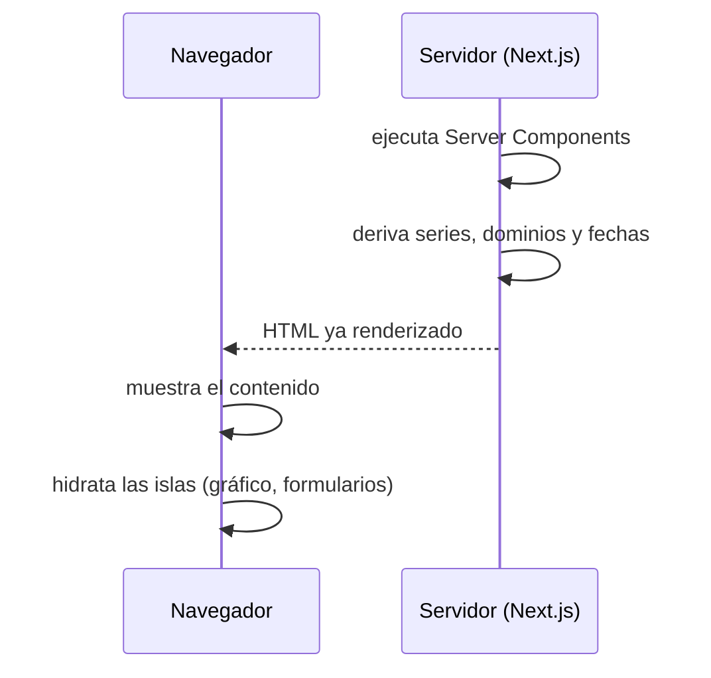
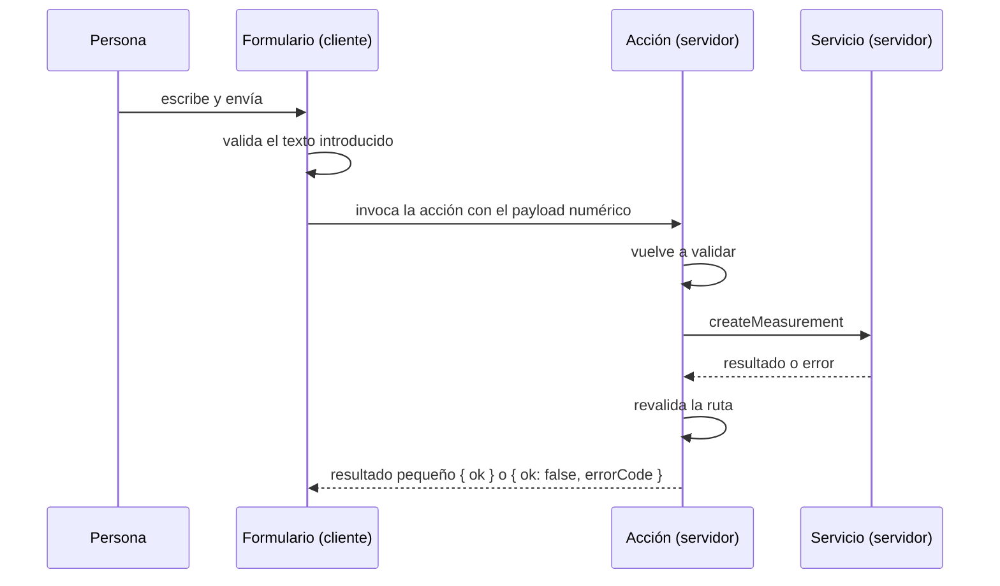

# 02 — Frontend: renderizado y comunicación

Este documento explica **dónde se ejecuta** cada parte de la interfaz, **cómo viajan los datos** entre el servidor y el navegador, y **por qué** el frontend está construido con un modelo de renderizado en servidor con islas de interactividad.

---

## 1. ¿Qué es?

El frontend es una aplicación **React sobre Next.js con App Router**. Su modelo de renderizado no es "todo en el navegador": por defecto, los componentes son **Server Components**, es decir, se ejecutan en el servidor y no envían JavaScript al navegador. La interactividad se concentra en **islas**: componentes que sí se ejecutan en el navegador porque necesitan APIs que solo existen allí.

Los términos que hay que retener:

- **Server Component**: componente que se ejecuta en el servidor. Puede ser asíncrono y hacer trabajo pesado antes de enviar HTML. No puede usar estado ni eventos.
- **Client Component**: componente marcado explícitamente para ejecutarse en el navegador. Puede usar estado, efectos y eventos.
- **Isla (client island)**: porción interactiva incrustada dentro de una página que, en su mayoría, es estática y ya viene renderizada.
- **Hidratación**: proceso por el que el navegador toma el HTML ya enviado y le "pega" el comportamiento del cliente.
- **Server Action**: función que se declara en el servidor y que el navegador puede invocar como si fuera local; el transporte ocurre por debajo.
- **Frontera de serialización**: el límite donde los datos dejan de ser objetos del servidor y pasan a ser datos transportables al cliente.

La aplicación tiene dos rutas: la entrada del asistente en `/` y la vista de seguimiento corporal en `/measurements`.

---

## 2. ¿Por qué se utiliza aquí?

**Por qué renderizar en el servidor.** Buena parte de lo que se ve son **datos derivados**: series de un gráfico, dominios de ejes, etiquetas de fecha y resúmenes. Calcularlos en el servidor tiene tres ventajas concretas: el navegador recibe HTML listo para mostrar, se envía menos JavaScript, y el cálculo se hace una sola vez, en un entorno controlado. Esto último importa para las **fechas**: si se formatearan en el navegador, el resultado dependería de la zona horaria de cada visitante; hacerlo en el servidor con una zona fija garantiza que una fecha-calendario se vea igual en todas partes.

**Por qué islas en lugar de client components generalizados.** Los gráficos y los formularios sí necesitan el navegador: los primeros dibujan sobre el DOM; los segundos gestionan la interacción y el foco. Confinarlos en islas mantiene el resto de la página como contenido ya renderizado, sin coste de interactividad innecesario.

**Por qué una frontera de datos separada.** Todas las llamadas a la API salen desde el **servidor** del frontend. Por eso el navegador nunca conoce la dirección del backend: no hay una variable pública con la URL. Esa frontera también es el lugar donde se **valida** lo que llega, de modo que el resto de la aplicación solo trabaja con datos bien formados.

**Por qué acciones de servidor para escribir.** Al escribir desde una acción, la petición sale del servidor, el navegador sigue sin conocer la API, y la acción puede **invalidar** los datos ya renderizados para que la vista se refresque sola. La interfaz no necesita orquestar un `fetch` ni decidir cuándo recargar.

---

## 3. ¿Qué ocurre bajo el capó?

### 3.1 El modelo de renderizado, en una página real

La ruta de mediciones es un **Server Component** que compone tres piezas: el formulario y la importación —ambos islas cliente, porque interactúan— y el panel de datos, que es asíncrono y se ejecuta en el servidor.

El panel es el ejemplo más claro del modelo:

```text
Panel (async, servidor)
  └─ await obtenerMediciones()          // I/O en el servidor
  └─ si no hay datos → mensaje de vacío
  └─ por cada métrica:
       serie  = construir puntos        // lógica pura, servidor
       dominio = calcular rango del eje // lógica pura, servidor
  └─ renderiza N gráficos + tabla
```

Cuando el panel produce el gráfico, **no le pasa objetos ni funciones**: le entrega datos ya resueltos. El gráfico es una isla cliente y recibe únicamente valores primitivos —etiquetas ya formateadas y números—, nunca objetos de fecha ni lógica de formateo.

**Por qué ese detalle es importante.** Todo lo que cruza la frontera de serialización debe poder transportarse. Si el servidor enviara un objeto de fecha, el cliente tendría que formatearlo, y volvería el problema de la zona horaria. Al resolver el formato en el servidor, el cliente solo dibuja. La regla práctica es: **calcula en el servidor, dibuja en el cliente, y cruza solo primitivos**.

### 3.2 Renderizado y hidratación



La hidratación conecta comportamiento a HTML existente. Si el HTML del servidor y el primer render del cliente no coincidieran, aparecería un error de hidratación. Derivar todo en el servidor y pasar primitivos es precisamente lo que hace predecible ese primer render.

### 3.3 Obtención y validación de datos

La frontera de datos vive en `src/services/`. Su forma es siempre la misma:

```text
petición HTTP  →  comprobar estado  →  desenvolver la envoltura  →  validar  →  devolver
```

Tres decisiones merecen atención:

- **Sin caché.** Las mediciones pueden cambiar fuera de esta aplicación, así que se pide siempre el dato fresco (`cache: "no-store"`). Servir una copia antigua mostraría un estado que ya no existe.
- **Validación en la frontera.** La respuesta se comprueba contra un **esquema** que refleja el contrato. Si el backend cambia de forma, el error aparece al entrar, en un solo sitio, y no disperso por la interfaz.
- **Normalización.** El servicio devuelve los datos en el orden en que la interfaz los necesita (por fecha ascendente), para que ningún componente tenga que reordenarlos.

La dirección base de la API se lee de una variable de entorno **sin prefijo público**, y el módulo está marcado como solo-servidor: nada del paquete del cliente puede importarlo.

### 3.4 Escritura: acción de servidor y revalidación

El formulario es una isla cliente. Su ciclo es:



Dos aspectos definen este flujo:

- **Se valida dos veces.** La interfaz valida para dar respuesta inmediata; la acción vuelve a validar porque es la frontera de confianza y no puede asumir que el cliente hizo su parte.
- **El resultado es pequeño y nombrado.** La acción no devuelve una excepción ni un detalle técnico, sino un objeto mínimo con un **código de error con nombre** (`VALIDATION_ERROR`, `SAVE_FAILED`). La redacción para la persona vive en la interfaz, no en el error. Esto impide que un detalle de transporte llegue al navegador.

Tras guardar, la acción **revalida la ruta**. Eso hace que los Server Components vuelvan a ejecutarse y que el gráfico y la tabla reflejen el dato nuevo sin recargar la página. La misma mecánica usa la importación por archivo, con su previsualización y su confirmación.

El chat sigue el mismo patrón: una acción de servidor valida la entrada, llama al servicio correspondiente y devuelve un resultado con código. La diferencia es que el éxito incluye la respuesta del asistente, que la isla de chat renderiza.

### 3.5 Estados de error y actualización

- **Error de ruta.** Cuando el panel no puede obtener datos, la excepción llega a la **frontera de error** de la ruta, que muestra un mensaje localizado y un botón de reintento. El reintento re-ejecuta el renderizado del servidor.
- **Error de escritura.** El formulario conserva lo escrito cuando el guardado falla, de modo que la persona puede reintentar sin volver a teclear.
- **Actualización.** No hay refresco manual: al revalidar, el servidor regenera la vista con el estado nuevo.

### 3.6 Localización, formato y separación de idiomas

- Las **fechas** se formatean en el servidor con una zona horaria fija, para que una fecha-calendario no se desplace.
- Los **valores numéricos** se formatean con un formateador reutilizado por número de decimales, en lugar de recrearlo en cada render.
- Los **textos visibles** están en español y centralizados en un módulo de cadenas; el **código** se escribe en inglés. Separar ambos evita mezclar idioma de producto con idioma de implementación.

### 3.7 Configuración por métrica en un solo lugar

Las métricas se describen en un **registro**: etiqueta, unidad, decimales, color y margen del eje. Los componentes consumen ese registro en lugar de codificar cada caso. Añadir una métrica es añadir una entrada, no duplicar un gráfico. Esto es lo que permite que un solo componente de gráfico sirva a varias métricas.

---

## 4. Ideas clave

- El renderizado es **servidor primero**; la interactividad vive en **islas** concretas.
- El **panel** de datos es un Server Component asíncrono que deriva todo lo que se puede derivar antes de enviar HTML.
- A través de la **frontera de serialización** solo cruzan primitivos; nada de fechas ni lógica de formato.
- Las **fechas se formatean en el servidor con zona fija**, por eso no se desplazan.
- La **dirección de la API** es solo del servidor; el navegador nunca la conoce.
- Toda respuesta de la API se **valida en la frontera** contra un esquema del contrato.
- Las **acciones de servidor** escriben, revalidan y devuelven resultados pequeños con **códigos de error con nombre**.
- La validación del cliente **no sustituye** a la del servidor.
- La **revalidación** sustituye al refresco manual.
- Los **textos** van en español y el **código** en inglés; cada métrica se describe en un **registro único**.
