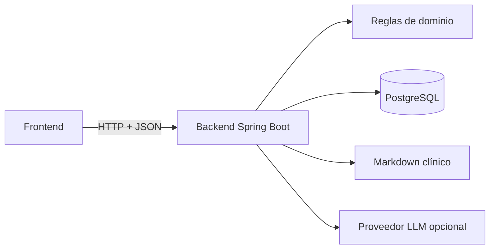
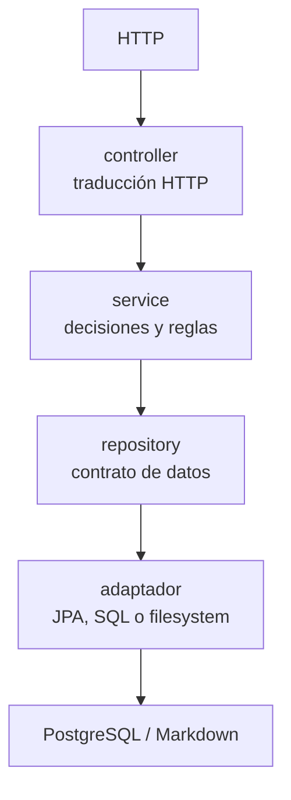
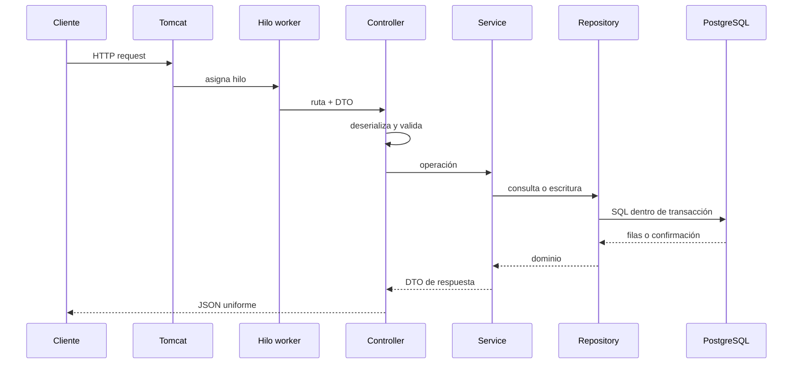
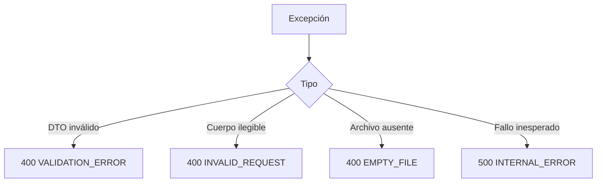

# 03 — Backend: API, concurrencia y persistencia

Este documento explica cómo funciona el backend de Careme como servicio HTTP:
qué responsabilidades concentra, cómo se organiza el stack, cómo se validan los
datos, cómo se ejecutan las peticiones, cómo se coordinan las transacciones y
cómo se conserva el estado en PostgreSQL y en los documentos Markdown.

## Índice

1. [Qué es un backend](#1-qué-es-un-backend)
2. [Responsabilidades del backend](#2-responsabilidades-del-backend)
3. [Stack tecnológico](#3-stack-tecnológico)
4. [Arquitectura y patrones](#4-arquitectura-y-patrones)
5. [Ciclo de una petición HTTP](#5-ciclo-de-una-petición-http)
6. [Validación y Bean Validation](#6-validación-y-bean-validation)
7. [Servidores bloqueantes y reactivos](#7-servidores-bloqueantes-y-reactivos)
8. [Persistencia y transacciones](#8-persistencia-y-transacciones)
9. [Concurrencia y estado compartido](#9-concurrencia-y-estado-compartido)
10. [Errores y operaciones compuestas](#10-errores-y-operaciones-compuestas)
11. [Dos formas de leer los hechos clínicos](#11-dos-formas-de-leer-los-hechos-clínicos)

## 1. Qué es un backend

Un **backend** es el conjunto de procesos que reciben solicitudes de clientes,
aplican reglas, acceden a datos y producen respuestas. En una aplicación web,
el backend suele ejecutarse fuera del navegador y ofrece una interfaz de
comunicación, normalmente una API HTTP.

Una **API** (Application Programming Interface) es un contrato entre un
consumidor y un proveedor. El contrato define rutas, métodos, datos de entrada,
respuestas y errores. Una API REST utiliza recursos identificables por URL y
métodos HTTP con semántica definida, como `GET` para leer y `POST` para crear o
solicitar una operación.

Careme implementa un backend REST con Java 21 y Spring Boot. Expone mediciones,
chat e inspección de eventos clínicos, y coordina dos formas de persistencia:
PostgreSQL para datos estructurados e índice derivado, y archivos Markdown como
fuente de verdad de los hechos clínicos.



## 2. Responsabilidades del backend

La responsabilidad principal del backend es mantener un contrato confiable entre
la interfaz y el estado de la aplicación. Esa responsabilidad se descompone en
funciones concretas:

1. **Exponer operaciones:** traducir rutas HTTP como
   `GET /api/v1/measurements` a operaciones internas.
2. **Validar entradas externas:** rechazar estructuras inválidas antes de que
   lleguen a las reglas o a la persistencia.
3. **Aplicar invariantes:** impedir que el dominio represente estados inválidos,
   como una medición con valores no positivos.
4. **Orquestar operaciones:** decidir qué servicios y adaptadores deben
   participar en una petición.
5. **Persistir y consultar:** guardar datos mediante repositorios y recuperar
   información desde sus fuentes correspondientes.
6. **Uniformar respuestas y errores:** devolver una forma estable para que el
   frontend no dependa de excepciones internas.
7. **Aislar detalles técnicos:** evitar que el contrato HTTP conozca SQL, JPA,
   archivos o el proveedor LLM.

El backend es también la **frontera de confianza**. Una frontera de confianza es
el límite donde una entrada externa deja de considerarse fiable. Aunque el
frontend valide sus formularios, el backend vuelve a validar porque cualquier
cliente puede llamar a la API sin utilizar esa interfaz.

## 3. Stack tecnológico

Un **stack tecnológico** es el conjunto de herramientas que colaboran en una
aplicación. No son sinónimos: cada elemento ocupa una responsabilidad distinta.

| Elemento | Función en Careme |
| --- | --- |
| Java 21 | Lenguaje, tipos, clases, records y concurrencia de la aplicación |
| Spring Boot 3.5 | Configuración, arranque, composición de componentes y empaquetado |
| Spring Web MVC | Rutas HTTP, deserialización, controladores y respuestas síncronas |
| Bean Validation | Reglas declarativas para validar objetos de entrada |
| Spring Data JPA | Abstracción para declarar repositorios y ejecutar persistencia JPA |
| Hibernate ORM | Implementación JPA: mapeo entre objetos Java y tablas SQL |
| PostgreSQL | Base de datos relacional y motor de transacciones |
| Flyway | Migraciones versionadas que poseen el esquema |
| Maven | Dependencias, compilación, pruebas y ciclo de construcción |
| Testcontainers | PostgreSQL real para pruebas de integración |
| JaCoCo | Medición y umbral de cobertura durante `verify` |

### 3.1 Spring Boot

**Spring Boot** es una capa de conveniencia sobre Spring que configura una
aplicación ejecutable con convenciones y auto-configuración. La
auto-configuración inspecciona las dependencias y propiedades disponibles para
crear componentes adecuados, como el servidor HTTP, el acceso a datos o la
validación.

Un **componente Spring** es un objeto cuya creación y ciclo de vida administra
el contenedor de inversión de control. La **inyección de dependencias** consiste
en entregar a un objeto las colaboraciones que necesita, en lugar de que las
construya directamente.

```java
@Service
public final class MeasurementService {
    private final MeasurementRepository repository;

    public MeasurementService(MeasurementRepository repository) {
        this.repository = repository;
    }
}
```

El servicio declara su dependencia; Spring crea el repositorio y lo entrega.
Esto reduce el acoplamiento y facilita sustituir la colaboración en pruebas.

### 3.2 Spring Web MVC

**Spring Web MVC** es el módulo de Spring que implementa el modelo
Model-View-Controller para peticiones HTTP. En una API JSON, el controlador es
el adaptador de entrada: recibe una solicitud, Spring convierte el cuerpo a un
DTO, ejecuta validaciones y el controlador delega en un servicio.

Un **controlador** no debe contener reglas de negocio. Su responsabilidad es
traducir entre HTTP y objetos de la aplicación:

```java
@RestController
@RequestMapping("/api/v1/measurements")
final class MeasurementController {
    @GetMapping
    ApiResponse<List<MeasurementResponse>> list() {
        return ApiResponse.success(service.findAll());
    }
}
```

El modelo MVC no obliga a generar HTML. En este backend, la vista se representa
como JSON y el consumidor es el frontend Next.js.

### 3.3 Hibernate y JPA

**JPA** (Jakarta Persistence) es una especificación que define cómo representar
objetos persistentes y consultar entidades. **Hibernate ORM** es la
implementación que usa Careme.

Un **mapeo objeto-relacional** relaciona clases y propiedades Java con tablas y
columnas relacionales. Hibernate traduce operaciones sobre entidades a SQL y
mantiene un contexto de persistencia que explicaremos más adelante.

Careme separa tres representaciones:

```text
MeasurementRequest  -> DTO de entrada HTTP
Measurement         -> tipo de dominio, sin anotaciones JPA
MeasurementEntity   -> mapeo JPA de la tabla
MeasurementResponse -> DTO de salida HTTP
```

La separación evita que una modificación de la tabla cambie automáticamente el
JSON público o que una entidad de infraestructura se convierta en dominio.

### 3.4 Flyway

**Flyway** es una herramienta de migraciones. Una migración es un script
versionado que transforma el esquema desde un estado conocido a otro. Flyway
registra qué versiones ya se aplicaron y ejecuta las pendientes en orden.

En Careme, Flyway es el propietario del esquema y Hibernate solo lo valida:

```yaml
spring:
  jpa:
    hibernate:
      ddl-auto: validate
  flyway:
    enabled: true
```

`validate` significa que Hibernate comprueba que sus mapeos coinciden con las
tablas existentes; no crea ni modifica tablas. Esta división evita que el
modelo Java altere el esquema de forma implícita.

## 4. Arquitectura y patrones

Un **patrón arquitectónico** es una solución recurrente para organizar
responsabilidades y dependencias. Un patrón no es una clase concreta: es una
regla de colaboración que puede tener distintas implementaciones.

### 4.1 Arquitectura por capas

La arquitectura por capas agrupa componentes por nivel de abstracción y limita
la dirección de sus dependencias:



| Capa | Responsabilidad |
| --- | --- |
| `controller` | Traducir HTTP, validar DTOs y envolver respuestas |
| `service` | Orquestar operaciones, aplicar decisiones y mapear resultados |
| `repository` | Declarar operaciones de acceso a datos |
| `entity` | Expresar dominio o mapeo persistente según el tipo |
| `dto` | Definir la forma pública de entrada y salida |
| `exception` | Convertir fallos en respuestas uniformes |

### 4.2 DTO y separación de modelos

Un **DTO** (Data Transfer Object) es un objeto diseñado para cruzar una frontera
entre procesos o capas. No representa necesariamente una entidad completa ni
contiene toda la lógica del dominio.

Por ejemplo, `MeasurementRequest` representa lo que el cliente puede solicitar,
mientras `Measurement` representa una medición válida y `MeasurementResponse`
representa lo que se permite devolver. Este patrón limita la exposición de
campos internos y permite validar entradas antes de construir el dominio.

### 4.3 Puerto y adaptador

Un **puerto** es una interfaz que expresa una capacidad que la aplicación
necesita, sin mencionar la tecnología que la implementa. Un **adaptador** es un
componente que traduce ese puerto hacia una tecnología externa, como PostgreSQL,
JPA, el sistema de archivos o un proveedor HTTP.

Este es el **patrón Adapter**: una interfaz estable permite que una colaboración
con una forma incompatible se utilice mediante una conversión controlada.
También se relaciona con la arquitectura hexagonal, donde el dominio queda en
el centro y las tecnologías se conectan en los bordes.

```java
public interface EventReader {
    List<ClinicalEvent> findAll(EventFilter filter);
}

@Repository
final class MarkdownEventReader implements EventReader {
    public List<ClinicalEvent> findAll(EventFilter filter) {
        // Traduce archivos Markdown a objetos de dominio.
        return List.of();
    }
}
```

El servicio depende de `EventReader`, no del filesystem. Por eso una prueba
puede entregar una implementación controlada sin cambiar las reglas.

### 4.4 Repository y Service

El **patrón Repository** encapsula el acceso a una colección de objetos o a un
almacenamiento. El servicio pide datos mediante el repositorio y no construye
SQL ni navega directamente por tablas.

El **Service Layer** concentra decisiones de una operación que coordinan varias
colaboraciones. No es una capa para esconder cualquier código: su función es
expresar reglas y orquestación que no pertenecen al controlador ni al adaptador.

El backend también usa un **manejador global de excepciones**. Este patrón
centraliza la traducción de excepciones a códigos HTTP y sobres de error, de
modo que cada controlador no tenga que repetir la misma lógica.

## 5. Ciclo de una petición HTTP

Una petición HTTP contiene un método, una URL, cabeceras y opcionalmente un
cuerpo. El servidor la recibe, determina la ruta y la entrega al componente que
puede procesarla.



El controlador adapta el protocolo; el servicio decide; el repositorio traduce.
Si el DTO es inválido, el flujo termina antes de ejecutar las reglas y la
persistencia.

## 6. Validación y Bean Validation

La **validación** comprueba si un valor cumple restricciones antes de utilizarlo.
En Careme se aplica en tres niveles:

| Nivel | Qué protege | Ejemplo |
| --- | --- | --- |
| Bean Validation | Datos de una petición | Fecha no futura, valor positivo |
| Dominio | Objetos creados internamente | Una medición no puede tener valores no positivos |
| Base de datos | Cualquier escritura que alcance el motor | `CHECK`, `UNIQUE`, claves |

### 6.1 Qué es un Bean

En el contexto de Java, un **JavaBean** es una clase convencional con
constructor accesible y propiedades expuestas mediante métodos. En Spring, el
uso habitual de **Bean** es más amplio: es un objeto cuya creación, configuración
y ciclo de vida administra el contenedor de Spring.

No todo Bean de Spring es un JavaBean clásico. Un servicio anotado con `@Service`
y una configuración creada con `@Bean` son objetos administrados por Spring,
aunque no tengan getters y setters para todas sus propiedades.

### 6.2 Qué es Bean Validation

**Bean Validation** es una especificación para declarar restricciones sobre
objetos Java mediante anotaciones y evaluarlas con un validador. Spring Boot la
integra mediante `spring-boot-starter-validation`.

```java
public record MeasurementRequest(
    @NotNull LocalDate date,
    @Positive @DecimalMax("500") BigDecimal weightKg,
    @Positive @DecimalMax("400") BigDecimal waistCm
) {}
```

`@NotNull` y `@Positive` son restricciones declarativas. La anotación `@Valid`
en el controlador solicita que Spring evalúe el objeto antes de llamar al
servicio. La validación no reemplaza las invariantes del dominio ni las
restricciones SQL: cada nivel protege una frontera diferente.

Una regla dependiente de la operación, como “la fecha de esta solicitud no puede
ser futura”, pertenece al DTO o al servicio de entrada. Una regla que debe ser
cierta para toda instancia de dominio pertenece al dominio y debe permanecer
válida aunque el objeto se cree desde una prueba o desde otro adaptador.

## 7. Servidores bloqueantes y reactivos

Un servidor **bloqueante** mantiene ocupado el hilo que atiende una petición
mientras espera una operación externa, como una consulta a PostgreSQL. Spring
Web MVC usa este modelo con un grupo de hilos de trabajo.

```text
Petición A -> hilo 1 -> espera PostgreSQL -> responde
Petición B -> hilo 2 -> procesa
Petición C -> espera si no queda un hilo libre
```

El bloqueo no significa que el proceso esté detenido por completo: otros hilos
pueden atender otras peticiones. Significa que el hilo asignado no puede ejecutar
otra petición durante la espera.

Un servidor **reactivo** representa operaciones asíncronas como una secuencia de
señales o eventos. Cuando una operación espera I/O, el hilo puede atender otra
tarea y continuar cuando llega el resultado. Spring WebFlux es la alternativa
reactiva de Spring.

```text
Bloqueante: hilo -> espera I/O -> continúa
Reactivo:   hilo -> registra continuación -> atiende otra tarea -> retoma
```

La ventaja reactiva aparece cuando hay mucha espera de I/O y se desea mantener
pocos hilos. El coste es una programación más compleja: hay que razonar sobre
flujos, backpressure, cancelación y no bloquear accidentalmente el event loop.

Existen otros modelos relevantes:

- **Prefork o multiproceso:** cada proceso atiende una parte de las peticiones;
  aísla memoria, pero consume más recursos por proceso.
- **Event-driven:** un bucle de eventos distribuye callbacks o mensajes; es
  común en servidores con I/O no bloqueante.
- **Actor model:** actores aislados reciben mensajes y modifican solo su estado;
  la coordinación ocurre mediante mensajes.
- **Híbrido:** combina hilos, eventos y procesos según el tipo de trabajo.

Careme utiliza Spring Web MVC porque sus operaciones son HTTP cortas y el acceso
actual a PostgreSQL y al filesystem es bloqueante. El modelo de un hilo por
petición resulta directo para este tamaño y permite usar las APIs JDBC/JPA
convencionales.

## 8. Persistencia y transacciones

La **persistencia** es la conservación de datos más allá de la duración de una
petición o del proceso que los produjo. PostgreSQL persiste mediciones y el
índice clínico; Markdown persiste los documentos clínicos que constituyen la
fuente de verdad.

### 8.1 Contexto de persistencia

El **contexto de persistencia** es el conjunto de entidades que Hibernate está
siguiendo dentro de una unidad de trabajo. Para una identidad de base de datos,
ese contexto mantiene una única instancia administrada y puede detectar cambios
sin que el código ejecute un `UPDATE` manual.

Sus funciones principales son:

- identidad: una fila cargada dos veces puede corresponder a una entidad
  administrada única;
- seguimiento de cambios: Hibernate compara el estado administrado y detecta
  modificaciones;
- operaciones diferidas: algunas escrituras se convierten en SQL durante el
  `flush`;
- coordinación con la transacción de la base de datos.

El contexto no es la base de datos ni un caché global. Normalmente está ligado a
una unidad de trabajo y no debe confundirse con estado compartido entre
peticiones.

### 8.2 Qué es una transacción

Una **transacción** es una secuencia de operaciones que el motor trata como una
unidad atómica. Sus propiedades clásicas se resumen como ACID:

| Propiedad | Definición |
| --- | --- |
| Atomicidad | Todas las operaciones se confirman o ninguna se conserva |
| Consistencia | El resultado respeta las restricciones del esquema |
| Aislamiento | Las transacciones concurrentes no observan estados intermedios según el nivel configurado |
| Durabilidad | Lo confirmado sobrevive al fin de la transacción y a reinicios normales |

En Careme, el adaptador de persistencia delimita la interacción transaccional
con PostgreSQL. Una importación prepara las filas y las envía como una unidad;
si la operación falla, la transacción de base de datos se revierte.

```text
BEGIN
  comprobar restricciones
  insertar o actualizar filas
  FLUSH
COMMIT       -- todo queda visible
ROLLBACK     -- no queda ninguna operación de la unidad
```

`flush` y `commit` no son sinónimos. `flush` envía cambios pendientes al motor;
`commit` confirma la transacción. Un flush exitoso todavía puede ser seguido
por un rollback.

### 8.3 Fuente de verdad y dato derivado

Una **fuente de verdad** es el almacenamiento canónico de un dato. Un **dato
derivado** es una representación que puede reconstruirse a partir de la fuente.
En Careme, los documentos Markdown son la fuente de verdad —los hechos clínicos
en `data/events/` y las consultas en `data/encounters/`— y las tablas
`clinical_event_index` y `encounter_index` son índices derivados para búsquedas.

El sistema de archivos no comparte la transacción de PostgreSQL. Por eso el
registro clínico usa una operación compensable:

```text
1. reservar códigos
2. escribir documentos Markdown
3. escribir índice PostgreSQL
4. si falla el índice, eliminar los documentos nuevos
```

Una **compensación** es una operación posterior que deshace el efecto de una
operación anterior cuando no existe una transacción única que abarque ambos
sistemas.

## 9. Concurrencia y estado compartido

La **concurrencia** es la existencia de varias operaciones activas durante un
mismo intervalo de tiempo. No exige que se ejecuten literalmente al mismo
instante: basta con que sus pasos se intercalen. El **paralelismo** sí implica
ejecución simultánea en varios núcleos o hilos.

```text
Concurrencia: A1 -> B1 -> A2 -> B2
Paralelismo:  A y B ejecutan instrucciones al mismo tiempo
```

Un backend concurrente debe proteger invariantes cuando varias peticiones
comparten recursos. En Careme:

- controladores y servicios son objetos compartidos, pero no guardan estado de
  una petición a otra;
- el registro de conversaciones sí mantiene un mapa mutable en memoria, con
  límite, expiración y acceso sincronizado;
- la **consulta** se persiste en Markdown desde que se abre, así que las notas
  recogidas sobreviven a un reinicio aunque el búfer de turnos no;
- PostgreSQL protege reglas persistentes mediante transacciones y restricciones,
  como la unicidad de `(metric, date)` en el seguimiento de mediciones;
- los hechos clínicos sobreviven a reinicios porque están en Markdown, no en el
  estado de conversación.

Una **condición de carrera** ocurre cuando el resultado depende del orden no
controlado de operaciones concurrentes. El patrón “comprobar y después escribir”
puede tener una ventana de carrera; una restricción única en la base de datos es
la defensa definitiva contra duplicados.

La **idempotencia** es la propiedad por la que repetir una operación produce el
mismo efecto observable que ejecutarla una vez. El chat identifica los turnos
por conversación y mensaje para que un reintento no vuelva a registrar efectos
secundarios. El **cierre de la consulta** también es idempotente por sí mismo:
repetirlo devuelve el mismo resultado de cierre y no registra nada nuevo.

Ese cierre es, además, **reintentable**. Si una parte no se completa, la consulta
no se da por cerrada: conserva sus notas, sigue abierta y el cierre puede
repetirse sin dejar trabajo a medias. Cada cauce mantiene su propia atomicidad,
así que un fallo no revierte lo que otro cauce ya registró.

## 10. Errores y operaciones compuestas

Un **manejador global de excepciones** intercepta errores fuera de los
controladores y los transforma en una respuesta estable:



El cliente recibe un código estable y detalles apropiados, no una pila, una
consulta SQL ni credenciales. Esta separación permite cambiar la implementación
sin cambiar la forma básica de tratar los errores en el frontend.

Una **operación compuesta** produce efectos en más de un recurso o sistema. El
registro clínico combina filesystem y PostgreSQL; como no existe una transacción
distribuida entre ambos, la implementación ordena las acciones y define una
compensación para fallos parciales.

El **cierre de la consulta** es la operación compuesta más ancha del sistema:
escribe por **dos cauces**. El lote de mediciones se incorpora al seguimiento en
una **transacción de PostgreSQL**, y los hechos clínicos en su **publicación
Markdown** con el índice derivado. Cada cauce es de todo o nada por sí mismo, y
no hay una transacción única que los abarque: por eso el resultado del cierre se
declara **por cauce**, distinguiendo lo que quedó registrado de lo que no, sin
presentar un fallo como una ausencia y sin revertir lo que ya se completó. La
segunda escritura no se piensa como “lo mismo, en otro sitio”: son dos resultados
distintos que la persona debe poder distinguir.

## 11. Dos formas de leer los hechos clínicos

El backend tiene dos contratos de lectura distintos sobre los mismos hechos:

| Necesidad | Consulta conversacional | Inspección directa |
| --- | --- | --- |
| Entrada | Pregunta en lenguaje natural | Filtros y orden explícitos |
| Fuente | Índice PostgreSQL derivado | Markdown mediante adaptador read-only |
| Resultado | Hechos relevantes para redactar una respuesta | Lista o detalle determinista |
| Criterio | Relevancia textual | Completitud y orden estable |

La consulta conversacional interpreta la intención y limita los resultados a los
hechos pertinentes. La inspección directa permite revisar, filtrar, ordenar y
abrir un evento sin depender de interpretación lingüística ni de composición
LLM. Ambas operaciones son de lectura, pero no comparten necesariamente el
servicio ni el criterio de selección.
