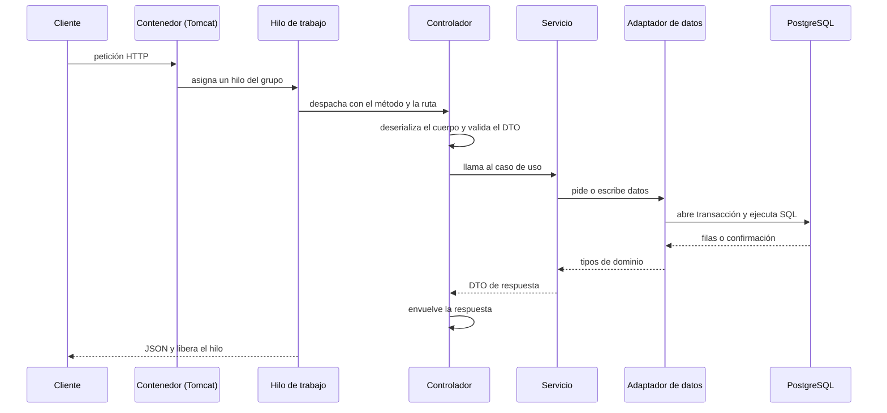
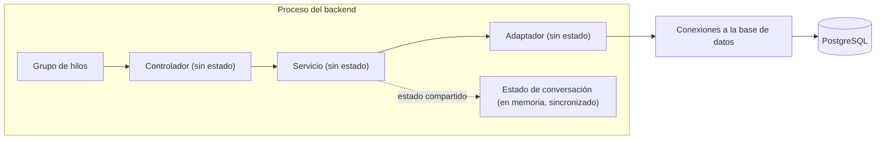
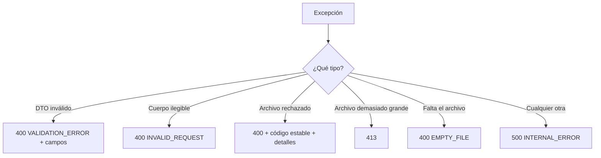

# 03 — Backend: API, concurrencia y persistencia

Este documento explica **cómo el backend atiende una petición HTTP**: qué hace cada capa, dónde se valida, dónde empieza y termina una transacción, cómo se comparte el estado entre peticiones simultáneas y cómo se traducen los errores a un contrato uniforme.

---

## 1. ¿Qué es?

El backend es un servicio **Spring Boot** sobre Java 21 que expone una **API REST JSON**. Internamente usa **Spring Web MVC** (modelo de petición-respuesta bloqueante), **Bean Validation** para validar la entrada, **Spring Data JPA/Hibernate** para persistir y **Flyway** para versionar el esquema en PostgreSQL.

Los términos que hay que retener:

- **Contenedor de servlets**: el servidor web embebido que acepta conexiones y despacha peticiones.
- **Hilo de trabajo (worker thread)**: el hilo del servidor que atiende una petición de principio a fin.
- **DTO**: objeto que define la forma de los datos que entran o salen por HTTP.
- **Transacción**: unidad de trabajo que se confirma entera o se descarta entera.
- **Contexto de persistencia**: el espacio de Hibernate donde viven las entidades asociadas a una transacción.
- **Migración**: script versionado que define el esquema; se aplica una sola vez y en orden.

---

## 2. ¿Por qué se utiliza aquí?

**Por qué un servidor bloqueante y no uno reactivo.** El servicio atiende operaciones cortas de petición-respuesta: leer mediciones, registrar un día, reenviar un mensaje de chat. Para ese perfil, el modelo de **un hilo por petición** es directo de razonar y de depurar. El precio es que cada petición ocupa un hilo mientras espera a la base de datos; la concurrencia queda acotada por el tamaño del grupo de hilos.

**Por qué capas.** Ya se explicó en el documento anterior; aquí importa la consecuencia práctica: la **capa web no decide**, la **capa de servicio decide**, y la **capa de datos traduce**. Un cambio en el esquema afecta al adaptador; un cambio de reglas afecta al servicio; un cambio de contrato afecta al DTO.

**Por qué la validación vive en tres sitios.** Cada validación protege una frontera distinta, y por eso no se solapan:

| Nivel | Protege contra | Ejemplo de regla |
| --- | --- | --- |
| Bean Validation (DTO) | Un cliente que envía una petición inválida | La fecha no puede ser futura; un valor debe ser positivo y tener un solo decimal |
| Invariantes del dominio | Construir un objeto inválido desde dentro del código | Un valor debe ser positivo y no nulo, siempre |
| Restricciones del esquema | Escrituras que ocurren fuera de la aplicación | `CHECK` de positividad y `UNIQUE` por día |

Las reglas **de esta petición** —como "la fecha no puede ser futura"— no pertenecen al dominio, porque un hecho histórico sí puede tener cualquier fecha; pertenecen a la solicitud. Las reglas **siempre verdaderas** pertenecen al dominio. La base de datos repite lo esencial para no depender de que el código se porte bien.

**Por qué el esquema lo posee la migración y no Hibernate.** Con la generación automática activada, un cambio en una entidad puede alterar la base de datos en silencio. Aquí Hibernate está en modo **validación**: comprueba que el mapeo coincide con el esquema y **falla al arrancar** si hay divergencia. El esquema tiene un único dueño —las migraciones— y una desviación se detecta antes de servir tráfico.

---

## 3. ¿Qué ocurre bajo el capó?

### 3.1 El ciclo de una petición



Cuatro hechos importan para razonar sobre este flujo:

1. **El hilo se ocupa durante toda la petición.** Mientras se espera a la base de datos, ese hilo no atiende otra cosa. El número de hilos del grupo fija cuántas peticiones se procesan a la vez; las demás esperan en cola.
2. **La deserialización y la validación ocurren antes de la lógica.** Si el cuerpo no cumple las reglas, el caso de uso no llega a ejecutarse.
3. **La transacción la abre el adaptador de datos, no el controlador.** El controlador no conoce transacciones.
4. **La respuesta se envuelve siempre** en la misma forma, tanto en éxito como en error.

### 3.2 Qué hace cada capa

| Capa | Hace | No hace |
| --- | --- | --- |
| Controlador | Mapea ruta y verbo a un método, valida el DTO, envuelve la respuesta | Decidir reglas ni consultar datos |
| DTO de entrada | Declara las restricciones de la solicitud | Conocer el esquema |
| Servicio | Decide el caso de uso, ordena y mapea a DTO de salida | Conocer HTTP ni SQL |
| Puerto de datos | Declara qué operaciones existen | Elegir el motor |
| Adaptador | Traduce filas a dominio, abre transacciones | Decidir reglas ni ordenar |
| DAO | Consulta concreta sobre una entidad | Exponerse fuera del adaptador |
| Entidad | Mapea la tabla | Ser la forma pública |
| Tipo de dominio | Garantiza invariantes | Tener anotaciones de persistencia |

El servicio, por ejemplo, no crea ni reemplaza a ciegas: primero pregunta si el día ya tiene medición y luego decide. La decisión —"un día tiene una sola medición"— vive ahí, no en la base de datos ni en el controlador.

### 3.3 Transacciones: dónde y por qué

La frontera transaccional está en el **adaptador de datos**. Eso trae tres consecuencias:

- **Lecturas declaradas de solo lectura.** Una lectura no puede, por accidente, quedar enganchada a una escritura; además, el motor sabe que no hace falta preparar un cambio.
- **Escrituras que fuerzan el envío (flush).** El adaptador confirma y vacía el contexto de persistencia antes de devolver, para que quien llama observe la fila ya almacenada y no un objeto en memoria.
- **Escrituras en lote como una unidad.** La importación de un archivo prepara todas las filas y las envía en **un solo flush**: o entra el lote completo o no entra ninguna.

**El detalle de "comprobar y luego actuar".** El registro hace dos pasos: busca si el día existe, y crea o actualiza. Entre la comprobación y la escritura hay una ventana en la que dos peticiones simultáneas podrían coincidir. Lo que garantiza de verdad "una medición por día" no es la comprobación del servicio, sino la **restricción de unicidad** del esquema: si dos escrituras compiten, una prevalece y la otra no puede duplicar la fila. Es un buen ejemplo de que la invariante importante se protege en la capa más cercana a los datos.

### 3.4 Concurrencia: qué se comparte y qué no



- **Controladores y servicios son sin estado.** Se instancian una vez y se comparten entre todas las peticiones; como no guardan datos de una petición a otra, compartirlos es seguro.
- **El estado mutable está aislado y protegido.** El único estado compartido relevante es el de las conversaciones del chat: un mapa en memoria con un límite de conversaciones, un tiempo de vida y un **búfer acotado de turnos recientes**. Su acceso está **sincronizado**, de modo que dos turnos simultáneos no corrompen el mapa ni la cola.
- **Ese estado no se comparte entre instancias ni sobrevive a un reinicio.** Es deliberado: la conversación es efímera. Lo que sí sobrevive son los hechos registrados, porque su fuente de verdad está en disco.
- **No hay caché de datos.** Cada petición consulta la base de datos, así que una fila insertada por fuera de la aplicación se ve en la siguiente petición.

**Idempotencia.** El chat identifica cada turno por `(conversación, mensaje)`. Repetir la misma petición devuelve el resultado original sin volver a ejecutar efectos secundarios. Es la forma de hacer seguro un reintento sobre una operación que no es naturalmente idempotente.

### 3.5 El contrato de errores



Un **manejador global** traduce excepciones a la misma envoltura de error. Dos decisiones destacan:

- **Los errores de validación son de cliente (400), no de servidor.** Un payload que no cumple las reglas no es un fallo del backend.
- **El error nombra un código, no una causa técnica.** El cliente recibe un código estable y detalles legibles; los detalles internos (pila, credenciales, SQL) no se exponen.

No existe la ruta de "recurso no encontrado" (404) porque, en este modelo, ningún recurso puede faltar: se registra un día y se listan mediciones; no hay identificadores que el cliente pida y puedan no existir.

### 3.6 La operación compuesta y su compensación

El registro de hechos clínicos cruza dos medios: **archivos** (fuente de verdad) y **base de datos** (índice derivado). El sistema de archivos no participa de la transacción de la base de datos, así que la operación se ordena para ser compensable:

```text
1. reservar los códigos del lote
2. escribir los documentos de forma atómica
3. escribir el índice derivado
   └─ si algo falla: borrar los documentos recién escritos y las filas del índice
```

La lógica es: **publicar al final, compensar si algo falla**. Nada se considera registrado hasta que ambos medios están escritos; y si el segundo paso falla, el primero se deshace. Es una alternativa explícita a una transacción distribuida, que este sistema no necesita.

La ruta de consulta, en cambio, es **de solo lectura**: recupera hechos del índice y redacta una respuesta, sin tocar ni los archivos ni el índice.

---

## 4. Ideas clave

- El servicio es **bloqueante y multihilo**: cada petición ocupa un hilo y la concurrencia la fija el grupo de hilos.
- Las capas separan **transporte, reglas y datos**, con dependencia en una sola dirección.
- La validación es **defensa en profundidad**: DTO para la petición, dominio para las invariantes, esquema para lo ineludible.
- **La restricción del esquema, no la comprobación del servicio, es la que garantiza la unicidad** bajo concurrencia.
- La **transacción vive en el adaptador de datos**; las lecturas son de solo lectura y las escrituras fuerzan el flush.
- Hibernate **valida** el esquema, no lo genera; las migraciones son la única fuente de verdad.
- El **estado compartido es mínimo y está sincronizado**; todo lo demás es sin estado.
- El **contrato de errores es uniforme** y no filtra detalles internos.
- Las operaciones sobre varios medios se hacen **compensables**, no distribuidas.
- La **idempotencia** protege los reintentos del chat.
