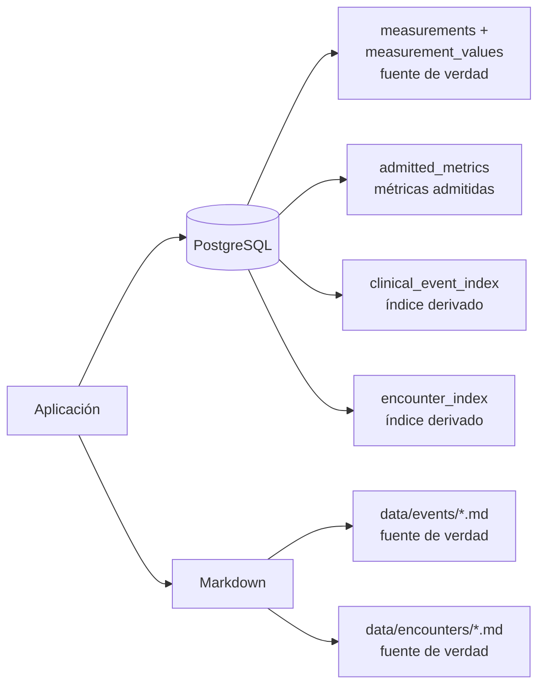
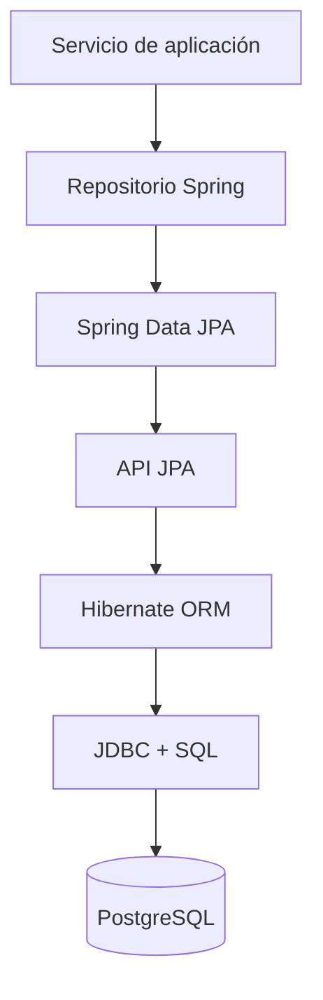
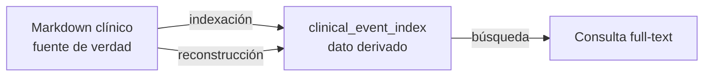
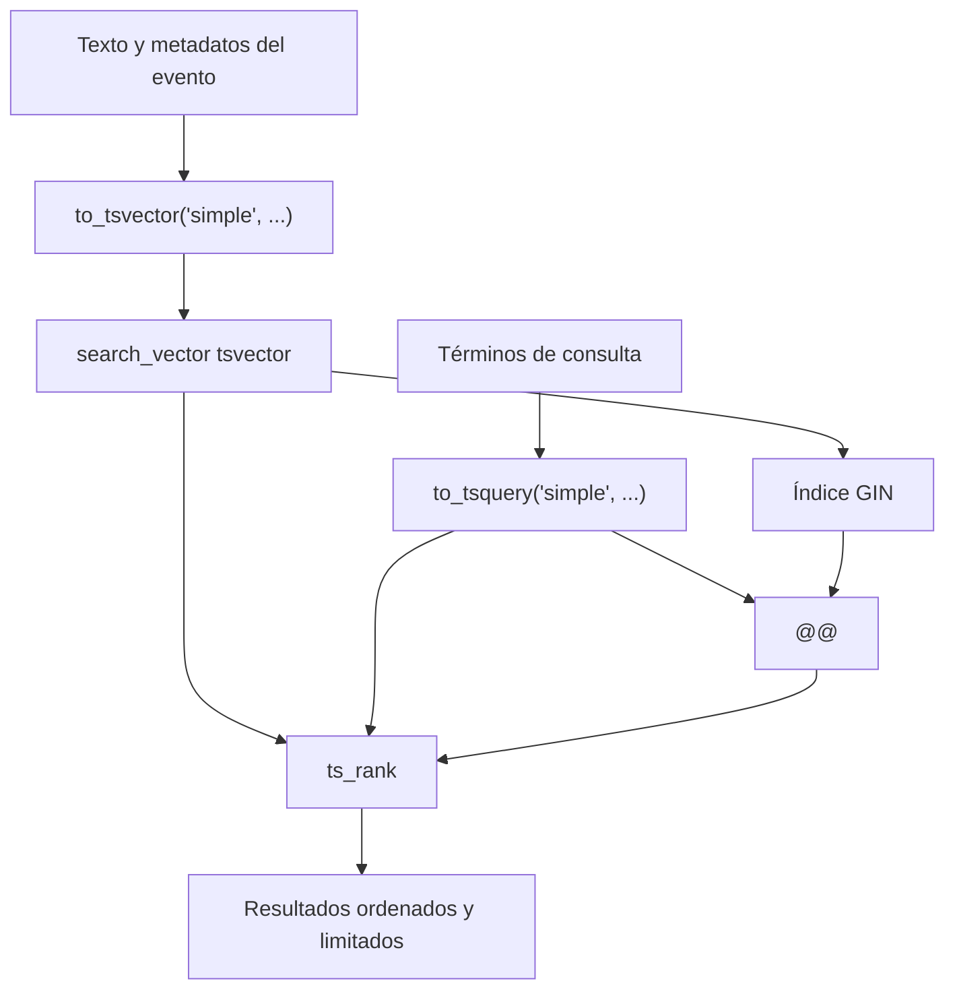

# 04 — Persistencia: PostgreSQL, datos relacionales y búsqueda textual

Este documento explica cómo se conserva el estado de Careme y cómo se consultan
los hechos clínicos. Presenta el modelo relacional, las capacidades particulares
de PostgreSQL, la relación entre Spring Data JPA y Hibernate, y el índice de
búsqueda basado en `tsvector`, `tsquery` y `ts_rank`.

La persistencia tiene dos partes con funciones distintas: PostgreSQL almacena
datos estructurados y un índice derivado; el sistema de archivos conserva los
documentos Markdown que son la fuente de verdad de los hechos clínicos.

## Índice

1. [Qué es la persistencia](#1-qué-es-la-persistencia)
2. [Qué es una base de datos relacional](#2-qué-es-una-base-de-datos-relacional)
3. [PostgreSQL como motor de persistencia](#3-postgresql-como-motor-de-persistencia)
4. [Spring Data JPA, JPA e Hibernate](#4-spring-data-jpa-jpa-e-hibernate)
5. [Modelo relacional de Careme](#5-modelo-relacional-de-careme)
6. [Índices y restricciones](#6-índices-y-restricciones)
7. [Fuente de verdad y datos derivados](#7-fuente-de-verdad-y-datos-derivados)
8. [Búsqueda full-text de PostgreSQL](#8-búsqueda-full-text-de-postgresql)
9. [Otras estrategias de búsqueda](#9-otras-estrategias-de-búsqueda)
10. [Transacciones y coherencia](#10-transacciones-y-coherencia)
11. [Reconstrucción y operación del índice](#11-reconstrucción-y-operación-del-índice)

## 1. Qué es la persistencia

La **persistencia** es la conservación de datos más allá de la duración de una
petición o del proceso que los produjo. Una variable en memoria desaparece al
reiniciar la aplicación; una fila confirmada en PostgreSQL o un archivo escrito
en disco puede recuperarse después.

Un **sistema de persistencia** define dónde se guardan los datos, cómo se
identifican, qué reglas deben cumplir, cómo se consultan y qué sucede cuando
varias operaciones ocurren al mismo tiempo.

Careme usa dos medios:

- PostgreSQL 17 para mediciones y para los índices consultables de hechos
  clínicos y de consultas.
- Archivos Markdown en `data/events/` para conservar los hechos clínicos, y en
  `data/encounters/` para conservar las consultas, como documentos legibles y
  canónicos.

La elección depende de la forma del dato. Las mediciones tienen columnas,
tipos, rangos y unicidad por métrica y día. Un hecho clínico conserva texto y
metadatos en un documento, por lo que su representación original es más
importante que su descomposición en muchas columnas.



## 2. Qué es una base de datos relacional

Una **base de datos relacional** organiza datos en relaciones, que normalmente
se representan como tablas. Una tabla contiene **filas**, que representan
ocurrencias concretas, y **columnas**, que representan atributos con un tipo
determinado.

```text
Tabla measurements
┌────────────┬───────────┬────────────┬───────┐
│ id         │ metric    │ date       │ unit  │  <- columnas
├────────────┼───────────┼────────────┼───────┤
│ 7d...      │ weight    │ 2026-09-18 │ kg    │  <- fila
└────────────┴───────────┴────────────┴───────┘
```

El término **relacional** no significa simplemente “datos en tablas”. Significa
que el modelo se apoya en relaciones, claves, restricciones y operaciones
formales sobre conjuntos de filas. Una consulta SQL puede combinar tablas,
filtrar relaciones y ordenar resultados sin que el programa tenga que recorrer
manualmente cada objeto.

### 2.1 Elementos fundamentales

Una **clave primaria** identifica de forma única cada fila. En `measurements`,
`id` es un UUID y no puede ser nulo ni repetirse.

Una **clave candidata** es cualquier conjunto mínimo de columnas que podría
identificar una fila. En Careme, la **métrica y la fecha** son candidatas para las
mediciones porque solo se admite una por métrica y día; se expresa mediante
`UNIQUE (metric, date)`.

Una **restricción** es una regla que el motor comprueba al insertar o modificar
datos. Ejemplos:

- `NOT NULL`: la columna debe tener un valor.
- `UNIQUE`: no puede existir el mismo valor o combinación dos veces.
- `CHECK`: una expresión debe ser verdadera.
- `PRIMARY KEY`: combina identificación única y no nulidad.
- `FOREIGN KEY`: exige que una referencia apunte a una fila existente.

Una **transacción** agrupa operaciones para que el motor las confirme o revierta
como una unidad. Sus garantías se describen con ACID: atomicidad, consistencia,
aislamiento y durabilidad.

### 2.2 Tipos y semántica

El tipo de una columna no es solo documentación: limita los valores y determina
cómo PostgreSQL los almacena y compara. Careme usa, entre otros:

| Tipo | Uso | Propiedad relevante |
| --- | --- | --- |
| `UUID` | Identificadores | Identidad sin depender de un contador visible |
| `DATE` | Día de una medición o hecho | No incluye hora ni zona horaria |
| `TIMESTAMPTZ` | Momento de creación | Representa un instante con normalización de zona |
| `NUMERIC(p, s)` | Valores de una medición | Decimal exacto con precisión y escala declaradas |
| `VARCHAR` | Códigos y valores acotados | Texto con límite declarado |
| `TEXT` | Contenido clínico | Texto largo sin límite pequeño impuesto por la columna |
| `tsvector` | Índice lógico de texto | Lexemas normalizados con posiciones y pesos |

Usar `NUMERIC` para una medida decimal evita los errores de representación de
los tipos binarios de coma flotante. El esquema expresa así tanto el significado
como la precisión esperada del dato.

## 3. PostgreSQL como motor de persistencia

**PostgreSQL** es un sistema gestor de bases de datos relacional y objeto-
relacional. Además de tablas y SQL, ofrece tipos ricos, índices especializados,
funciones, extensiones y un modelo transaccional robusto.

### 3.1 Características relevantes

**Transacciones y MVCC.** PostgreSQL usa **MVCC** (Multi-Version Concurrency
Control). En lugar de hacer que toda lectura espere a cada escritura, conserva
versiones de las filas y permite que una transacción vea un estado coherente
según su aislamiento. Esto favorece la concurrencia entre lecturas y escrituras,
aunque no elimina la necesidad de restricciones y diseño correcto.

**Restricciones en el motor.** PostgreSQL ejecuta `UNIQUE`, `CHECK`, claves
primarias y otras reglas incluso si la escritura no viene de Careme. La
aplicación puede validar antes para producir mejores mensajes, pero la base de
datos es la última autoridad sobre sus invariantes.

**Índices especializados.** PostgreSQL incluye B-tree para igualdad, rangos y
orden; GIN para estructuras compuestas como documentos de texto; GiST y SP-GiST
para ciertas búsquedas espaciales y extensibles; y BRIN para datos grandes
correlacionados físicamente. Careme usa B-tree implícitos en claves y unicidad,
y GIN para el vector de búsqueda textual.

**Tipos y funciones de texto.** PostgreSQL incluye `TEXT`, expresiones regulares,
concatenación, normalización de búsqueda y operadores full-text. Esto permite que
la búsqueda clínica se ejecute cerca de los datos y dentro de las mismas
transacciones que actualizan el índice.

**Extensibilidad.** El motor puede incorporar tipos, funciones, operadores y
extensiones. Careme no necesita una base vectorial separada para su búsqueda
actual: utiliza las capacidades full-text incluidas en PostgreSQL.

### 3.2 Migraciones con Flyway

Una **migración** es un cambio versionado del esquema. Flyway registra las
migraciones aplicadas y ejecuta las pendientes en orden. En Careme:

- `V1__create_measurements_table.sql` crea la tabla de mediciones y sus reglas.
- `V2__create_clinical_event_index.sql` crea el índice derivado y su `tsvector`.
- `V3__create_encounter_index.sql` crea el índice derivado de las consultas.
- `V4__add_provenance_to_clinical_event_index.sql` añade al índice de hechos la
  consulta de la que procede cada uno.
- `V5__create_metric_measurements.sql` sustituye la tabla de mediciones por el
  modelo de métrica: crea las tablas nuevas, **copia** las filas existentes y retira
  la tabla antigua.
- Hibernate usa `ddl-auto: validate`, por lo que comprueba el esquema pero no lo
  crea ni lo modifica.

Esta división hace explícito quién posee cada cambio: Flyway transforma la base
de datos; Hibernate verifica que el modelo de persistencia sea compatible.

Una migración no siempre **añade**: puede **transformar**. `V5` cambia la forma de
un dato que ya existía, así que no basta con crear tablas nuevas: hay que **copiar**
las filas antes de retirar la estructura antigua, porque Flyway solo avanza y no
existe una marcha atrás automática. Ese tipo de migración se planifica con una copia
de seguridad y un procedimiento de retorno explícitos, y no confiando en que el
esquema vuelva solo a su forma anterior.

## 4. Spring Data JPA, JPA e Hibernate

Estas tres piezas están relacionadas, pero no son la misma cosa.

**JPA** (Jakarta Persistence) es una especificación. Define conceptos y APIs
para mapear objetos Java a tablas, identificar entidades, ejecutar consultas y
coordinar un contexto de persistencia. JPA describe el contrato, no una
implementación concreta.

**Hibernate ORM** es la implementación JPA utilizada por el backend. Convierte
entidades Java en SQL, mantiene el contexto de persistencia, detecta cambios y
coordina el `flush` con la transacción. Hibernate pertenece al backend y es su
motor ORM; no es una característica propia de PostgreSQL.

**Spring Data JPA** es una capa de Spring que simplifica la declaración y el uso
de repositorios JPA. Puede generar consultas a partir de nombres de métodos,
proporcionar operaciones CRUD y conectar repositorios con el contenedor de
transacciones. No reemplaza a Hibernate: normalmente delega en un proveedor JPA
como Hibernate.

La relación puede representarse así:



### 4.1 Ejemplo en Careme

`MetricMeasurementJpaDao` extiende `JpaRepository<MetricMeasurementEntity, UUID>`.
Spring Data JPA proporciona operaciones como `findAll`, `findById` y `save`;
además, **deriva consultas a partir del nombre del método**, como la que busca una
medición por su métrica y su fecha.

`MetricMeasurementJpaRepository` es otra capa: traduce `MetricMeasurementEntity`
al tipo de dominio `MetricMeasurement`, declara los límites transaccionales y
expone el contrato que necesita el servicio. Sobre ella,
`MetricBackedMeasurementRepository` compone la vista diaria del contrato legado a
partir de esas mediciones. Así, el dominio no depende directamente de JPA.

```java
public interface MetricMeasurementJpaDao
        extends JpaRepository<MetricMeasurementEntity, UUID> {
    Optional<MetricMeasurementEntity> findByMetricAndDate(
            String metric, LocalDate date);
}
```

### 4.2 Contexto de persistencia y entidades

El **contexto de persistencia** es el conjunto de entidades que Hibernate está
siguiendo durante una unidad de trabajo. Para una identidad de base de datos,
mantiene una instancia administrada y puede detectar que sus propiedades
cambiaron.

Una entidad JPA no es necesariamente el modelo de dominio ni el DTO HTTP. En
Careme se distinguen:

```text
MeasurementRequest      -> entrada JSON del contrato legado
MetricMeasurement       -> dominio del modelo de métrica
MetricMeasurementEntity -> entidad JPA
MeasurementResponse     -> salida JSON
```

Esta separación evita que una anotación de persistencia defina por accidente el
contrato público o las reglas del dominio.

### 4.3 Por qué la búsqueda clínica usa JDBC

La persistencia de mediciones usa Spring Data JPA porque trabaja con entidades y
operaciones CRUD relacionales. La consulta full-text de hechos clínicos usa
`JdbcTemplate` en `ClinicalEventQueryRepository` porque necesita expresar
explícitamente operadores y funciones PostgreSQL como `@@`, `to_tsquery` y
`ts_rank`.

Esto no contradice el uso de Hibernate. Son dos adaptadores de persistencia para
necesidades distintas:

| Necesidad | Adaptador actual |
| --- | --- |
| CRUD y consultas derivadas de mediciones | Spring Data JPA + Hibernate |
| Búsqueda PostgreSQL full-text sobre índice derivado | `JdbcTemplate` + SQL parametrizado |
| Fuente canónica de hechos clínicos | Adaptador del sistema de archivos |

## 5. Modelo relacional de Careme

La tabla de mediciones es una fuente de verdad relacional:

```sql
CREATE TABLE measurements (
    id             UUID        PRIMARY KEY DEFAULT gen_random_uuid(),
    metric         VARCHAR(40) NOT NULL,
    unit           VARCHAR(10) NOT NULL,
    date           DATE        NOT NULL,
    encounter_code VARCHAR(20),
    created_at     TIMESTAMPTZ NOT NULL DEFAULT now(),
    CONSTRAINT uq_measurements_metric_date UNIQUE (metric, date)
);

CREATE TABLE measurement_values (
    measurement_id UUID           NOT NULL REFERENCES measurements (id) ON DELETE CASCADE,
    component      VARCHAR(20)    NOT NULL,
    value          NUMERIC(12, 4) NOT NULL,
    CONSTRAINT uq_measurement_values_component UNIQUE (measurement_id, component),
    CONSTRAINT ck_measurement_values_positive CHECK (value > 0)
);
```

Cada decisión tiene una consecuencia:

- `UNIQUE (metric, date)` hace que **una medición por métrica y día** sea una
  propiedad del dato, no una convención del código.
- Los valores viven en una **tabla hija** (`measurement_values`), un componente por
  fila: una métrica simple tiene un valor y una **métrica compuesta** —la presión
  arterial— tiene dos, pero siguen siendo **una sola** medición. Con dos columnas
  fijas en `measurements` el esquema inmovilizaría esa métrica y no admitiría
  ninguna otra compuesta.
- `NUMERIC(12, 4)` almacena un decimal exacto con precisión y escala declaradas.
- `CHECK` impide valores no positivos.
- `PRIMARY KEY` proporciona identidad estable e índice único.

Un tercer elemento completa el modelo: **las métricas que el sistema admite** se
registran aparte, en la tabla `admitted_metrics`, sembrada con peso, circunferencia
abdominal, presión arterial y colesterol. La distinción importa: el conjunto admitido
es un dato que la persona puede ampliar cuando confirma que quiere registrar una
métrica nueva, mientras que la **definición** de cada métrica —su unidad de
referencia, sus componentes y su rango admisible— vive en el código, porque no puede
deducirse de lo que la persona dice. Normalizar un dato no es solo repartir
columnas: es decidir qué parte es configurable y qué parte es conocimiento del
sistema.

Los hechos clínicos tienen otra forma: `clinical_event_index` contiene `id`,
`code`, `type`, fechas, contenido y metadatos suficientes para consultar, pero no
es la fuente original del texto. Los documentos Markdown conservan esa fuente.

## 6. Índices y restricciones

Un **índice** es una estructura auxiliar que evita leer toda la tabla para una
consulta frecuente. El coste de lectura disminuye, pero cada escritura debe
actualizar el índice y el índice ocupa espacio adicional.

### 6.1 B-tree

Un **B-tree** mantiene claves ordenadas en un árbol equilibrado. Es apropiado
para igualdad, rangos y ordenación:

```sql
SELECT *
FROM measurements
WHERE date BETWEEN DATE '2026-09-01' AND DATE '2026-09-18'
ORDER BY date;
```

La clave primaria y la restricción `UNIQUE (date)` crean índices que permiten
localizar y ordenar mediciones eficientemente. La complejidad exacta depende del
planificador y de la distribución de datos, pero conceptualmente se evita un
recorrido completo de la tabla.

### 6.2 GIN

**GIN** (Generalized Inverted Index) es un índice para valores que contienen
múltiples elementos indexables. En full-text, esos elementos son los lexemas de
un `tsvector`. El índice relaciona cada lexema con las filas que lo contienen.

```sql
CREATE INDEX idx_clinical_event_index_search_vector
    ON clinical_event_index USING GIN (search_vector);
```

GIN acelera la identificación de candidatos, pero la consulta todavía puede
necesitar filtros, cálculo de relevancia y ordenación posterior.

## 7. Fuente de verdad y datos derivados

Una **fuente de verdad** es el almacenamiento canónico de un dato. Un **dato
derivado** es una representación calculada que puede reconstruirse desde la
fuente.

En Careme:



El índice PostgreSQL no inventa el texto clínico. Se rellena a partir de los
documentos y puede borrarse y reconstruirse sin perder la fuente original.

### 7.1 Dos fuentes de verdad y dos índices

Careme tiene dos documentos canónicos distintos, no uno: los hechos clínicos en
`data/events/` y las **consultas** en `data/encounters/`. Cada uno se indexa en
su propia tabla derivada:

| Documento | Tabla derivada | Uso |
| --- | --- | --- |
| `data/events/evt_NNN.md` | `clinical_event_index` | Recuperar hechos clínicos para responder |
| `data/encounters/enc_NNN.md` | `encounter_index` | Conservar el ciclo de vida de la conversación |

Esas tablas son descartables: se reconstruyen desde los documentos. Pero la
consulta añade una propiedad que el hecho no tiene: se **republica** mientras
está abierta, porque va acumulando notas, de modo que su fila de índice se
**actualiza** en cada cambio en lugar de insertarse una sola vez.

**La procedencia se conserva en la fuente.** Cada hecho registrado declara de qué
consulta procede, y ese dato vive en el *front matter* del documento Markdown
—no solo en PostgreSQL—. Esa es la razón de que la procedencia **sobreviva a la
reconstrucción**: si el índice se borra y se vuelve a construir, cada hecho
recupera su origen desde el documento. Si la procedencia viviera solo en la tabla
derivada, se perdería al reconstruirla.

**El resumen de la consulta es información derivada.** Al cerrarse, la consulta
guarda un resumen —con un motivo a modo de título— elaborado a partir de sus
hechos. Se marca como información derivada dentro del propio documento
(`## Resumen (información derivada)`) para que nunca se confunda con la fuente:
puede reconstruirse desde los hechos y no se presenta como la verdad de lo
ocurrido.

El sistema de archivos y PostgreSQL no comparten una transacción distribuida. La
escritura compuesta sigue una estrategia de compensación: se escriben los
Markdown, se actualiza el índice y, si la segunda parte falla, se eliminan los
documentos recién creados. Una **compensación** es una operación posterior que
revierte el efecto de una operación anterior cuando no existe una transacción
única que abarque todos los sistemas.

### 7.2 Una vista derivada que conserva un contrato

Cambiar la forma de un dato no obliga a romper el contrato que ya consumían sus
clientes. Una **vista derivada** permite hacerlo en dos tiempos: el almacenamiento
adopta la forma nueva y sobre ella se **compone**, al leer, la forma que el cliente
esperaba recibir. El cliente no cambia y el sistema sigue teniendo una sola fuente
de verdad, porque la vista no guarda nada: se calcula desde el modelo. La dirección
de la derivación importa —se escribe en la forma nueva y se lee la antigua—; si la
vista guardara el dato por su cuenta, la forma antigua seguiría siendo la fuente y
la evolución no habría ocurrido.

Cuando la forma antigua no es una simple proyección sino un objeto con reglas
propias, esas reglas se trasladan a la vista: si el contrato promete un registro
por período con dos valores que van juntos, escribir a través de él tiene que
reflejar los dos en el modelo nuevo, y leerlo tiene que volver a reunirlos.

En Careme el caso aparece al pasar de una tabla de mediciones diaria a un modelo
que guarda cada métrica por separado. La tabla antigua desaparece, pero su contrato
se conserva con esa técnica: una capa que compone la pareja del día a partir de las
métricas almacenadas y refleja ambas al escribir, de modo que quien ya consultaba
ese contrato no cambia y el seguimiento sigue teniendo una sola fuente.

Una vista de ese tipo tiene un coste que conviene declarar, no ocultar: solo puede
componer lo que su contrato exige, así que un período que en el modelo tiene **una
sola** de las dos métricas queda íntegro en el almacenamiento pero no aparece en la
vista. Reconocer ese hueco es parte del diseño; suponer que la vista es completa
porque el contrato no admite nulos sería el error.

Ese hueco no se cierra ensanchando el contrato que se acaba de conservar: relajar lo
que el contrato prometía rompería precisamente a los clientes para los que se mantuvo.
La dimensión que la vista no puede expresar se sirve con una **lectura nueva**, que
describe el modelo actual sin las restricciones del contrato antiguo. Las dos formas
conviven sobre la misma fuente de verdad: la antigua se sigue componiendo y la nueva
se lee tal cual, y ninguna de las dos guarda nada.

## 8. Búsqueda full-text de PostgreSQL

La **búsqueda full-text** no compara simplemente cadenas completas. Convierte el
texto en unidades normalizadas, construye una expresión de consulta y busca
coincidencias mediante operadores especializados.

En Careme, la columna se genera así:

```sql
search_vector tsvector GENERATED ALWAYS AS (
    to_tsvector(
        'simple',
        coalesce(code, '') || ' ' || coalesce(type, '') || ' '
        || coalesce(date_text, '') || ' ' || content
    )
) STORED
```

`GENERATED ALWAYS AS ... STORED` hace que PostgreSQL calcule y almacene el
vector cada vez que cambia el texto relevante. La aplicación no puede actualizar
el vector de forma independiente y dejarlo desincronizado.

### 8.1 Qué es `tsvector`

Un **`tsvector`** es la representación normalizada de un documento para
búsqueda. Contiene **lexemas**, no el texto original. Cada lexema puede conservar
posiciones dentro del documento y un peso de relevancia.

Por ejemplo, conceptualmente:

```text
Texto:  "dolor abdominal registrado"
tsvector: 'abdominal':2 'dolor':1 'registrado':3
```

La posición permite evaluar proximidad y relevancia. La transformación depende
de la configuración lingüística. La configuración `simple` usada por Careme
separa y normaliza de forma básica, pero no aplica stemming específico del
español ni elimina un conjunto de palabras vacías del español. Esto favorece
previsibilidad cuando el texto mezcla idiomas y conserva términos cercanos a la
forma escrita por la persona.

`tsvector` no es un índice físico por sí mismo. Es un valor lógico que después
puede acelerarse con un índice GIN.

### 8.2 Qué es `tsquery`

Un **`tsquery`** es una expresión de búsqueda que describe qué lexemas deben
coincidir. No contiene necesariamente el texto original de la pregunta: contiene
condiciones sobre el vector.

Sus operadores principales son:

| Operador | Significado |
| --- | --- |
| `&` | AND: ambas condiciones deben coincidir |
| `|` | OR: basta una de las condiciones |
| `!` | NOT: excluye una condición |
| `<->` | Proximidad: términos adyacentes en el orden indicado |
| `:*` | Prefijo, cuando se construye una consulta que lo permite |

Ejemplos conceptuales:

```sql
-- Deben aparecer ambos lexemas.
'tdolor' & 'abdominal'

-- Debe aparecer uno de los dos.
'tos' | 'fiebre'

-- Buscar un término cerca de otro.
'tdolor' <-> 'abdominal'
```

Careme recibe términos ya estructurados por su capa de interpretación y los
convierte en una cadena segura: las palabras dentro de un término se unen con
`&`, y términos alternativos se unen con `|`. Después PostgreSQL interpreta la
cadena con `to_tsquery('simple', ?)`. La consulta se parametriza mediante
`JdbcTemplate`; los valores no se concatenan directamente al SQL.

El operador `@@` aplica la consulta al vector:

```sql
WHERE search_vector @@ to_tsquery('simple', ?)
```

La expresión es verdadera cuando el `tsvector` satisface el `tsquery`.

### 8.3 Qué es `ts_rank`

**`ts_rank`** calcula una puntuación de relevancia para una coincidencia entre
un `tsvector` y un `tsquery`. No decide si una fila coincide; esa decisión la
hace `@@`. `ts_rank` ordena las filas que ya coincidieron.

```sql
SELECT content,
       ts_rank(search_vector, to_tsquery('simple', ?)) AS rank
FROM clinical_event_index
WHERE search_vector @@ to_tsquery('simple', ?)
ORDER BY rank DESC, event_date DESC NULLS LAST;
```

La puntuación considera la frecuencia y posiciones de los lexemas, junto con la
configuración de pesos cuando se define. No equivale a una comprensión semántica
ni a una probabilidad de que el resultado responda correctamente a una pregunta.
Es una medida léxica de coincidencia.

PostgreSQL también ofrece `ts_rank_cd`, que incorpora cobertura y proximidad de
las coincidencias. Careme usa `ts_rank`, seguido de un desempate por fecha. Por
eso una fila puede tener alta puntuación porque comparte términos relevantes,
pero no necesariamente porque exprese el mismo significado que la pregunta.

### 8.4 Flujo completo



La consulta actual combina búsqueda textual con filtros de tipo y fecha. Si no
hay coincidencias textuales y existe un filtro de metadatos, ejecuta una segunda
consulta solo por esos metadatos. El límite de resultados protege el tamaño de
la respuesta, pero significa que una búsqueda limitada no prueba la ausencia de
hechos.

## 9. Otras estrategias de búsqueda

La búsqueda full-text de PostgreSQL es una estrategia **léxica**: relaciona
formas normalizadas de palabras. Existen otras estrategias, con propiedades
diferentes.

| Estrategia | Qué compara | Ventaja | Limitación |
| --- | --- | --- | --- |
| `LIKE` / `ILIKE` | Subcadenas | Simple y útil para pocos datos | Puede recorrer muchas filas; poca relevancia |
| Trigramas (`pg_trgm`) | Fragmentos de tres caracteres | Tolerancia a errores y similitud textual | No representa bien el significado completo |
| Full-text | Lexemas y operadores | Integrado en PostgreSQL; rápido con GIN | Principalmente léxico; depende de configuración lingüística |
| BM25 | Frecuencia y rareza de términos en una colección | Ranking fuerte para recuperación textual | Requiere un motor o extensión que lo implemente |
| Embeddings | Vectores semánticos generados por un modelo | Encuentra significado y paráfrasis | Coste de modelo, almacenamiento, actualización y evaluación |
| Búsqueda híbrida | Léxica + semántica | Combina coincidencia exacta y significado | Más compleja de calibrar y explicar |

### 9.1 BM25

**BM25** es una función de ranking de recuperación de información. Considera,
entre otros factores, cuántas veces aparece un término en un documento, qué tan
raro es en toda la colección y cuánto mide el documento. La rareza se expresa
con una idea de frecuencia inversa de documento: un término común distingue
menos que uno poco frecuente.

BM25 no es lo mismo que `ts_rank`. Ambos producen un ranking léxico, pero usan
modelos diferentes. PostgreSQL proporciona full-text con `ts_rank`; no se debe
describir el comportamiento actual como BM25.

### 9.2 Embeddings y búsqueda vectorial

Un **embedding** es un vector numérico que representa rasgos semánticos de un
texto producido por un modelo. Dos textos con palabras diferentes pueden quedar
cerca si el modelo considera que expresan ideas relacionadas.

La **búsqueda vectorial** compara el vector de una consulta con los vectores de
los documentos mediante una distancia, como coseno o distancia euclídea. En el
ecosistema PostgreSQL suele apoyarse en `pgvector`, aunque esa extensión no forma
parte de la implementación actual de Careme.

Los embeddings son útiles cuando las personas formulan la misma idea con
vocabulario diferente, pero introducen decisiones adicionales: modelo de
embeddings, versión, dimensiones, indexación aproximada, umbral de similitud,
privacidad y estrategia de actualización.

### 9.3 Por qué Careme usa full-text aquí

La búsqueda actual necesita ser local, explicable y reconstruible desde los
documentos. `tsvector` conserva una relación visible entre términos y hechos;
GIN evita escanear toda la tabla; `tsquery` expresa condiciones controladas; y
`ts_rank` permite ordenar coincidencias sin introducir un modelo externo.

Eso no convierte full-text en la mejor estrategia universal. Significa que es la
estrategia adecuada para el contrato actual y que una eventual búsqueda híbrida
debería añadirse como una decisión explícita, con sus propios datos derivados y
criterios de evaluación.

## 10. Transacciones y coherencia

Una **transacción** es una unidad de trabajo que PostgreSQL confirma o revierte
como conjunto. En una escritura de mediciones, `saveAllAndFlush` envía el lote
y la transacción permite que un fallo revierta la operación completa.

`flush` y `commit` son distintos:

```text
BEGIN
  modificar entidades
  FLUSH    -- enviar cambios pendientes al motor
  COMMIT   -- hacerlos definitivos
```

Un `flush` exitoso todavía puede ser seguido por un rollback. El contexto de
persistencia de Hibernate coordina el estado de las entidades con el flush,
mientras PostgreSQL aplica la transacción y sus restricciones.

Las operaciones sobre Markdown y PostgreSQL no caben en la misma transacción.
La coherencia entre ambos se consigue con orden, detección de fallos y
compensación. El documento Markdown sigue siendo la fuente primaria; el índice
puede reconstruirse.

## 11. Reconstrucción y operación del índice

La reconstrucción lee los documentos clínicos, recalcula sus filas y vuelve a
crear el índice derivado. Es una operación **idempotente**: ejecutarla dos veces
produce el mismo estado lógico que ejecutarla una vez, suponiendo que la fuente
no cambió entre ambas ejecuciones. Se aplica a los dos índices: el de hechos
(`clinical_event_index`) y el de consultas (`encounter_index`).

El flujo conceptual es:

```text
1. leer todos los documentos Markdown
2. parsear front matter y contenido
3. validar tipos, fechas y códigos
4. limpiar o reemplazar el índice derivado
5. insertar filas; PostgreSQL genera search_vector
6. consultar mediante GIN + tsquery + ts_rank
```

Esta estrategia separa recuperación de datos y optimización de consultas. Si se
pierde `clinical_event_index`, no se pierde el texto clínico: se pierde una
representación derivada que puede volver a producirse. Lo mismo vale para
`encounter_index`, y como la procedencia de cada hecho viaja en el *front matter*
del documento, la reconstrucción del índice de hechos **no la pierde**.

La operación también debe distinguir dos preguntas diferentes:

- una búsqueda limitada responde si existen coincidencias entre sus filtros y su
  límite;
- un `COUNT(*)` sobre el alcance completo permite razonar sobre ausencia total,
  ausencia por tipo o ausencia por periodo.

La diferencia importa porque un índice de búsqueda prueba presencia de candidatos,
pero un resultado vacío no demuestra por sí solo que la historia carezca de
hechos.
