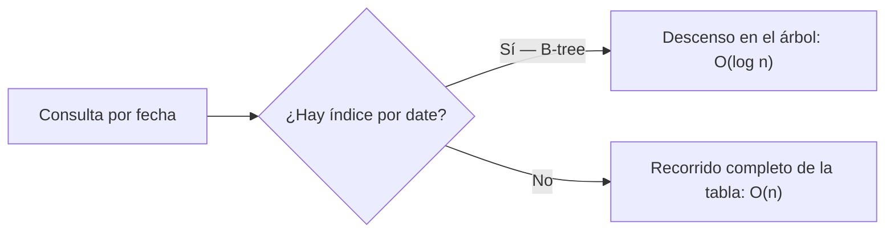
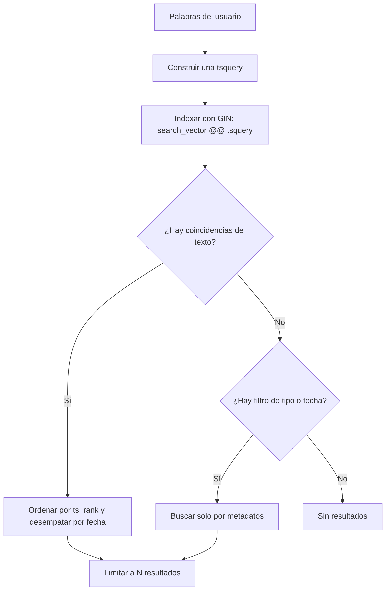
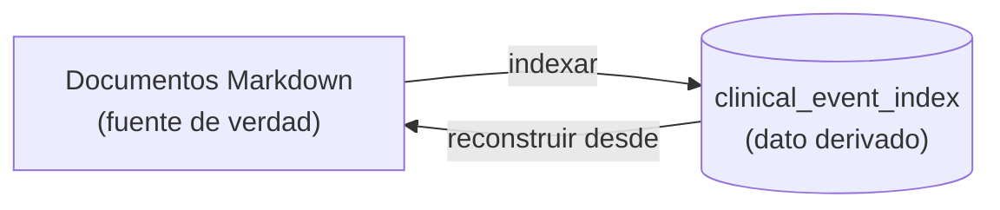

# 04 — Datos relacionales y fuentes derivadas

Este documento explica **cómo se modela y se guarda el estado**, qué garantiza la base de datos por sí misma y por qué una parte de los datos vive en archivos Markdown como **fuente de verdad** mientras la base de datos mantiene un **índice derivado** para buscar.

---

## 1. ¿Qué es?

La persistencia se apoya en **PostgreSQL 17** y en el **sistema de archivos**, con dos estrategias distintas según la naturaleza del dato:

- las **mediciones corporales** son datos estructurados y pequeños: viven en una tabla que es, a la vez, la fuente de verdad;
- los **hechos clínicos** son documentos de texto libre: su fuente de verdad son **archivos Markdown**, y la base de datos guarda un **índice reconstruible** para poder buscarlos.

Términos que hay que retener:

- **Tabla, fila, columna**: la forma relacional del dato.
- **Clave primaria**: identificador único de una fila; implica un índice.
- **Restricción**: condición que la base de datos hace cumplir siempre (`UNIQUE`, `CHECK`).
- **Índice**: estructura auxiliar que acelera las lecturas a cambio de espacio y de coste de escritura.
- **Índice B-tree**: índice ordenado; sirve para igualdad, rangos y orden.
- **Índice invertido**: estructura que asocia cada término con las filas que lo contienen; es la base de la búsqueda de texto.
- **`tsvector` / `tsquery`**: la forma normalizada y buscable de un texto, y una consulta sobre esa forma.
- **`ts_rank`**: la función que puntúa la relevancia de una coincidencia.
- **Fuente de verdad**: el lugar donde el dato se considera canónico.
- **Dato derivado**: un dato que puede reconstruirse a partir de otro.
- **ACID**: atomicidad, consistencia, aislamiento y durabilidad.

---

## 2. ¿Por qué se utiliza aquí?

**Por qué relacional.** El dominio tiene reglas fuertes y verificables: *un solo registro por día*, valores positivos, fechas válidas. Una base relacional permite expresar esas reglas como **restricciones** que el motor hace cumplir, incluso si alguien escribe por fuera de la aplicación. Eso convierte reglas de negocio en propiedades del dato, no en disciplina del programador.

**Por qué dos estrategias de almacenamiento.** Sería posible guardar los hechos clínicos también en tablas. Pero su valor está en el **texto original de la persona**, y su ciclo de vida se parece más al de un documento que al de un registro. Guardarlos como archivos aporta dos cosas: se leen sin la base de datos y sobreviven a un problema de esquema. A cambio, se necesita un índice para buscarlos; y como el índice es **derivable**, puede borrarse y rehacerse sin pérdida.

**Por qué un índice B-tree.** Las mediciones necesitan tres operaciones: localizar un día, garantizar que no se repita y devolver todo ordenado por fecha. Un índice ordenado resuelve las tres a la vez. Sin él, cada consulta recorrería la tabla completa.

**Por qué un índice invertido y no un escaneo de texto.** Buscar una palabra con `LIKE` obliga a leer cada fila y comparar. Un índice invertido guarda, por adelantado, qué filas contienen cada término, de modo que una búsqueda se resuelve consultando el índice en lugar de la tabla entera.

---

## 3. ¿Qué ocurre bajo el capó?

### 3.1 El modelo de las mediciones

```sql
CREATE TABLE measurements (
    id        UUID          PRIMARY KEY DEFAULT gen_random_uuid(),
    date      DATE          NOT NULL,
    weight_kg NUMERIC(5, 2) NOT NULL,
    waist_cm  NUMERIC(5, 2) NOT NULL,
    CONSTRAINT uq_measurements_date UNIQUE (date),
    CONSTRAINT ck_measurements_weight_kg_positive CHECK (weight_kg > 0),
    CONSTRAINT ck_measurements_waist_cm_positive CHECK (waist_cm > 0)
);
```

Cada decisión tiene una consecuencia:

- **`UNIQUE (date)`** convierte "una medición por día" en una propiedad del dato. Bajo escrituras simultáneas, esta restricción es la que realmente impide el duplicado; el código puede comprobar antes, pero no es lo que garantiza.
- **`NUMERIC(5, 2)`** almacena decimales **exactos**, no aproximados. Un peso o una cintura tienen una precisión definida en el esquema, no en la moneda de cambio de la coma flotante.
- **`CHECK (... > 0)`** mantiene la positividad incluso si un programa externo intentara insertar un valor inválido.
- **`PRIMARY KEY`** implica un índice único: localizar una fila por su identificador es una búsqueda en árbol, no un recorrido.

### 3.2 Qué es un índice, en una frase

Un índice es una **estructura ordenada o invertida** que permite no leer toda la tabla. Su coste es real: cada inserción o actualización debe actualizar también el índice, y ocupa espacio. Se paga en escritura y en disco para ganar en lectura.



### 3.3 El índice derivado de hechos clínicos

La tabla del índice **no inventa** el texto: lo recibe de los documentos. Lo que añade es una **columna generada** que calcula automáticamente la forma buscable de cada fila:

```sql
search_vector tsvector GENERATED ALWAYS AS (
    to_tsvector('simple', coalesce(code,'') || ' ' || coalesce(type,'') || ' '
        || coalesce(date_text,'') || ' ' || content)
) STORED,

CREATE INDEX idx_clinical_event_index_search_vector
    ON clinical_event_index USING GIN (search_vector);
```

Dos mecanismos merecen atención:

- **`GENERATED ALWAYS ... STORED`** significa que el `tsvector` lo calcula la base de datos en cada escritura. No puede quedar desincronizado del texto, porque nadie lo escribe a mano.
- **`USING GIN`** construye un **índice invertido**: para cada término, la lista de filas que lo contienen. Es lo que permite buscar sin recorrer la tabla.

### 3.4 Cómo se resuelve una búsqueda



- **La consulta se construye con las palabras de la persona.** Las palabras de un mismo término se exigen juntas (AND) y los términos se alternan (OR), de modo que una búsqueda amplia sigue encontrando algo sin dejar de priorizar lo más específico.
- **La relevancia se puntúa con `ts_rank`.** El orden no es alfabético ni cronológico: primero lo que más se parece a la consulta, y ante empate, lo más reciente.
- **Los metadatos filtran.** Si la pregunta menciona un tipo o un rango de fechas, el filtro se aplica junto a la búsqueda de texto.
- **El resultado está acotado.** Se devuelve un número máximo de hechos, porque la respuesta se compone a partir de ellos y no conviene crecer sin límite.
- **Hay un plan B.** Si la búsqueda de texto no encuentra nada pero existe un filtro, se busca **solo por metadatos**: una pregunta "¿qué medicaciones tengo?" puede responderse aunque no coincida ninguna palabra.
- **La configuración es `simple`.** No aplica raíces léxicas ni listas de palabras vacías de un idioma concreto; conserva los términos tal como se escriben. Es predecible cuando el contenido mezcla idiomas, y respeta las palabras originales de la persona.

### 3.5 Fuente de verdad frente a dato derivado



La regla es: **el documento manda, el índice se deduce**. De ahí se siguen consecuencias muy concretas:

- **El índice se puede borrar sin pérdida.** Basta releer los documentos y reinsertar las filas.
- **La verdad es legible sin la base de datos.** Un hecho clínico se entiende abriendo su archivo.
- **Un fallo al indexar no destruye el dato.** Lo peor que ocurre es que el índice quede incompleto, y eso se corrige reconstruyéndolo.
- **La reconstrucción es total, no incremental.** Se leen todos los documentos, se vacía la tabla y se reinsertan las filas. Con un conjunto pequeño, esta estrategia es **idempotente** y mucho más fácil de razonar que llevar cuenta de cambios incrementales: repetirla da el mismo resultado.
- **Se reconstruye al arrancar.** En cuanto la aplicación está lista, un reconciliador rehace el índice desde los documentos. Así, el índice nunca queda desfasado respecto a la fuente de verdad, aunque la base de datos se haya recreado.

### 3.6 ACID en la práctica

| Propiedad | Qué significa | Dónde se ve |
| --- | --- | --- |
| **Atomicidad** | Una transacción se aplica entera o no se aplica | Un lote de filas se escribe en un solo flush |
| **Consistencia** | Las restricciones se cumplen al confirmar | `UNIQUE`, `CHECK`, claves |
| **Aislamiento** | Las transacciones concurrentes no ven trabajo a medias | Una consulta no ve filas no confirmadas |
| **Durabilidad** | Lo confirmado sobrevive a un fallo | Escritura confirmada en disco |

El **aislamiento** explica por qué la restricción de unicidad es la que resuelve una carrera: dos escrituras simultáneas sobre el mismo día no se ven entre sí antes de confirmar; cuando ambas intentan confirmar, solo una puede satisfacer la restricción. Ese es el punto donde el dato impone la regla, no el código.

**El sistema de archivos queda fuera de la transacción.** Por eso la escritura de hechos clínicos se ordena como *publicar y compensar*: primero los documentos, después el índice; si el segundo paso falla, se deshacen los documentos recién escritos. No hay una transacción que abarque ambos medios, así que la coherencia se consigue con una compensación explícita.

No hay replicación ni una segunda instancia de la base de datos: la consistencia no se negocia contra nada, y el coste se paga en que un fallo del nodo interrumpe el servicio.

### 3.7 El coste de mantener un índice

Mantener el índice no es gratis, y conviene tenerlo presente al añadir datos:

- **Cada escritura cuesta más.** Insertar una fila implica actualizar también el árbol y el índice invertido, y recalcular la columna generada.
- **Ocupa espacio adicional.** El índice duplica, en parte, la información que ya está en la tabla.
- **La reconstrucción total es lineal en el número de documentos** y necesita reemplazar todas las filas del índice.
- **Más índices no siempre es mejor.** Cada índice añade coste de escritura; se crean para las consultas que de verdad se hacen.

---

## 4. Ideas clave

- Hay **dos estrategias**: una tabla que es fuente de verdad para datos estructurados, y archivos que son fuente de verdad para texto con un índice derivado.
- Las **restricciones del esquema** convierten reglas de negocio en propiedades del dato; la unicidad es la que garantiza "una medición por día" bajo concurrencia.
- **`NUMERIC` guarda decimales exactos**; la precisión es parte del esquema.
- Un **índice** cambia coste de escritura y espacio por velocidad de lectura; un **B-tree** resuelve igualdad, rango y orden.
- La **búsqueda de texto** usa una columna `tsvector` generada, un **índice invertido GIN**, una **`tsquery`** construida desde las palabras del usuario y un orden por **`ts_rank`**, con filtros de metadatos y un límite.
- El rigor depende de la **fuente de verdad**; el índice derivado se **reconstruye**, y por eso puede borrarse sin pérdida.
- **ACID** describe las garantías de la transacción; el **aislamiento** es lo que hace que la restricción resuelva las carreras.
- El **sistema de archivos no es transaccional con la base de datos**, así que la coherencia entre ambos se logra con **compensación**.
- Los índices tienen **coste de mantenimiento**; se crean para las consultas reales.
