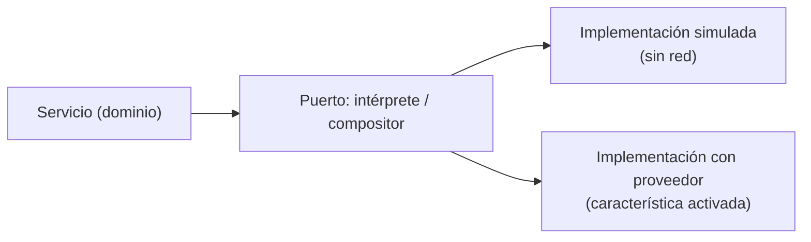
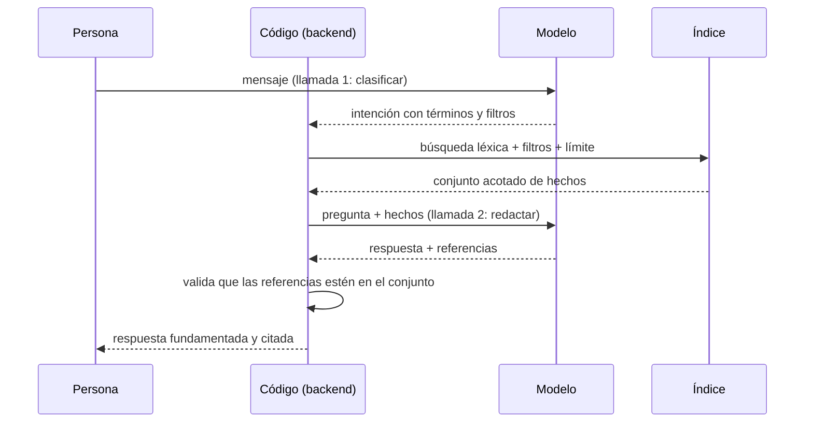
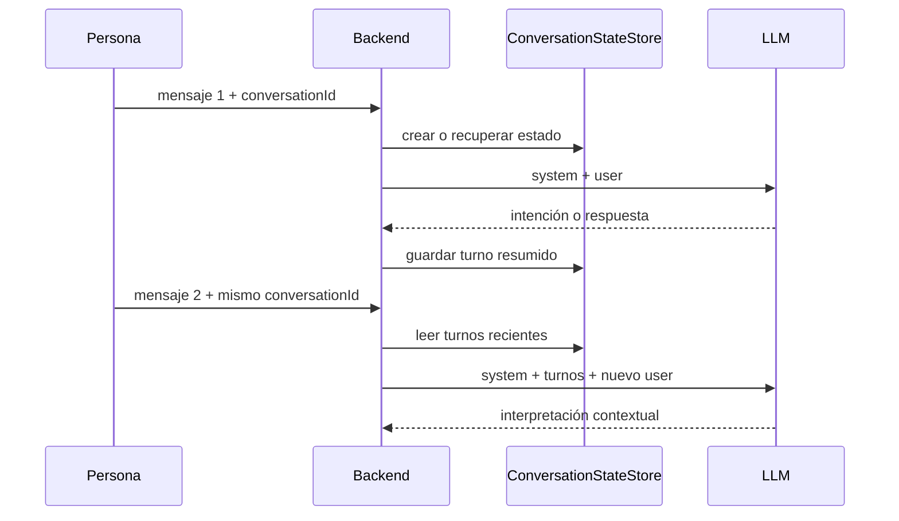

# 05 — IA: LLM, prompts y RAG

Este documento explica qué es un modelo de lenguaje, cómo se estructura una
consulta, cómo se recuperan hechos antes de redactar una respuesta y dónde
termina el modelo y empieza el código. También distingue los patrones de RAG,
los roles de los mensajes de un chat y la memoria multiturno que implementa
Careme.

## Índice

1. [Qué es un LLM](#1-qué-es-un-llm)
2. [Por qué se utiliza aquí](#2-por-qué-se-utiliza-aquí)
3. [Qué ocurre durante una consulta](#3-qué-ocurre-durante-una-consulta)
4. [Patrones de RAG](#4-patrones-de-rag)
5. [Memoria y conversaciones multiturno](#5-memoria-y-conversaciones-multiturno)
6. [Límites y controles para datos clínicos](#6-límites-y-controles-para-datos-clínicos)

---

## 1. Qué es un LLM

Un **modelo de lenguaje grande (LLM)** es un modelo estadístico entrenado para predecir el siguiente **token** de una secuencia. Al generar texto, no consulta una base de datos ni "recuerda" interacciones anteriores: produce la continuación más probable dado **todo lo que está escrito en el prompt**.

Términos que hay que retener:

- **Token**: fragmento de texto (palabra, parte de palabra o signo) con el que trabaja el modelo.
- **Ventana de contexto**: la cantidad máxima de tokens que el modelo puede tener en cuenta a la vez. Todo lo que no esté ahí, el modelo lo ignora.
- **Temperatura**: parámetro que controla cuánta aleatoriedad se introduce al elegir el siguiente token. Cerca de cero, la elección es casi determinista.
- **Alucinación**: contenido que el modelo produce con seguridad pero que no está respaldado por nada.
- **Prompt**: el texto que se envía al modelo, normalmente separado en una **instrucción de sistema** (el comportamiento) y un **mensaje de usuario** (los datos concretos).
- **Salida estructurada**: pedir al modelo que responda en un formato fijo, como JSON, para poder parsearlo.
- **RAG** (*retrieval-augmented generation*): recuperar información relevante de una fuente propia y dársela al modelo en el prompt, de modo que responda **a partir de esos datos** y no de su conocimiento general.
- **Fundamentación (grounding)**: que la respuesta se apoye solo en los datos aportados, y que cite de dónde salió.
- **Puerto**: interfaz que expresa una capacidad que el dominio necesita sin depender de una tecnología concreta.
- **Adaptador**: componente que traduce entre el contrato de un puerto y una tecnología externa, como un proveedor LLM o el sistema de archivos.

Una distinción importante de vocabulario: este sistema usa un **adaptador de modelo** —llamadas puntuales con entrada y salida definidas—, no un **agente** ni un uso de **herramientas** por parte del modelo. El modelo no decide qué ejecutar; solo clasifica y redacta.

---

## 2. Por qué se utiliza aquí

**Por qué un LLM.** La entrada del sistema es lenguaje natural en español: "me diagnosticaron hipertensión el mes pasado", "¿cuándo empecé con la medicación?". Interpretar eso con reglas rígidas es frágil; el modelo maneja bien la variación del lenguaje. Pero el modelo **no es la fuente de verdad**: el código sigue siendo el que guarda, busca y decide.

**Por qué salida estructurada en lugar de texto libre.** Si el modelo devolviera prosa, habría que adivinar qué quiso decir. Pidiéndole JSON con una forma fija, el resultado se convierte en un dato que el programa puede **validar y rechazar**. El modelo nunca escribe directamente en la persistencia: primero su salida pasa por validación.

**Por qué llamadas separadas.** El sistema no le pide todo al modelo en una sola vez. La primera llamada **clasifica** el mensaje y extrae una intención. A partir de ahí hay dos caminos de redacción, y en cada turno se usa uno solo: la **composición fundamentada** redacta una respuesta a partir de hechos ya recuperados, y la **composición conversacional** redacta una respuesta que no depende de la historia. Separarlas aporta tres cosas: la clasificación no necesita ver la historia; cada composición recibe únicamente el material que le corresponde —y lo que una llamada no recibe no lo puede afirmar—; y cada una se puede probar y sustituir por separado.

**Por qué RAG con recuperación léxica.** El modelo no conoce la historia clínica de la persona, y no debe inventarla. La recuperación aporta los hechos reales, y el modelo solo los redacta. La búsqueda es **léxica** (sobre las palabras de la persona), no semántica: es predecible, no requiere almacenar vectores y respeta el vocabulario original.

**Por qué fundamentar y citar.** Una respuesta sobre salud debe poder **verificarse**. Por eso la respuesta cita los hechos en los que se apoya, y una cita fuera del conjunto recuperado se rechaza: no se presenta como fundamentada algo que no lo está.

**Por qué un modo sin red.** El comportamiento del modelo es caro y no determinista. Por defecto el sistema funciona en un **modo simulado** que no sale a la red, para poder desarrollar y probar sin credenciales ni dependencia de un proveedor. El proveedor real se activa explícitamente.

---

## 3. Qué ocurre durante una consulta

### 3.1 Cómo genera texto un modelo

```text
texto de entrada → tokens → distribución de probabilidad del siguiente token → selección
                 → añadir el token → repetir hasta terminar
```

Tres consecuencias explican casi todo el diseño:

1. **El modelo no "sabe" nada fuera del prompt.** No tiene memoria de peticiones anteriores. Si una pregunta depende de turnos previos, esos turnos tienen que **volver a enviarse** en el prompt.
2. **La generación es probabilística.** Con temperatura **cero**, el modelo elige siempre el token más probable y el resultado es prácticamente reproducible. Por eso este sistema usa temperatura cero: aquí no se busca creatividad, sino consistencia.
3. **La salida puede ser plausible y falsa.** Predecir el token más probable no es lo mismo que decir la verdad. De ahí la necesidad de **fundamentar** y **validar**.

### 3.2 El prompt como contrato

Cada llamada usa un archivo de prompt que hace de **contrato**: una instrucción, un conjunto de reglas y la forma exacta del JSON de salida.

```text
Instrucción: qué rol cumple el modelo
Reglas:      qué no puede hacer (no inventar, conservar la precisión temporal, no citar fuera del conjunto)
Forma:       la estructura JSON exacta de la respuesta
```

Dos decisiones destacan:

- **Los prompts están versionados como archivos.** Un cambio de comportamiento es un cambio revisable y reversible; el intérprete declara qué versión usa.
- **El formato se pide, pero no se confía.** Se solicita al proveedor una respuesta JSON, y aun así la aplicación **parsea y valida** el contenido. La petición de formato reduce errores; la validación los detecta.

El mensaje de usuario añade el contexto que el modelo no tiene: la **fecha de referencia** (para poder interpretar expresiones como "ayer") y, cuando los hay, los **turnos recientes** de la conversación.

### 3.2.1 Roles de los mensajes

Las APIs de chat representan la entrada como una secuencia ordenada de
mensajes. Cada mensaje tiene un rol que indica cómo debe interpretarse:

| Rol o elemento | Función |
| --- | --- |
| `system` | Instrucciones de comportamiento, límites, formato y criterios de seguridad |
| `user` | Solicitud o datos aportados por la persona |
| `assistant` | Respuesta producida por el modelo en un turno anterior o actual |
| `tool` | Resultado devuelto por una función externa invocada durante una conversación |
| `model` | Normalmente identifica el modelo elegido, no un rol estándar del mensaje |

En Careme, las llamadas al proveedor incluyen un mensaje `system` con el prompt
versionado y un mensaje `user` con la información concreta del turno. La
respuesta del proveedor llega como mensaje del modelo, que la API suele
presentar con rol `assistant`; el backend extrae su contenido JSON y lo valida.

No hay mensajes `tool` en el flujo actual. El modelo no llama una función para
buscar en PostgreSQL: el backend interpreta primero la intención, ejecuta la
recuperación y después construye otra llamada con los hechos recuperados. En
otras arquitecturas, un mensaje `assistant` puede solicitar una herramienta y el
backend respondería con un mensaje `tool`; ese es un patrón de uso de
herramientas, no el que implementa Careme.

### 3.3 De lenguaje a estructura: la intención

La primera llamada convierte el mensaje en una **intención** tipada. Hay cuatro formas posibles:

| Intención | Significado |
| --- | --- |
| `events` | El mensaje describe hechos clínicos que deben registrarse |
| `query` | El mensaje pregunta por la historia clínica |
| `clarification` | Falta información: el mensaje podría ser un hecho, o no puede determinarse su cauce |
| `conversation` | El mensaje ni registra un hecho ni depende de la historia |

Una intención de consulta lleva la pregunta, un **ámbito** (historia o seguimiento corporal), los **términos de búsqueda** y, cuando la persona los mencionó, filtros de tipo y de fecha. Puede llevar además la **parte general** del mensaje: la porción que no depende de la historia, cuando el mensaje mezcla ambas cosas.

**Qué decide el cauce.** El reparto no depende de «lo que parece», sino de una regla con una asimetría deliberada:

- si **alguna** parte del mensaje depende de la historia, la intención es `query` —aunque el resto del mensaje no dependa, y aunque la pregunta esté formulada en lenguaje coloquial;
- la parte que no depende de la historia se conserva en la consulta, **fuera** de los términos de búsqueda, para poder responderla aparte;
- si no puede determinarse si el mensaje depende de la historia, la intención es `clarification`: el sistema **pregunta** en lugar de adivinar;
- `conversation` es lo que queda cuando el mensaje ni registra un hecho ni depende de la historia.

La asimetría es intencionada porque los dos errores no cuestan lo mismo. Clasificar como conversación algo que dependía de la historia llevaría a responder con conocimiento general una pregunta clínica, es decir, a **fabricar**. Clasificar como consulta algo que era general produce, como mucho, una ausencia explícita y accionable.

Después de parsear, el código **valida** antes de usar la intención:

- una intención de consulta **no puede** traer hechos candidatos;
- solo una consulta puede llevar pregunta y parte general;
- debe contener al menos un término de búsqueda o un filtro;
- un hecho con precisión exacta **necesita** una fecha.

Si la respuesta del proveedor no se puede parsear o no cumple estas reglas, el turno termina en un **fallo controlado** —sin inventar— y **sin escribir nada**.

### 3.4 Las fechas: el modelo propone, el código normaliza

El modelo puede devolver una fecha ISO o una **expresión** ("hoy", "ayer", "hace dos semanas"). Un **normalizador determinista** la resuelve contra la fecha de referencia:

- "hoy" → la fecha de referencia, precisión exacta;
- "ayer" → un día antes, precisión exacta;
- "hace N días/semanas" → la fecha calculada, precisión exacta;
- cualquier otra expresión → se conserva el texto original y **no se aumenta la precisión**.

Ese último punto es el importante: el sistema **nunca convierte una fecha aproximada o desconocida en exacta**. Si la persona dijo "el mes pasado", el hecho queda como aproximado y así se responde después. La precisión es un dato del dominio, no un adorno.

### 3.5 El adaptador como frontera



El dominio depende de un **puerto**, no de un proveedor. Hay dos implementaciones: una **simulada**, que clasifica con reglas sencillas y es la opción por defecto; y una que **llama al proveedor**, activada por configuración. Consecuencias:

- **El resto del sistema no sabe qué proveedor hay detrás.** Cambiar de proveedor, o ejecutar sin red, no afecta a las reglas.
- **Las pruebas usan la implementación simulada**, así que no dependen de la red ni de credenciales.
- **La credencial la lee solo el backend** y nunca llega al navegador. Los tiempos de conexión y de lectura están acotados por configuración.

Un puerto es una interfaz que nombra la capacidad, por ejemplo
`ClinicalIntentInterpreter.interpret(...)`. Un adaptador es la implementación
que traduce esa capacidad al protocolo concreto de una dependencia. El adaptador
real transforma el contrato del sistema en una petición HTTP con `model`,
`messages`, temperatura y formato JSON; después transforma la respuesta del
proveedor en `ClinicalEventIntent`. El adaptador simulado cumple la misma
interfaz sin abrir una conexión.

Por eso “el dominio depende de un puerto, no de un proveedor” significa que las
reglas reciben una abstracción estable. El dominio conoce que puede interpretar
un mensaje, pero no conoce una URL, una clave API, el formato de `/chat/completions`
ni las clases HTTP de un proveedor. Esta inversión de dependencias permite
cambiar proveedor, usar el modo simulado o probar una regla sin red.

### 3.6 La recuperación: código, no modelo



La recuperación es **determinista y la ejecuta el código**: construye una consulta de texto con los términos del usuario, filtra por metadatos, ordena por relevancia, aplica un límite y, si el texto no encuentra nada pero hay filtro, busca **solo por metadatos**. El modelo **no consulta la base de datos**: recibe ya el conjunto recuperado.

Este paso acotado es lo que hace que la respuesta sea tratable y verificable: el modelo solo ve unos pocos hechos relevantes, no la historia completa.

### 3.7 La composición fundamentada

La segunda llamada entrega al modelo la pregunta y los hechos recuperados con su código, tipo, fecha, precisión y contenido. El prompt impone las reglas:

- usar **solo** el contenido y la precisión de los hechos entregados;
- **no** añadir hechos, fechas ni interpretaciones que no estén ahí;
- conservar la precisión temporal;
- devolver la lista de **códigos** de los hechos usados, sin citar ninguno ajeno.

Y el código **verifica** ese resultado: si una referencia no pertenece al conjunto recuperado, la respuesta se **rechaza** y no se presenta como fundamentada. Si el modelo no cita nada, se adjunta como apoyo el conjunto recuperado completo, para que la respuesta siga siendo verificable. Si el conjunto estaba vacío, no se llama al modelo: el sistema declara que **no encuentra registros**.

Verificar las citas no basta, porque una respuesta puede apoyarse en hechos reales y aun así **no responder a la pregunta**: basta con que la recuperación devuelva algo que se parece. Por eso la composición declara también su **cobertura**: si los hechos entregados responden a **toda** la pregunta, a **parte** de ella o a **ninguna**. Recuperar no es responder.

- Con cobertura **parcial**, se responde solo la parte respaldada y se declara explícitamente la que no tiene registros.
- Con cobertura **ninguna**, el texto compuesto se descarta —podría describir hechos que no vienen al caso— y el sistema declara la ausencia: ningún hecho recuperado se presenta como apoyo de algo que no responde.

No todos los mensajes pasan por aquí. Cuando el mensaje no depende de la historia, la redacción es otra: la del apartado siguiente.

### 3.8 La composición conversacional: responder sin hechos

No todo mensaje depende de la historia. Cuando la intención es `conversation`, el sistema pide una respuesta al mismo modelo, pero con otro material: **el mensaje y los turnos recientes de la conversación, y nada más**. No se recupera nada, no se envía ningún hecho y la firma del compositor no admite ni hechos ni referencias.

Eso es una garantía **estructural**, no un filtro sobre el texto ya escrito: el compositor no puede citar un hecho registrado porque nunca lo recibe. Es la misma idea que recorre este documento desde otro ángulo: *lo que una llamada no recibe no lo puede afirmar*. Un filtro detecta lo que ya se redactó; quitar el material impide redactarlo.

El prompt de esta llamada lleva sus propios límites, porque aquí el riesgo no es inventar una cita, sino **aplicar** conocimiento general al caso de la persona:

- explicar un concepto en términos generales, **sin** aplicarlo a su caso ni interpretar sus datos;
- no afirmar nada sobre la historia clínica ni presentar la respuesta como un hecho registrado;
- no diagnosticar ni recomendar tratamiento: si la persona lo pide, la petición se **declina** de forma explícita (ver §6);
- responder en el idioma del mensaje y con el tono del chat.

**Un mensaje, dos salidas.** Cuando el mensaje mezcla una parte general con otra que depende de la historia, el turno no elige un cauce: los atiende por separado. El resultado clínico conserva su estado y su mensaje —`answered`, `no_records` o `failed`— y la parte general viaja en un campo propio, aparte. Ninguna de las dos rellena a la otra: la réplica conversacional no puede tapar una ausencia declarada ni presentarse como apoyo de una respuesta fundada.

Conviene no confundir este reparto con la **cobertura parcial** de §3.7. Allí se parte una *pregunta* en la parte que los hechos respaldan y la que no; aquí se parte un *mensaje* en dos cauces, y cada uno tiene su propio mecanismo de verdad.

### 3.9 RAG, y qué no hace este sistema

RAG significa, literalmente, **recuperar y luego generar condicionado por lo recuperado**. Aquí: recuperar hechos y redactar una respuesta apoyada solo en ellos. Con un matiz que importa: **no toda respuesta del sistema es RAG**. La conversación general (§3.8) no recupera nada y, precisamente por eso, no puede afirmar nada sobre la historia.

Para delimitar el concepto, conviene decir qué **no** ocurre:

- **No hay búsqueda vectorial ni *embeddings*.** La recuperación es léxica, sobre las palabras de la persona.
- **No hay agente ni uso de herramientas.** No hay bucle de decisión ni el modelo invoca funciones; son llamadas de una sola vuelta: clasificar y, después, redactar —con hechos recuperados o sin ellos, según el cauce.
- **No hay reentrenamiento.** El modelo no se ajusta; se le aporta contexto mediante el prompt.

## 4. Patrones de RAG

**RAG** (*retrieval-augmented generation*) es un patrón en el que una aplicación
recupera información externa y la incorpora al contexto de una generación. El
modelo no obtiene automáticamente acceso a la base de datos: el código debe
seleccionar los documentos, formatearlos y enviarlos en el prompt.

Existen varias formas de organizarlo:

| Patrón | Flujo | Característica |
| --- | --- | --- |
| RAG ingenuo o básico | recuperar → generar | Una recuperación y una generación en una sola cadena |
| RAG conversacional | historial → recuperar → generar | Usa la conversación para resolver referencias como “ese tratamiento” |
| RAG con reranking | recuperar candidatos → reordenar → generar | Un segundo criterio mejora la selección antes del prompt |
| RAG híbrido | búsqueda léxica + vectorial → combinar → generar | Combina coincidencias de términos y similitud semántica |
| RAG agentivo | modelo decide → llama herramientas → observa → genera | El modelo participa en un ciclo de decisiones y herramientas |
| RAG multi-etapa | clasificar → recuperar → verificar → generar | Divide la consulta en pasos con controles intermedios |

Careme utiliza un **RAG multi-etapa y conversacional, pero no agentivo**:

1. el intérprete clasifica el mensaje y extrae términos y filtros;
2. el código recupera candidatos mediante búsqueda léxica PostgreSQL y filtros
    de metadatos;
3. el compositor recibe la pregunta y ese conjunto acotado;
4. el backend valida cobertura y referencias antes de devolver la respuesta.

La parte conversacional se limita a usar turnos recientes para interpretar una
pregunta de seguimiento. No se envía todo el historial clínico al modelo ni se
permite que el modelo elija libremente una consulta SQL. La recuperación sigue
siendo determinista y la ejecuta el backend.

Este diseño también puede describirse como **retrieve-then-generate**: primero se
recupera y después se genera. Es diferente de un agente que decide en tiempo de
ejecución qué herramienta invocar, cuántas veces invocarla y cuándo considera
que tiene suficiente información.

## 5. Memoria y conversaciones multiturno

Un modelo de lenguaje no conserva automáticamente el estado entre peticiones. Para
que entienda “¿y cuándo ocurrió eso?”, la aplicación debe guardar una parte de
la conversación y volver a incluirla en la siguiente solicitud.

Careme lo hace con `ConversationStateStore`, un almacén en memoria indexado por
`conversationId`:



Cada turno almacenado contiene el mensaje de la persona y un resumen de la
respuesta del asistente. El almacén conserva como máximo seis turnos recientes
por conversación (`max-recent-turns: 6`), expulsa conversaciones inactivas tras
el TTL configurado (dos horas por defecto) y limita el número total de
conversaciones (1000 por defecto). El mapa está protegido con acceso
sincronizado porque varias peticiones pueden llegar al mismo tiempo.

Esta memoria es **efímera y operacional**, no historia clínica:

- vive solo en la memoria del proceso;
- no se escribe en PostgreSQL ni en Markdown;
- se pierde al reiniciar el backend o al expulsar el estado;
- sirve para resolver referencias y continuidad lingüística, no para demostrar
    que un hecho clínico ocurrió;
- la respuesta clínica se fundamenta en hechos recuperados desde la historia,
    no en el resumen conversacional.

El flujo multiturno tiene dos usos. El intérprete recibe turnos recientes para
resolver una referencia y producir términos de búsqueda explícitos. El
compositor conversacional recibe el mensaje y esos turnos, pero no recibe hechos
clínicos. La separación impide que una conversación general se convierta por
accidente en una afirmación sobre la historia.

- **Idempotencia.** Repetir un turno con los mismos identificadores devuelve el resultado original sin repetir efectos.
- **Límite de tamaño del mensaje**, además de los tiempos de espera de conexión y lectura.
- **Los fallos no inventan.** Si la interpretación o la búsqueda fallan, el resultado es un fallo recuperable, sin respuesta fabricada.
- **Un fallo al redactar tampoco inventa.** Si falla la composición conversacional, el turno es un fallo recuperable que conserva el mensaje para reintentarlo. Y en un mensaje mixto, un fallo de la parte general no cuesta el resultado clínico ya obtenido: el turno conserva su estado y simplemente no lleva parte conversacional.
- **Ausencia no es fallo.** Que la historia no respalde una pregunta es un **resultado**, no un error: se declara con su motivo —historia vacía, sin hechos de ese tipo, sin hechos en ese periodo, o ninguno que responda—, con su alcance acotado y con una salida para continuar. Además **no niega que el hecho ocurriera**: solo dice que no consta. Un fallo de búsqueda, en cambio, se informa como recuperable y nunca se disfraza de ausencia.

## 6. Límites y controles para datos clínicos

- **El asistente registra lo que la persona afirma**, no lo que el sistema deduce: no diagnostica, no infiere, no recomienda tratamiento. Una sospecha no es un hecho. Cuando la persona pide justamente eso —un diagnóstico, una recomendación o una interpretación de su caso—, el sistema lo **declina de forma explícita**: no lo responde desde la historia, no lo sustituye por una respuesta inventada y no lo disfraza de conversación útil.
- **Los registros no incluyen el contenido clínico** ni el prompt, la respuesta del proveedor o la credencial; solo identificadores de correlación para poder seguir un turno.
- **El proveedor externo queda fuera del control de la aplicación.** Su política de retención y su región de procesamiento no las garantiza este sistema: son una decisión de despliegue antes de enviar datos reales.
- **El modelo puede equivocarse igualmente.** De ahí la combinación de controles: salida estructurada, validación, recuperación acotada, fundamentación con citas y un camino explícito para "no hay registros".
