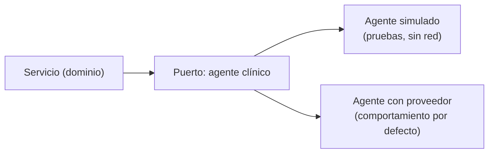
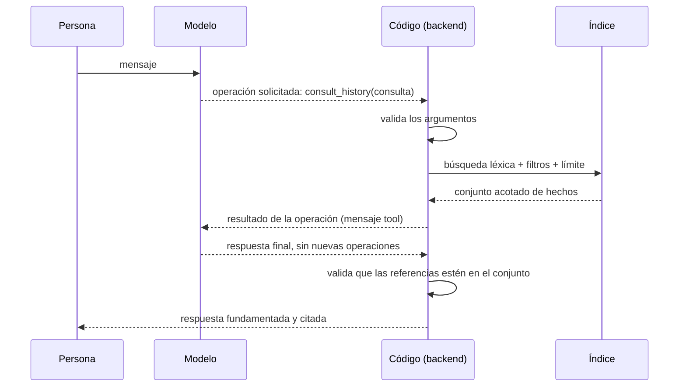
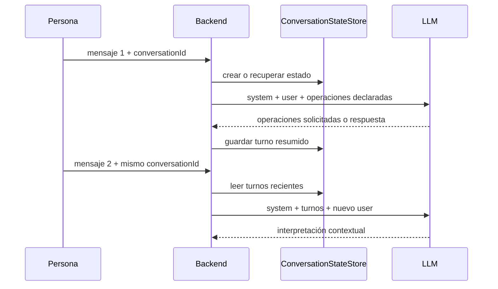

# 05 — IA: LLM, prompts y RAG

Este documento explica qué es un modelo de lenguaje, cómo se estructura una
consulta, cómo se recuperan hechos antes de redactar una respuesta y dónde
termina el modelo y empieza el código. También distingue los patrones de RAG,
los roles de los mensajes de un chat y la memoria multiturno que implementa
Careme.

## Índice

1. [Qué es un LLM](#1-qué-es-un-llm)
2. [Por qué se utiliza aquí](#2-por-qué-se-utiliza-aquí)
3. [Qué ocurre durante una consulta](#3-qué-ocurre-durante-una-consulta)
4. [Patrones de RAG](#4-patrones-de-rag)
5. [Memoria y conversaciones multiturno](#5-memoria-y-conversaciones-multiturno)
6. [Límites y controles para datos clínicos](#6-límites-y-controles-para-datos-clínicos)

---

## 1. Qué es un LLM

Un **modelo de lenguaje grande (LLM)** es un modelo estadístico entrenado para predecir el siguiente **token** de una secuencia. Al generar texto, no consulta una base de datos ni "recuerda" interacciones anteriores: produce la continuación más probable dado **todo lo que está escrito en el prompt**.

Términos que hay que retener:

- **Token**: fragmento de texto (palabra, parte de palabra o signo) con el que trabaja el modelo.
- **Ventana de contexto**: la cantidad máxima de tokens que el modelo puede tener en cuenta a la vez. Todo lo que no esté ahí, el modelo lo ignora.
- **Temperatura**: parámetro que controla cuánta aleatoriedad se introduce al elegir el siguiente token. Cerca de cero, la elección es casi determinista.
- **Alucinación**: contenido que el modelo produce con seguridad pero que no está respaldado por nada.
- **Prompt**: el texto que se envía al modelo, normalmente separado en una **instrucción de sistema** (el comportamiento) y un **mensaje de usuario** (los datos concretos).
- **Salida estructurada**: pedir al modelo que responda en un formato fijo, como JSON, para poder parsearlo.
- **RAG** (*retrieval-augmented generation*): recuperar información relevante de una fuente propia y dársela al modelo en el prompt, de modo que responda **a partir de esos datos** y no de su conocimiento general.
- **Fundamentación (grounding)**: que la respuesta se apoye solo en los datos aportados, y que cite de dónde salió.
- **Puerto**: interfaz que expresa una capacidad que el dominio necesita sin depender de una tecnología concreta.
- **Adaptador**: componente que traduce entre el contrato de un puerto y una tecnología externa, como un proveedor LLM o el sistema de archivos.
- **Herramienta** (o **función**): una capacidad acotada que el modelo puede pedir ejecutar, declarada por la aplicación con un nombre, una descripción y la forma de sus argumentos.
- **Llamada a función** (*function calling*): modo de invocación en el que el modelo, en lugar de redactar directamente la respuesta final, devuelve qué función quiere invocar y con qué argumentos.
- **Bucle de decisión**: la repetición acotada de «el modelo pide, el código ejecuta, el resultado vuelve al modelo» hasta que el modelo responde sin pedir nada más.

Una distinción importante de vocabulario: este sistema **sí** es un **agente con herramientas**. El modelo no escribe en la persistencia ni consulta la base de datos —eso lo hace el código—, pero **decide** cuál de las operaciones declaradas atiende el mensaje, con qué argumentos, y puede encadenar más de una en un mismo turno. Lo que lo mantiene acotado es que el conjunto de operaciones es **cerrado y declarado**: el modelo no puede invocar una capacidad que la aplicación no haya publicado. Ver [`UC-012`](../use-cases/UC-012.md) y el catálogo de [reglas de negocio](../use-cases/reglas-de-negocio.md).

---

## 2. Por qué se utiliza aquí

**Por qué un LLM.** La entrada del sistema es lenguaje natural en español: "me diagnosticaron hipertensión el mes pasado", "¿cuándo empecé con la medicación?". Interpretar eso con reglas rígidas es frágil; el modelo maneja bien la variación del lenguaje. Pero el modelo **no es la fuente de verdad**: el código sigue siendo el que guarda, busca y decide.

**Por qué salida estructurada en lugar de texto libre.** Si el modelo devolviera prosa, habría que adivinar qué quiso decir. Pidiéndole que elija entre operaciones declaradas y devuelva sus argumentos con una forma fija, el resultado se convierte en un dato que el programa puede **validar y rechazar**. El modelo nunca escribe directamente en la persistencia: la operación pasa por validación antes de tocar nada.

**Por qué el modelo decide y el código ejecuta.** El sistema no clasifica el mensaje por su cuenta para después redactar: publica un conjunto **cerrado** de operaciones —consultar la historia, registrar un hecho— y deja que el modelo elija. Eso traslada al modelo la parte que hace bien, entender lenguaje natural variado, y deja en el código la parte que debe ser predecible: resolver los argumentos, validarlos, recuperar y escribir. Cada ejecución recibe únicamente el material que le corresponde, y lo que una ejecución no recibe no lo puede afirmar.

**Por qué RAG con recuperación léxica.** El modelo no conoce la historia clínica de la persona, y no debe inventarla. La recuperación aporta los hechos reales, y el modelo solo los redacta. La búsqueda es **léxica** (sobre las palabras de la persona), no semántica: es predecible, no requiere almacenar vectores y respeta el vocabulario original.

**Por qué fundamentar y citar.** Una respuesta sobre salud debe poder **verificarse**. Por eso la respuesta cita los hechos en los que se apoya, y una cita fuera del conjunto recuperado se rechaza: no se presenta como fundamentada algo que no lo está.

**Por qué un modo sin red.** El comportamiento del modelo es caro y no determinista. Por eso existe un **modo simulado** que no sale a la red y que también elige operaciones, de modo que desarrollar y probar no dependa de credenciales ni de un proveedor. Ese modo es una herramienta de prueba: el comportamiento por defecto es el **asistente real**, porque un asistente que no consulta ni registra no es el producto. Sin credencial el backend **no arranca**, en lugar de degradar en silencio a un doble de prueba.

---

## 3. Qué ocurre durante una consulta

### 3.1 Cómo genera texto un modelo

```text
texto de entrada → tokens → distribución de probabilidad del siguiente token → selección
                 → añadir el token → repetir hasta terminar
```

Tres consecuencias explican casi todo el diseño:

1. **El modelo no "sabe" nada fuera del prompt.** No tiene memoria de peticiones anteriores. Si una pregunta depende de turnos previos, esos turnos tienen que **volver a enviarse** en el prompt.
2. **La generación es probabilística.** Con temperatura **cero**, el modelo elige siempre el token más probable y el resultado es prácticamente reproducible. Por eso este sistema usa temperatura cero: aquí no se busca creatividad, sino consistencia.
3. **La salida puede ser plausible y falsa.** Predecir el token más probable no es lo mismo que decir la verdad. De ahí la necesidad de **fundamentar** y **validar**.

### 3.2 El prompt como contrato

Cada llamada usa un archivo de prompt que hace de **contrato**: una instrucción, un conjunto de reglas y el **catálogo de operaciones** que el modelo puede pedir ejecutar.

```text
Instrucción: qué rol cumple el modelo
Reglas:      qué no puede hacer (no inventar, conservar la precisión temporal,
             no citar fuera del conjunto, no diagnosticar ni recomendar)
Operaciones: las declaradas, con su descripción y la forma de sus argumentos
Forma:       cómo devolver la operación elegida y cómo cerrar el turno con una respuesta
```

Dos decisiones destacan:

- **Los prompts están versionados como archivos.** Un cambio de comportamiento es un cambio revisable y reversible. El agente usa `clinical-agent-v1.txt`; la redacción fundamentada de §3.7 conserva su propio prompt, `clinical-answer-v3.txt`.
- **El formato se pide, pero no se confía.** Se declaran las operaciones y se pide al modelo que elija, y aun así la aplicación **parsea y valida** los argumentos: una operación que no está declarada no se resuelve, y unos argumentos inválidos no llegan a escribir nada.

El mensaje de usuario añade el contexto que el modelo no tiene: la **fecha de referencia** (para poder interpretar expresiones como "ayer") y, cuando los hay, los **turnos recientes** de la conversación.

### 3.2.1 Roles de los mensajes

Las APIs de chat representan la entrada como una secuencia ordenada de
mensajes. Cada mensaje tiene un rol que indica cómo debe interpretarse:

| Rol o elemento | Función |
| --- | --- |
| `system` | Instrucciones de comportamiento, límites, formato y criterios de seguridad |
| `user` | Solicitud o datos aportados por la persona |
| `assistant` | Respuesta producida por el modelo en un turno anterior o actual |
| `tool` | Resultado devuelto por una función externa invocada durante una conversación |
| `model` | Normalmente identifica el modelo elegido, no un rol estándar del mensaje |

En Careme, cada llamada al proveedor lleva un mensaje `system` con el prompt
versionado y la conversación del turno. El modelo responde con un mensaje
`assistant` que puede **solicitar operaciones**; el backend las resuelve, las
ejecuta y contesta al modelo con un mensaje `tool` por cada una, con el resultado
de la operación. El bucle termina cuando el modelo responde sin solicitar nada más.

**Sí hay mensajes `tool`.** El modelo no ejecuta nada ni consulta PostgreSQL: pide
la operación `consult_history`, y el código es el que recupera y le devuelve los
hechos como resultado de la herramienta. Ese es exactamente el patrón de uso de
herramientas, y es el que implementa Careme.

### 3.3 De lenguaje a operaciones: las funciones declaradas

El turno empieza cuando el modelo convierte el mensaje en una o más **operaciones** elegidas de un conjunto cerrado. Son dos:

| Operación | Significado |
| --- | --- |
| `consult_history` | El mensaje pregunta por la historia clínica |
| `register_event` | El mensaje describe hechos clínicos que la persona afirma y deben registrarse |

Una operación de consulta lleva la pregunta, un **ámbito** (historia o seguimiento corporal), los **términos de búsqueda** y, cuando la persona los mencionó, filtros de tipo y de fecha. Una operación de registro lleva los hechos candidatos con su tipo, su contenido y su precisión temporal. Ni una ni otra expone rutas, archivos ni almacenamiento: el modelo nombra una capacidad, no un recurso.

**Qué decide el turno.** El modelo elige cuántas operaciones necesita y en qué orden: un mensaje que registra un hecho y además pregunta por lo ya registrado produce **dos operaciones en un mismo turno**, y las dos se atienden. Lo que el modelo no puede hacer es declarar una operación que la aplicación no haya publicado, ni ejecutar nada por su cuenta.

Cuando falta un dato —no se sabe qué hecho registrar o con qué precisión—, el sistema **pregunta** en lugar de adivinar, y no registra nada hasta tenerlo. Y cuando el mensaje ni registra un hecho ni depende de la historia, el turno es **conversación general**: no se solicita ninguna operación y la respuesta queda fuera de la historia clínica.

Antes de ejecutar nada, el código **valida** la operación solicitada:

- la operación tiene que estar **declarada**; si no lo está, no se resuelve y no se ejecuta;
- una consulta **no puede** traer hechos candidatos, y necesita al menos un término de búsqueda o un filtro;
- una consulta sobre el seguimiento corporal —peso y circunferencia— no se atiende por este cauce, que es la historia clínica, y se responde con la indicación de dónde sí consta;
- un hecho con precisión exacta **necesita** una fecha.

Si la respuesta del proveedor no se puede interpretar o no cumple estas reglas, el turno termina en un **fallo controlado** —sin inventar— y **sin escribir nada**. La validación y la escritura ocurren **dentro** de la ejecución de la operación, antes de devolver el resultado al modelo: cuando el modelo ve el resultado, el hecho ya está escrito, y no puede describir como hecho algo que no llegó a registrarse.

### 3.4 Las fechas: el modelo propone, el código normaliza

El modelo puede devolver una fecha ISO o una **expresión** ("hoy", "ayer", "hace dos semanas"). Un **normalizador determinista** la resuelve contra la fecha de referencia:

- "hoy" → la fecha de referencia, precisión exacta;
- "ayer" → un día antes, precisión exacta;
- "hace N días/semanas" → la fecha calculada, precisión exacta;
- cualquier otra expresión → se conserva el texto original y **no se aumenta la precisión**.

Ese último punto es el importante: el sistema **nunca convierte una fecha aproximada o desconocida en exacta**. Si la persona dijo "el mes pasado", el hecho queda como aproximado y así se responde después. La precisión es un dato del dominio, no un adorno.

### 3.5 El adaptador como frontera



El dominio depende de un **puerto**, no de un proveedor. Hay dos implementaciones: la del **agente real**, que llama al proveedor y es el comportamiento por defecto; y una **simulada**, que también elige operaciones pero con reglas sencillas y sin red, y que existe sobre todo para las pruebas. Consecuencias:

- **El resto del sistema no sabe qué proveedor hay detrás.** Cambiar de proveedor no afecta a las reglas ni a la validación.
- **Las pruebas fijan el modo simulado de forma explícita**, así que no dependen de la red ni de credenciales.
- **La credencial la lee solo el backend** y nunca llega al navegador. Los tiempos de conexión y de lectura están acotados por configuración.

Un puerto es una interfaz que nombra la capacidad: aquí, `ClinicalAgent.respond(...)`, que devuelve el turno ya atendido, y `AgentProvider.send(...)`, que es lo único que habla con el proveedor. Un adaptador es la implementación que traduce esa capacidad al protocolo concreto de una dependencia. El adaptador real transforma el contrato del sistema en una petición HTTP con `model`, `messages`, las **operaciones declaradas** y temperatura; después transforma la respuesta del proveedor en operaciones resueltas. El adaptador simulado cumple la misma interfaz sin abrir una conexión.

Por eso “el dominio depende de un puerto, no de un proveedor” significa que las
reglas reciben una abstracción estable. El dominio conoce que puede interpretar
un mensaje, pero no conoce una URL, una clave API, el formato de `/chat/completions`
ni las clases HTTP de un proveedor. Esta inversión de dependencias permite
cambiar proveedor, usar el modo simulado o probar una regla sin red.

### 3.6 La recuperación: código, no modelo



La recuperación es **determinista y la ejecuta el código**: construye una consulta de texto con los términos del usuario, filtra por metadatos, ordena por relevancia, aplica un límite y, si el texto no encuentra nada pero hay filtro, busca **solo por metadatos**. El modelo **no consulta la base de datos**: recibe ya el conjunto recuperado.

Este paso acotado es lo que hace que la respuesta sea tratable y verificable: el modelo solo ve unos pocos hechos relevantes, no la historia completa.

### 3.7 La composición fundamentada

La segunda llamada entrega al modelo la pregunta y los hechos recuperados con su código, tipo, fecha, precisión y contenido. El prompt impone las reglas:

- usar **solo** el contenido y la precisión de los hechos entregados;
- **no** añadir hechos, fechas ni interpretaciones que no estén ahí;
- conservar la precisión temporal;
- devolver la lista de **códigos** de los hechos usados, sin citar ninguno ajeno.

Y el código **verifica** ese resultado: si una referencia no pertenece al conjunto recuperado, la respuesta se **rechaza** y no se presenta como fundamentada. Si el modelo no cita nada, se adjunta como apoyo el conjunto recuperado completo, para que la respuesta siga siendo verificable. Si el conjunto estaba vacío, no se llama al modelo: el sistema declara que **no encuentra registros**.

Verificar las citas no basta, porque una respuesta puede apoyarse en hechos reales y aun así **no responder a la pregunta**: basta con que la recuperación devuelva algo que se parece. Por eso la composición declara también su **cobertura**: si los hechos entregados responden a **toda** la pregunta, a **parte** de ella o a **ninguna**. Recuperar no es responder.

- Con cobertura **parcial**, se responde solo la parte respaldada y se declara explícitamente la que no tiene registros.
- Con cobertura **ninguna**, el texto compuesto se descarta —podría describir hechos que no vienen al caso— y el sistema declara la ausencia: ningún hecho recuperado se presenta como apoyo de algo que no responde.

De esta redacción no se encarga el turno por su cuenta: la convoca la operación de consulta cuando hay hechos que responder. Si no hay ninguno, no se llama al modelo para redactar y el sistema declara la ausencia.

### 3.8 Una sola respuesta para todo el turno

Un turno con varias operaciones produce **una sola respuesta**. El modelo redacta un único texto que cubre lo que hizo —la confirmación del hecho que registró y la respuesta a lo que preguntó— sin partir el turno en dos ni repetir dos veces la misma cosa.

Eso no significa que el turno oculte lo que pasó. La respuesta viaja acompañada de **la lista de operaciones por las que pasó el turno**, cada una con su estado, de modo que la interfaz puede presentar por separado lo que se completó y lo que no. La respuesta es para la persona; el detalle de lo ocurrido es para poder verificarlo.

**Cuando no hay hechos que citar.** Si el mensaje no dependía de la historia, no se recupera nada y no se envía ningún hecho al modelo: la respuesta es conversación general. Aquí el riesgo no es inventar una cita, sino **aplicar** conocimiento general al caso de la persona, así que el prompt lleva sus propios límites:

- explicar un concepto en términos generales, **sin** aplicarlo a su caso ni interpretar sus datos;
- no afirmar nada sobre la historia clínica ni presentar la respuesta como un hecho registrado;
- no diagnosticar ni recomendar tratamiento: si la persona lo pide, la negativa es **obligatoria** y explícita (ver §6);
- responder en el idioma del mensaje y con el tono del chat.

Conviene no confundir esto con la **cobertura parcial** de §3.7. Allí se parte una *pregunta* en la parte que los hechos respaldan y la que no; aquí se compone un *turno* que puede contener varias operaciones, y cada operación conserva su propio mecanismo de verdad.

### 3.9 RAG, y qué no hace este sistema

RAG significa, literalmente, **recuperar y luego generar condicionado por lo recuperado**. Aquí: recuperar hechos y redactar una respuesta apoyada solo en ellos. Con un matiz que importa: **no toda respuesta del sistema es RAG**. La conversación general (§3.8) no recupera nada y, precisamente por eso, no puede afirmar nada sobre la historia.

Para delimitar el concepto, conviene decir qué **no** ocurre:

- **No hay búsqueda vectorial ni *embeddings*.** La recuperación es léxica, sobre las palabras de la persona.
- **Sí hay agente y uso de herramientas, en un bucle acotado.** El modelo pide operaciones de un conjunto declarado y el código las ejecuta; el turno termina cuando el modelo responde sin pedir nada más o cuando se agota el máximo de operaciones por turno.
- **No hay reentrenamiento.** El modelo no se ajusta; se le aporta contexto mediante el prompt.

## 4. Patrones de RAG

**RAG** (*retrieval-augmented generation*) es un patrón en el que una aplicación
recupera información externa y la incorpora al contexto de una generación. El
modelo no obtiene automáticamente acceso a la base de datos: el código debe
seleccionar los documentos, formatearlos y enviarlos en el prompt.

Existen varias formas de organizarlo:

| Patrón | Flujo | Característica |
| --- | --- | --- |
| RAG ingenuo o básico | recuperar → generar | Una recuperación y una generación en una sola cadena |
| RAG conversacional | historial → recuperar → generar | Usa la conversación para resolver referencias como “ese tratamiento” |
| RAG con reranking | recuperar candidatos → reordenar → generar | Un segundo criterio mejora la selección antes del prompt |
| RAG híbrido | búsqueda léxica + vectorial → combinar → generar | Combina coincidencias de términos y similitud semántica |
| RAG agentivo | modelo decide → llama herramientas → observa → genera | El modelo participa en un ciclo de decisiones y herramientas |
| RAG multi-etapa | clasificar → recuperar → verificar → generar | Divide la consulta en pasos con controles intermedios |

Careme utiliza un **RAG agentivo, multi-etapa y conversacional**:

1. el agente decide qué operaciones declaradas atienden el mensaje —una o varias— y con qué argumentos;
2. el código valida los argumentos y ejecuta cada operación;
3. en la consulta, el código recupera candidatos mediante búsqueda léxica PostgreSQL
y    filtros de metadatos, y devuelve ese conjunto acotado como resultado de la operación;
4. el agente redacta una **sola** respuesta sobre los resultados, y el backend valida
    cobertura y referencias antes de devolverla.

La parte conversacional se limita a usar turnos recientes para interpretar una
pregunta de seguimiento. No se envía todo el historial clínico al modelo ni se
permite que el modelo elija libremente una consulta SQL: la recuperación sigue
siendo determinista y la ejecuta el backend. Lo que el modelo elige es **cuál** de
las operaciones declaradas se ejecuta y con qué argumentos, no cómo se consulta la
base de datos.

Este diseño también puede describirse como **retrieve-then-generate** dentro de un
bucle de decisión: la recuperación sigue siendo determinista, pero es el agente
quien decide cuándo pedirla, cuántas operaciones necesita y cuándo considera que ya
tiene suficiente para responder. El número de operaciones por turno está acotado
por configuración, de modo que un bucle no puede crecer sin límite.

## 5. Memoria y conversaciones multiturno

Un modelo de lenguaje no conserva automáticamente el estado entre peticiones. Para
que entienda “¿y cuándo ocurrió eso?”, la aplicación debe guardar una parte de
la conversación y volver a incluirla en la siguiente solicitud.

Careme lo hace con `ConversationStateStore`, un almacén en memoria indexado por
`conversationId`:



Cada turno almacenado contiene el mensaje de la persona y un resumen de la
respuesta del asistente. El almacén conserva como máximo seis turnos recientes
por conversación (`max-recent-turns: 6`), expulsa conversaciones inactivas tras
el TTL configurado (dos horas por defecto) y limita el número total de
conversaciones (1000 por defecto). El mapa está protegido con acceso
sincronizado porque varias peticiones pueden llegar al mismo tiempo.

Esta memoria es **efímera y operacional**, no historia clínica:

- vive solo en la memoria del proceso;
- no se escribe en PostgreSQL ni en Markdown;
- se pierde al reiniciar el backend o al expulsar el estado;
- sirve para resolver referencias y continuidad lingüística, no para demostrar
    que un hecho clínico ocurrió;
- la respuesta clínica se fundamenta en hechos recuperados desde la historia,
    no en el resumen conversacional.

El agente recibe los turnos recientes en cada llamada para resolver referencias
—"¿y cuándo ocurrió eso?"— y para no preguntar dos veces lo mismo. Los hechos
clínicos **no** viajan en esos turnos: llegan como resultado de la operación de
consulta, y solo si esa operación se ejecuta. La memoria conversacional nunca es
la fuente de una afirmación sobre la historia.

- **Idempotencia.** Repetir un turno con los mismos identificadores devuelve el resultado original sin repetir efectos.
- **Límite de tamaño del mensaje**, además de los tiempos de espera de conexión y lectura.
- **Los fallos no inventan.** Si la operación solicitada o la búsqueda fallan, el resultado es un fallo recuperable, sin respuesta fabricada y sin escritura.
- **Un fallo al redactar tampoco inventa.** Si el agente no logra cerrar el turno con una respuesta, el turno es un fallo recuperable que conserva el mensaje para reintentarlo. Y un fallo en una operación no cuesta las que ya se completaron: el turno conserva el resultado de las anteriores y no lo deshace, porque lo registrado es un hecho que la persona afirmó.
- **Ausencia no es fallo.** Que la historia no respalde una pregunta es un **resultado**, no un error: se declara con su motivo —historia vacía, sin hechos de ese tipo, sin hechos en ese periodo, o ninguno que responda—, con su alcance acotado y con una salida para continuar. Además **no niega que el hecho ocurriera**: solo dice que no consta. Un fallo de búsqueda, en cambio, se informa como recuperable y nunca se disfraza de ausencia.

## 6. Límites y controles para datos clínicos

- **El asistente registra lo que la persona afirma**, no lo que el sistema deduce: no diagnostica, no infiere, no recomienda tratamiento. Una sospecha no es un hecho. Cuando la persona pide justamente eso —un diagnóstico, una recomendación o una interpretación de su caso—, el sistema lo **declina de forma explícita**: no lo responde desde la historia, no lo sustituye por una respuesta inventada y no lo disfraza de conversación útil. La negativa se exige en el prompt como un elemento **obligatorio** de la respuesta, con su frase literal, y no como una recomendación de estilo; medido con una sola muestra, que dependa del prompt es un riesgo aceptado, y la salida prevista ante una regresión es una guarda determinista en la aplicación.
- **Los registros no incluyen el contenido clínico** ni el prompt, la respuesta del proveedor o la credencial; solo identificadores de correlación para poder seguir un turno.
- **El proveedor externo queda fuera del control de la aplicación.** Su política de retención y su región de procesamiento no las garantiza este sistema: son una decisión de despliegue antes de enviar datos reales.
- **El modelo puede equivocarse igualmente.** De ahí la combinación de controles: un conjunto cerrado de operaciones, argumentos validados antes de ejecutar, recuperación acotada, fundamentación con citas y un camino explícito para "no hay registros".
