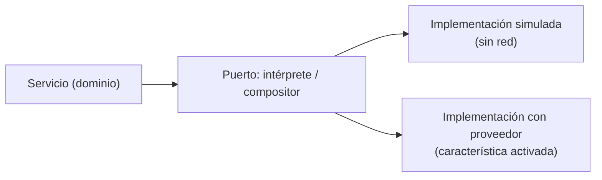
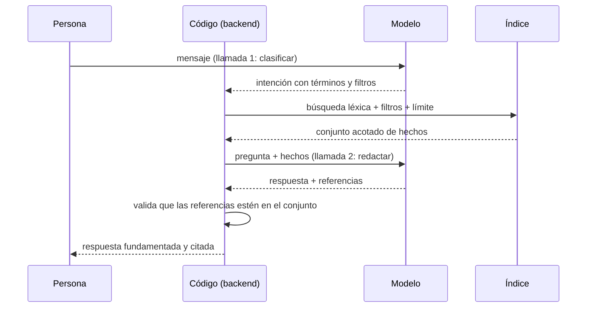

# 05 — IA: LLM, prompts y RAG

Este documento explica **qué es un modelo de lenguaje**, cómo se le pide una respuesta **estructurada**, cómo se le dan **hechos reales** para que no invente, y **dónde termina el modelo y empieza el código** en este sistema.

---

## 1. ¿Qué es?

Un **modelo de lenguaje grande (LLM)** es un modelo estadístico entrenado para predecir el siguiente **token** de una secuencia. Al generar texto, no consulta una base de datos ni "recuerda" interacciones anteriores: produce la continuación más probable dado **todo lo que está escrito en el prompt**.

Términos que hay que retener:

- **Token**: fragmento de texto (palabra, parte de palabra o signo) con el que trabaja el modelo.
- **Ventana de contexto**: la cantidad máxima de tokens que el modelo puede tener en cuenta a la vez. Todo lo que no esté ahí, el modelo lo ignora.
- **Temperatura**: parámetro que controla cuánta aleatoriedad se introduce al elegir el siguiente token. Cerca de cero, la elección es casi determinista.
- **Alucinación**: contenido que el modelo produce con seguridad pero que no está respaldado por nada.
- **Prompt**: el texto que se envía al modelo, normalmente separado en una **instrucción de sistema** (el comportamiento) y un **mensaje de usuario** (los datos concretos).
- **Salida estructurada**: pedir al modelo que responda en un formato fijo, como JSON, para poder parsearlo.
- **RAG** (*retrieval-augmented generation*): recuperar información relevante de una fuente propia y dársela al modelo en el prompt, de modo que responda **a partir de esos datos** y no de su conocimiento general.
- **Fundamentación (grounding)**: que la respuesta se apoye solo en los datos aportados, y que cite de dónde salió.
- **Adaptador**: aquí, la pieza que traduce entre el formato propio del sistema y el del proveedor del modelo.

Una distinción importante de vocabulario: este sistema usa un **adaptador de modelo** —llamadas puntuales con entrada y salida definidas—, no un **agente** ni un uso de **herramientas** por parte del modelo. El modelo no decide qué ejecutar; solo clasifica y redacta.

---

## 2. ¿Por qué se utiliza aquí?

**Por qué un LLM.** La entrada del sistema es lenguaje natural en español: "me diagnosticaron hipertensión el mes pasado", "¿cuándo empecé con la medicación?". Interpretar eso con reglas rígidas es frágil; el modelo maneja bien la variación del lenguaje. Pero el modelo **no es la fuente de verdad**: el código sigue siendo el que guarda, busca y decide.

**Por qué salida estructurada en lugar de texto libre.** Si el modelo devolviera prosa, habría que adivinar qué quiso decir. Pidiéndole JSON con una forma fija, el resultado se convierte en un dato que el programa puede **validar y rechazar**. El modelo nunca escribe directamente en la persistencia: primero su salida pasa por validación.

**Por qué dos llamadas separadas.** La primera **clasifica** el mensaje y extrae una intención. La segunda **redacta** una respuesta a partir de hechos ya recuperados. Separarlas aporta tres cosas: la clasificación no necesita ver la historia; la redacción solo ve los hechos que se le entregan; y cada una se puede probar y sustituir por separado.

**Por qué RAG con recuperación léxica.** El modelo no conoce la historia clínica de la persona, y no debe inventarla. La recuperación aporta los hechos reales, y el modelo solo los redacta. La búsqueda es **léxica** (sobre las palabras de la persona), no semántica: es predecible, no requiere almacenar vectores y respeta el vocabulario original.

**Por qué fundamentar y citar.** Una respuesta sobre salud debe poder **verificarse**. Por eso la respuesta cita los hechos en los que se apoya, y una cita fuera del conjunto recuperado se rechaza: no se presenta como fundamentada algo que no lo está.

**Por qué un modo sin red.** El comportamiento del modelo es caro y no determinista. Por defecto el sistema funciona en un **modo simulado** que no sale a la red, para poder desarrollar y probar sin credenciales ni dependencia de un proveedor. El proveedor real se activa explícitamente.

---

## 3. ¿Qué ocurre bajo el capó?

### 3.1 Cómo genera texto un modelo

```text
texto de entrada → tokens → distribución de probabilidad del siguiente token → selección
                 → añadir el token → repetir hasta terminar
```

Tres consecuencias explican casi todo el diseño:

1. **El modelo no "sabe" nada fuera del prompt.** No tiene memoria de peticiones anteriores. Si una pregunta depende de turnos previos, esos turnos tienen que **volver a enviarse** en el prompt.
2. **La generación es probabilística.** Con temperatura **cero**, el modelo elige siempre el token más probable y el resultado es prácticamente reproducible. Por eso este sistema usa temperatura cero: aquí no se busca creatividad, sino consistencia.
3. **La salida puede ser plausible y falsa.** Predecir el token más probable no es lo mismo que decir la verdad. De ahí la necesidad de **fundamentar** y **validar**.

### 3.2 El prompt como contrato

Cada llamada usa un archivo de prompt que hace de **contrato**: una instrucción, un conjunto de reglas y la forma exacta del JSON de salida.

```text
Instrucción: qué rol cumple el modelo
Reglas:      qué no puede hacer (no inventar, conservar la precisión temporal, no citar fuera del conjunto)
Forma:       la estructura JSON exacta de la respuesta
```

Dos decisiones destacan:

- **Los prompts están versionados como archivos.** Un cambio de comportamiento es un cambio revisable y reversible; el intérprete declara qué versión usa.
- **El formato se pide, pero no se confía.** Se solicita al proveedor una respuesta JSON, y aun así la aplicación **parsea y valida** el contenido. La petición de formato reduce errores; la validación los detecta.

El mensaje de usuario añade el contexto que el modelo no tiene: la **fecha de referencia** (para poder interpretar expresiones como "ayer") y, cuando los hay, los **turnos recientes** de la conversación.

### 3.3 De lenguaje a estructura: la intención

La primera llamada convierte el mensaje en una **intención** tipada. Hay cuatro formas posibles:

| Intención | Significado |
| --- | --- |
| `events` | El mensaje describe hechos clínicos que deben registrarse |
| `query` | El mensaje pregunta por la historia clínica |
| `clarification` | El mensaje podría ser un hecho, pero falta información |
| `conversation` | Cualquier otra cosa |

Una intención de consulta lleva la pregunta, un **ámbito** (historia o seguimiento corporal), los **términos de búsqueda** y, cuando la persona los mencionó, filtros de tipo y de fecha.

Después de parsear, el código **valida** antes de usar la intención:

- una intención de consulta **no puede** traer hechos candidatos;
- debe contener al menos un término de búsqueda o un filtro;
- un hecho con precisión exacta **necesita** una fecha.

Si la respuesta del proveedor no se puede parsear o no cumple estas reglas, el turno termina en un **fallo controlado** —sin inventar— y **sin escribir nada**.

### 3.4 Las fechas: el modelo propone, el código normaliza

El modelo puede devolver una fecha ISO o una **expresión** ("hoy", "ayer", "hace dos semanas"). Un **normalizador determinista** la resuelve contra la fecha de referencia:

- "hoy" → la fecha de referencia, precisión exacta;
- "ayer" → un día antes, precisión exacta;
- "hace N días/semanas" → la fecha calculada, precisión exacta;
- cualquier otra expresión → se conserva el texto original y **no se aumenta la precisión**.

Ese último punto es el importante: el sistema **nunca convierte una fecha aproximada o desconocida en exacta**. Si la persona dijo "el mes pasado", el hecho queda como aproximado y así se responde después. La precisión es un dato del dominio, no un adorno.

### 3.5 El adaptador como frontera



El dominio depende de un **puerto**, no de un proveedor. Hay dos implementaciones: una **simulada**, que clasifica con reglas sencillas y es la opción por defecto; y una que **llama al proveedor**, activada por configuración. Consecuencias:

- **El resto del sistema no sabe qué proveedor hay detrás.** Cambiar de proveedor, o ejecutar sin red, no afecta a las reglas.
- **Las pruebas usan la implementación simulada**, así que no dependen de la red ni de credenciales.
- **La credencial la lee solo el backend** y nunca llega al navegador. Los tiempos de conexión y de lectura están acotados por configuración.

### 3.6 La recuperación: código, no modelo



La recuperación es **determinista y la ejecuta el código**: construye una consulta de texto con los términos del usuario, filtra por metadatos, ordena por relevancia, aplica un límite y, si el texto no encuentra nada pero hay filtro, busca **solo por metadatos**. El modelo **no consulta la base de datos**: recibe ya el conjunto recuperado.

Este paso acotado es lo que hace que la respuesta sea tratable y verificable: el modelo solo ve unos pocos hechos relevantes, no la historia completa.

### 3.7 La composición fundamentada

La segunda llamada entrega al modelo la pregunta y los hechos recuperados con su código, tipo, fecha, precisión y contenido. El prompt impone las reglas:

- usar **solo** el contenido y la precisión de los hechos entregados;
- **no** añadir hechos, fechas ni interpretaciones que no estén ahí;
- conservar la precisión temporal;
- devolver la lista de **códigos** de los hechos usados, sin citar ninguno ajeno.

Y el código **verifica** ese resultado: si una referencia no pertenece al conjunto recuperado, la respuesta se **rechaza** y no se presenta como fundamentada. Si el modelo no cita nada, se adjunta como apoyo el conjunto recuperado completo, para que la respuesta siga siendo verificable. Si el conjunto estaba vacío, no se llama al modelo: el sistema declara que **no encuentra registros**.

Verificar las citas no basta, porque una respuesta puede apoyarse en hechos reales y aun así **no responder a la pregunta**: basta con que la recuperación devuelva algo que se parece. Por eso la composición declara también su **cobertura**: si los hechos entregados responden a **toda** la pregunta, a **parte** de ella o a **ninguna**. Recuperar no es responder.

- Con cobertura **parcial**, se responde solo la parte respaldada y se declara explícitamente la que no tiene registros.
- Con cobertura **ninguna**, el texto compuesto se descarta —podría describir hechos que no vienen al caso— y el sistema declara la ausencia: ningún hecho recuperado se presenta como apoyo de algo que no responde.

### 3.8 RAG, y qué no hace este sistema

RAG significa, literalmente, **recuperar y luego generar condicionado por lo recuperado**. Aquí: recuperar hechos y redactar una respuesta apoyada solo en ellos.

Para delimitar el concepto, conviene decir qué **no** ocurre:

- **No hay búsqueda vectorial ni *embeddings*.** La recuperación es léxica, sobre las palabras de la persona.
- **No hay agente ni uso de herramientas.** No hay bucle de decisión ni el modelo invoca funciones; son dos llamadas de una sola vuelta.
- **No hay reentrenamiento.** El modelo no se ajusta; se le aporta contexto mediante el prompt.

### 3.9 Memoria, límites y fallos

- **Memoria conversacional.** Los turnos recientes se guardan en memoria y se reenvían en el prompt, porque el modelo no recuerda. El búfer está **acotado**, sujeto a un tiempo de vida y a un límite de conversaciones. **No se persiste**: si el proceso se reinicia, se pierde. Las respuestas no dependen del búfer para ser ciertas: salen de la historia, no de lo conversado.
- **Idempotencia.** Repetir un turno con los mismos identificadores devuelve el resultado original sin repetir efectos.
- **Límite de tamaño del mensaje**, además de los tiempos de espera de conexión y lectura.
- **Los fallos no inventan.** Si la interpretación o la búsqueda fallan, el resultado es un fallo recuperable, sin respuesta fabricada.
- **Ausencia no es fallo.** Que la historia no respalde una pregunta es un **resultado**, no un error: se declara con su motivo —historia vacía, sin hechos de ese tipo, sin hechos en ese periodo, o ninguno que responda—, con su alcance acotado y con una salida para continuar. Además **no niega que el hecho ocurriera**: solo dice que no consta. Un fallo de búsqueda, en cambio, se informa como recuperable y nunca se disfraza de ausencia.

### 3.10 Controles para datos clínicos

- **El asistente registra lo que la persona afirma**, no lo que el sistema deduce: no diagnostica, no infiere, no recomienda tratamiento. Una sospecha no es un hecho.
- **Los registros no incluyen el contenido clínico** ni el prompt, la respuesta del proveedor o la credencial; solo identificadores de correlación para poder seguir un turno.
- **El proveedor externo queda fuera del control de la aplicación.** Su política de retención y su región de procesamiento no las garantiza este sistema: son una decisión de despliegue antes de enviar datos reales.
- **El modelo puede equivocarse igualmente.** De ahí la combinación de controles: salida estructurada, validación, recuperación acotada, fundamentación con citas y un camino explícito para "no hay registros".

---

## 4. Ideas clave

- Un LLM **predice tokens**; no consulta datos ni recuerda. Todo su contexto es el prompt.
- La **temperatura cero** se usa aquí por consistencia, no por creatividad.
- El **prompt es un contrato versionado**; el formato se pide y aun así se **valida**.
- La intención se convierte en una **estructura tipada** que se valida antes de usarse.
- Las **fechas las normaliza el código**, y nunca se aumenta la precisión de un dato aproximado.
- El adaptador es una **frontera**: el dominio no depende del proveedor, y hay un modo sin red por defecto.
- La **recuperación la hace el código**, no el modelo; es léxica, filtrada y acotada.
- La **respuesta se fundamenta y se cita**; una cita fuera del conjunto recuperado se rechaza.
- Recuperar **no es responder**: la respuesta declara qué parte de la pregunta cubren los hechos recuperados.
- El sistema **declara que no encuentra registros** en lugar de improvisar, y esa ausencia es un resultado con motivo, alcance y salida para continuar, no un error.
- La **memoria conversacional es efímera y acotada**; la verdad está en la historia, no en la conversación.
- Los **fallos no producen respuestas inventadas**, y los datos clínicos no se registran en los logs.
