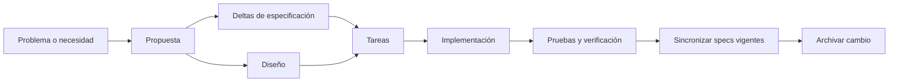
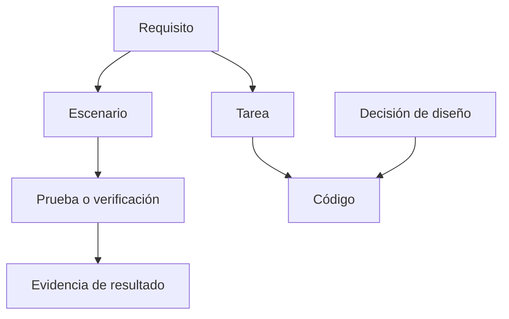

# 06 — Desarrollo guiado por especificaciones y OpenSpec

Este documento explica el **desarrollo guiado por especificaciones (SDD)** y la
forma en que OpenSpec organiza requisitos, decisiones, tareas y cambios en
Careme. El objetivo es entender cómo una intención se convierte en un contrato
observable, cómo ese contrato guía la implementación y cómo se conserva la
trazabilidad cuando el cambio termina.

## Índice

1. [Qué es SDD](#1-qué-es-sdd)
2. [Especificación, diseño y tareas](#2-especificación-diseño-y-tareas)
3. [Estructura de OpenSpec](#3-estructura-de-openspec)
4. [Cómo se escribe un comportamiento verificable](#4-cómo-se-escribe-un-comportamiento-verificable)
5. [Ciclo de vida de un cambio](#5-ciclo-de-vida-de-un-cambio)
6. [Deltas y sincronización](#6-deltas-y-sincronización)
7. [Trazabilidad y verificación](#7-trazabilidad-y-verificación)
8. [Archivo e historial](#8-archivo-e-historial)
9. [Otras formas de gestionar requisitos](#9-otras-formas-de-gestionar-requisitos)

## 1. Qué es SDD

El **desarrollo guiado por especificaciones (SDD)** es una forma de construir
software en la que el comportamiento esperado se expresa como un artefacto
revisable antes o junto con el código. La especificación funciona como un
contrato: define qué debe observarse, mientras la implementación decide cómo
lograrlo.

Un **requisito** es una obligación del sistema. Un requisito normativo usa
palabras como `MUST` o “debe” porque no propone una posibilidad: fija una
condición de aceptación.

Un **escenario** es un ejemplo concreto de un requisito, con una condición de
entrada y resultados observables. Un requisito sin escenario puede parecer claro
pero ser difícil de probar, porque no concreta qué debe ocurrir en una situación
real.

Una **capacidad** es una unidad coherente de comportamiento que puede tener sus
propios requisitos, como registrar hechos clínicos, consultar la historia o
mantener mediciones. Un **cambio** es una unidad de trabajo que modifica una o
varias capacidades.

SDD no significa escribir toda la implementación antes del código. Significa
acordar primero el comportamiento que no debe perderse mientras el diseño y el
código evolucionan.

## 2. Especificación, diseño y tareas

Los artefactos de un cambio responden preguntas distintas:

| Artefacto | Pregunta | Tipo de información |
| --- | --- | --- |
| Propuesta | ¿Por qué se necesita el cambio y qué alcance tiene? | Motivación, impacto, capacidades afectadas y fuera de alcance |
| Especificación | ¿Qué comportamiento debe observarse? | Requisitos y escenarios normativos |
| Diseño | ¿Cómo se resolverá? | Arquitectura, decisiones, restricciones y alternativas |
| Tareas | ¿En qué orden se implementará? | Pasos concretos y verificables |
| Código | ¿Qué hace realmente el sistema? | Implementación ejecutable |

La **especificación** no debe convertirse en una copia del código. Si se cambia
una clase o una biblioteca sin cambiar el comportamiento observable, no debería
cambiar el requisito. El diseño puede mencionar capas, adaptadores, tablas o
bibliotecas porque responde al “cómo”; la especificación debe conservar el
contrato que esas decisiones implementan.

Las **tareas** descomponen el trabajo, pero no sustituyen a los requisitos. Una
lista como “crear controlador” indica una acción técnica; un escenario como
“cuando llega una medición futura, la API responde con error de validación”
indica cómo se reconoce que la capacidad funciona.

## 3. Estructura de OpenSpec

OpenSpec es la convención y el conjunto de herramientas que separan el estado
vigente del sistema, los cambios en curso y el historial:

```text
openspec/
├── config.yaml
├── specs/                         # comportamiento vigente
│   └── <capacidad>/spec.md
└── changes/
    ├── <cambio>/                  # propuesta en curso
    │   ├── .openspec.yaml
    │   ├── proposal.md
    │   ├── design.md
    │   ├── tasks.md
    │   └── specs/<capacidad>/spec.md
    └── archive/
        └── YYYY-MM-DD-<cambio>/   # cambio completado
```

Las especificaciones de `openspec/specs/` representan el contrato vigente. Un
directorio en `changes/` representa una propuesta que todavía no debe leerse
como comportamiento implementado. `archive/` conserva el cambio que ya pasó por
implementación, verificación e integración.

El archivo `config.yaml` declara el esquema de trabajo y el contexto del
proyecto. En Careme usa el esquema `spec-driven` y documenta restricciones como
la ausencia de autenticación en el MVP, la fuente Markdown de los hechos
clínicos y el uso de PostgreSQL con un índice derivado.

La separación evita que una especificación vigente prometa algo que todavía es
solo una propuesta y permite consultar por qué una capacidad cambió.

## 4. Cómo se escribe un comportamiento verificable

Un formato habitual de requisito y escenario es:

```text
### Requirement: Rechazar una medición futura
El sistema MUST rechazar una medición cuya fecha sea posterior al día actual.

#### Scenario: Fecha posterior al día actual
- **WHEN** se envía una medición con fecha futura
- **THEN** la API responde con HTTP 400
- **AND** devuelve el código de validación correspondiente
- **AND** no crea ni modifica una fila
```

El requisito formula la obligación. El escenario fija una situación y un
resultado. La frase “no crea ni modifica una fila” protege también un efecto
negativo, que es tan importante como la respuesta HTTP.

### 4.1 Propiedades de un buen escenario

Un escenario útil es:

- **observable:** se puede comprobar desde una respuesta, estado o efecto;
- **determinista:** no depende de una hora, red o dato aleatorio sin controlar;
- **aislado:** describe una situación que puede preparar una prueba;
- **completo:** expresa los resultados relevantes, incluidos errores;
- **atómico:** verifica una conducta principal sin mezclar varias capacidades;
- **trazable:** se puede relacionar con una prueba, tarea o decisión.

Los escenarios deben cubrir caminos normales, límites, errores y efectos que no
deben ocurrir. No es necesario describir cada detalle de implementación.

### 4.2 Alcance y no objetivos

El **fuera de alcance** es una decisión explícita sobre lo que no cambia en una
entrega. No significa que una capacidad nunca vaya a existir; significa que no
forma parte de ese cambio. Registrar esta frontera evita que una tarea técnica
crezca por asociación.

Un **criterio de aceptación** es una condición que debe cumplirse para
considerar terminado un cambio. En SDD, los escenarios de los requisitos son la
forma más precisa de expresarlos.

## 5. Ciclo de vida de un cambio

Un cambio atraviesa estados conceptuales, aunque cada equipo puede automatizar
los pasos de forma distinta:



### 5.1 Propuesta

La propuesta explica el problema, el valor del cambio, las capacidades
implicadas y sus límites. Su función es permitir una decisión antes de invertir
en diseño y código.

### 5.2 Deltas y diseño

El delta expresa cómo cambia el comportamiento vigente. El diseño explica la
solución técnica: capas afectadas, contratos, persistencia, compatibilidad,
alternativas y riesgos.

Separar ambos evita dos errores opuestos: escribir un diseño sin saber qué
comportamiento se necesita, o convertir una especificación en una receta
inflexible de implementación.

### 5.3 Tareas e implementación

Las tareas convierten la decisión en una secuencia ejecutable. Una tarea debe
ser suficientemente concreta para producir un cambio comprobable y debe
relacionarse con un requisito o escenario.

Durante la implementación puede descubrirse una decisión nueva. Si cambia el
comportamiento o el alcance, el cambio debe actualizar sus artefactos en lugar
de dejar la decisión solo en el código o en una conversación informal.

### 5.4 Verificación

Verificar significa demostrar que los escenarios se cumplen. La evidencia puede
ser una prueba unitaria, una prueba de integración, una comprobación manual o
una combinación de ellas, según la propiedad que se verifica.

Un cambio no está completo porque las tareas estén marcadas: está completo
cuando el comportamiento implementado coincide con la especificación y la
documentación resultante puede explicar la decisión.

## 6. Deltas y sincronización

Una **especificación delta** describe la diferencia entre el comportamiento
vigente y el comportamiento propuesto. OpenSpec usa operaciones explícitas:

| Operación | Significado |
| --- | --- |
| `ADDED` | Aparece un requisito nuevo |
| `MODIFIED` | Cambia el comportamiento de un requisito existente |
| `REMOVED` | El requisito deja de aplicar, con una razón documentada |
| `RENAMED` | Cambia el identificador o título sin cambiar necesariamente el comportamiento |

Un delta `MODIFIED` debe incluir el requisito completo y sus escenarios que siguen
vigentes. Si solo contiene una frase parcial, una sincronización que reemplace el
requisito puede borrar accidentalmente escenarios anteriores.

La **sincronización** integra los deltas aprobados en `openspec/specs/`. Es una
operación semántica: deja la especificación vigente en el estado correcto, no
simplemente concatena archivos.

La propiedad deseable es la **idempotencia**: sincronizar un cambio ya integrado
no debe duplicar requisitos ni cambiar el resultado. Después de sincronizar, el
directorio de cambio conserva el contexto histórico hasta ser archivado.

## 7. Trazabilidad y verificación

La **trazabilidad** es la relación que permite seguir una decisión desde su
motivo hasta su evidencia:



Una matriz de trazabilidad puede responder:

| Pregunta | Relación |
| --- | --- |
| ¿Por qué existe este código? | Código → tarea → propuesta |
| ¿Qué comportamiento protege? | Código → requisito → escenario |
| ¿Cómo sé que funciona? | Escenario → prueba → resultado |
| ¿Por qué se eligió esta solución? | Código → decisión de diseño |
| ¿Qué documentación debe actualizarse? | Cambio → capacidades y contratos afectados |

La trazabilidad no obliga a enlazar cada línea con un documento. Su utilidad es
mantener relaciones significativas entre comportamiento, decisión e información
que permite verificarlo.

## 8. Archivo e historial

**Archivar** un cambio es cerrarlo después de implementar, verificar y sincronizar
sus deltas. El archivo conserva la propuesta, el diseño, las tareas y las
especificaciones del cambio con su fecha.

El archivo sirve para dos propósitos:

- registrar decisiones históricas que explican por qué el sistema tiene su forma
  actual;
- impedir que `changes/` acumule propuestas que parecen activas cuando ya
  terminaron.

Archivar no sustituye la sincronización. La especificación vigente debe reflejar
primero el comportamiento actual; el archivo conserva cómo se llegó a ese
estado.

Cuando el código, las especificaciones y la documentación divergen, la solución
no es ocultar la diferencia. Se debe decidir cuál es el comportamiento correcto,
actualizar el artefacto que corresponda y dejar una nueva decisión trazable si
el cambio modifica el contrato.

## 9. Otras formas de gestionar requisitos

SDD es una estrategia entre varias. Para contextualizar:

| Enfoque | Unidad principal | Fortaleza |
| --- | --- | --- |
| Historias de usuario | Necesidad de una persona | Centra la conversación en valor y resultado |
| BDD | Ejemplos compartidos | Hace los criterios legibles para negocio y desarrollo |
| RFC o ADR | Decisión técnica | Conserva alternativas, razones y consecuencias |
| Gestión tradicional | Documento de requisitos completo | Útil con contratos estables y regulación formal |
| Desarrollo iterativo | Incremento pequeño y feedback | Reduce el riesgo mediante entregas frecuentes |
| Test-first/TDD | Prueba antes de implementación | Fuerza interfaces y feedback rápido sobre diseño |

Estos enfoques se pueden combinar. En Careme, OpenSpec aporta el registro de
cambios y deltas; los escenarios se relacionan naturalmente con las pruebas, y
los documentos de `docs/` explican la arquitectura y los conceptos que resultan
del sistema construido.
