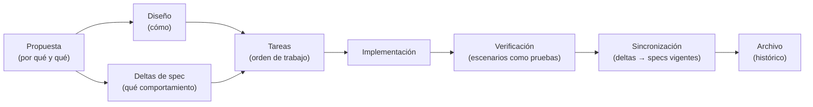

# 06 — SDD y OpenSpec

Este documento explica **qué es el desarrollo guiado por especificaciones**, qué papel cumple una especificación frente al código y al diseño, y **cómo está organizado OpenSpec** en este repositorio para gobernar los cambios.

---

## 1. ¿Qué es?

El **desarrollo guiado por especificaciones (SDD)** es una forma de trabajar en la que el **comportamiento esperado** se escribe y se acuerda como artefacto de referencia **antes o junto con** el código, y no se deduce después leyendo la implementación. La especificación no describe cómo se construye algo, sino **qué debe observarse** cuando esté construido.

Términos que hay que retener:

- **Especificación**: contrato de comportamiento. Dice qué hace el sistema, no cómo lo hace.
- **Requisito**: una obligación normativa (*el sistema MUST…*).
- **Escenario**: un caso concreto y verificable de un requisito, en forma *cuando… entonces…*.
- **Capacidad**: una unidad funcional del sistema con su propia especificación (por ejemplo, la conversación del chat o la consulta de la historia clínica).
- **Cambio**: una unidad de trabajo acotada que modifica una o varias capacidades.
- **Especificación delta**: la parte de un cambio que describe **qué se añade, modifica, elimina o renombra** respecto a las especificaciones vigentes.
- **Archivo**: el acto de cerrar un cambio completado, integrando sus deltas en las especificaciones vigentes y guardándolo como histórico.

**OpenSpec** es la herramienta y la convención que estructuran ese flujo en el repositorio: separa las especificaciones **vigentes** de los cambios **en curso** y del **histórico archivado**.

Una distinción útil desde el principio: la **especificación** dice *qué*, el **diseño** dice *cómo se resolverá*, las **tareas** dicen *en qué orden se hará*, y la **propuesta** dice *por qué y qué cambia*. Los cuatro son artefactos distintos con propósitos distintos.

---

## 2. ¿Por qué se utiliza aquí?

**Porque el valor del sistema es su comportamiento verificable.** Este proyecto trata con hechos clínicos: cuándo se registra algo, cuándo se responde, cuándo se declara que no hay registros, cuándo no se debe inventar una respuesta. Ese tipo de garantías no debería vivir solo en la cabeza de quien implementa. Escribirlas como requisitos y escenarios las hace **explícitas, revisables y comprobables**.

**Porque la implementación cambia y el contrato no debería hacerlo por sorpresa.** Una especificación expresa comportamiento externo: si se puede cambiar el código sin alterar ese comportamiento, el cambio no pertenece a la especificación. Eso mantiene el contrato estable mientras la implementación evoluciona.

**Porque los cambios necesitan un límite.** Un cambio acotado a una o varias capacidades, con un "fuera de alcance" explícito, evita el crecimiento silencioso del trabajo. La propuesta obliga a decir **qué entra y qué no**.

**Porque el repositorio ya distingue "cómo es" de "cómo cambia".** `docs/` describe el sistema tal como está. `openspec/` describe lo que se propone cambiar y conserva lo ya cambiado. Mezclarlos haría que la documentación de arquitectura se llenara de propuestas no decididas.

---

## 3. ¿Qué ocurre bajo el capó?

### 3.1 La estructura en el repositorio

```text
openspec/
├── config.yaml                     # esquema del flujo y ajustes
├── specs/                          # especificaciones VIGENTES
│   └── <capacidad>/spec.md         # una por capacidad del sistema
└── changes/
    ├── <cambio>/                   # cambios EN CURSO
    │   ├── .openspec.yaml          # metadatos del cambio (esquema, fecha)
    │   ├── proposal.md             # por qué y qué cambia
    │   ├── design.md               # cómo se resolverá
    │   ├── tasks.md                # plan de ejecución
    │   └── specs/<capacidad>/spec.md   # deltas por capacidad
    └── archive/
        └── YYYY-MM-DD-<cambio>/    # cambios COMPLETADOS
```

La división clave es **vigente / en curso / archivado**. Las especificaciones de `specs/` son la verdad actual. Un cambio en `changes/` aún no ha ocurrido: propone. `archive/` guarda lo ya integrado, con su fecha.

### 3.2 Qué contiene cada artefacto

| Artefacto | Responde a | Contiene |
| --- | --- | --- |
| `proposal.md` | ¿Por qué y qué cambia? | Motivación, cambios propuestos, capacidades nuevas y modificadas, impacto y fuera de alcance |
| `design.md` | ¿Cómo se resolverá? | Contexto y restricciones, objetivos y no-objetivos, decisiones y alternativas descartadas |
| `tasks.md` | ¿En qué orden se hará? | Lista ordenada de pasos, cada uno verificable |
| `specs/<capacidad>/spec.md` | ¿Qué comportamiento cambia? | Requisitos y escenarios, como delta |
| `.openspec.yaml` | ¿Con qué reglas se trabaja? | El esquema del flujo y la fecha de creación |

Cada artefacto responde a una pregunta distinta y **ninguno sustituye a otro**. Que una decisión esté en el diseño no la convierte en requisito; que un requisito esté en la especificación no indica cómo implementarlo.

### 3.3 Qué es una especificación y qué no

Una especificación describe **comportamiento observable**:

```text
### Requirement: <nombre>
El sistema MUST <comportamiento exigido>.

#### Scenario: <nombre>
- **WHEN** <condición>
- **THEN** <resultado esperado>
- **AND** <otro resultado>
```

Lo que **sí** aparece en una especificación: comportamiento que un usuario o un sistema externo puede observar, entradas y salidas, condiciones de error, y restricciones externas relevantes.

Lo que **no** aparece: nombres de clases o funciones, elecciones de biblioteca, pasos de implementación o detalles de ejecución. La prueba para decidirlo es directa: **si la implementación puede cambiar sin cambiar el comportamiento visible, no pertenece a la especificación.**

Un requisito es **normativo** (*MUST*, *SHALL*): no es una sugerencia. Y todo requisito lleva **al menos un escenario**, porque un requisito sin un caso concreto no se puede comprobar. Cada escenario es un **candidato a prueba**: describe una situación y el resultado exigido.

### 3.4 El ciclo de vida de un cambio



El punto que suele sorprender es el penúltimo: **las especificaciones vigentes no se tocan mientras el cambio está en curso**. El cambio vive aparte con sus deltas; solo cuando se verifica que está implementado, los deltas se **integran** en `specs/` y el cambio pasa a `archive/`. Así, `specs/` siempre refleja el sistema **actual**, y no una mezcla de lo hecho y lo propuesto.

Verificar significa comprobar que lo implementado **satisface los escenarios**. Como los escenarios están escritos en términos observables, se traducen de forma natural en pruebas.

### 3.5 Las operaciones delta

Un delta declara explícitamente la naturaleza del cambio sobre cada requisito:

| Operación | Significado |
| --- | --- |
| **Añadido** | Un requisito nuevo que no existía |
| **Modificado** | Un requisito existente cambia de comportamiento |
| **Eliminado** | Un requisito deja de existir, con razón y migración |
| **Renombrado** | El requisito cambia de nombre sin cambiar de fondo |

Merece atención **Modificado**: un delta de este tipo debe llevar el requisito **completo** —su descripción y todos los escenarios que sobreviven—, no solo el fragmento que cambia. La razón es que la integración **reemplaza** el requisito en la especificación vigente; si el delta trajera solo la diferencia, la integración perdería lo demás. Es un error frecuente y silencioso.

La cualidad deseada de todo el proceso es la **idempotencia**: aplicar los deltas dos veces debe dejar el mismo resultado que aplicarlos una. Por eso la integración se piensa como "dejar la especificación en el estado correcto", no como "aplicar un parche".

### 3.6 Cómo una especificación restringe la implementación

Una especificación no es un adorno documental; condiciona el trabajo de tres maneras:

- **Define la aceptación.** El criterio de "terminado" no es una opinión: es que los escenarios se cumplan.
- **Fija el alcance.** La sección de "fuera de alcance" es una decisión registrada; lo que no está, no se hace en ese cambio.
- **Impide la deriva.** Al integrar los deltas al cerrar el cambio, si el código y las especificaciones no coinciden, la discrepancia se hace visible. Las especificaciones no pueden quedarse atrás en silencio.

### 3.7 Relación con el código y con esta guía

Hay tres registros distintos, y conviene no confundirlos:

| Registro | Responde a | Dónde vive |
| --- | --- | --- |
| **Comportamiento exigido** | ¿Qué debe hacer el sistema? | `openspec/specs/` |
| **Cambio en curso** | ¿Qué vamos a cambiar y por qué? | `openspec/changes/` |
| **Cómo es hoy y cómo funciona** | ¿Qué hay y cómo está construido? | `docs/` (incluida esta guía) |
| **La realidad ejecutable** | ¿Qué hace de verdad el software? | El código |

La conexión entre ellos es bidireccional: los **escenarios** de una especificación son las **pruebas** que el código debe pasar, y las **decisiones** del diseño son las que esta guía explica como mecanismos. Cuando se quiere entender por qué una parte del sistema está construida de cierta forma, el diseño del cambio que la introdujo suele contener esa respuesta.

---

## 4. Ideas clave

- **SDD** escribe el comportamiento esperado como artefacto de referencia, antes o junto con el código.
- Una **especificación** describe *qué* se observa; el **diseño** describe *cómo*; las **tareas**, *en qué orden*; la **propuesta**, *por qué y qué*.
- Un **requisito** es normativo y lleva **al menos un escenario** verificable.
- Si la implementación puede cambiar sin alterar el comportamiento visible, **no pertenece a la especificación**.
- OpenSpec separa **especificaciones vigentes**, **cambios en curso** e **histórico archivado**.
- Los cambios viven aparte con sus **deltas**; las especificaciones vigentes solo se actualizan al **integrar** el cambio.
- Un delta de tipo **Modificado** debe traer el requisito **completo**, no solo la diferencia.
- El proceso busca la **idempotencia**: integrar dos veces da el mismo resultado.
- La especificación **restringe** la implementación: define la aceptación, fija el alcance y evita la deriva.
- Los **escenarios** son el puente entre la especificación y las pruebas.
