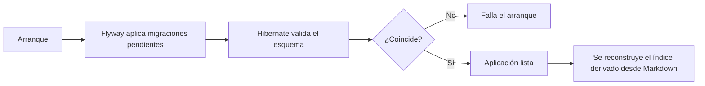

# 07 — Calidad y despliegue

Este documento explica **qué propiedades del sistema se comprueban y con qué**, qué garantiza cada tipo de verificación y qué queda fuera de su alcance, y cómo el código se convierte en un artefacto desplegable con su configuración.

---

## 1. ¿Qué es?

"Calidad" no es una sola cosa. Se comprueba con **verificaciones distintas**, cada una dirigida a una propiedad distinta:

- **Prueba unitaria**: ejecuta una pieza de lógica aislada y comprueba su resultado.
- **Prueba de capa web**: comprueba el contrato HTTP —rutas, códigos de estado, forma de la respuesta— sin levantar un servidor real.
- **Prueba de integración**: ejecuta contra dependencias reales (aquí, una base de datos de verdad) para comprobar que el sistema funciona en conjunto.
- **Prueba de componente**: monta una parte de la interfaz y comprueba lo que se renderiza y cómo reacciona.
- **Doble de prueba**: un sustituto controlado de una dependencia (por ejemplo, una implementación falsa de un proveedor).
- **Cobertura**: porcentaje de código ejecutado por las pruebas. Se mide por **línea** y por **rama** (cada desenlace de una decisión).
- **Lint**: análisis estático de estilo y errores comunes.
- **Chequeo de tipos**: comprobación estática de coherencia de tipos, sin ejecutar.
- **Imagen de contenedor**: el artefacto empaquetado con su entorno de ejecución.
- **Construcción multietapa**: un mismo archivo de imagen con etapas separadas para construir y para ejecutar.
- **Perfil de entorno**: un conjunto de configuración para un entorno (desarrollo, preproducción, producción).
- **Migración**: script versionado que lleva el esquema de un estado a otro.

---

## 2. ¿Por qué se utiliza aquí?

**Porque cada verificación cubre una propiedad que las demás no cubren.** Una prueba unitaria comprueba que una regla es correcta, pero no que la consulta SQL funcione; una prueba de integración comprueba la persistencia real, pero es lenta y no aísla la causa. Se usan **varias** porque cada una responde a una pregunta distinta.

**Porque la base de datos forma parte del comportamiento.** Aquí hay restricciones de unicidad, columnas generadas y búsqueda de texto: comportamiento que **solo existe en PostgreSQL**. Probarlo con una base simulada comprobaría una maqueta, no el sistema. Por eso las pruebas de integración arrancan un **PostgreSQL real** en un contenedor.

**Porque un umbral de cobertura detecta huecos, no errores.** El umbral sirve para que no se acumule código sin probar. Pero conviene tenerlo claro: **la cobertura mide ejecución, no corrección**. Una línea ejecutada puede estar mal; una línea no ejecutada puede estar bien. El umbral es un **suelo**, no un objetivo.

**Porque el artefacto debe ser reproducible y con privilegios mínimos.** Construir en etapas separa las herramientas de construcción del runtime; la imagen final lleva solo lo necesario y corre con un usuario **sin privilegios**.

**Porque la configuración no debe viajar en el código.** El mismo artefacto se despliega en varios entornos cambiando **variables**, no recompilando. Los secretos viven fuera del repositorio.

---

## 3. ¿Qué ocurre bajo el capó?

### 3.1 Qué comprueba cada verificación

| Verificación | Propiedad que comprueba | Qué **no** comprueba |
| --- | --- | --- |
| Unitaria | La lógica y las invariantes de una pieza aislada | Integración real, red, base de datos |
| Capa web | El contrato HTTP: rutas, estados, forma de respuesta | Persistencia real |
| Integración con contenedor | Esquema, consultas, transacciones y búsqueda sobre el motor real | La interfaz |
| Componente | Render e interacción de una parte de la UI | El backend ni la base de datos |
| Chequeo de tipos | Coherencia estática entre tipos | Comportamiento en ejecución |
| Lint | Convenciones y errores comunes | Corrección funcional |
| Cobertura | Qué código se ejecutó | Que ese código sea **correcto** |

### 3.2 Backend

```text
Unitaria        JUnit 5 + Mockito + AssertJ      reglas, invariantes, servicios
Capa web        MockMvc                          contrato HTTP y errores
Integración     Spring Boot Test + Testcontainers (PostgreSQL real)
Cobertura       JaCoCo: informe + umbral en verify
Reproducibilidad  Maven Wrapper + enforcer de JDK 21
```

Tres detalles importan:

- **Las pruebas de integración arrancan su propio PostgreSQL.** Necesitan un runtime de contenedores disponible, pero **no** que el entorno de desarrollo esté levantado: no comparten la base de datos del día a día.
- **El umbral de cobertura está atado a `verify`, no a `test`.** Ejecutar solo las pruebas no aplica el umbral; se aplica en la fase de verificación, junto al informe. El umbral exigido es **90 % de líneas y 90 % de ramas** sobre el **conjunto** del proyecto.
- **El JDK está fijado por el enforcer.** El rango es Java 21; una versión distinta hace **fallar la construcción**. Es deliberado: evita que el proyecto se construya con un entorno distinto al previsto.

### 3.3 Frontend

```text
Unitaria / componente   Vitest + Testing Library (entorno jsdom)
Tipos                   tsc --noEmit
Lint                    ESLint
Build                   compilación de producción
```

Una propiedad que conviene destacar: **estas pruebas no necesitan ni el backend ni la base de datos**. Corren en un DOM simulado, así que son rápidas y deterministas. Eso las hace ideales para comprobar lógica pura (cálculos, formateo, esquemas) y el render de componentes, pero implica que **no** demuestran que la aplicación funcione de extremo a extremo.

### 3.4 Cobertura: qué mide y qué no

```text
Cobertura de línea:  ¿se ejecutó esta línea?
Cobertura de rama:   ¿se ejecutaron los dos lados de esta decisión?
```

La cobertura de **rama** es más estricta, porque obliga a recorrer también el camino que no se toma. Aun así, ninguna de las dos dice que el resultado sea el esperado. Un umbral alto puede convivir con un comportamiento incorrecto si las pruebas comprueban mal. Por eso el umbral se complementa con pruebas que **afirman** resultados concretos, y con escenarios de especificación (documento 06) que describen qué debe observarse.

### 3.5 Del código al artefacto

**Backend — construcción multietapa:**

```text
Etapa 1 (maven + JDK 21): resuelve dependencias, compila y empaqueta el jar
Etapa 2 (JRE 21 alpine):  copia el jar, crea el usuario sin privilegios,
                          prepara el directorio de datos y ejecuta
```

Dos decisiones concretas: la imagen de construcción **no ejecuta las pruebas** (ya se ejecutaron en la verificación) para que el empaquetado sea rápido y consuma un artefacto ya validado; y el runtime **crea el directorio de datos con el usuario del proceso**, de modo que un volumen montado herede el propietario correcto y el proceso sin privilegios pueda escribir en él. Sin ese detalle, montar un volumen dejaría el directorio sin permiso de escritura y la fuente de verdad quedaría inaccesible.

**Frontend — construcción multietapa:**

```text
Etapa de dependencias: instala con el archivo de bloqueo congelado
Etapa de construcción: compila la aplicación
Etapa de runtime:      copia solo la salida autónoma y ejecuta como usuario sin privilegios
```

El uso de la **salida autónoma** hace que la imagen final contenga solo lo necesario para servir, sin las dependencias de desarrollo. Instalar con el bloqueo **congelado** garantiza que se instale exactamente lo que quedó registrado.

### 3.6 Configuración por entorno

El mismo artefacto se despliega en tres entornos cambiando **variables**, no recompilando:

| Entorno | Base de datos | Comportamiento |
| --- | --- | --- |
| Desarrollo | Valores por defecto locales | Arranca sin configuración adicional |
| Preproducción / Producción | Variables **obligatorias** | **Se niega a arrancar** si faltan |

Ese "se niega a arrancar" es una decisión de calidad, no una limitación: un servicio que arranca con una base de datos equivocada o con valores por defecto heredados es más peligroso que uno que no arranca. **Fallo temprano y visible** en lugar de comportamiento silenciosamente incorrecto.

Además, la dirección de la API en el frontend **no lleva prefijo público**, así que no se expone al navegador; y los secretos del proveedor se leen del entorno y nunca del repositorio. Un archivo de ejemplo documenta la **forma** de la configuración sin contener valores reales.

### 3.7 El arranque forma parte del despliegue



Dos mecanismos hacen que el arranque sea parte del despliegue:

- **Migraciones y validación del esquema.** Al arrancar, las migraciones llevan el esquema a su versión actual y Hibernate comprueba que el mapeo coincide. Una divergencia **falla el arranque** en lugar de alterar la base de datos en silencio.
- **Reconciliación del índice derivado.** Cuando la aplicación está lista, se reconstruye el índice desde los documentos Markdown. Así, tras cualquier reinicio, el índice vuelve a coincidir con su fuente de verdad.

El orquestador local levanta los tres servicios con una red común, espera a que la base de datos esté **saludable** antes de arrancar el backend, y monta un **volumen persistente** para los documentos. Ese volumen no es opcional: la fuente de verdad debe sobrevivir a la recreación del contenedor, porque el índice se reconstruye a partir de ella.

### 3.8 Criterios conceptuales de "listo para desplegar"

Antes de considerar un cambio desplegable:

1. Los **escenarios de la especificación** afectados están cubiertos por pruebas.
2. **Backend**: pruebas unitarias, de capa web y de integración en verde; `verify` cumple el umbral de cobertura; el enforcer confirma el JDK.
3. **Frontend**: pruebas, lint, chequeo de tipos y build en verde.
4. **Imágenes**: los contenedores construyen con las etapas previstas.
5. **Esquema**: las migraciones se aplican sin divergencia y el arranque valida el mapeo.
6. **Configuración**: cada entorno resuelve sus variables; producción no depende de valores por defecto.
7. **Flujo crítico**: se recorre a mano el camino principal para comprobar que se comporta como se espera.

### 3.9 Qué queda fuera de esta verificación

Es tan importante saber qué **no** se comprueba como qué sí:

- **No hay integración continua configurada en el repositorio.** Las verificaciones se ejecutan **localmente**, así que nada impide fusionar código que no las pase: la disciplina es manual. Un pipeline convertiría estos pasos en una puerta automática.
- **No hay pruebas de extremo a extremo.** Existe una carpeta reservada para ellas, pero todavía está vacía: el recorrido completo se comprueba a mano.
- **No hay pruebas de carga ni de rendimiento**: no se mide cómo se comporta el sistema bajo concurrencia alta.
- **No hay comprobación automática de accesibilidad**; la accesibilidad se verifica en las pruebas de componente y en revisión.
- **No hay análisis de dependencias ni de vulnerabilidades.**
- **La cobertura no demuestra corrección.** Es un indicador de qué se ejecutó, no de qué se afirmó.
- **No hay pruebas del proveedor real.** El comportamiento del sistema se prueba con una implementación simulada; el proveedor real es una dependencia externa fuera del control del repositorio.

---

## 4. Ideas clave

- Cada verificación cubre una propiedad distinta; se usan **varias** porque ninguna basta sola.
- Las pruebas de **integración usan PostgreSQL real**, porque parte del comportamiento solo existe en el motor.
- El **umbral de cobertura** es un suelo, no un objetivo, y **no demuestra corrección**.
- El umbral está atado a la fase de **verificación**, no a la de pruebas.
- El **JDK está fijado**: construir con otra versión falla.
- Las pruebas del frontend **no necesitan backend ni base de datos**; son rápidas, pero **no** prueban el sistema completo.
- Las imágenes son **multietapa y sin privilegios**; el runtime del backend prepara el directorio de datos para el volumen.
- El mismo artefacto se despliega **cambiando variables**; producción **falla al arrancar** si falta configuración, en lugar de arrancar mal.
- El **arranque migra, valida y reconcilia**: las migraciones aplican, el mapeo se comprueba y el índice derivado se reconstruye.
- **No hay CI**: las verificaciones son locales y manuales, y eso es una brecha real.
