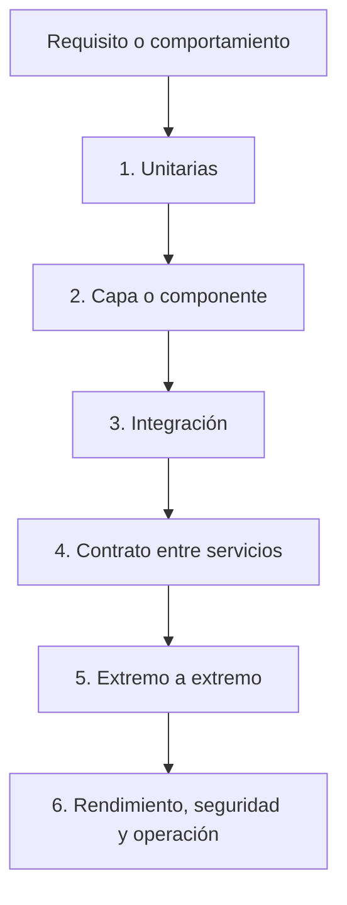

# 07 — Calidad y pruebas

Este documento explica qué significa calidad en software, cómo se construyen
casos de prueba, en qué secuencia se aplican las verificaciones y cómo se mide
la cobertura. Los ejemplos se basan en el backend Java/Spring Boot y en el
frontend Next.js de Careme.

El documento 08 explica construcción, configuración y despliegue. Aquí interesa
la evidencia que permite saber si el comportamiento implementado es confiable.

## Índice

1. [Qué es calidad](#1-qué-es-calidad)
2. [La estrategia de pruebas](#2-la-estrategia-de-pruebas)
3. [Cómo se construye un caso de prueba](#3-cómo-se-construye-un-caso-de-prueba)
4. [Tipos de pruebas y niveles](#4-tipos-de-pruebas-y-niveles)
5. [Ejemplos del backend](#5-ejemplos-del-backend)
6. [Ejemplos del frontend](#6-ejemplos-del-frontend)
7. [Cobertura de código](#7-cobertura-de-código)
8. [Otras verificaciones](#8-otras-verificaciones)

## 1. Qué es calidad

La **calidad del software** es el grado en que un sistema satisface sus
requisitos y conserva propiedades importantes bajo las condiciones para las que
fue diseñado. No es sinónimo de “tener muchas pruebas” ni de “tener un
porcentaje alto de cobertura”. Una prueba es evidencia sobre una propiedad; la
calidad resulta de combinar evidencias sobre comportamiento, estructura,
seguridad, rendimiento, mantenibilidad y operación.

Una **verificación** comprueba una propiedad del artefacto o del proceso. Una
**prueba** es una verificación ejecutable que prepara una situación, ejecuta el
sistema y compara el resultado con una expectativa. Un **test oracle** u oráculo
de prueba es la regla que permite decidir si el resultado es correcto: un valor
esperado, una excepción, un código HTTP, un cambio en la base de datos o una
propiedad que debe cumplirse.

La calidad tiene dos dimensiones relacionadas:

- **Corrección funcional:** el sistema hace lo que el contrato exige.
- **Características no funcionales:** el sistema conserva propiedades como
  seguridad, rendimiento, accesibilidad, confiabilidad y mantenibilidad.

Una cobertura del 100 % puede ejecutar todo el código y comprobar mal los
resultados. Una prueba que afirma resultados concretos puede encontrar un error
aunque solo ejecute unas pocas líneas. Por eso cobertura y corrección son
medidas diferentes.

## 2. La estrategia de pruebas

Una **estrategia de pruebas** distribuye verificaciones por niveles para obtener
feedback rápido sin renunciar a probar las integraciones importantes. Cada nivel
intercambia velocidad, aislamiento y realismo.

### 2.1 Secuencia de aplicación

La secuencia habitual va de lo más barato y aislado a lo más realista:



1. **Pruebas unitarias:** comprueban una función, clase o regla con
   dependencias controladas. Dan feedback rápido y localizan mejor la causa.
2. **Pruebas de capa o componente:** comprueban una frontera concreta, como un
   controlador HTTP o un componente React, sin levantar todo el sistema.
3. **Pruebas de integración:** conectan varios componentes y una dependencia
   real, como PostgreSQL, para verificar mapeos, SQL, transacciones y esquema.
4. **Pruebas de contrato:** comprueban que dos participantes interpretan igual
   una API o un mensaje. Son especialmente útiles cuando los equipos se
   despliegan por separado.
5. **Pruebas end-to-end:** recorren el producto desde una interfaz o cliente
   hasta sus dependencias. Aportan realismo, pero son más lentas y sensibles.
6. **Pruebas no funcionales:** comprueban rendimiento, seguridad, accesibilidad,
   resiliencia y otras propiedades que no se reducen a una respuesta correcta.

La secuencia no significa que un nivel sustituya al anterior. Una prueba
end-to-end puede demostrar que un flujo funciona, pero no explica con precisión
si falló el formulario, la API, la consulta o la base de datos. Las pruebas
pequeñas mantienen esa localización.

### 2.2 Secuencia real del repositorio

En Careme, el backend se ejecuta con Maven y el frontend con pnpm:

```text
Backend:  test -> verify
          pruebas JUnit/Spring -> informe JaCoCo -> umbral de cobertura

Frontend: test -> typecheck -> lint -> build
          Vitest/jsdom -> TypeScript -> ESLint -> compilación Next.js
```

La suite backend combina JUnit 5, Mockito, AssertJ, MockMvc, Spring Boot Test y
Testcontainers. Las pruebas que requieren PostgreSQL arrancan `postgres:17-alpine`
y aplican las migraciones reales. El frontend usa Vitest en `jsdom` y React
Testing Library; esas pruebas no necesitan levantar el backend.

El orden conceptual también ayuda a diagnosticar: si falla una función pura, no
conviene atribuir el problema a PostgreSQL; si pasa la lógica pero falla una
prueba de integración, la atención se desplaza al contrato entre componentes,
el esquema o la configuración.

## 3. Cómo se construye un caso de prueba

Un **caso de prueba** es una especificación ejecutable de una situación concreta.
Para construirlo se parte del comportamiento observable, no de la implementación
interna.

### 3.1 De requisito a casos

Un procedimiento práctico es:

1. escribir el comportamiento esperado en términos de entrada, acción y salida;
2. identificar precondiciones y estado inicial;
3. dividir entradas en clases representativas;
4. elegir valores frontera y errores importantes;
5. definir un oráculo observable;
6. comprobar también que no ocurrió un efecto prohibido;
7. nombrar el caso con la conducta que protege.

Si el requisito dice “una medición debe tener peso positivo y como máximo una
cifra decimal”, las clases no son solo “80,1 funciona” y “0 falla”. También
interesan un valor negativo, cero, un valor con dos decimales, el límite máximo,
un campo ausente y un cuerpo ilegible.

La **partición de equivalencia** agrupa entradas que deberían comportarse igual.
El **análisis de valores frontera** prueba los bordes donde suelen cambiar las
reglas: cero frente a un valor positivo, límite permitido frente a límite
superado, o fecha de hoy frente a fecha futura.

### 3.2 Arrange, Act, Assert

El patrón **Arrange-Act-Assert (AAA)** separa preparación, acción y comprobación:

```java
@Test
void rejectsMissingPrecision() {
    // Arrange
    var normalizer = new ClinicalEventDateNormalizer();

    // Act + Assert
    assertThatThrownBy(() -> normalizer.normalize(
            null, null, "hoy", LocalDate.of(2026, 9, 13)))
        .isInstanceOf(IllegalArgumentException.class)
        .hasMessageContaining("precision");
}
```

La preparación crea solo lo necesario. La acción ejecuta una operación. El
oráculo afirma el resultado y, cuando corresponde, la excepción o la ausencia
de efectos secundarios.

Un buen caso prueba una razón principal. Si una sola prueba falla por cinco
motivos posibles, el diagnóstico se vuelve ambiguo. Es válido agrupar varios
valores cuando la propiedad común es precisamente lo que se quiere demostrar,
pero el nombre y las aserciones deben mantener una intención clara.

### 3.3 Dobles de prueba

Un **doble de prueba** sustituye una colaboración real por una versión controlada.
Los principales tipos son:

- **Stub:** devuelve datos preparados.
- **Mock:** registra interacciones y permite verificar que se llamó como se
  esperaba.
- **Fake:** implementación funcional simplificada, como el proveedor LLM falso.
- **Spy:** envuelve una implementación y observa llamadas concretas.

Un doble reduce el coste o el ruido de una dependencia, pero no prueba la
compatibilidad con esa dependencia. Por eso el mock de un repositorio no
sustituye una prueba con PostgreSQL real.

## 4. Tipos de pruebas y niveles

### 4.1 Prueba unitaria

Una **prueba unitaria** aísla una unidad de comportamiento: una función, un
objeto de dominio o un servicio con colaboraciones sustituidas. Debe ser rápida,
determinista y suficientemente pequeña para señalar la causa del fallo.

Ejemplos de unidades adecuadas:

- normalizar una expresión temporal;
- rechazar una entidad inválida;
- ordenar mediciones;
- transformar una respuesta JSON en un DTO;
- decidir el mensaje de ausencia de registros.

### 4.2 Prueba de capa web

Una **prueba de capa web** levanta solo la infraestructura necesaria para un
controlador. En Spring, `@WebMvcTest` configura MVC, serialización, validación y
manejo de errores, mientras el servicio se sustituye con un mock.

Comprueba el contrato HTTP: ruta, método, código de estado, JSON, validación y
respuesta de error. No demuestra que el repositorio o PostgreSQL funcionen.

### 4.3 Prueba de integración

Una **prueba de integración** conecta componentes reales. En Careme, las pruebas
con Testcontainers ejecutan PostgreSQL 17 en un contenedor, aplican Flyway y
comprueban el acceso mediante JPA o JDBC.

El objetivo no es repetir todas las pruebas unitarias, sino verificar aquello que
surge de la composición: mapeos entidad-tabla, restricciones, SQL full-text,
transacciones, migraciones y comportamiento del motor real.

### 4.4 Prueba de componente frontend

Una **prueba de componente** renderiza una parte de la interfaz en un DOM
simulado y observa lo que una persona puede ver o hacer. React Testing Library
favorece consultas por rol, etiqueta y texto porque prueban el contrato accesible
de la interfaz, no sus detalles privados.

Puede comprobar validación, estados de carga, interacción, mensajes de error,
filas de una tabla y contenido accesible de un gráfico.

## 5. Ejemplos del backend

### 5.1 Regla pura y error

`ClinicalEventDateNormalizerTest` construye el normalizador directamente y usa
una fecha de referencia fija. Prueba expresiones como `hoy`, `ayer` y “hace dos
semanas”, y afirma tanto la fecha calculada como la conservación del texto
original. Otro caso prueba que una precisión ausente lanza
`IllegalArgumentException`.

Este diseño es unitario: no necesita Spring, red ni base de datos. La fecha fija
elimina una fuente de variación temporal y hace que el caso sea reproducible.

### 5.2 Contrato HTTP con MockMvc

`MeasurementControllerTest` usa `@WebMvcTest(MeasurementController.class)`.
El servicio se sustituye con `@MockitoBean`, y la prueba ejecuta una petición
HTTP simulada:

```java
when(measurementService.findAll()).thenReturn(List.of(response));

mockMvc.perform(get("/api/v1/measurements"))
    .andExpect(status().isOk())
    .andExpect(jsonPath("$.success").value(true))
    .andExpect(jsonPath("$.data[0].date").value("2026-09-06"));
```

Otro caso envía `weightKg: 0` y afirma `400` y el código
`VALIDATION_ERROR`. Otro envía `not-json` y distingue `INVALID_REQUEST`.
Estos casos comprueban rutas distintas del contrato sin hacer una consulta real.

### 5.3 Persistencia con PostgreSQL real

`PostgresIntegrationTest` es una base para pruebas que necesitan el motor real:

```java
@ServiceConnection
static final PostgreSQLContainer<?> POSTGRES =
        new PostgreSQLContainer<>("postgres:17-alpine");

@BeforeEach
void clearMeasurements() {
    measurementJpaDao.deleteAllInBatch();
}
```

El contenedor no es un mock de PostgreSQL. Permite que Flyway construya el
esquema real y que Hibernate, SQL, restricciones y tipos se prueben contra el
motor previsto. La limpieza antes de cada prueba mantiene el aislamiento entre
casos.

### 5.4 Servicio con dependencias controladas

Una prueba de servicio puede sustituir el repositorio y el compositor LLM con
mocks para concentrarse en una decisión: por ejemplo, que una búsqueda vacía se
convierta en `no_records`, mientras un error de consulta se convierta en
`failed`. El oráculo no es “se llamó un método”, sino el resultado observable y,
cuando es relevante, que no se compuso una respuesta con hechos no recuperados.

## 6. Ejemplos del frontend

### 6.1 Funciones puras

`metrics.test.ts` prueba `sortByDateAsc`, `buildSeries`, `computeDomain` y
`formatMetricValue` con arrays pequeños. Comprueba orden, no mutación de la
entrada, series por métrica, dominios degenerados y formato decimal español:

```typescript
it("does not mutate the input while sorting", () => {
    const sorted = sortByDateAsc(measurements);

    expect(sorted.map((item) => item.date)).toEqual([
        "2026-09-06",
        "2026-09-08",
        "2026-09-10",
    ]);
    expect(measurements[0].date).toBe("2026-09-08");
});
```

Es una prueba unitaria rápida: recibe valores y devuelve valores, sin renderizar
React ni llamar a la API.

### 6.2 Componente e interacción

`MeasurementForm.test.tsx` renderiza el formulario, obtiene controles por sus
etiquetas y usa `userEvent` para simular la interacción:

```typescript
await user.type(getField("Peso"), "80,1");
await user.type(getField("Cintura abdominal"), "94,8");
await user.click(getSubmit());

await waitFor(() =>
    expect(registerMock).toHaveBeenCalledWith({
        date: todayIsoDate(),
        weightKg: 80.1,
        waistCm: 94.8,
    })
);
```

Otros casos afirman que los campos requeridos muestran errores, que un guardado
fallido conserva los valores y que el botón se desactiva mientras la promesa
está pendiente. La prueba observa la interfaz y el límite de la acción; no
necesita un navegador real ni el backend.

## 7. Cobertura de código

La **cobertura de código** mide qué partes de un programa fueron ejecutadas por
una colección de pruebas. Es una métrica estructural: indica qué se recorrió,
no si lo recorrido era correcto ni si las aserciones eran suficientes.

Para un conjunto de elementos $E$ y los elementos ejecutados $C$, una cobertura
básica puede expresarse como:

$$
\mathrm{cobertura} = \frac{|C|}{|E|} \times 100
$$

El denominador depende de la métrica: líneas, instrucciones, métodos o ramas.
Una línea ejecutada puede contener una condición cuyo camino alternativo nunca
se probó; por eso la cobertura de rama aporta información adicional.

### 7.1 Cobertura de línea

La **cobertura de línea** es la proporción de líneas ejecutables que fueron
visitadas al ejecutar las pruebas. No cuenta de la misma forma líneas vacías,
comentarios o declaraciones que la herramienta identifica como no ejecutables.

```java
String message = value == null ? "empty" : value.trim();
return message.isEmpty();
```

Una prueba que pasa por esta línea puede dar cobertura de línea aunque solo haya
usado `value == null`. La línea se ejecutó, pero el comportamiento para un valor
no nulo todavía puede estar sin comprobar.

### 7.2 Cobertura de rama

Una **rama** es un posible desenlace de una decisión del flujo de control. En
este contexto, una rama aparece en estructuras como `if/else`, `switch` y
expresiones condicionales; también puede surgir de condiciones compiladas que
la herramienta de cobertura reconoce como decisiones.

```java
if (amount > 0) {
    return "valid";      // rama verdadera
}
return "invalid";        // rama falsa
```

Para cubrir la decisión hacen falta al menos dos casos: uno con `amount > 0` y
otro con `amount <= 0`. En un `switch`, cada alternativa relevante es un
camino que las pruebas deben visitar. En una expresión booleana compuesta, el
instrumentador y el lenguaje determinan qué decisiones se cuentan; la regla
práctica es diseñar casos para cada resultado observable de la condición.

La cobertura de rama es más estricta que la de línea, pero tampoco demuestra que
los valores devueltos sean correctos. Una prueba podría visitar ambas ramas y
hacer aserciones débiles o ninguna.

### 7.3 JaCoCo y el umbral del backend

JaCoCo instrumenta las clases Java durante la ejecución de las pruebas, registra
qué instrucciones y decisiones fueron visitadas y genera un informe. En este
proyecto, el plugin se ejecuta en la fase `verify` y exige como mínimo:

- 85 % de cobertura de líneas;
- 85 % de cobertura de ramas;
- sobre el conjunto del bundle del backend.

Por eso `mvn test` ejecuta pruebas, pero `mvn verify` añade el informe y aplica
la puerta de cobertura. Si el porcentaje queda por debajo del mínimo, `verify`
falla. El umbral evita que el código nuevo acumule caminos sin ejecutar, pero no
reemplaza el diseño de buenos oráculos.

### 7.4 Cómo se consigue cobertura útil

Conseguir cobertura no consiste en añadir casos arbitrarios hasta subir un
número. El proceso útil es:

1. medir el informe actual;
2. localizar líneas y ramas no visitadas;
3. identificar el comportamiento que representa cada camino;
4. crear un caso con una entrada significativa y un oráculo concreto;
5. volver a medir y revisar si la prueba protege una regla o solo ejecuta código.

Para una función con validación, suelen ser necesarios el valor válido, cada
límite relevante y los errores que cambian el resultado. Para un servicio con
colaboradores, suelen ser necesarios éxito, ausencia, excepción y efectos que
deben evitarse. Para una interfaz, suelen ser necesarios estado inicial,
interacción válida, error y operación pendiente.

## 8. Otras verificaciones

Las pruebas descritas no agotan la ingeniería de calidad. Según el riesgo del
sistema, también pueden usarse:

| Tipo | Propósito |
| --- | --- |
| Contrato | Detectar incompatibilidades entre productor y consumidor de una API |
| End-to-end | Comprobar un recorrido completo con interfaz, servicios y datos |
| Smoke | Confirmar rápidamente que una versión arranca y ejecuta un camino básico |
| Regresión | Evitar que un comportamiento corregido vuelva a romperse |
| Exploratoria | Encontrar comportamientos inesperados mediante investigación guiada |
| Propiedad | Verificar reglas generales sobre muchos datos generados |
| Mutación | Comprobar si las pruebas detectan pequeños cambios deliberados en el código |
| Carga | Medir latencia y capacidad bajo volumen concurrente |
| Estrés | Observar el comportamiento al superar los límites previstos |
| Seguridad | Buscar fallos de autenticación, autorización, entradas y exposición de datos |
| Accesibilidad | Comprobar navegación, semántica, foco y uso con tecnologías de asistencia |
| Visual | Detectar cambios no deseados en la apariencia renderizada |
| Resiliencia | Comprobar recuperación frente a fallos de red, procesos o dependencias |
| Compatibilidad | Verificar navegadores, sistemas, versiones de API o motores soportados |

No todas tienen que ejecutarse en cada cambio. Su selección depende del riesgo,
la frecuencia de cambio, el coste de ejecución y la propiedad que se necesita
evidenciar. En Careme, la suite existente prioriza reglas de dominio, contratos
HTTP, componentes de interfaz, integración con PostgreSQL y cobertura del
backend; las demás categorías sirven como contexto para ampliar la estrategia
cuando el producto o su operación lo requieran.
