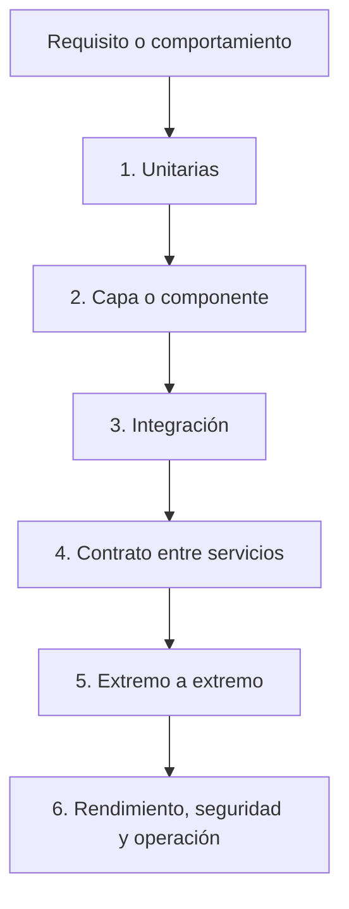
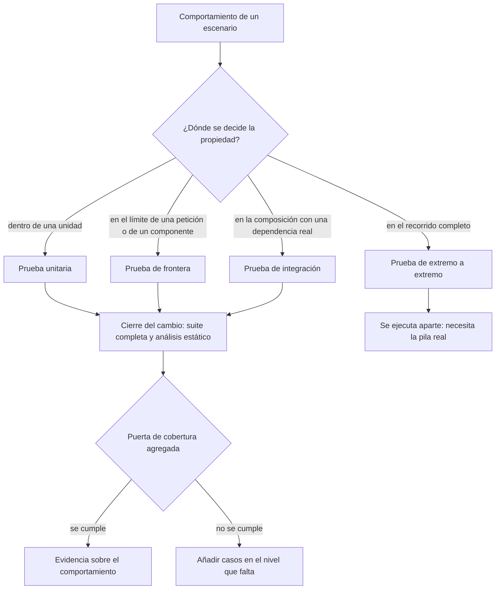
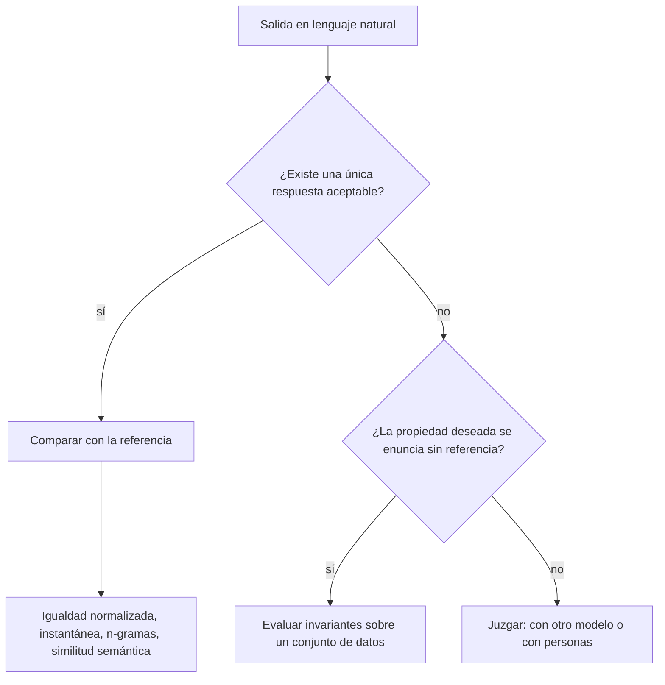

# 07 — Calidad y pruebas

Este documento explica qué significa calidad en software, cómo se construyen
casos de prueba, en qué secuencia se aplican las verificaciones y cómo se mide
la cobertura. Los ejemplos se basan en el backend Java/Spring Boot y en el
frontend Next.js de Careme.

El documento 08 explica construcción, configuración y despliegue. Aquí interesa
la evidencia que permite saber si el comportamiento implementado es confiable.

## Índice

1. [Qué es calidad](#1-qué-es-calidad)
2. [La estrategia de pruebas](#2-la-estrategia-de-pruebas)
3. [Cómo se construye un caso de prueba](#3-cómo-se-construye-un-caso-de-prueba)
4. [Tipos de pruebas y niveles](#4-tipos-de-pruebas-y-niveles)
5. [Ejemplos del backend](#5-ejemplos-del-backend)
6. [Ejemplos del frontend](#6-ejemplos-del-frontend)
7. [Cobertura de código](#7-cobertura-de-código)
8. [Otras verificaciones](#8-otras-verificaciones)
9. [Evaluación de texto generado por un modelo](#9-evaluación-de-texto-generado-por-un-modelo)

## 1. Qué es calidad

La **calidad del software** es el grado en que un sistema satisface sus
requisitos y conserva propiedades importantes bajo las condiciones para las que
fue diseñado. No es sinónimo de “tener muchas pruebas” ni de “tener un
porcentaje alto de cobertura”. Una prueba es evidencia sobre una propiedad; la
calidad resulta de combinar evidencias sobre comportamiento, estructura,
seguridad, rendimiento, mantenibilidad y operación.

Una **verificación** comprueba una propiedad del artefacto o del proceso. Una
**prueba** es una verificación ejecutable que prepara una situación, ejecuta el
sistema y compara el resultado con una expectativa. Un **test oracle** u oráculo
de prueba es la regla que permite decidir si el resultado es correcto: un valor
esperado, una excepción, un código HTTP, un cambio en la base de datos o una
propiedad que debe cumplirse.

La calidad tiene dos dimensiones relacionadas:

- **Corrección funcional:** el sistema hace lo que el contrato exige.
- **Características no funcionales:** el sistema conserva propiedades como
  seguridad, rendimiento, accesibilidad, confiabilidad y mantenibilidad.

Una cobertura del 100 % puede ejecutar todo el código y comprobar mal los
resultados. Una prueba que afirma resultados concretos puede encontrar un error
aunque solo ejecute unas pocas líneas. Por eso cobertura y corrección son
medidas diferentes.

Una prueba es evidencia sobre una **propiedad**, y la propiedad se enuncia al
margen de los casos —«una lectura no escribe», «la ausencia no se inventa»— porque
los casos cambian con la implementación y la propiedad no debería cambiar con
ellos. Ese enunciado estable es lo que permite saber después si un caso protegía
algo o solo ejecutaba código.

## 2. La estrategia de pruebas

Una **estrategia de pruebas** distribuye verificaciones por niveles para obtener
feedback rápido sin renunciar a probar las integraciones importantes. Cada nivel
intercambia velocidad, aislamiento y realismo.

### 2.1 Secuencia de aplicación

La secuencia habitual va de lo más barato y aislado a lo más realista:



1. **Pruebas unitarias:** comprueban una función, clase o regla con
   dependencias controladas. Dan feedback rápido y localizan mejor la causa.
2. **Pruebas de capa o componente:** comprueban una frontera concreta, como un
   controlador HTTP o un componente React, sin levantar todo el sistema.
3. **Pruebas de integración:** conectan varios componentes y una dependencia
   real, como PostgreSQL, para verificar mapeos, SQL, transacciones y esquema.
4. **Pruebas de contrato:** comprueban que dos participantes interpretan igual
   una API o un mensaje. Son especialmente útiles cuando los equipos se
   despliegan por separado.
5. **Pruebas end-to-end:** recorren el producto desde una interfaz o cliente
   hasta sus dependencias. Aportan realismo, pero son más lentas y sensibles.
6. **Pruebas no funcionales:** comprueban rendimiento, seguridad, accesibilidad,
   resiliencia y otras propiedades que no se reducen a una respuesta correcta.

La secuencia no significa que un nivel sustituya al anterior. Una prueba
end-to-end puede demostrar que un flujo funciona, pero no explica con precisión
si falló el formulario, la API, la consulta o la base de datos. Las pruebas
pequeñas mantienen esa localización.

### 2.2 Secuencia real del repositorio

En Careme la verificación se escalona en el mismo orden que la estrategia: primero
las pruebas que no necesitan infraestructura, después la comprobación de tipos y el
análisis estático, y al final la compilación. El backend añade una **puerta de
cobertura** que se evalúa en un paso posterior a las pruebas, de modo que pasar las
pruebas no basta; el frontend no impone umbral, pero exige que el tipado y el
linting pasen antes de compilar.

Fuera de esa cadena quedan las pruebas de extremo a extremo (§4.5) y la medición
sobre un corpus de evaluación (§4.6): ambas necesitan la pila levantada y el
asistente real, así que se ejecutan aparte y su coste no se paga en cada cambio.

El nivel no se elige por la herramienta disponible, sino por la **frontera
observable** del comportamiento: dónde puede decidirse si la propiedad se cumple.
La herramienta es la consecuencia de esa elección, no su criterio. La figura
siguiente resume el recorrido completo —de la elección del nivel al cierre del
cambio— y sitúa la puerta de cobertura dentro de él:



Cerrar un cambio no consiste en elegir una lista de casos de regresión: la
regresión es la **suite completa** de cada lado, porque solo una ejecución
completa permite atribuir un fallo a lo que acaba de cambiar y no a otra cosa.
La puerta de cobertura (§7.3), cuando existe, se evalúa después de las pruebas y
sobre el **conjunto agregado** del módulo, de modo que su resultado no puede
obtenerse ejecutando un subconjunto.

La gradación de herramientas es la que describe §4: pruebas que corren sin
infraestructura, pruebas de una frontera concreta con la petición en memoria,
pruebas de integración contra un motor real en contenedor y, en el frontend,
componentes renderizados en un DOM simulado. Esa gradación es lo que permite
atribuir un fallo a la pieza correcta.

El orden conceptual también ayuda a diagnosticar: si falla una función pura, no
conviene atribuir el problema a PostgreSQL; si pasa la lógica pero falla una
prueba de integración, la atención se desplaza al contrato entre componentes,
el esquema o la configuración.

### 2.3 Determinismo: cuándo una prueba deja de ser evidencia

Una prueba **determinista** produce el mismo veredicto sobre el mismo código. Una
prueba **intermitente** —que pasa y falla sin que nada haya cambiado— no es una
prueba con mala suerte: es una prueba que ha dejado de ser evidencia, porque su
resultado ya no permite decidir nada. Y si el proyecto no tiene verificación manual
que la respalde, el hueco no lo cubre nadie.

De ahí que el determinismo sea una **condición de validez** y no una preferencia de
estilo, y que se pague por adelantado con reglas explícitas en lugar de con intentos
de arreglo posteriores:

- **Sin red** fuera del nivel que la necesita: una prueba cuyo resultado depende de
  un servicio externo mide ese servicio, no el sistema.
- **Reloj fijo** en todo lo que razone sobre «hoy», «ayer» o una fecha relativa; la
  fecha de referencia se inyecta en lugar de leerse del sistema.
- **Sin dependencia de orden ni de paralelismo**: un caso no consume el estado que
  dejó otro ni depende de qué trabajador lo ejecutó.
- **Limpieza de lo que se crea**, incluidos los archivos escritos fuera de la base
  de datos.
- **Una precondición ausente es un fallo, no un salto**: una prueba que pasa en
  silencio cuando falta la infraestructura informa de una verificación que no ocurrió.

Los reintentos no son una estrategia de determinismo: si se usan, el recuento se
registra, y un reintento que oculta un fallo real es un fallo. La regla que se sigue
de todo esto es de tolerancia cero, y es posible porque el ciclo de trabajo no tiene
un estado «pendiente» donde aparcar un caso inestable: o el caso es fiable, o el
cambio no está terminado.

## 3. Cómo se construye un caso de prueba

Un **caso de prueba** es una especificación ejecutable de una situación concreta.
Para construirlo se parte del comportamiento observable, no de la implementación
interna.

### 3.1 De requisito a casos

Un procedimiento práctico es:

1. escribir el comportamiento esperado en términos de entrada, acción y salida;
2. identificar precondiciones y estado inicial;
3. dividir entradas en clases representativas;
4. elegir valores frontera y errores importantes;
5. definir un oráculo observable;
6. comprobar también que no ocurrió un efecto prohibido;
7. nombrar el caso con la conducta que protege.

Si el requisito dice “una medición debe tener peso positivo y como máximo una
cifra decimal”, las clases no son solo “80,1 funciona” y “0 falla”. También
interesan un valor negativo, cero, un valor con dos decimales, el límite máximo,
un campo ausente y un cuerpo ilegible.

La **partición de equivalencia** agrupa entradas que deberían comportarse igual.
El **análisis de valores frontera** prueba los bordes donde suelen cambiar las
reglas: cero frente a un valor positivo, límite permitido frente a límite
superado, o fecha de hoy frente a fecha futura.

### 3.2 Arrange, Act, Assert

El patrón **Arrange-Act-Assert (AAA)** separa preparación, acción y comprobación:

```java
@Test
void rejectsMissingPrecision() {
    // Arrange
    var normalizer = new ClinicalEventDateNormalizer();

    // Act + Assert
    assertThatThrownBy(() -> normalizer.normalize(
            null, null, "hoy", LocalDate.of(2026, 9, 13)))
        .isInstanceOf(IllegalArgumentException.class)
        .hasMessageContaining("precision");
}
```

La preparación crea solo lo necesario. La acción ejecuta una operación. El
oráculo afirma el resultado y, cuando corresponde, la excepción o la ausencia
de efectos secundarios.

Un buen caso prueba una razón principal. Si una sola prueba falla por cinco
motivos posibles, el diagnóstico se vuelve ambiguo. Es válido agrupar varios
valores cuando la propiedad común es precisamente lo que se quiere demostrar,
pero el nombre y las aserciones deben mantener una intención clara.

### 3.3 Dobles de prueba

Un **doble de prueba** sustituye una colaboración real por una versión controlada.
Los principales tipos son:

- **Stub:** devuelve datos preparados.
- **Mock:** registra interacciones y permite verificar que se llamó como se
  esperaba.
- **Fake:** implementación funcional simplificada, como el proveedor LLM falso.
- **Spy:** envuelve una implementación y observa llamadas concretas.

Un doble reduce el coste o el ruido de una dependencia, pero no prueba la
compatibilidad con esa dependencia. Por eso el mock de un repositorio no
sustituye una prueba con PostgreSQL real.

### 3.4 La independencia del oráculo

Un oráculo vale lo que vale su **independencia** de la implementación. Cuando quien
escribe el código escribe también la expectativa, el acuerdo entre ambos no demuestra
nada: si la implementación tiene una idea equivocada del comportamiento, la
expectativa tiende a compartir el mismo malentendido, y la prueba pasa. La
coincidencia es evidencia de consistencia, no de corrección.

En un equipo esa independencia aparece sola, porque quien prueba no escribió el
código. Cuando una misma persona —o un mismo agente— implementa y verifica, hay que
sustituirla por otras fuentes de contraste:

- el **requisito**, que es externo a ambos y por eso puede desmentirlos;
- el **oráculo externo al sistema**, cuando existe, como un contenido leído fuera de
  la interfaz y comparado antes y después;
- los **datos reales**, cuando el motor o el formato no admiten una interpretación
  propia.

Por eso la trazabilidad entre requisito, prueba y código no es burocracia: es lo que
ocupa el lugar de un revisor independiente.

## 4. Tipos de pruebas y niveles

Cada nivel se apoya en una herramienta distinta, y la herramienta determina qué
se ejecuta realmente:

| Nivel | Herramienta | Qué levanta y cómo opera |
| --- | --- | --- |
| Unitaria (backend) | JUnit 5 + AssertJ + Mockito | Solo la JVM: descubre los `@Test`, los ejecuta y AssertJ evalúa las aserciones; Mockito sustituye colaboraciones |
| Unitaria (frontend) | Vitest | Solo Node: ejecuta cada `it(...)` y compara con `expect`; sin DOM ni backend |
| Capa web | Spring Boot Test (`@WebMvcTest`) + MockMvc | El contexto web aislado —MVC, JSON, validación, errores— con el servicio mockeado; la petición HTTP va en memoria |
| Componente | Vitest + React Testing Library + `jsdom` + `userEvent` | Un DOM simulado en Node: renderiza el componente, consulta por rol o etiqueta y reproduce la interacción |
| Integración | Spring Boot Test + Testcontainers | Un motor PostgreSQL real en contenedor, con Flyway aplicando el esquema; acceso por JPA o JDBC |
| Extremo a extremo | Playwright | Un navegador real contra la pila levantada; afirma sobre el DOM y lee el oráculo del sistema de archivos |
| Corpus | Playwright, como cliente de la API | El mismo motor sin navegador: conduce la API y agrega un tablero |

### 4.1 Prueba unitaria

Una **prueba unitaria** aísla una unidad de comportamiento: una función, un
objeto de dominio o un servicio con colaboraciones sustituidas. Debe ser rápida,
determinista y suficientemente pequeña para señalar la causa del fallo.

Ejemplos de unidades adecuadas:

- normalizar una expresión temporal;
- rechazar una entidad inválida;
- ordenar mediciones;
- transformar una respuesta JSON en un DTO;
- decidir el mensaje de ausencia de registros.

**Herramientas y mecanismo.** En el backend, **JUnit 5** descubre y ejecuta los
métodos anotados con `@Test` sobre la JVM y **AssertJ** evalúa las aserciones,
mientras **Mockito** sustituye las colaboraciones: no se levanta ningún contexto de
Spring. En el frontend, **Vitest** ejecuta cada caso en Node y expone `expect`;
tampoco hay DOM ni backend.

```java
@Test
void acceptsAPositiveValue() {
    assertThat(metric.admits("value", new BigDecimal("80.1"))).isTrue();
}
```

Ejemplos reales: §5.1 y §6.1.

### 4.2 Prueba de capa web

Una **prueba de capa web** levanta solo la infraestructura necesaria para un
controlador. En Spring, `@WebMvcTest` configura MVC, serialización, validación y
manejo de errores, mientras el servicio se sustituye con un mock.

Comprueba el contrato HTTP: ruta, método, código de estado, JSON, validación y
respuesta de error. No demuestra que el repositorio o PostgreSQL funcionen.

**Herramientas y mecanismo.** `@WebMvcTest` levanta **solo** la capa web —MVC,
conversión JSON, Bean Validation y manejo de errores— y deja el servicio
sustituido por un mock; **MockMvc** ejecuta la petición **en memoria**, sin abrir
un socket ni arrancar el servidor, y expone el código de estado y el cuerpo para
afirmarlos.

```java
mockMvc.perform(get("/api/v1/measurements"))
    .andExpect(status().isOk())
    .andExpect(jsonPath("$.success").value(true));
```

Ejemplo real: §5.2.

### 4.3 Prueba de integración

Una **prueba de integración** conecta componentes reales. En Careme, las pruebas
con Testcontainers ejecutan PostgreSQL 17 en un contenedor, aplican Flyway y
comprueban el acceso mediante JPA o JDBC.

El objetivo no es repetir todas las pruebas unitarias, sino verificar aquello que
surge de la composición: mapeos entidad-tabla, restricciones, SQL full-text,
transacciones, migraciones y comportamiento del motor real.

**Herramientas y mecanismo.** **Testcontainers** arranca un contenedor efímero de
PostgreSQL y `@ServiceConnection` lo conecta al contexto de Spring Boot; **Flyway**
construye el esquema con las migraciones reales y la prueba accede por JPA o JDBC.
El contenedor se comparte entre los casos de la suite, así que cada prueba deja
limpio su estado antes de empezar.

```java
assertThat(measurementRepository.findAll()).hasSize(1);
```

Ejemplo real: §5.3.

### 4.4 Prueba de componente frontend

Una **prueba de componente** renderiza una parte de la interfaz en un DOM
simulado y observa lo que una persona puede ver o hacer. React Testing Library
favorece consultas por rol, etiqueta y texto porque prueban el contrato accesible
de la interfaz, no sus detalles privados.

Puede comprobar validación, estados de carga, interacción, mensajes de error,
filas de una tabla y contenido accesible de un gráfico.

**Herramientas y mecanismo.** `jsdom` implementa un DOM en JavaScript, sin
navegador; **React Testing Library** renderiza el componente dentro de él y ofrece
consultas por rol, etiqueta o texto, que describen lo que una persona percibe;
`userEvent` reproduce la secuencia real de eventos en lugar de disparar uno
aislado.

```tsx
render(<MeasurementForm />);
await user.click(screen.getByRole("button", { name: "Guardar" }));
expect(await screen.findByRole("alert")).toBeInTheDocument();
```

Ejemplo real: §6.2.

### 4.5 Prueba de extremo a extremo

Una **prueba de extremo a extremo** recorre el producto desde la interfaz hasta
sus dependencias reales. Su valor es el realismo: demuestra que el recorrido
completo funciona, no que cada pieza funcione por separado. Su coste es la
fragilidad y la lentitud, así que no sustituye a los niveles anteriores.

Este nivel necesita un **oráculo externo** al sistema: algo distinto de la
interfaz que permita decidir si el turno hizo lo que debía. En Careme el oráculo
es el propio almacenamiento, los documentos Markdown de `data/events/`, que la
ejecución lee directamente. La prueba no se conforma con contar archivos: compara
una **instantánea de contenido** —nombre y hash de cada documento— antes y
después del turno, de modo que «la historia clínica queda exactamente como
estaba» signifique que nada se añadió, se modificó ni se borró.

Las pruebas de este nivel se ejecutan con `pnpm test:e2e`, y antes de contar con
ellas hay que levantar la pila: el backend con el asistente real, PostgreSQL en
marcha y acceso directo al directorio que actúa como oráculo, que es lo que
permite leer el efecto del turno sin pasar por la interfaz.

**Herramienta y mecanismo.** **Playwright** lanza un navegador real (Chromium) y lo
conduce: navega, escribe, hace clic y espera a que la interfaz se estabilice antes
de afirmar. Los localizadores son accesibles —`getByLabel`, `getByRole`—, así que
la prueba se apoya en el mismo contrato que un lector de pantalla. El oráculo
externo se lee con `node:fs`, no a través del navegador.

```typescript
await page.getByLabel("Mensaje para el asistente").fill("¿Cuánto peso?");
await page.getByRole("button", { name: "Enviar mensaje" }).click();
await expect(turn.getByText("70.5 kg")).toBeVisible();
```

### 4.6 Medición sobre un corpus de evaluación

Una **medición sobre un corpus** no comprueba un caso: mide una propiedad sobre
un conjunto de datos preparado. En lugar de una expectativa por ejecución hay un
**corpus** —hechos ficticios y un conjunto independiente de preguntas de
prueba— y un **tablero de resultados** al final. La diferencia importa: una
prueba afirma y falla; una medición recoge y permite decidir. Por eso el corpus
sirve para fijar valores que de otro modo se eligen por intuición, como cuántas
operaciones necesita un turno real.

El oráculo es lo delicado. Aquí no se puede comparar texto, porque el asistente
redacta y dos respuestas correctas no coinciden palabra por palabra. Se miden
**invariantes**: que el estado del turno sea el declarado, que toda referencia a
un hecho corresponda a un documento que existe, que una pregunta sobre algo no
registrado no produzca ninguna afirmación y que una consulta no escriba. La
comprobación de «no invención» pide cautela aparte: una respuesta correcta a una
pregunta de ausencia **nombra** lo que no consta —«no consta ninguna alergia al
gluten»—, así que buscar por subcadena confundiría la negación con una
afirmación. La medición mira si el término aparece **fuera de una negación o de
una lista de términos buscados**.

El corpus se ejecuta con `pnpm test:e2e:corpus` y en Careme lo conduce la **API** y
no el navegador, porque lo que mide —el estado del turno y cuántas operaciones
necesitó— forma parte del contrato del backend y la interfaz no lo muestra entero.
Es el mismo motor de extremo a extremo usado como cliente de la API en lugar de
como navegador.

**Herramienta y mecanismo.** El mismo motor de Playwright, pero sin navegador:
`APIRequestContext` envía las peticiones directamente a la API y el resultado se
agrega en un tablero en lugar de afirmarse caso a caso. Sin navegador, recorrer un
conjunto grande de preguntas es mucho más barato que hacerlo con la interfaz.

Su veredicto puede quedar en rojo a propósito: cuando el corpus encuentra
un fallo real de recuperación, se archiva como hallazgo documentado en lugar de
rebajarse la expectativa para que pase.

El problema general —por qué el texto generado no se compara con un valor esperado
y qué estrategias existen para evaluarlo— se trata en §9.

## 5. Ejemplos del backend

### 5.1 Regla pura y error

`ClinicalEventDateNormalizerTest` construye el normalizador directamente y usa
una fecha de referencia fija. Prueba expresiones como `hoy`, `ayer` y “hace dos
semanas”, y afirma tanto la fecha calculada como la conservación del texto
original. Otro caso prueba que una precisión ausente lanza
`IllegalArgumentException`.

Este diseño es unitario: no necesita Spring, red ni base de datos. La fecha fija
elimina una fuente de variación temporal y hace que el caso sea reproducible.

### 5.2 Contrato HTTP con MockMvc

`MeasurementControllerTest` usa `@WebMvcTest(MeasurementController.class)`.
El servicio se sustituye con `@MockitoBean`, y la prueba ejecuta una petición
HTTP simulada:

```java
when(measurementService.findAll()).thenReturn(List.of(response));

mockMvc.perform(get("/api/v1/measurements"))
    .andExpect(status().isOk())
    .andExpect(jsonPath("$.success").value(true))
    .andExpect(jsonPath("$.data[0].date").value("2026-09-06"));
```

Otro caso envía `weightKg: 0` y afirma `400` y el código
`VALIDATION_ERROR`. Otro envía `not-json` y distingue `INVALID_REQUEST`.
Estos casos comprueban rutas distintas del contrato sin hacer una consulta real.

### 5.3 Persistencia con PostgreSQL real

`PostgresIntegrationTest` es una base para pruebas que necesitan el motor real:

```java
@ServiceConnection
static final PostgreSQLContainer<?> POSTGRES =
        new PostgreSQLContainer<>("postgres:17-alpine");

@BeforeEach
void clearMeasurements() {
    measurementJpaDao.deleteAllInBatch();
}
```

El contenedor no es un mock de PostgreSQL. Permite que Flyway construya el
esquema real y que Hibernate, SQL, restricciones y tipos se prueben contra el
motor previsto. La limpieza antes de cada prueba mantiene el aislamiento entre
casos.

### 5.4 Servicio con dependencias controladas

Una prueba de servicio puede sustituir el repositorio y el compositor LLM con
mocks para concentrarse en una decisión: por ejemplo, que una búsqueda vacía se
convierta en `no_records`, mientras un error de consulta se convierta en
`failed`. El oráculo no es “se llamó un método”, sino el resultado observable y,
cuando es relevante, que no se compuso una respuesta con hechos no recuperados.

## 6. Ejemplos del frontend

### 6.1 Funciones puras

`metrics.test.ts` prueba `sortByDateAsc`, `buildSeries`, `computeDomain` y
`formatMetricValue` con arrays pequeños. Comprueba orden, no mutación de la
entrada, series por métrica, dominios degenerados y formato decimal español:

```typescript
it("does not mutate the input while sorting", () => {
    const sorted = sortByDateAsc(measurements);

    expect(sorted.map((item) => item.date)).toEqual([
        "2026-09-06",
        "2026-09-08",
        "2026-09-10",
    ]);
    expect(measurements[0].date).toBe("2026-09-08");
});
```

Es una prueba unitaria rápida: recibe valores y devuelve valores, sin renderizar
React ni llamar a la API.

### 6.2 Componente e interacción

`MeasurementForm.test.tsx` renderiza el formulario, obtiene controles por sus
etiquetas y usa `userEvent` para simular la interacción:

```typescript
await user.type(getField("Peso"), "80,1");
await user.type(getField("Cintura abdominal"), "94,8");
await user.click(getSubmit());

await waitFor(() =>
    expect(registerMock).toHaveBeenCalledWith({
        date: todayIsoDate(),
        weightKg: 80.1,
        waistCm: 94.8,
    })
);
```

Otros casos afirman que los campos requeridos muestran errores, que un guardado
fallido conserva los valores y que el botón se desactiva mientras la promesa
está pendiente. La prueba observa la interfaz y el límite de la acción; no
necesita un navegador real ni el backend.

## 7. Cobertura de código

La **cobertura de código** mide qué partes de un programa fueron ejecutadas por
una colección de pruebas. Es una métrica estructural: indica qué se recorrió,
no si lo recorrido era correcto ni si las aserciones eran suficientes.

Para un conjunto de elementos $E$ y los elementos ejecutados $C$, una cobertura
básica puede expresarse como:

$$
\mathrm{cobertura} = \frac{|C|}{|E|} \times 100
$$

El denominador depende de la métrica: líneas, instrucciones, métodos o ramas.
Una línea ejecutada puede contener una condición cuyo camino alternativo nunca
se probó; por eso la cobertura de rama aporta información adicional.

### 7.1 Cobertura de línea

La **cobertura de línea** es la proporción de líneas ejecutables que fueron
visitadas al ejecutar las pruebas. No cuenta de la misma forma líneas vacías,
comentarios o declaraciones que la herramienta identifica como no ejecutables.

```java
String message = value == null ? "empty" : value.trim();
return message.isEmpty();
```

Una prueba que pasa por esta línea puede dar cobertura de línea aunque solo haya
usado `value == null`. La línea se ejecutó, pero el comportamiento para un valor
no nulo todavía puede estar sin comprobar.

### 7.2 Cobertura de rama

Una **rama** es un posible desenlace de una decisión del flujo de control. En
este contexto, una rama aparece en estructuras como `if/else`, `switch` y
expresiones condicionales; también puede surgir de condiciones compiladas que
la herramienta de cobertura reconoce como decisiones.

```java
if (amount > 0) {
    return "valid";      // rama verdadera
}
return "invalid";        // rama falsa
```

Para cubrir la decisión hacen falta al menos dos casos: uno con `amount > 0` y
otro con `amount <= 0`. En un `switch`, cada alternativa relevante es un
camino que las pruebas deben visitar. En una expresión booleana compuesta, el
instrumentador y el lenguaje determinan qué decisiones se cuentan; la regla
práctica es diseñar casos para cada resultado observable de la condición.

La cobertura de rama es más estricta que la de línea, pero tampoco demuestra que
los valores devueltos sean correctos. Una prueba podría visitar ambas ramas y
hacer aserciones débiles o ninguna.

### 7.3 JaCoCo y el umbral del backend

JaCoCo instrumenta las clases Java durante la ejecución de las pruebas, registra
qué instrucciones y decisiones fueron visitadas y genera un informe. En este
proyecto, el plugin se ejecuta en la fase `verify` y exige como mínimo:

- 85 % de cobertura de líneas;
- 85 % de cobertura de ramas;
- sobre el conjunto del bundle del backend.

Por eso `mvn test` ejecuta pruebas, pero `mvn verify` añade el informe y aplica
la puerta de cobertura. Si el porcentaje queda por debajo del mínimo, `verify`
falla. El umbral evita que el código nuevo acumule caminos sin ejecutar, pero no
reemplaza el diseño de buenos oráculos.

### 7.4 Cómo se consigue cobertura útil

Conseguir cobertura no consiste en añadir casos arbitrarios hasta subir un
número. El proceso útil es:

1. medir el informe actual;
2. localizar líneas y ramas no visitadas;
3. identificar el comportamiento que representa cada camino;
4. crear un caso con una entrada significativa y un oráculo concreto;
5. volver a medir y revisar si la prueba protege una regla o solo ejecuta código.

Para una función con validación, suelen ser necesarios el valor válido, cada
límite relevante y los errores que cambian el resultado. Para un servicio con
colaboradores, suelen ser necesarios éxito, ausencia, excepción y efectos que
deben evitarse. Para una interfaz, suelen ser necesarios estado inicial,
interacción válida, error y operación pendiente.

## 8. Otras verificaciones

Las pruebas descritas no agotan la ingeniería de calidad. Según el riesgo del
sistema, también pueden usarse:

| Tipo | Propósito |
| --- | --- |
| Contrato | Detectar incompatibilidades entre productor y consumidor de una API |
| End-to-end | Comprobar un recorrido completo con interfaz, servicios y datos |
| Smoke | Confirmar rápidamente que una versión arranca y ejecuta un camino básico |
| Regresión | Evitar que un comportamiento corregido vuelva a romperse |
| Exploratoria | Encontrar comportamientos inesperados mediante investigación guiada |
| Propiedad | Verificar reglas generales sobre muchos datos generados |
| Mutación | Comprobar si las pruebas detectan pequeños cambios deliberados en el código |
| Carga | Medir latencia y capacidad bajo volumen concurrente |
| Estrés | Observar el comportamiento al superar los límites previstos |
| Seguridad | Buscar fallos de autenticación, autorización, entradas y exposición de datos |
| Accesibilidad | Comprobar navegación, semántica, foco y uso con tecnologías de asistencia |
| Visual | Detectar cambios no deseados en la apariencia renderizada |
| Resiliencia | Comprobar recuperación frente a fallos de red, procesos o dependencias |
| Compatibilidad | Verificar navegadores, sistemas, versiones de API o motores soportados |

### 8.1 Verificación estática: linting y tipado

No toda verificación ejecuta el programa. Hay dos que analizan el **código fuente**
y detectan defectos sin llegar a correrlo:

- El **linting** es un análisis estático de reglas. Un *linter* comprueba un
  conjunto de convenciones y patrones —código o variables sin usar, dependencias
  innecesarias, usos propensos a error, reglas de estilo— y señala lo que las
  incumple. No juzga si el comportamiento es correcto: juzga si el código respeta
  lo acordado. Su valor está en volver explícito lo que de otro modo queda al
  criterio de cada persona, y en atrapar errores triviales antes de la revisión.
- El **tipado estático** (*typechecking*) comprueba que los valores y las
  operaciones se usan según los tipos declarados. El compilador de TypeScript, por
  ejemplo, verifica esas relaciones antes de ejecutar nada y detecta un campo mal
  escrito o un argumento de tipo equivocado. No sustituye a la validación en
  tiempo de ejecución: los datos que llegan por HTTP siguen necesitando un
  validador, porque el tipo describe el código, no lo que un tercero envía.

Ambos comparten una propiedad: son **baratos y locales**. No necesitan
infraestructura, señalan la línea exacta y pueden ejecutarse en cada cambio. Y
comparten un límite: ven lo que el código **declara**, no lo que ocurre al
ejecutarlo. Por eso se sitúan antes que las pruebas en la cadena de verificación,
como un primer filtro que evita gastar una ejecución en un error de forma.

En Careme, el frontend ejecuta `pnpm typecheck` (TypeScript) y `pnpm lint`
(ESLint) antes de construir: el orden es `test -> typecheck -> lint -> build`
(§2.2). El backend no tiene un linter aparte: su verificación estática la ejerce
el compilador de Java y el modo `validate` de Hibernate, que rechaza al arrancar
un modelo de persistencia que no coincida con el esquema migrado.

### 8.2 Otras verificaciones no funcionales

No todas las categorías de la tabla tienen que ejecutarse en cada cambio: su
selección depende del riesgo, la frecuencia de cambio, el coste de ejecución y la
propiedad que se necesita evidenciar. En Careme, la suite existente prioriza
reglas de dominio, contratos HTTP, componentes de interfaz, integración con
PostgreSQL, cobertura del backend, la verificación estática del frontend (§8.1) y
el recorrido de extremo a extremo con la medición sobre un corpus de evaluación
(§4.5 y §4.6); las demás categorías sirven como contexto para ampliar la
estrategia cuando el producto o su operación lo requieran.

### 8.3 Las omisiones deliberadas

Elegir qué no se verifica es una decisión de ingeniería, no un descuido, y como toda
decisión se **registra con su consecuencia**: qué propiedad queda sin proteger y qué
se acepta a cambio. Una omisión escrita es una decisión que puede revisarse cuando
cambie el riesgo; una omisión silenciosa es indistinguible de un olvido, y quien lee
asume una cobertura que no existe.

Por eso conviene no confundir una cobertura baja con una deuda: un hueco declarado
entra en el mapa de riesgos y un hueco callado entra en producción.

Eso tiene una consecuencia sobre quién decide. Aceptar un riesgo nuevo, rebajar una
puerta o recortar el alcance de una comprobación no lo puede aprobar quien necesita
la excepción para avanzar, porque no hay contrapeso: lo aprueba otra persona. Y una
excepción no es un aplazamiento: o se aplica ahora, con su consecuencia anotada, o el
trabajo no se cierra.

## 9. Evaluación de texto generado por un modelo

Las secciones anteriores suponen un **valor esperado**: un resultado, una
excepción, un código de estado. Cuando la salida del sistema es una frase
redactada por un modelo de lenguaje, esa suposición se rompe, y el problema no es
de herramienta sino de **oráculo**: no existe *la* respuesta correcta, existen
respuestas sostenidas por la evidencia y respuestas que no lo están.

Tres causas lo producen:

1. **Multiplicidad.** Una misma pregunta admite muchas respuestas correctas que no
   comparten palabras, así que ninguna de ellas puede ser el valor esperado.
2. **No determinismo.** El mismo mensaje produce salidas distintas entre
   ejecuciones, y la variación depende del muestreo y de la versión del modelo.
   Fijar la semilla o la temperatura reduce la varianza, no la elimina, y la
   reduce a costa de la variedad que el sistema necesita.
3. **Deriva del proveedor.** Cambiar la versión del modelo invalida una línea base
   medida con la anterior sin que ningún requisito haya cambiado.

La consecuencia práctica es un desplazamiento del oráculo: de «el texto es este»
a «el texto cumple esto».

### 9.1 La decisión previa: ¿existe una referencia?



La rama de la izquierda mide **parecido**; la del centro, **cumplimiento**; la de
la derecha, **calidad percibida**. Confundirlas es el error más común: un sistema
puede dar una respuesta correcta y suspender una comparación de palabras, o dar
una respuesta bien redactada y falsa que una métrica de parecido aprueba.

### 9.2 Estrategias que comparan con una referencia

| Estrategia | Qué mide | Qué exige | Límite |
| --- | --- | --- | --- |
| Igualdad normalizada | Si la salida coincide con la esperada tras normalizar mayúsculas, espacios y acentos | Una única salida aceptable | Solo sirve para tareas cerradas: clasificar, extraer, rellenar un campo |
| Instantánea (*golden*) | Si la salida **cambió** respecto de la guardada | Almacenar salidas y revisar cada diferencia | Detecta cambios, no corrección; el ruido del modelo y la deriva del proveedor obligan a re-aprobar |
| Métricas de n-gramas (BLEU, ROUGE, chrF) | Solapamiento de palabras o de caracteres con el texto de referencia | Uno o varios textos de referencia | Correlaciona poco con el juicio humano en texto abierto; penaliza paráfrasis correctas |
| Similitud semántica | Cercanía de significado mediante incrustaciones vectoriales | Referencia y un umbral | El umbral es un supuesto, y la referencia sigue siendo una entre muchas respuestas válidas |

### 9.3 Estrategias que no necesitan referencia

| Estrategia | Qué mide | Límite |
| --- | --- | --- |
| Contrato estructurado | Que la salida encaje en un esquema y que sus campos sean aceptables | Hay que diseñar el esquema; no dice nada del texto que no cabe en él |
| Invariantes de la respuesta | Propiedades que deben cumplirse siempre: cada referencia existe, ninguna afirmación carece de respaldo, el formato se respeta | Solo cubre lo que se sabe enunciar; lo inesperado sigue sin detectarse |
| Métricas del sistema de recuperación | Si lo recuperado era pertinente y si la respuesta se apoya en ello | Miden el sistema, no la redacción |
| Suites adversarias | Si el sistema se mantiene en su cometido ante inyección de instrucciones, peticiones fuera de dominio o intentos de obtener lo prohibido | Hay que mantener el conjunto de ataques, y envejece |
| Juicio con modelo | Calidad según una rúbrica aplicada por otro modelo | Aporta sesgos propios —prefiere respuestas largas, se prefiere a sí mismo, depende del orden— y no es determinista: es medición, no puerta |
| Evaluación humana | Calidad según personas, con rúbrica y acuerdo entre evaluadores | Es el patrón de referencia y no escala: cara, lenta y con variación entre evaluadores |

### 9.4 Cuando la propiedad debe ser fiable, se constriñe el sistema

Hay comportamientos que no admiten una tasa de acierto: no dar un diagnóstico, no
recomendar un tratamiento, no inventar un valor. Probabilizar su cumplimiento y
medirlo no es una garantía, y la observación de que el comportamiento se cumple en
una muestra no autoriza a prometerlo. La salida robusta es **quitarle la decisión al
modelo**: comprobarla después, restringir lo que puede devolver, o mover la frase a
la aplicación, que sí es determinista. Entonces lo que se prueba es la guarda, y
una guarda se prueba como cualquier otra regla.

En Careme ese camino está **reservado, no recorrido**: la negativa ante una
petición de recomendación depende hoy de la redacción del prompt, se ha medido con
una sola muestra, y la respuesta prevista ante una regresión es precisamente una
guarda determinista en la aplicación.

### 9.5 Qué se aplica en Careme y qué no

| Estrategia | Estado | Por qué |
| --- | --- | --- |
| Contrato estructurado | En uso | La respuesta se pide con una forma fija —incluido el veredicto de cuánto de la pregunta queda cubierto— y se afirma el contrato, no la redacción |
| Invariantes sobre un conjunto de datos | En uso | La pregunta que importa —¿está sostenida la respuesta?— se enuncia sin referencia; es la medición sobre un corpus de §4.6 |
| Transporte fingido | En uso | Permite afirmar el adaptador del proveedor con la misma entrada y la misma salida en cada ejecución, sin depender del modelo |
| Guarda determinista | Reservada | Es la salida prevista si una negativa deja de cumplirse; no es una medida actual |
| Igualdad, instantánea, n-gramas, similitud semántica | No aplican | No existe una respuesta ideal: el asistente redacta, y dos respuestas correctas no comparten palabras |
| Juicio con modelo y evaluación humana | No aplican | No hay evaluación humana en este proyecto, y un juez modelo añadiría su propio no determinismo sin aportar independencia: quien escribe la implementación escribe también su oráculo |
| Comparación en producción | No aplica | No hay tráfico instrumentado con el que comparar variantes |
| Repetición para estimar varianza | No aplica hoy | Una sola ejecución basta para registrar un hallazgo y no para sostener una garantía, y así se anota cuando se mide |

La lección que más se generaliza de esta sección es la última: **en un dominio donde
inventar es la falla grave, no se evalúa el parecido con una respuesta ideal sino la
relación de la respuesta con su evidencia.** Esa relación sí se puede enunciar como
invariante, y por eso sí se puede automatizar.
