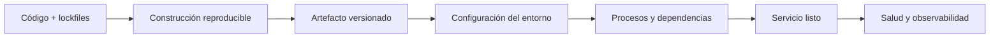
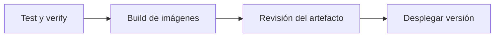
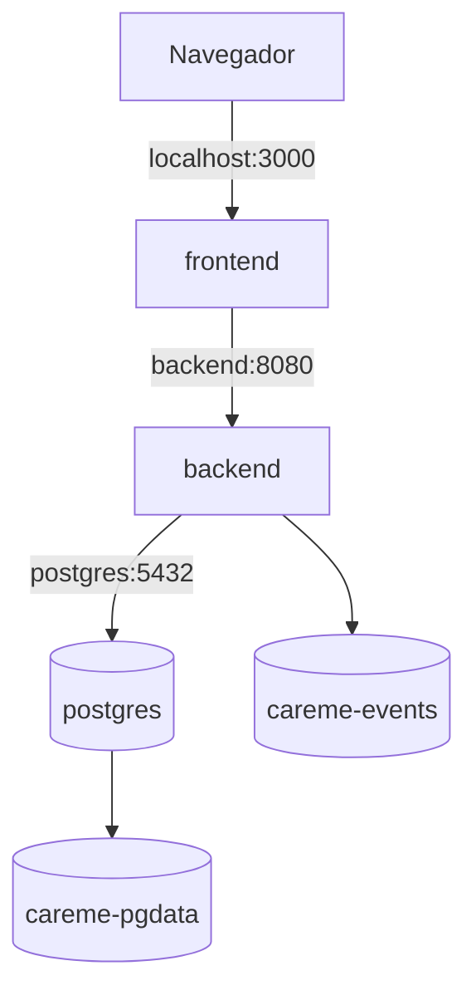
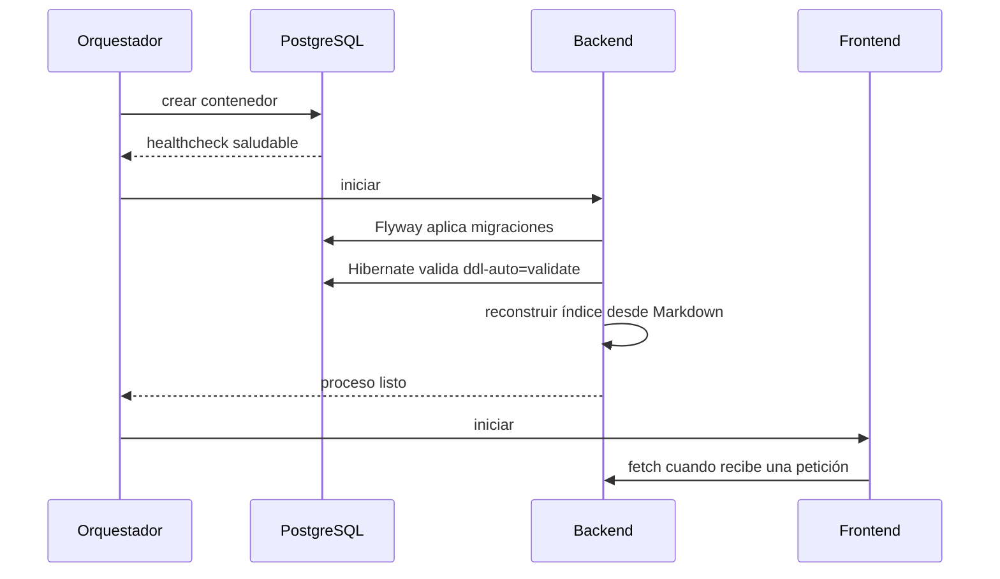

# 08 — Despliegue y operación

Este documento explica cómo una aplicación pasa del código a un servicio
accesible y operable. Presenta artefactos, imágenes de contenedor, configuración,
redes, volúmenes, migraciones, arranque, salud, seguridad, observabilidad y
continuidad de datos, con ejemplos basados en el despliegue de Careme.

El documento 07 explica cómo se verifica la calidad del código. Aquí se explica
cómo ejecutar esa versión validada en un entorno reproducible y cómo mantener
sus datos y dependencias durante el ciclo de vida del servicio.

## Índice

1. [Qué es un despliegue](#1-qué-es-un-despliegue)
2. [Del código al artefacto](#2-del-código-al-artefacto)
3. [Contenedores e imágenes](#3-contenedores-e-imágenes)
4. [Orquestación con Compose](#4-orquestación-con-compose)
5. [Configuración y secretos](#5-configuración-y-secretos)
6. [Arranque, migraciones y salud](#6-arranque-migraciones-y-salud)
7. [Persistencia y continuidad de datos](#7-persistencia-y-continuidad-de-datos)
8. [Seguridad y operación](#8-seguridad-y-operación)
9. [Estrategias de despliegue](#9-estrategias-de-despliegue)
10. [Criterios de una entrega desplegable](#10-criterios-de-una-entrega-desplegable)

## 1. Qué es un despliegue

Un **despliegue** es el proceso de poner una versión de software en un entorno
capaz de recibir tráfico, conectarla con sus dependencias y comprobar que está
lista para operar. No es simplemente copiar archivos: incluye construir un
artefacto, resolver configuración, inicializar datos, exponer puertos, definir
persistencia y observar el estado del servicio.

Un **entorno** es la combinación de infraestructura, configuración, datos y
políticas en la que se ejecuta una versión. Desarrollo, pruebas, preproducción y
producción pueden usar el mismo artefacto con valores diferentes.

Una **versión** identifica el código y las dependencias que se entregan. Un
**artefacto** es el resultado distribuible de una construcción, como un JAR, una
salida autónoma de Next.js o una imagen de contenedor. Un **release** es una
versión seleccionada y preparada para ser desplegada; puede contener uno o
varios artefactos.



El despliegue de Careme ejecuta tres servicios: PostgreSQL, backend Spring Boot
y frontend Next.js. El backend y el frontend se construyen como imágenes
multietapa; PostgreSQL utiliza la imagen oficial y conserva su directorio de
datos en un volumen.

## 2. Del código al artefacto

Una **construcción reproducible** produce el mismo resultado lógico a partir de
las mismas entradas: código, versión del compilador, dependencias y archivos de
bloqueo. La reproducibilidad reduce diferencias entre el ordenador de desarrollo
y el entorno donde se ejecuta el servicio.

El flujo de Careme es:

```text
1. resolver dependencias con Maven o pnpm
2. compilar backend y frontend
3. ejecutar las verificaciones del documento 07
4. empaquetar JAR y salida autónoma de Next.js
5. construir imágenes de runtime
6. arrancar servicios y dependencias
7. aplicar migraciones y validar el esquema
8. comprobar salud y flujo principal
```

Un build de imagen no debe ser la única prueba de calidad. El Dockerfile del
backend empaqueta con `-DskipTests`, por lo que las pruebas y `verify` deben
haberse ejecutado antes de construir la imagen que se promociona. En un pipeline,
la secuencia suele ser explícita:



El **promocionar** una versión significa mover el mismo artefacto entre entornos,
no recompilarlo con cambios ocultos de dependencias. La configuración se inyecta
en cada entorno durante la ejecución.

## 3. Contenedores e imágenes

Un **contenedor** es un proceso aislado que comparte el kernel del sistema
anfitrión. Una **imagen** es una plantilla inmutable de capas que contiene el
sistema de archivos, el runtime y el punto de entrada necesarios para iniciar
ese proceso.

La imagen no debe confundirse con una máquina virtual: una VM incluye un sistema
operativo invitado completo; un contenedor normalmente comparte el kernel y
arranca con menos coste. El aislamiento de contenedores organiza procesos, pero
no elimina la necesidad de seguridad, límites y actualizaciones.

### 3.1 Construcción multietapa

Una **construcción multietapa** usa una etapa con herramientas de compilación y
otra con solo lo necesario para ejecutar:

```dockerfile
FROM maven:3.9-eclipse-temurin-21 AS build
WORKDIR /workspace
COPY pom.xml .
RUN mvn -B -q dependency:go-offline
COPY src ./src
RUN mvn -B -q clean package -DskipTests

FROM eclipse-temurin:21-jre-alpine
WORKDIR /app
COPY --from=build /workspace/target/*.jar app.jar
USER careme
ENTRYPOINT ["java", "-jar", "/app/app.jar"]
```

La primera etapa contiene Maven y JDK. La segunda usa un JRE y no conserva el
código fuente ni las herramientas de compilación. Esto reduce superficie,
tamaño y número de componentes en runtime.

El frontend sigue el mismo principio: instala dependencias con
`pnpm install --frozen-lockfile`, compila Next.js y ejecuta la salida
`standalone` con Node 22 bajo el usuario `node`.

### 3.2 Usuario, proceso y puerto

Una imagen de runtime debe ejecutar el proceso con el menor privilegio necesario.
El backend crea el usuario `careme`, prepara `/app/data/events` y cambia a ese
usuario antes del `ENTRYPOINT`. El frontend usa el usuario no privilegiado
`node`.

`EXPOSE` documenta el puerto de la imagen; no publica por sí solo el puerto al
exterior. Compose realiza el mapeo `8080:8080` para el backend y `3000:3000`
para el frontend.

## 4. Orquestación con Compose

La **orquestación** coordina varios procesos: redes, variables, volúmenes,
orden de arranque, reinicios y exposición de puertos. Docker Compose y Podman
Compose describen esa coordinación en YAML.

En el entorno local de Careme, Compose crea una red común y permite que los
servicios se encuentren por nombre:



Dentro de la red, `backend` y `postgres` son nombres de servicio. El frontend
usa `API_BASE_URL=http://backend:8080` porque sus fetches server-side se
originan dentro de la red Compose; el navegador solo accede al frontend.

### 4.1 Dependencias y orden

`depends_on` expresa una dependencia de arranque, pero iniciar un proceso no
significa que el servicio esté listo. Careme añade un `healthcheck` a PostgreSQL
con `pg_isready` y hace que el backend espere la condición `service_healthy`.

El frontend depende del backend para sus peticiones, pero su proceso puede
arrancar antes de que una petición concreta sea atendida. La disponibilidad real
se comprueba al realizar la operación, no solo al crear el contenedor.

### 4.2 Red, puertos y aislamiento

Un **puerto publicado** conecta un puerto del anfitrión con uno del contenedor.
Un servicio que solo debe ser usado por otros servicios puede mantenerse en la
red interna sin publicarse. Publicar PostgreSQL en `5432` es práctico para el
desarrollo local; en un entorno protegido, la base puede quedar accesible solo
desde el backend.

## 5. Configuración y secretos

La **configuración** son valores que cambian entre entornos sin cambiar el
artefacto: URLs, puertos, límites, modo LLM o directorios. Un **secreto** es una
configuración cuyo valor debe mantenerse confidencial: una contraseña, una clave
API o un certificado privado.

La configuración externa sigue el principio de separación entre código y
entorno:

```text
Imagen inmutable + variables del entorno = instancia configurada
```

Careme usa variables como:

| Variable | Función | Valor o regla |
| --- | --- | --- |
| `SPRING_DATASOURCE_URL` | Conexión backend → PostgreSQL | URL interna de Compose |
| `CAREME_EVENTS_DIRECTORY` | Ubicación de la fuente Markdown | `/app/data/events` en contenedor |
| `CAREME_LLM_MODE` | Modo `fake` u `openai` | `openai` por defecto (asistente real); `fake` es el modo de pruebas |
| `CAREME_LLM_API_KEY` | Credencial del proveedor | Solo backend, nunca frontend |
| `API_BASE_URL` | URL que usa el frontend server-side | `http://backend:8080` en Compose |

Los valores por defecto sirven para desarrollo local, pero una producción debe
revisar explícitamente credenciales, contraseñas, origen permitido, URLs y
políticas de retención. Nunca se debe hornear un secreto en una imagen ni
publicarlo en un archivo versionado.

La configuración también necesita validación. Una variable ausente puede causar
un fallo temprano y claro; una variable presente pero apuntando a la base
incorrecta puede producir un fallo más peligroso, porque el proceso parece
saludable mientras opera sobre datos equivocados.

## 6. Arranque, migraciones y salud

El **arranque** es la transición de un proceso creado a un servicio listo para
recibir tráfico. Una aplicación puede estar viva y todavía no estar lista: puede
seguir conectando la base, aplicando migraciones o reconstruyendo un índice.



### 6.1 Migraciones y compatibilidad

Una **migración** es un cambio versionado del esquema. Flyway aplica las
migraciones pendientes en orden y registra las ejecutadas. Hibernate usa
`ddl-auto: validate`, por lo que valida que las entidades coincidan con el
esquema, pero no modifica la base automáticamente.

El principio importante es que el esquema tiene un propietario explícito. Una
migración nueva debe ser compatible con la versión de aplicación que la necesita
y con la estrategia de actualización elegida. En sistemas con versiones
simultáneas suele usarse el patrón expand-and-contract: primero se añade una
forma compatible, luego se migra el uso y finalmente se elimina lo antiguo.

Careme aplica ese patrón dentro de un mismo despliegue cuando cambia la **forma** de
un dato: `V5__create_metric_measurements.sql` **expande** creando las tablas del
modelo nuevo, **migra** copiando las filas de la tabla antigua y **contrata**
retirándola. La copia de las filas es la parte crítica, porque eliminar la
estructura antigua es irreversible: el retorno se apoya en la copia de seguridad
previa a la migración, no en una migración inversa. Y la comprobación de que el
dato sobrevivió —que el seguimiento conserva los valores que ya existían— es tan
necesaria como la migración misma.

### 6.2 Healthcheck, readiness y liveness

Un **healthcheck** ejecuta una comprobación automática. La **liveness** responde a
“¿el proceso sigue vivo?”; la **readiness** responde a “¿puede recibir tráfico
ahora?”. Un proceso puede tener liveness correcta y readiness incorrecta si la
base no está disponible.

Compose usa el healthcheck de PostgreSQL para ordenar el arranque. En plataformas
más completas, el backend podría exponer endpoints separados de liveness y
readiness, y el orquestador retiraría una instancia no preparada del tráfico.

La **reconstrucción de los índices derivados** también es parte del arranque
lógico: los documentos Markdown son la fuente de verdad y `clinical_event_index`
y `encounter_index` pueden recrearse. Un despliegue correcto no trata esos
índices como datos irremplazables. Antes de reindexar, el arranque **cierra las
consultas que quedaron abiertas** por una interrupción, registrando lo
determinista que hubieran recogido: sin ese paso, una consulta quedaría abierta
fuera de la conversación que la originó.

## 7. Persistencia y continuidad de datos

Un contenedor es reemplazable; sus datos no necesariamente deben serlo. Un
**volumen** es almacenamiento gestionado fuera del ciclo de vida del contenedor.

Careme declara dos volúmenes:

| Volumen | Montaje | Contenido | Consecuencia |
| --- | --- | --- | --- |
| `careme-pgdata` | `/var/lib/postgresql/data` | Datos PostgreSQL | Conserva mediciones y estado del motor |
| `careme-events` | `/app/data` | Documentos Markdown: hechos y consultas | Conserva las fuentes de verdad clínicas |

Los índices son derivados y pueden reconstruirse desde `careme-events`. Los
documentos, en cambio, deben sobrevivir a la recreación del backend. El usuario
del proceso debe tener permisos de escritura sobre el volumen montado.

### 7.1 Backup y restauración

Un **backup** es una copia recuperable de datos; una reconstrucción no siempre es
un backup. El índice se puede regenerar, pero la restauración de PostgreSQL y de
los documentos requiere una política de copia, retención y prueba de restauración.

Dos objetivos habituales son:

- **RPO** (*Recovery Point Objective*): cuánta información se acepta perder;
- **RTO** (*Recovery Time Objective*): cuánto tiempo se acepta tardar en volver a
  operar.

Para Careme, la continuidad clínica exige proteger especialmente los Markdown y
verificar que PostgreSQL pueda restaurarse o volver a indexarse. La existencia
de un volumen no equivale por sí sola a una copia de seguridad: un volumen
puede fallar, corromperse o eliminarse junto con sus recursos asociados.

## 8. Seguridad y operación

Desplegar de forma segura implica reducir privilegios, controlar exposición y
hacer observables los fallos:

- ejecutar procesos como usuarios no root;
- mantener secretos fuera de imágenes y repositorios;
- publicar solo los puertos necesarios;
- restringir CORS a orígenes conocidos;
- usar imágenes base actualizadas y revisar dependencias;
- cifrar conexiones cuando el entorno lo requiera;
- registrar estados y errores sin exponer contenido clínico ni credenciales;
- definir quién puede leer volúmenes y ejecutar migraciones.

La **observabilidad** combina tres señales:

| Señal | Pregunta |
| --- | --- |
| Logs | ¿Qué ocurrió y con qué contexto? |
| Métricas | ¿Cuánto tráfico, latencia, error o recurso se observa? |
| Trazas | ¿Por qué componentes pasó una operación distribuida? |

Careme registra identificadores de conversación y mensaje para correlación, pero
no debe registrar el contenido clínico, prompts, respuestas del proveedor ni
claves API en los logs normales. En despliegues más grandes, las métricas y
trazas pueden centralizarse en una plataforma de observabilidad.

### 8.1 Fallos y recuperación

Un despliegue debe definir qué ocurre si:

- PostgreSQL todavía no está listo;
- una migración falla;
- el volumen no es escribible;
- el backend pierde acceso a la base;
- la reconstrucción del índice no termina;
- una imagen arranca pero no puede atender peticiones.

Fallar temprano evita servir una instancia mal configurada. Reiniciar
automáticamente puede recuperar un proceso transitorio, pero no debe ocultar una
migración incompatible ni repetir una operación no idempotente sin control.

Un **rollback** vuelve a una versión anterior. Las migraciones complican el
rollback: volver atrás el código no siempre permite volver atrás el esquema. Por
eso los cambios destructivos de base de datos suelen separarse en etapas
compatibles y requieren un plan de restauración.

## 9. Estrategias de despliegue

El patrón multietapa de las imágenes describe la construcción, no es la única
estrategia de liberar versiones:

| Estrategia | Funcionamiento | Ventaja principal |
| --- | --- | --- |
| Recreación | Detener versión anterior e iniciar la nueva | Simple, pero produce interrupción |
| Rolling update | Sustituir instancias gradualmente | Reduce interrupción con varias instancias |
| Blue-green | Mantener dos entornos y cambiar tráfico | Rollback rápido mediante cambio de destino |
| Canary | Enviar una fracción del tráfico a la nueva versión | Reduce el impacto de una versión defectuosa |
| Immutable release | Promover el mismo artefacto sin modificarlo | Reproducibilidad y trazabilidad |
| Serverless | Ejecutar unidades bajo demanda | Escala operativa distinta, con límites de arranque |

Careme usa Compose para el entorno local y una topología de tres servicios. Las
otras estrategias sirven como contexto para sistemas con varias instancias,
tráfico gestionado o requisitos de disponibilidad diferentes.

## 10. Criterios de una entrega desplegable

Una entrega es desplegable cuando existe evidencia suficiente de que:

1. el código pasó las verificaciones de calidad relevantes;
2. el artefacto se construye con versiones y dependencias reproducibles;
3. la imagen contiene solo el runtime necesario y usa un usuario no privilegiado;
4. las variables y secretos del entorno están definidos y validados;
5. las dependencias arrancan en el orden correcto y tienen comprobaciones de salud;
6. las migraciones son compatibles con la versión que se despliega;
7. los volúmenes y permisos protegen las fuentes de verdad;
8. existe una estrategia de backup, restauración y rollback adecuada al riesgo;
9. logs, métricas o comprobaciones operativas permiten detectar fallos;
10. se verifica el flujo principal después del arranque.

El objetivo no es que todos los entornos sean idénticos. Es que las diferencias
sean deliberadas, configurables y observables, mientras el artefacto de la
aplicación permanece trazable.
