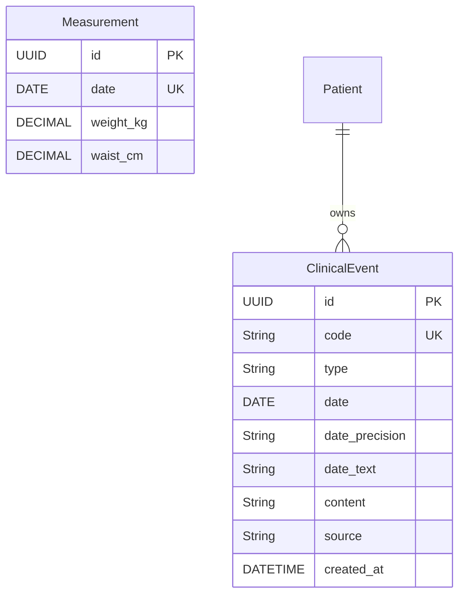

# Data model — Careme

This document describes the Careme data model: every entity with its fields,
validation rules and relationships, plus an entity-relationship diagram.

The document distinguishes two states:

- **Implemented**: what exists today in the code and in the database.
- **Proposed**: the model defined in the documentation
  (`docs/roadmap/mvp_alcance_asistente_historia_clinica.md`) that does not exist
  in the code yet.

Body tracking (`Measurement`), clinical-event registration (`ClinicalEvent`,
UC-004) and the history query through the derived index (UC-007) are implemented
today; `Patient` remains implicit.

---

## 1. Implemented model

The implemented model covers body tracking (UC-001, UC-002 and UC-003),
clinical-event registration (UC-004) and the history query through lexical
retrieval from the derived index (UC-007).

### 1.1 Measurement

Represents a body measurement recorded on a specific day. It is the persisted
entity of body tracking; it coexists with the assistant's derived table
`clinical_event_index` (see §2).

**Fields:**

- `id`: Unique identifier of the measurement (Primary Key, UUID)
- `date`: Day of the measurement (required, unique)
- `weightKg`: Weight in kilograms (required, positive)
- `waistCm`: Abdominal circumference in centimetres (required, positive)

**Validation rules:**

- The date is a calendar day, without time, and cannot be in the future.
- At most one measurement per day is allowed; the date is unique.
- Both values are required and must be strictly positive.
- Both values are expressed with a single decimal (`NUMERIC(5, 2)`).
- Weight cannot exceed 500 kg and abdominal circumference cannot exceed 400 cm.
- Registering a day that already has a measurement replaces its values; it does
  not duplicate it.

**Database constraints:**

- `uq_measurements_date`: unique on `date`.
- `ck_measurements_weight_kg_positive`: `weight_kg > 0`.
- `ck_measurements_waist_cm_positive`: `waist_cm > 0`.

**Relationships:** none. It is an independent entity; there is no user or owner
in the current model.

### 1.2 MeasurementDraft

Represents a measurement that has no database identity yet. It is used when
several measurements are written at once, as in the file import.

**Fields:**

- `date`: Day of the measurement
- `weightKg`: Weight in kilograms
- `waistCm`: Abdominal circumference in centimetres

**Validation rules:** the same as `Measurement` (date present and positive
values), but without `id`.

**Relationships:** none. It is not persisted on its own; it becomes a
`Measurement` when it is stored.

### 1.3 API models

They are not persisted; they describe the HTTP contract.

- **MeasurementRequest**: `date`, `weightKg`, `waistCm`. Applies the registration
  form rules (date not in the future, positive values, one decimal, limits of
  500 kg and 400 cm).
- **MeasurementResponse**: `id`, `date`, `weightKg`, `waistCm`. Representation
  returned to the client.
- **ImportPreviewRow**: `date`, `weightKg`, `waistCm`, `replacesExisting`.
  A measurement read from a file and what would happen if it were loaded.
- **ImportPreviewResponse**: `rows`, `totalRows`, `newCount`, `replacedCount`,
  `ignoredCount`. What the load would do, without running it.
- **ImportResultResponse**: `createdCount`, `replacedCount`, `ignoredCount`,
  `totalRows`. Result of the load.
- **ApiResponse**: `success`, `data`, `messageCode`, `message`. The common
  envelope of every response.
- **ChatMessageRequest**: `message` (max. 4000 characters), `conversationId`
  (optional), `messageId`. Message sent to the chat.
- **ChatMessageResponse**: `conversationId`, `messageId`, `status`
  (`registered`, `answered`, `no_records`, `clarification_required`,
  `general_conversation`, `duplicate`, `failed`), `message` and `events`. In an
  `answered` response, `events` holds the facts that support it; in `no_records`
  it holds no facts and, instead, the response reports the reason for the absence
  (`absenceReason`: `empty_history`, `no_events_of_type`,
  `no_events_in_period` or `no_term_match`) and the actions offered
  (`suggestedActions`: `reformulate`, `register`). When the message mixes a
  general part with another part that depends on the history, `generalReply`
  carries the conversational part, apart from the clinical result. The three
  fields are optional and additive.
- **ClinicalEventIntent**: the structured contract between the chat and
  registration or the query; `kind` (`events`, `query`, `clarification`,
  `conversation`), with search criteria and the general part of the message in the
  query, `events` and `clarification`. It is what the LLM adapter produces and the
  domain validates.

**Import file format:** required columns `date`, `weight_kg` and
`abdominal_circumference_cm`, with a header. Default limit of 10000 rows.

### 1.4 Cross-cutting import rules

- Every file is validated completely before anything is written (all-or-nothing
  load).
- Rows with a repeated date are deduplicated: the last one replaces the previous
  one.
- A row without a date is an error; a row with a date but no value at all is
  ignored.
- Errors are reported as `line|field|reason`, not as user-facing sentences.

---

## 2. Clinical history assistant model (implemented)

The model defined for the MVP of the personal clinical history assistant. The
registration of clinical facts (`ClinicalEvent`) is implemented by UC-004 and the
history query by UC-007; editing and deletion are still proposed.

### 2.1 Patient

Represents the owner of the clinical history. The MVP has a single history, the
user's own, so `Patient` remains **implicit**: no entity or table is created for
it.

**Relationships:**

- `events`: one-to-many relationship with the ClinicalEvent model

### 2.2 ClinicalEvent

Represents a medical fact registered by the user in their own words. Implemented
by UC-004 (`backend/src/main/java/com/careme/backend/entity/ClinicalEvent.java`).

**Fields:**

- `id`: Unique identifier of the event (Primary Key, UUID)
- `code`: Readable and stable identifier (`evt_NNN`, file-name Primary Key)
- `type`: Type of clinical fact
- `date`: Date of the fact (may be missing when it is unknown)
- `date_precision`: Degree of precision of the date
- `date_text`: The user's original temporal expression, when there was one
- `content`: Content of the clinical fact
- `source`: Origin of the fact
- `created_at`: Date and time the record was created

**Validation rules:**

- The type must be one of the four supported ones: `diagnosis`, `medication`,
  `measurement`, `note`.
- Every event has a type, content and date with its degree of precision; the date
  may be missing when the user does not state it.
- `date_precision` must be `exact`, `approximate` or `unknown`.
- The stored temporal precision cannot be higher than the one the user gave: an
  approximate date never becomes exact.
- The content preserves the values as the user expressed them (for example, a
  blood pressure of 145/92).
- Beliefs, suspicions and inferences are not registered as if they were facts.
- Only medical facts are registered; questions and general conversation do not
  create events.
- The same fact is not registered twice.

**Persistence notes:**

- The source of truth is Markdown documents in `data/events/`, on the backend
  filesystem (`ClinicalEventMarkdownStore.java`), with versioned front matter and
  a file name of `evt_NNN.md`.
- PostgreSQL keeps a derived, rebuildable index (the `clinical_event_index`
  table, full-text with `tsvector` and a GIN index) which is never the truth. It
  is defined in `V2__create_clinical_event_index.sql` and rebuilt with
  `POST /api/v1/clinical-events/reindex`.

**Relationships:**

- `patient`: many-to-one relationship with the Patient model (implicit in the
  MVP)

---

## 3. Entity-relationship diagram

> The `Measurement` block corresponds to the implemented body tracking. The
> `Patient` / `ClinicalEvent` block corresponds to the clinical history
> assistant, implemented for fact registration (UC-004) and its query (UC-007);
> `Patient` remains implicit and in PostgreSQL only the derived index
> `clinical_event_index` exists.

---

## 4. Design principles

1. **Stable identity**: every record has a unique identifier; for measurements it
   is a UUID and for clinical events a readable `code` is added, which also names
   the file.
2. **One measurement per day**: the date identifies the measurement within the
   day, so registering a day again updates instead of duplicating.
3. **Domain invariants**: the domain type (`Measurement`) rejects any invalid
   value when it is constructed, so an invalid record cannot exist.
4. **Contract separated from storage**: the API DTOs and the persistence entity
   are kept apart, so the HTTP contract does not change when the table changes.
5. **Temporal fidelity**: dates are treated as calendar days, without time, and
   an approximate date is never presented as exact.
6. **All or nothing**: an import validates the whole file before writing anything,
   so it never leaves half-written records.
7. **Explicit source of truth**: clinical events are the primary source; derived
   summaries must be rebuildable from them.

---

## 5. Notes

- `Measurement` and `ClinicalEvent` belong to two stages of the product: body
  tracking and the clinical history assistant. The assistant exposes registration
  and query; it does not expose editing or deletion yet.
- The implemented model has no users: the person is not identified and
  measurements of different people are not distinguished.
- Required fields guarantee the core information, and optional fields allow
  flexible input without losing that core.
- The schemas are defined by the Flyway migrations:
  `V1__create_measurements_table.sql` (the `measurements` table) and
  `V2__create_clinical_event_index.sql` (the derived index
  `clinical_event_index`); the JPA mapping is validated against them.
