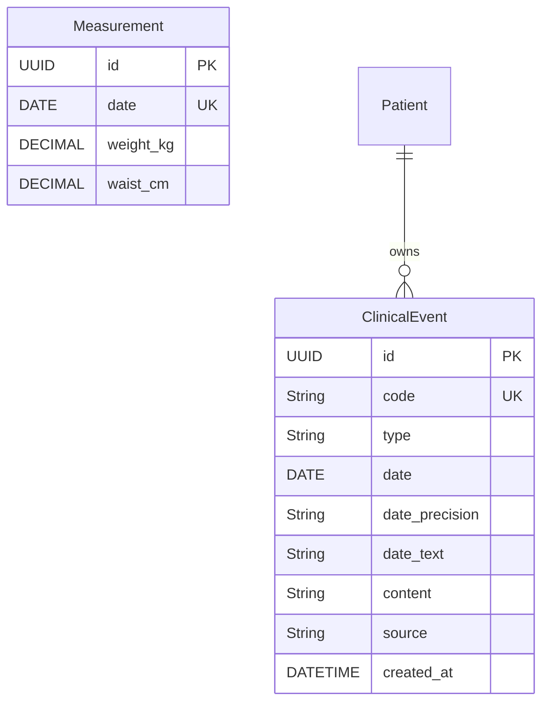

# Modelo de datos — Careme

Este documento describe el modelo de datos del proyecto Careme, con la
descripción de cada entidad, sus campos, sus reglas de validación, sus
relaciones y un diagrama entidad-relación.

El documento distingue dos estados:

- **Implementado**: lo que hoy existe en el código y en la base de datos.
- **Propuesto**: el modelo definido en la documentación
  (`docs/roadmap/mvp_alcance_asistente_historia_clinica.md`) que todavía no
  existe en el código.

Hoy están implementados el seguimiento corporal (`Measurement`), el registro de
hechos clínicos (`ClinicalEvent`, UC-004) y la consulta de la historia mediante
el índice derivado (UC-007); `Patient` sigue siendo implícito.

---

## 1. Modelo implementado

El modelo implementado cubre el seguimiento corporal (UC-001, UC-002 y UC-003),
el registro de hechos clínicos (UC-004) y la consulta de la historia mediante
recuperación léxica del índice derivado (UC-007).

### 1.1 Measurement

Representa una medición corporal registrada en un día concreto. Es la entidad
persistida del seguimiento corporal; convive con la tabla derivada
`clinical_event_index` del asistente (ver §2).

**Campos:**

- `id`: Identificador único de la medición (Primary Key, UUID)
- `date`: Día de la medición (obligatorio, único)
- `weightKg`: Peso en kilogramos (obligatorio, positivo)
- `waistCm`: Cintura abdominal en centímetros (obligatorio, positiva)

**Reglas de validación:**

- La fecha es un día del calendario, sin hora, y no puede ser futura.
- Se admite como máximo una medición por día; la fecha es única.
- Ambos valores son obligatorios y deben ser estrictamente positivos.
- Ambos valores se expresan con un solo decimal (`NUMERIC(5, 2)`).
- El peso no puede superar 500 kg y la cintura abdominal no puede superar 400 cm.
- Registrar de nuevo un día ya registrado reemplaza sus valores, no lo duplica.

**Restricciones en base de datos:**

- `uq_measurements_date`: única sobre `date`.
- `ck_measurements_weight_kg_positive`: `weight_kg > 0`.
- `ck_measurements_waist_cm_positive`: `waist_cm > 0`.

**Relaciones:** ninguna. Es una entidad independiente; no hay usuario ni
propietario en el modelo actual.

### 1.2 MeasurementDraft

Representa una medición que todavía no tiene identidad en base de datos. Se usa
cuando se escriben varias mediciones a la vez, como en la importación desde
archivo.

**Campos:**

- `date`: Día de la medición
- `weightKg`: Peso en kilogramos
- `waistCm`: Cintura abdominal en centímetros

**Reglas de validación:** las mismas que `Measurement` (fecha presente y valores
positivos), pero sin `id`.

**Relaciones:** ninguna. No se persiste por sí misma; se convierte en
`Measurement` al guardarse.

### 1.3 Modelos de la API

No se persisten; describen el contrato HTTP.

- **MeasurementRequest**: `date`, `weightKg`, `waistCm`. Aplica las reglas del
  formulario de registro (fecha no futura, valores positivos, un decimal,
  límites de 500 kg y 400 cm).
- **MeasurementResponse**: `id`, `date`, `weightKg`, `waistCm`. Representación
  devuelta al cliente.
- **ImportPreviewRow**: `date`, `weightKg`, `waistCm`, `replacesExisting`.
  Una medición leída de un archivo y qué haría al cargarse.
- **ImportPreviewResponse**: `rows`, `totalRows`, `newCount`, `replacedCount`,
  `ignoredCount`. Lo que haría la carga, sin ejecutarla.
- **ImportResultResponse**: `createdCount`, `replacedCount`, `ignoredCount`,
  `totalRows`. Resultado de la carga.
- **ApiResponse**: `success`, `data`, `messageCode`, `message`. Envoltura común
  de toda respuesta.
- **ChatMessageRequest**: `message` (máx. 4000 caracteres), `conversationId`
  (opcional), `messageId`. Mensaje enviado al chat.
- **ChatMessageResponse**: `conversationId`, `messageId`, `status`
  (`registered`, `answered`, `no_records`, `clarification_required`,
  `general_conversation`, `duplicate`, `failed`), `message` y `events`. En una
  respuesta `answered`, `events` contiene los hechos que la sustentan; en
  `no_records` no contiene hechos.
- **ClinicalEventIntent**: contrato estructurado entre el chat y el registro o
  la consulta; `kind` (`events`, `query`, `clarification`, `conversation`), con
  criterios de búsqueda en la consulta, `events` y `clarification`. Es lo que
  produce el adaptador del LLM y valida el dominio.

**Formato de archivo de importación:** columnas requeridas `date`, `weight_kg`
y `abdominal_circumference_cm`, con cabecera. Límite por defecto de 10000 filas.

### 1.4 Reglas transversales de la importación

- Todo archivo se valida por completo antes de escribir nada (carga todo o nada).
- Las filas con fecha repetida se deduplican: la última reemplaza a la anterior.
- Una fila sin fecha es un error; una fila con fecha pero sin ningún valor se
  ignora.
- Los errores se reportan como `línea|campo|motivo`, no como frases de usuario.

---

## 2. Modelo del asistente de historia clínica (implementado)

Modelo definido para el MVP del asistente de historia clínica personal. El
registro de hechos clínicos (`ClinicalEvent`) está implementado por UC-004 y la
consulta de la historia por UC-007; edición y borrado siguen propuestas.

### 2.1 Patient

Representa al dueño de la historia clínica. En el MVP existe una sola historia,
la del propio usuario, por lo que `Patient` permanece **implícito**: no se crea
entidad ni tabla para él.

**Relaciones:**

- `events`: relación de uno a muchos con el modelo ClinicalEvent

### 2.2 ClinicalEvent

Representa un hecho médico registrado por el usuario con sus propias palabras.
Implementado por UC-004
(`backend/src/main/java/com/careme/backend/entity/ClinicalEvent.java`).

**Campos:**

- `id`: Identificador único del evento (Primary Key, UUID)
- `code`: Identificador legible y estable (`evt_NNN`, Primary Key de nombre de archivo)
- `type`: Tipo de hecho clínico
- `date`: Fecha del hecho (puede faltar cuando se desconoce)
- `date_precision`: Grado de precisión de la fecha
- `date_text`: Expresión temporal original del usuario, si la hubo
- `content`: Contenido del hecho clínico
- `source`: Origen del hecho
- `created_at`: Fecha y hora de creación del registro

**Reglas de validación:**

- El tipo debe ser uno de los cuatro admitidos: `diagnosis`, `medication`,
  `measurement`, `note`.
- Todo evento tiene tipo, contenido y fecha con su grado de precisión; la fecha
  puede faltar cuando el usuario no la indica.
- `date_precision` debe ser `exact`, `approximate` o `unknown`.
- La precisión temporal almacenada no puede ser mayor que la aportada por el
  usuario: una fecha aproximada no se convierte en exacta.
- El contenido conserva los valores tal como los expresó el usuario (por
  ejemplo, una presión de 145/92).
- No se registran creencias, sospechas ni inferencias como si fueran hechos.
- Solo se registran hechos médicos; las preguntas y la conversación general no
  generan eventos.
- El mismo hecho no se registra dos veces.

**Notas de persistencia:**

- La fuente de verdad son documentos Markdown en `data/events/`, en el
  filesystem del backend (`ClinicalEventMarkdownStore.java`), con front matter
  versionado y nombre de archivo `evt_NNN.md`.
- PostgreSQL mantiene un índice derivado y reconstruible (tabla
  `clinical_event_index`, full-text con `tsvector` e índice GIN) que nunca es la
  verdad. Se define en `V2__create_clinical_event_index.sql` y se regenera con
  `POST /api/v1/clinical-events/reindex`.

**Relaciones:**

- `patient`: relación de muchos a uno con el modelo Patient (implícito en el MVP)

---

## 3. Diagrama entidad-relación

> El bloque de `Measurement` corresponde al seguimiento corporal implementado.
> El bloque `Patient` / `ClinicalEvent` corresponde al asistente de historia
> clínica, implementado para el registro de hechos (UC-004) y su consulta
> (UC-007); `Patient` permanece implícito y en PostgreSQL sólo existe el índice
> derivado `clinical_event_index`.

---

## 4. Principios de diseño

1. **Identidad estable**: cada registro tiene un identificador único; en las
   mediciones es un UUID y en los eventos clínicos se añade un `code` legible
   que además da nombre al archivo.
2. **Una medición por día**: la fecha identifica la medición dentro del día, de
   modo que volver a registrar un día actualiza en lugar de duplicar.
3. **Invariantes en el dominio**: el tipo de dominio (`Measurement`) rechaza
   cualquier valor inválido al construirse, así que un registro inválido no
   puede existir.
4. **Contrato separado del almacenamiento**: los DTO de la API y la entidad de
   persistencia se mantienen separados, para que el contrato HTTP no cambie
   cuando cambie la tabla.
5. **Fidelidad temporal**: las fechas se tratan como días de calendario, sin
   hora, y una fecha aproximada nunca se presenta como exacta.
6. **Todo o nada**: una importación valida el archivo completo antes de escribir
   nada, de forma que no deja registros a medias.
7. **Fuente de verdad explícita**: los eventos clínicos son la fuente primaria;
   los resúmenes derivados deben poder reconstruirse a partir de ellos.

---

## 5. Notas

- `Measurement` y `ClinicalEvent` pertenecen a dos etapas del producto: el
  seguimiento corporal y el asistente de historia clínica. El asistente expone
  registro y consulta; todavía no expone edición ni borrado.
- En el modelo implementado no hay usuarios: no se identifica a la persona ni se
  distinguen mediciones de distintas personas.
- Los campos obligatorios garantizan la información núcleo, y los opcionales
  permiten entrada flexible sin perder ese núcleo.
- Los esquemas los definen las migraciones Flyway:
  `V1__create_measurements_table.sql` (tabla `measurements`) y
  `V2__create_clinical_event_index.sql` (índice derivado
  `clinical_event_index`); el mapeo JPA se valida contra ellos.
