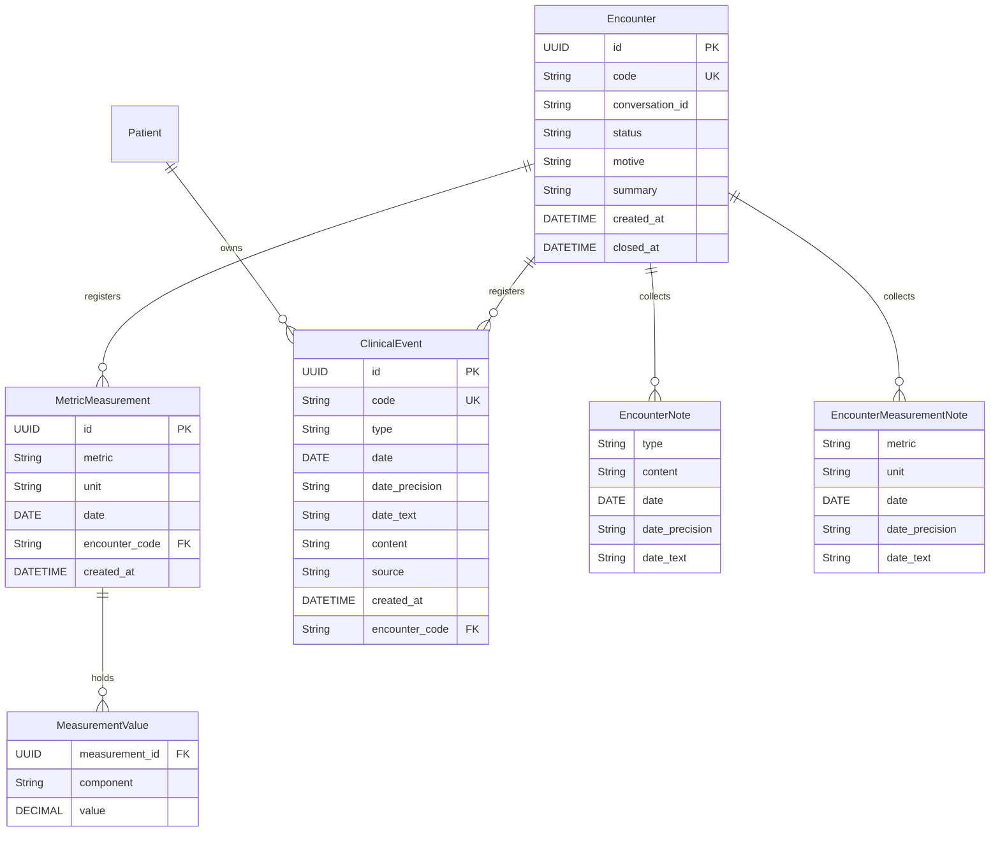

# Data model — Careme

This document describes the Careme data model: every entity with its fields,
validation rules and relationships, plus an entity-relationship diagram.

The document distinguishes two states:

- **Implemented**: what exists today in the code and in the database.
- **Proposed**: the model defined in the documentation
  (`docs/roadmap/mvp_alcance_asistente_historia_clinica.md`) that does not exist
  in the code yet.

Body tracking (the metric model of §1.1 and its legacy daily view), clinical-event
registration (`ClinicalEvent`, UC-004), the consultation (UC-013) and the history query
through the derived index (UC-007) are implemented today; `Patient` remains implicit.

---

## 1. Implemented model

The implemented model covers body tracking (UC-001, UC-002 and UC-003),
clinical-event registration (UC-004) and the history query through lexical
retrieval from the derived index (UC-007).

### 1.1 MetricMeasurement

Represents a measurement of one metric on one day. It is the persisted entity of body
tracking, implemented by UC-014; it coexists with the assistant's derived table
`clinical_event_index` (see §2).

**Fields:**

- `id`: Unique identifier of the measurement (Primary Key, UUID)
- `metric`: Which quantity was measured, by its catalogue code (`weight`, `waist`,
  `blood_pressure`, `cholesterol`, …)
- `unit`: The metric's reference unit, in which the values are expressed
- `date`: Exact calendar day of the measurement (required)
- `encounter_code`: The consultation the measurement came from, or absent when it did
  not come from one
- `created_at`: Date and time the record was created

**Validation rules:**

- The date is a calendar day, without time, and the metric is one of the catalogue's.
- The unit is the reference unit of that metric: a value stated in another unit of the
  same metric is converted before it is stored.
- Every value is strictly positive and inside the admissible range of its component.
- A composite metric carries all of its components: a blood pressure is one measurement
  with `systolic` and `diastolic`, never two measurements.
- At most one measurement per metric and day is allowed; registering that metric and day
  again replaces its values.

**Database constraints:**

- `uq_measurements_metric_date`: unique on `(metric, date)`.
- `uq_measurement_values_component`: unique on `(measurement_id, component)`.
- `ck_measurement_values_positive`: `value > 0`.

**Relationships:** many-to-one with the consultation the measurement came from, declared
as its provenance. There is still no user or owner in the current model.

**Metric catalogue:** the metrics the tracking admits live in `admitted_metrics`, seeded
with weight (kg), abdominal circumference (cm), blood pressure (mmHg) and cholesterol
(mg/dL). The catalogue itself —reference unit, components, admissible range, exact unit
equivalences and the unit a value without an explicit unit resolves to— is described in
code, because a metric's unit and range cannot be invented from what the person says.

### 1.1b The legacy daily view

`Measurement` (record) and its repository remain as the **derived daily view** over the
metric model: one row per day with `weightKg` and `waistCm`. It exists so the
`/api/v1/measurements` contract, the registration form (UC-002) and the file import
(UC-003) keep working unchanged against a single tracking store.

- `GET` composes the weight and the abdominal circumference of each day; `POST` stores
  those two metrics for that day.
- A day is part of the view only when it carries **both** metrics: the legacy contract
  requires both values, so a day with a single metric stays in the tracking and is not
  shown here. Closing that gap is the sibling change `metric-tracking-view`.
- The legacy request rules (date not in the future, positive values, one decimal, limits
  of 500 kg and 400 cm) are kept by the view, not by the metric model.

### 1.2 MeasurementDraft

Represents one day of the legacy daily view that has no database identity yet. It is used
when several measurements are written at once, as in the file import, and the view turns
each draft into one measurement per metric.

**Fields:**

- `date`: Day of the measurement
- `weightKg`: Weight in kilograms
- `waistCm`: Abdominal circumference in centimetres

**Validation rules:** the same as `Measurement` (date present and positive
values), but without `id`.

**Relationships:** none. It is not persisted on its own; storing it writes the `weight`
and `waist` measurements of that day.

### 1.3 API models

They are not persisted; they describe the HTTP contract.

- **MeasurementRequest**: `date`, `weightKg`, `waistCm`. Applies the registration
  form rules (date not in the future, positive values, one decimal, limits of
  500 kg and 400 cm).
- **MeasurementResponse**: `id`, `date`, `weightKg`, `waistCm`. Representation
  returned to the client.
- **ImportPreviewRow**: `date`, `weightKg`, `waistCm`, `replacesExisting`.
  A measurement read from a file and what would happen if it were loaded.
- **ImportPreviewResponse**: `rows`, `totalRows`, `newCount`, `replacedCount`,
  `ignoredCount`. What the load would do, without running it.
- **ImportResultResponse**: `createdCount`, `replacedCount`, `ignoredCount`,
  `totalRows`. Result of the load.
- **ApiResponse**: `success`, `data`, `messageCode`, `message`. The common
  envelope of every response.
- **ChatMessageRequest**: `message` (max. 4000 characters), `conversationId`
  (optional), `messageId`. Message sent to the chat.
- **ChatMessageResponse**: `conversationId`, `messageId`, `status`
  (`noted`, `answered`, `no_records`, `clarification_required`,
  `general_conversation`, `duplicate`, `failed`), `message` and `events`. `noted`
  means the turn collected one or more clinical facts as notes of the open
  consultation without registering them; `registered` is not a turn status and
  appears only in the consultation close outcome, which reports the facts that
  were registered or that there was nothing to register. In an `answered`
  response, `events` holds the facts that support it; in `no_records`
  it holds no facts and, instead, the response reports the reason for the absence
  (`absenceReason`: `empty_history`, `no_events_of_type`,
  `no_events_in_period` or `no_term_match`) and the actions offered
  (`suggestedActions`: `reformulate`, `register`). The response also reports the
  operations the turn went through (`operations`), each with its own status and
  support, so a client can tell what was completed from what was not. Those fields
  are optional and additive.
- **AgentOperation**: the closed set of operations the assistant may ask for —
  `consult_history`, `record_note` and `record_measurement` — declared to the
  provider and executed by the application, which validates before writing.
  Registering is not a turn operation: the turn collects notes and only the
  consultation close registers.
- **ClinicalEventIntent**: the structured contract the application builds for a
  registration or a query; `kind` (`events`, `query`, `clarification`,
  `conversation`), with the search criteria in the query. It is what the
  application validates before persisting or retrieving.

**Import file format:** required columns `date`, `weight_kg` and
`abdominal_circumference_cm`, with a header. Default limit of 10000 rows.

### 1.4 Cross-cutting import rules

- Every file is validated completely before anything is written (all-or-nothing
  load).
- Rows with a repeated date are deduplicated: the last one replaces the previous
  one.
- A row without a date is an error; a row with a date but no value at all is
  ignored.
- Errors are reported as `line|field|reason`, not as user-facing sentences.

---

## 2. Clinical history assistant model (implemented)

The model defined for the MVP of the personal clinical history assistant. The
registration of clinical facts (`ClinicalEvent`) is implemented by UC-004 and the
history query by UC-007; editing and deletion are still proposed.

### 2.1 Patient

Represents the owner of the clinical history. The MVP has a single history, the
user's own, so `Patient` remains **implicit**: no entity or table is created for
it.

> **Materialised in Fase 4.** The patient profile of §6.3 materialises `Patient`.
> It is still a single patient; what changes is that the system stops being blind
> to who it belongs to.

**Relationships:**

- `events`: one-to-many relationship with the ClinicalEvent model

### 2.2 ClinicalEvent

Represents a medical fact registered by the user in their own words. Implemented
by UC-004 (`backend/src/main/java/com/careme/backend/entity/ClinicalEvent.java`).

**Fields:**

- `id`: Unique identifier of the event (Primary Key, UUID)
- `code`: Readable and stable identifier (`evt_NNN`, file-name Primary Key)
- `type`: Type of clinical fact
- `date`: Date of the fact (may be missing when it is unknown)
- `date_precision`: Degree of precision of the date
- `date_text`: The user's original temporal expression, when there was one
- `content`: Content of the clinical fact
- `source`: Origin of the fact
- `created_at`: Date and time the record was created

**Validation rules:**

- The type must be one of the supported ones: `diagnosis`, `medication` or `note`.
  `measurement` was retired by UC-014 (see §1.1): it is still readable in a document
  written before the change, but nothing new can be registered with it.
- Every event has a type, content and date with its degree of precision; the date
  may be missing when the user does not state it.
- `date_precision` must be `exact`, `approximate` or `unknown`.
- The stored temporal precision cannot be higher than the one the user gave: an
  approximate date never becomes exact.
- The content preserves the values as the user expressed them (for example, a
  blood pressure of 145/92).
- Beliefs, suspicions and inferences are not registered as if they were facts.
- Only medical facts are registered; questions and general conversation do not
  create events.
- The same fact is not registered twice.

> **`measurement` retired by UC-014.** It is no longer an admissible type, and a
> measurement is not a clinical fact: it has its own tracking (§1.1) and its own channel in
> the consultation. Events also reference the encounter they came from (§2.3).

**Persistence notes:**

- The source of truth is Markdown documents in `data/events/`, on the backend
  filesystem (`ClinicalEventMarkdownStore.java`), with versioned front matter and
  a file name of `evt_NNN.md`.
- PostgreSQL keeps a derived, rebuildable index (the `clinical_event_index`
  table, full-text with `tsvector` and a GIN index) which is never the truth. It
  is defined in `V2__create_clinical_event_index.sql` and rebuilt with
  `POST /api/v1/clinical-events/reindex`.

**Relationships:**

- `patient`: many-to-one relationship with the Patient model (implicit in the
  MVP)
- `encounter`: the consultation the close registered the event in, declared as
  provenance in the event's front matter and in the derived index (UC-013).

### 2.3 Encounter (consulta)

The conversation as a record with its own identity and life cycle, implemented by
UC-013 (`backend/src/main/java/com/careme/backend/entity/Encounter.java`). It opens
with the conversation, collects in **notes** what the person mentions —clinical-fact
notes and measurement notes—, and at its close registers the admissible notes of each
channel with their provenance: the facts as clinical events and the measurements in
the metric model of §1.1.

**Fields:**

- `id`: Unique identifier of the consultation (Primary Key, UUID)
- `code`: Readable and stable identifier (`enc_NNN`, file-name Primary Key)
- `conversation_id`: The conversation the consultation belongs to, so it survives a restart
- `status`: `open` or `closed`
- `notes`: The clinical-fact notes collected while it is open
- `measurement_notes`: The measurement notes collected while it is open
  (`EncounterMeasurementNote`)
- `motive`: The title the close derives from the registered facts
- `summary`: The close's **derived** summary of the registered facts; it may be absent
- `created_at`: Date and time the consultation opened
- `closed_at`: Date and time the consultation closed; required when, and only when, it is closed

**EncounterNote** carries `type`, `content`, `date`, `date_precision` and
`date_text`. It is not a registered fact: it carries the temporal fidelity the
person gave so the close can register it, but it never reaches the clinical
history on its own and never carries an event code.

**EncounterMeasurementNote** carries the metric, the values already converted to the
metric's reference unit, the unit the person stated, the date with its precision and
the original temporal expression. It is not a registered measurement either: it stays
in the consultation until the close, and it never becomes a clinical event.

**Life cycle:**

- A consultation opens with the conversation and is persisted from that moment, so
  an interruption keeps what the person already narrated.
- Only one consultation is open at a time: opening a conversation closes the previous one.
- The close validates each note, registers the admissible ones as clinical events with
  their provenance and keeps the derived summary. A close that cannot complete leaves
  the consultation open so it can be retried; a repeated close registers nothing new.
- An interruption or a process shutdown closes the consultations left open and
  registers what they collected.

**Validation rules:**

- The code matches `enc_NNN`, the conversation is not blank and the status is one of the two.
- A closed consultation always records when it was closed; an open one never does.
- A note needs a type, content and date precision; an exact date needs a date.
- A closed consultation is never reopened: it accepts neither more notes nor another close.

**Persistence notes:**

- The source of truth is Markdown documents in `data/encounters/`
  (`EncounterMarkdownStore.java`), with versioned front matter including the
  conversation, the motive and the summary, and a file name of `enc_NNN.md`.
- The summary is marked as derived information in the document
  (`## Resumen (información derivada)`) so it is never mistaken for the source of truth.
- PostgreSQL keeps a derived, rebuildable index (the `encounter_index` table), defined
  in `V3__create_encounter_index.sql` and rebuilt with
  `POST /api/v1/clinical-events/reindex`.

**Relationships:**

- `conversation`: the conversation the consultation belongs to
- `events`: the clinical events registered at the close, which declare the consultation
  they came from as their provenance
- `measurements`: the metric measurements registered at the close (§1.1), which also
  declare the consultation as their provenance

---

## 3. Entity-relationship diagram

> The `MetricMeasurement` / `MeasurementValue` block is the implemented body tracking,
> and the legacy `Measurement` view is composed from it. The `Patient` / `ClinicalEvent`
> block corresponds to the clinical history assistant, implemented for fact registration
> (UC-004) and its query (UC-007); `Patient` remains implicit. The `Encounter` block is
> implemented by UC-013 —the provenance its close registers is UC-013b— and its notes are
> never events. In PostgreSQL only the derived indexes `clinical_event_index` and
> `encounter_index` exist, never as the source of truth; the tracking itself does live in
> PostgreSQL, because a measurement is a numeric record and not a narrated fact.

---

## 4. Design principles

1. **Stable identity**: every record has a unique identifier; for measurements it
   is a UUID and for clinical events a readable `code` is added, which also names
   the file.
2. **One measurement per metric and day**: the metric and the date identify a
   measurement, so registering that metric and day again replaces its value instead of
   duplicating it. Several metrics can be recorded on the same day.
3. **Domain invariants**: the domain type (`MetricMeasurement`) rejects any invalid
   value when it is constructed, so an invalid record cannot exist.
4. **Contract separated from storage**: the API DTOs and the persistence entity
   are kept apart, so the HTTP contract does not change when the table changes.
5. **Temporal fidelity**: dates are treated as calendar days, without time, and
   an approximate date is never presented as exact.
6. **All or nothing**: an import validates the whole file before writing anything,
   so it never leaves half-written records.
7. **Explicit source of truth**: clinical events are the primary source; derived
   summaries must be rebuildable from them.

---

## 5. Notes

- `Measurement` and `ClinicalEvent` belong to two stages of the product: body
  tracking and the clinical history assistant. The assistant exposes registration
  and query; it does not expose editing or deletion yet.
- The implemented model has no users: the person is not identified and
  measurements of different people are not distinguished.
- Required fields guarantee the core information, and optional fields allow
  flexible input without losing that core.
- The schemas are defined by the Flyway migrations:
  `V1__create_measurements_table.sql` (the legacy daily table),
  `V2__create_clinical_event_index.sql` (the derived index
  `clinical_event_index`), `V3__create_encounter_index.sql` (the derived index
  `encounter_index`), `V4__add_provenance_to_clinical_event_index.sql` (the
  consultation a registered fact came from) and `V5__create_metric_measurements.sql`
  (the metric model of §1.1, which migrates the legacy rows and retires its table); the
  JPA mapping is validated against them.
- §6 records what the roadmap's Fase 4 still has ahead. The encounter (§6.1) and the
  metric model (§6.2) are already implemented and live in §2.3 and §1.1.

---

## 6. Fase 4 target model

The model the roadmap's Fase 4 introduces. Part of it is already implemented and lives in the
sections above; what remains target-only is recorded here so the implemented model and the
target one are not confused.

- §6.1 encounter: **implemented by UC-013**, documented in §2.3.
- §6.2 metric model: **implemented by UC-014**, documented in §1.1 and §1.1b.
- §6.3 patient profile and §6.4 extended profile: **not implemented**.

### 6.1 Encounter (consulta)

**Implemented by UC-013**, and documented in §2.3: the conversation stopped being
in-memory state and became a record with an identifier and a life cycle. The facts
the person reports are registered with their **provenance**, referencing the
consultation they came from, and the registration happens at the close.

The link between the consultation and the metric model of §6.2 is implemented too:
a registered measurement declares the consultation it came from as its provenance
(§1.1).

**Relationships:**

- `events`: one-to-many with ClinicalEvent
- `measurements`: one-to-many with the metric model of §6.2

### 6.2 Measurement (metric model) — implemented by UC-014

One model for weight, abdominal circumference, blood pressure, cholesterol and any other
metric. It is documented as implemented in §1.1, with the legacy daily view in §1.1b.

Two points where what was planned and what was implemented differ, both decided by
[UC-014](../docs/use-cases/UC-014.md):

- The date of a measurement is **exact**. The temporal fidelity rules of `ClinicalEvent` do
  not apply unchanged: an approximate or unknown date is asked for and, without it, the
  measurement is not registered, because its value only means something on a concrete day
  (UC-014-R7).
- **One measurement per metric and day**, not several readings: registering that metric and
  day again replaces the value instead of adding a row (UC-014-R8).

**Relationships:**

- `encounter`: many-to-one with Encounter, as the provenance of a registered measurement

### 6.3 Patient profile

Materialises `Patient`, which today is implicit (§2.1).

**Fields:**

- `name`: Name and surnames
- `date_of_birth`: Date of birth. Age is derived from it and never stored
- `sex`
- `occupation`
- `blood_group` and `rh`
- `height_cm`: Height

**Behaviour:**

- The assistant proposes an **interview** on the first interaction. The user may
  skip it and resume it later, and the assistant asks again for a missing datum
  when the conversation needs it.
- The profile is updated when the user reports a change.
- **Only current values are kept.** The document is overwritten on update and the
  profile values carry no history of their own: correcting a datum discards the
  previous one. The provenance of the clinical model applies to clinical facts,
  not to these values; record versioning is Fase 8.4.
- A datum may be **unknown**: it is stored as absent and never invented.
- Representation: a Markdown patient document in a directory sibling to
  `data/events/`, under the same principle as the encounter (§6.1).

It does **not** contain allergies, vaccinations, family history, conditions or
laboratory results. Those are clinical facts, covered by the event types and the
conditions, and they are summarised in §6.4.

### 6.4 Extended profile

A **derived** document composed automatically from the patient profile plus the
main facts: active conditions, allergies, current medication, recent measurements
and family history.

In the sense of design principle 7 it is derived information: marked as such and
rebuildable from the facts, never a source of truth.

### 6.5 What changes with respect to the implemented model

| Implemented | Fase 4 |
| --- | --- |
| `Patient` is implicit: no entity and no table | materialised as the profile of §6.3 |
| No patient attributes to read | the assistant has the profile and the extended profile of §6.4 |
| Family history has no category of its own | event type `family_history`, with the relative in the content |
| `measurements` table with `weight_kg` and `waist_cm`, both required | metric model of §6.2, implemented in §1.1; the legacy pair survives as a derived daily view |
| One row per day (`uq_measurements_date`) | one measurement per metric and day (`uq_measurements_metric_date`); several metrics per day |
| `measurement` is a clinical event type | it leaves the catalogue (UC-014); the remaining types are `diagnosis`, `medication` and `note` |
| `/measurements` reads its own table | `/measurements` is a derived view over the metric model |
| The assistant redirects weight and waist questions | it registers them like any other metric (UC-014); reading them in the conversation is `UC-014b` |
| The conversation lives in memory with a TTL | **implemented by UC-013**: the consultation is a persisted record and gives provenance |
| No numeric comparison across time | Fase 7.3 can compare values over time |
