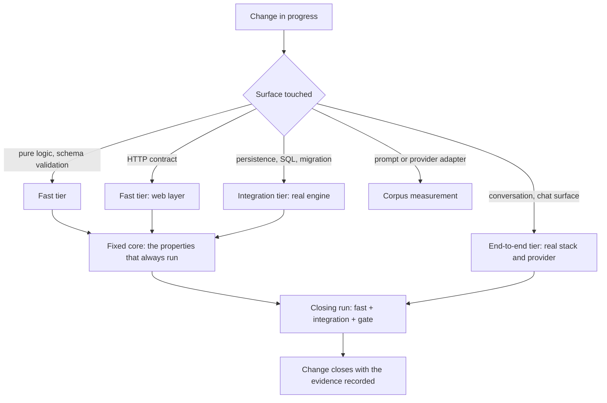

# Regression scope — Careme

This document answers one question: **when a change is verified, how far does the
verification reach?** It defines the tiers, the core that always runs, how the
affected tests are identified, and what the closing run costs.

It is the operational counterpart of section 7 of
[`test-strategy.md`](./test-strategy.md).

## 1. What regression means here

Regression is **protection against unintended change**, not a second verification
of everything that already works. The distinction matters because it decides what
is selected: a test is in the regression scope when the change could plausibly have
broken what it protects — not when it is convenient to run.

## 2. The tiers

| Tier | Members | Needs | Catches |
| --- | --- | --- | --- |
| Fast | Backend unit and web-layer tests; frontend unit and component tests | Nothing beyond each side's runtime | Logic, validation, contract shape, rendering, interaction |
| Integration | The tests that start a real PostgreSQL engine | A container runtime | Mapping, SQL, full-text search, migrations, index rebuild |
| End-to-end | The scenario specs that drive the real interface | The whole stack, plus the real assistant | The conversation end to end, and that a read leaves the clinical history untouched |
| Corpus | The measurement over a prepared dataset | The same as end-to-end | Retrieval and non-invention properties, measured instead of asserted |

## 3. The fixed core

Some properties are so central that their tests run in the regression scope of
**every** change, whatever the change touches. The core is defined by property, so
that it survives renames, splits and rewrites of the tests that carry it:

- **Reading never writes.** A question about the clinical history or the tracking
  leaves both exactly as they were.
- **Absence and failure are never presented as each other.**
- **The documents remain the source of truth**, and the derived index stays
  rebuildable from them.
- **The API envelope and its error contract keep their shape** for the consumer.
- **A consultation registers on close, not before.**
- **The assistant does not diagnose and does not recommend treatment.**

Pinning the core to named suites — instead of leaving it defined by property — is
listed as a proposed improvement in [`test-strategy.md`](./test-strategy.md#11-proposed-improvements).

## 4. How the affected tests are identified

1. Take the changed files.
2. For each one, add the test that **names its subject**: a backend test class
   named after the class under test, a frontend test file next to the module it
   covers.
3. For each capability the change touches, add the **end-to-end spec** that walks
   that capability.
4. Add the **fixed core**, always. It is not optional and it is not affected by the
   mapping.
5. If a changed file has no test naming its subject, that is a finding, not a
   shortcut: either the test is missing or the mapping is wrong. Never conclude
   that there is nothing to run.

This mapping is computable only because of the naming conventions in
[`test-process.md`](./test-process.md#6-naming-and-mapping).

## 5. What runs when

| Moment | Fast | Integration | End-to-end | Corpus | Gate |
| --- | --- | --- | --- | --- | --- |
| During a task | The tests of the level the task declares, plus the ones naming the touched subject | Only if the task touches persistence, SQL, the schema or the index | No | No | No |
| Closing the change | Complete | Complete | Complete if the change touches the chat surface or the provider adapter | No | Yes, over the backend module |
| Before a delivery | Complete | Complete | Complete | Yes | Yes |

## 6. Why the closing run is complete

The backend gate is a rule over the **whole module** and it is evaluated after the
tests: a subset run produces a coverage figure below the minimum for reasons that
have nothing to do with the change, and the build fails. An aggregate gate and a
partial closing run are therefore mutually exclusive — see
[`coverage-and-gates.md`](./coverage-and-gates.md).

That single constraint is what fixes the scope of the closing run: complete on the
backend, complete on the frontend, and end-to-end only when the change touches the
surface those specs walk.

## 7. The economy, honestly

Selecting a subset is worth exactly what it saves, so it is worth being precise
about where the cost is:

- **The fast tier is not the problem.** It is the cheapest thing in the repository
  and running it partially saves seconds while weakening the signal.
- **The integration tier is the real cost**, and it is dominated by starting the
  engine and applying the schema, not by the number of cases. Its leverage is
  **reuse**, not selection: the engine is already shared across the JVM instead of
  started per class. Running cases in parallel on top of that reuse is a further
  option, not something configured today.
- **The expensive tier is already selective.** The end-to-end specs run only when
  the change touches the surface they walk, which is precisely the impact mapping
  this document defines.

So the economy you are looking for is, in large part, already in place; what
remains is the cost of the engine and of the stack, and that is attacked by making
each cheaper to start — not by running fewer cases.

## 8. Reaching a smaller closing run

**Decision: the tiered scope above is adopted; a smaller closing run is not.** It
becomes defensible only after the gate stops being aggregate. The sequence would
be:

1. Adopt changed-code coverage as the gate ([`coverage-and-gates.md`](./coverage-and-gates.md), proposed improvement).
2. Replace "complete" in section 5 of this document with "fixed core plus affected
   tests".
3. Keep the complete run for the delivery row, where its cost is amortised.

Until step 1 is done, a smaller closing run leaves the build red for a reason
unrelated to the change, and a red build that everyone knows is red is worse than
no gate at all.
