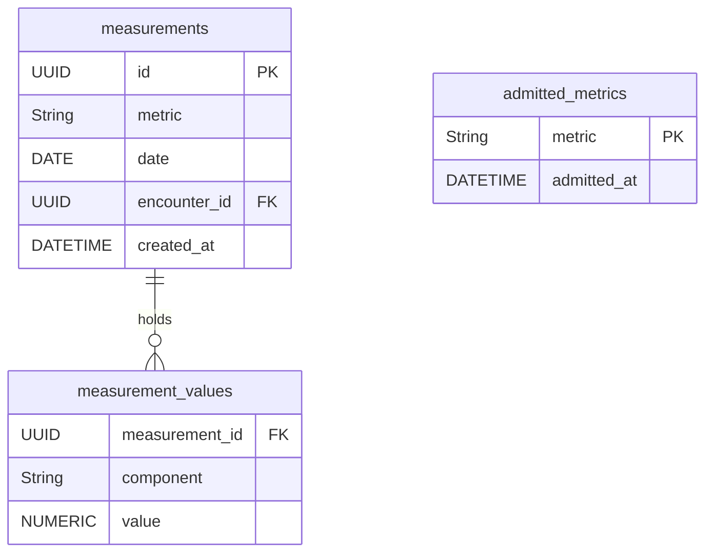

## Context

See `proposal.md` — Why. What shapes the approach:

- Hoy la medición está partida en dos: la tabla `measurements` (`V1__create_measurements_table.sql`, con
  `date` único, `weight_kg` y `waist_cm` obligatorios) y el tipo de evento clínico `measurement`
  (`ClinicalEvent.ClinicalEventType.MEASUREMENT`), que guarda el valor como texto libre.
- Los hechos clínicos tienen los documentos Markdown de `data/events/` como fuente de verdad y un índice
  PostgreSQL derivado y reconstruible; las mediciones, en cambio, ya viven en PostgreSQL a secas.
- La consulta (`UC-013`) ya es un registro persistido en `data/encounters/enc_NNN.md` con notas y cierre,
  y el cierre es quien registra lo recogido, en el camino de la operación
  (`assistant-agent-turn`, «Validar y escribir dentro del camino de la operación»).
- El contrato `/api/v1/measurements` lo consumen la vista `/measurements`, el formulario de registro
  (`UC-002`) y la carga desde archivo (`UC-003`), que siguen vigentes.
- No hay eventos `measurement` guardados en este repositorio: los 18 documentos de `data/events/` son
  `diagnosis`, `medication` y `note`.

## Goals / Non-Goals

**Goals:**

- Un único modelo de medición con dimensión de métrica, valor, unidad y fecha exacta, con procedencia.
- Registrar mediciones al cerrar la consulta, con la misma disciplina que los hechos clínicos: sin
  suposiciones, sin registros a medias y con confirmación breve.
- Conservar intactos para la persona el contrato y las vías de registro que ya existen.

**Non-Goals:**

- La consulta conversacional de mediciones (`UC-014b`) y la revisión visual de `/measurements`
  (`UC-001`): este cambio registra y migra, no añade lectura nueva.
- La comparación de valores en el tiempo (Fase 7.3) y el desglose del colesterol.
- Convertir una medición en un hecho clínico, o una métrica en otra.

## Decisions

### D1 — El seguimiento de mediciones tiene su fuente de verdad en PostgreSQL

Las mediciones se persisten en PostgreSQL como fuente de verdad, no como documentos Markdown.

- **Por qué:** una medición es un registro numérico, no un relato. El principio de «Markdown como fuente
  de verdad» existe para el contenido clínico narrado por la persona y para poder reconstruir el índice
  derivado de búsqueda; una medición no se busca por texto, se compara por valor y se lee desde la vista
  de seguimiento. Mantenerla en PostgreSQL evita un segundo almacén Markdown y su índice derivado, y no
  pierde nada que la persona pueda observar.
- **Alternativa descartada:** documentos Markdown por medición, por coherencia con `data/events/`. Añade
  un índice derivado y un camino de reconstrucción para un dato que nunca se consulta por texto.
- **Consecuencia:** las mediciones no entran en `data/events/`, no se convierten en hechos clínicos y no
  aparecen en la consulta de la historia.

### D2 — Tabla `measurements` con dimensión de métrica y tabla hija de valores

- `measurements` con unicidad `(metric, date)`: es la regla de una sola medición por métrica y día, que el
  reemplazo explota con un *upsert* en lugar de crear una segunda medición.
- Los valores viven en `measurement_values`, uno por componente (`value` para una métrica simple,
  `systolic`/`diastolic` para la presión arterial). Así una métrica compuesta es **una** medición con dos
  valores, no dos mediciones.
- **Alternativa descartada:** dos columnas anulables `systolic`/`diastolic` en `measurements`. Fija la
  presión arterial en el esquema y no admite otra métrica compuesta.
- La fecha es `DATE` sin hora, coherente con RN-009 y con el modelo actual.

### D3 — El catálogo es un registro en código más un conjunto admitido persistido

- Las **definiciones** de métrica viven en código: identificador, etiqueta en español, tipo (simple o
  compuesta), unidad de referencia, componentes, rango admisible, equivalencias de unidad y si la unidad
  se deduce del valor. Es la extensión «cuando se incorporen» del roadmap.
- El **conjunto admitido** se persiste en `admitted_metrics`, sembrado por Flyway con peso,
  circunferencia abdominal, presión arterial y colesterol. La confirmación de la persona (A8) es un alta
  en esa tabla.
- **Por qué:** una métrica nueva trae unidad de referencia y rango admisible, y esos datos **no pueden
  venir de la persona**: deducirlos sería inventar (RN-002). Por eso la definición es del sistema y lo
  que la persona decide es si empieza a registrarla.
- **Consecuencia:** una métrica que el registro no conoce no puede admitirse; el sistema declara que no
  la registra y no la sustituye por otra (UC-014-R10). El registro incluye desde el principio métricas
  conocidas todavía no admitidas (creatinina, glucosa en ayunas, triglicéridos) para que la confirmación
  de A8 tenga sobre qué recaer.
- **Alternativa descartada:** catálogo totalmente dirigido por datos y editable en tiempo de ejecución.
  Obliga a inventar la unidad y el rango de lo que la persona nombre.

### D4 — La conversión de unidades ocurre al recoger, con equivalencias exactas del catálogo

- Cada métrica declara sus equivalencias como factores exactos y **únicos**; el valor se convierte a la
  unidad de referencia en el momento de recoger la medición y se guarda ya convertido.
- **Por qué:** la regla exige guardar en la unidad de referencia y que la equivalencia no dependa del
  criterio del asistente; convertir en la frontera deja un único valor canónico que comparar después.
- **Alternativa descartada:** guardar el valor tal como se dijo con su unidad y convertir al leer.
  Multiplica las representaciones del mismo dato y deja la comparación numérica a merced de la lectura.
- La unidad se declara, no se adivina: el registro del catálogo indica si el valor por sí solo determina
  la unidad; cuando no, el sistema pide que se concrete (A10).

### D5 — La nota de medición vive en el documento de la consulta

- La consulta pasa a llevar, junto a sus notas de hechos clínicos, una lista de **notas de medición**
  (métrica, valores ya convertidos a la unidad de referencia, unidad declarada, fecha y precisión, y
  expresión temporal original).
- **Por qué una lista propia y no una unión discriminada en la nota existente:** la nota de hecho clínico
  ya está repartida por el modelo, el almacén y las pruebas, y una unión obligaría a reescribir todos esos
  puntos para expresar algo que se lee igual de claro con dos listas. La distinción se mantiene donde
  importa —el cierre procesa cada lista por su cauce— y el cambio no toca ninguna nota de hecho.
- El front matter de `enc_NNN.md` conserva la nota, así que una interrupción no pierde la medición, igual
  que con los hechos (`clinical-consultation`, «Conservar las notas ante una interrupción»).

### D6 — El cierre escribe por cauces separados, cada uno de todo o nada

- El cierre registra en dos escrituras: el lote de mediciones (una transacción PostgreSQL) y los hechos
  clínicos (la publicación Markdown existente). Cada una es de todo o nada por sí misma.
- Si el lote de mediciones falla, el seguimiento queda exactamente como estaba y puede reintentarse; si
  falla después de que otra medición ya se haya registrado, la respuesta declara lo registrado y lo no
  registrado, sin revertir lo completado (RN-019) y sin presentar el fallo como una ausencia (RN-012).
- **Por qué:** una transacción única sobre Markdown y PostgreSQL no existe, y forzarla acoplaría la
  fuente de verdad narrativa al seguimiento numérico. Declarar el resultado por cauce es lo que el
  contrato del turno ya hace con los hechos.
- El *upsert* por `(metric, date)` hace el reemplazo idempotente: repetir el cierre no crea una segunda
  medición.

### D7 — `measurement` sale del catálogo admisible; lo ya escrito no se reescribe

- Se retira `MEASUREMENT` de `ClinicalEvent.ClinicalEventType` y de la validación determinista del
  registro de hechos. Un hecho con ese tipo deja de admitirse.
- Los documentos que ya existieran con ese tipo no se reescriben (RN-019) y la reconstrucción del índice
  derivado los tolera. En este repositorio no hay ninguno, así que no hace falta migrarlos.
- La consulta de la historia deja de responder por valores de medición: el canal de lectura de las
  mediciones es su propio seguimiento (`UC-014b`).

### D8 — `/api/v1/measurements` se conserva intacto y pasa a leer del modelo de métrica

- El contrato se mantiene tal cual —`date`, `weightKg`, `waistCm`, ambos obligatorios y positivos— y pasa a
  componerse sobre el modelo de métrica: `GET` reúne las métricas `weight` y `waist` de cada día; `POST`
  hace *upsert* de esas dos métricas de ese día. La validación del contrato legado (fecha no futura,
  valores positivos, un decimal, topes de 500 kg y 400 cm) se conserva **en esa vista**, no en el modelo.
- **Por qué:** `UC-002`, `UC-003` y la vista `/measurements` siguen vigentes y «alimentan el mismo
  seguimiento»; una sola fuente evita que las mediciones del formulario y las de la conversación vivan en
  paralelo. Y el contrato no cambia para el cliente, así que este cambio no toca el frontend.
- **Hueco acotado y declarado:** el modelo de métrica admite un día con una sola de las dos métricas
  (peso mencionado en la conversación sin circunferencia, por ejemplo), pero el contrato legado exige
  ambas. La vista de seguimiento compone, por tanto, los días que tienen las dos; una medición suelta se
  conserva íntegra en el seguimiento, pero la pantalla antigua no la muestra hasta que la revisión de la
  vista la sustituya. Se cierra con el cambio hermano `metric-tracking-view`, que entrega el contrato por
  métrica y el formulario por métrica, y ambos se aplican antes de la próxima entrega.
- **Alternativa descartada:** hacer anulable `weightKg`/`waistCm` en el contrato legado y adaptar el
  esquema Zod, la tabla, la gráfica y sus pruebas. Es trabajo de usar y tirar: la vista por métrica no se
  compone como «una fila por día con dos valores», sino como «una fila por fecha, métrica, valor y
  unidad», y el cambio hermano rehace justo esa forma.
- **Alternativa descartada:** reapuntar el frontend a una API de métricas dentro de este cambio. Cambia la
  vista y sus pantallas, que la revisión de `UC-001` y `UC-002` entrega en el cambio hermano.

### D9 — El asistente recoge mediciones, no las escribe

- El conjunto de operaciones ofrecido al proveedor crece en una operación de **recoger una medición**,
  junto a consultar la historia y recoger notas de hechos. Ninguna escribe en el seguimiento.
- El candidato estructurado gana una variante de medición (métrica, valores, unidad cuando se dijo,
  fecha y precisión) que el proveedor no puede convertir en hecho clínico: un mensaje con una medición se
  enruta por el cauce de las mediciones.
- **Por qué:** mantiene la garantía estructural de que el proveedor no alcanza la persistencia, y es la
  misma frontera que ya separa decidir de escribir.

### D10 — El cauce de las mediciones ya existe; su lectura la entrega `UC-014b`

- Una pregunta por una medición se atiende hoy con un **redireccionamiento** a su propio espacio, porque
  leer el seguimiento dentro de la conversación es `UC-014b`. El ámbito `measurements` de la operación de
  consulta se mantiene tal cual: es el cauce que `UC-014b` rellena con la respuesta desde el seguimiento, y
  cambiarlo por una respuesta real no toca ni el modelo ni el cierre.
- **Por qué no quitarlo ni construirlo aquí:** adelantar la lectura obligaría a decidir en este cambio el
  contrato de la consulta de mediciones —qué métricas, qué periodo y cómo se identifican las mediciones en
  que se apoya la respuesta—, que es justamente el objeto de `UC-014b`; quitarlo dejaría la pregunta sin
  cauce. Lo que este cambio fija es que la historia clínica **nunca** presente un valor de medición como un
  hecho suyo: la operación de consulta rechaza el tipo retirado y el cauce de la historia no lo devuelve.

## Risks / Trade-offs

- **[Dos cauces en un mismo cierre pueden dar resultados parciales]** → El contrato declara el resultado
  por cauce y la confirmación distingue lo registrado de lo no registrado; el cierre es reintentable y
  nunca revierte una medición ya registrada.
- **[La migración de la tabla es destructiva para el esquema antiguo]** → Flyway es de solo avance; la
  migración copia filas antes de eliminar la tabla antigua y el retorno es restaurar la copia de
  seguridad. Los documentos Markdown de `data/events/` y `data/encounters/` no se tocan.
- **[Una medición de una sola métrica no aparece en la pantalla antigua]** → Hueco acotado y declarado en
  D8: el dato queda en el seguimiento y la consulta conversacional (`UC-014b`) lo verá; la pantalla la
  sustituye el cambio hermano `metric-tracking-view`, que se aplica antes de la próxima entrega.
- **[El contrato legado y el modelo nuevo pueden divergir en precisión numérica]** → El modelo guarda un
  numérico sin imponer el decimal único; la regla de un decimal se queda en la vista legada, que es donde
  la persona la observa.
- **[El reemplazo por métrica y día puede sorprender si la persona menciona dos valores del mismo día]** → Es
  la regla declarada (UC-014-R8): se reemplaza y se informa de que quedó actualizado; el cierre lo comunica.
- **[Una métrica compuesta mal declarada en el registro produce valores incompletos]** → El registro define
  los componentes obligatorios de cada métrica y la comprobación previa rechaza un valor compuesto
  incompleto, sin dejar registro a medias.
- **[La heurística de unidad puede equivocarse]** → La deducción no es libre: el registro declara por
  métrica si el valor determina la unidad y, cuando no, el sistema pide que la persona la concrete.

## Migration Plan

1. Migración Flyway nueva: crear `measurements` (modelo de métrica), `measurement_values` y
   `admitted_metrics`; sembrar las métricas admitidas; copiar cada fila de la tabla antigua a
   `(weight, día)` y `(waist, día)`; renombrar la tabla antigua y eliminarla al final.
2. Desplegar el backend con el modelo, el catálogo, la vista derivada y el cierre extendido; el contrato
   `/api/v1/measurements` no cambia para los clientes, así que el frontend se despliega sin cambios
   obligatorios.
3. Retorno: restaurar la base de datos desde la copia previa a la migración. Las fuentes de verdad
   Markdown no participan en la migración y no requieren retorno.

## Open Questions

- Los topes numéricos exactos por métrica (hoy 500 kg y 400 cm para peso y circunferencia) y su precisión
  decimal: se fijan en el registro y pueden ajustarse sin cambiar las specs.
- Si el registro siembra creatinina, glucosa en ayunas y triglicéridos como conocidas no admitidas o las
  incorpora más tarde: no cambia el comportamiento descrito ni las specs.
